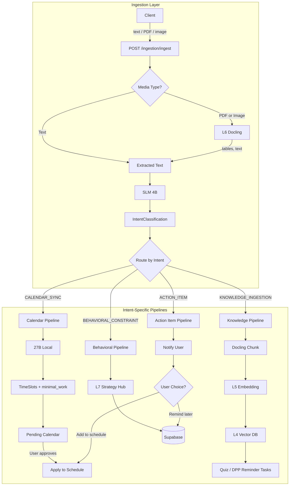

# Autonomous Extraction Pipeline

## Architecture Overview




---

## Phase 1: Multi-Modal Ingestion and Enhanced Classification

### 1.1 Accept PDF, Images, and Text

**File:** [app/api/v1/endpoints/ingestion.py](app/api/v1/endpoints/ingestion.py)

- Extend `IngestionRequest` to accept:
  - `payload: str` (existing)
  - `file_base64: Optional[str]` — base64-encoded PDF or image (PNG, JPEG)
  - `media_type: Optional[str]` — `"pdf"` or `"image"`
- Add `file_url: Optional[str]` if you want URL-based uploads later.

**Flow:**

1. If `file_base64` + `media_type` provided: decode, detect mime type, pass bytes to Docling.
2. If only `payload`: use as-is (Slack, email, Discord text).
3. If both (e.g. Slack message + PDF): concatenate `payload` with extracted text from file.

### 1.2 Implement Docling Extraction (L6)

**File:** [app/utils/docling_helper.py](app/utils/docling_helper.py)

Implement extraction using Docling (already in [pyproject.toml](pyproject.toml)):

```python
def extract_document(bytes_data: bytes, media_type: str) -> str:
    """Extract text and tables from PDF or image. Returns markdown/plain text."""
    # Use docling.convert_pdf() or equivalent
    # Preserve table structure (critical for timetables)
    # Return unified text for downstream LLM
```

- Docling supports PDF and images.
- Use table-structure options for timetable PDFs.
- Return markdown or structured text that preserves rows/columns for the LLM.

### 1.3 Enhance SLM Classification Prompt

**File:** [app/api/v1/endpoints/ingestion.py](app/api/v1/endpoints/ingestion.py)

Update `SEMANTIC_ROUTER_SYSTEM_PROMPT` to:

- Handle syllabus vs timetable vs homework vs internship/opportunity.
- Add `metadata` or `extracted_entities` for downstream use (optional):
  - e.g. `deadline_mentioned: bool`, `urgency: "high" | "normal" | "low"` for KNOWLEDGE_INGESTION / ACTION_ITEM.

Keep response schema as `IntentClassification` for now; optional extensions can be added later.

---

## Phase 2: Intent-Based Extraction Pipelines

### 2.1 New Schema: ExtractionResult and Pipeline Outputs

**File:** [app/schemas/context.py](app/schemas/context.py)

Add schemas for pipeline outputs:

```python
class ExtractedTimeSlots(BaseModel):
    slots: List[TimeSlot]
    source_summary: str  # e.g. "Sem 6 Mon-Fri"
    behavioral_overrides_applied: List[str]  # e.g. ["OS Lec → minimal_work (back bench)"]

class PendingCalendarUpdate(BaseModel):
    id: str
    extracted_slots: List[TimeSlot]
    source_summary: str
    status: Literal["pending", "approved", "rejected"]
    created_at: str  # ISO-8601
```

### 2.2 Calendar Pipeline: Timetable Extraction with "Truly Understanding"

**New file:** `app/services/extraction/calendar_extractor.py`

- **Input:** Extracted text from Docling (timetable) + optional `user_context: str` (from Strategy Hub or current message).
- **Model:** 27B via `hybrid_route_query` (no `model_override`).
- **System prompt** (critical for "Truly Understanding"):

```
You extract TimeSlots from timetable text. Each slot has: name, start_min, end_min (minutes from 8:00 AM = 0), availability.

Availability rules:
- blocked: Full lecture, meeting, lab — no work allowed.
- minimal_work: User can do light work here (e.g. flashcards, back-bench). Set max_task_duration (e.g. 10) and max_difficulty (e.g. 0.4).
- full_focus: Free slot for deep work.

CRITICAL: If the user says "I sit in the back bench during [X]" or "I can do flashcards during [X]", set availability to minimal_work for that slot with max_task_duration=10, max_difficulty=0.4. Match slot names flexibly (e.g. "Operating Systems" matches "OS Lec").

Parse times: "9:00" = 60 min from 8 AM, "9:30" = 90, "14:30" = 390. Return strictly valid JSON.
```

- **Response schema:** `ExtractedTimeSlots`.
- Map `(day, time)` to minutes: assume horizon = 2 days (2880 min). Day 1 = 0–1439, Day 2 = 1440–2879. Single-day timetable repeats or maps to Day 1.

### 2.3 Knowledge Pipeline: Chunk, Embed, Store

**New file:** `app/services/extraction/knowledge_ingester.py`

- **Input:** Extracted text (syllabus, DPP, study material).
- **Flow:**
  1. Docling or simple chunking (e.g. 500 tokens, overlap 50) for long text.
  2. Embed chunks (MLX-Embed or fallback; Vector DB in optional deps).
  3. Store in Chroma/Qdrant with metadata: `source`, `intent`, `deadline` if detected.
  4. Return `KnowledgeIngestionResult`: `stored_chunk_count`, `suggested_actions` (e.g. "generate quiz", "remind before exam").
- **Deadline handling:** If LLM detects "submit by X" or "exam on Y", create a reminder/task suggestion. Stub for now; full DKT/RL integration is later.

### 2.4 Behavioral Pipeline: Strategy Hub (L7)

**New file:** `app/services/extraction/behavioral_store.py`

- **Input:** User preference text (e.g. "I hate coding before 10 AM", "back bench during OS").
- **Action:** Store in Supabase `behavioral_constraints` (or `user_state` extended).
- **Schema:** `{ user_id?, constraint_type, raw_text, structured_override?, created_at }`.
- Behavioral constraints are passed to calendar extraction as `user_context` when extracting timetables.

### 2.5 Action Item Pipeline: Notify and User Choice

**New file:** `app/services/extraction/action_item_handler.py`

- **Input:** Extracted text (e.g. internship update, apply-by date).
- **Action:**
  1. Return a structured `ActionItemProposal`: `title`, `summary`, `suggested_actions: ["remind_after_days", "add_to_evening_schedule"]`.
  2. API endpoint: `POST /ingestion/action-item/respond` with `{ proposal_id, chosen_action, params }` (e.g. `remind_after_days: 3`).
  3. Persist choice in Supabase; trigger schedule/reasoning when user chooses "add to schedule".

---

## Phase 3: User Approval and Calendar Apply

### 3.1 Pending Calendar Updates

**New table (Supabase):** `pending_calendar_updates`


| Column          | Type        |
| --------------- | ----------- |
| id              | uuid        |
| user_id         | text        |
| extracted_slots | jsonb       |
| source_summary  | text        |
| status          | text        |
| created_at      | timestamptz |


### 3.2 Approval API

**New endpoints in** [app/api/v1/endpoints/ingestion.py](app/api/v1/endpoints/ingestion.py) or new `approval.py`:

- `GET /ingestion/pending-calendar` — list pending items for user.
- `POST /ingestion/pending-calendar/{id}/approve` — set status=approved, return `daily_context` for schedule.
- `POST /ingestion/pending-calendar/{id}/reject` — set status=rejected.

Client can then call `POST /schedule/generate-schedule` with `daily_context` from approved item.

---

## Phase 4: Orchestrator and Routing Logic

### 4.1 Autonomous Extraction Orchestrator

**New file:** `app/services/extraction/orchestrator.py`

```python
async def process_ingestion(
    payload: str | None,
    file_bytes: bytes | None,
    media_type: str | None,
    user_id: str | None,
) -> IngestionPipelineResult:
    # 1. Extract text (Docling if file, else payload)
    # 2. SLM classify
    # 3. Route by intent:
    #    - CALENDAR_SYNC → calendar_extractor → pending_calendar_updates
    #    - KNOWLEDGE_INGESTION → knowledge_ingester → Vector DB
    #    - BEHAVIORAL_CONSTRAINT → behavioral_store → Strategy Hub
    #    - ACTION_ITEM → action_item_handler → propose → wait for user choice
    # 4. Return unified result
```

### 4.2 Complexity Routing (Optional)

- SLM response can include `needs_deep_reasoning: bool`.
- If true for KNOWLEDGE_INGESTION or ACTION_ITEM: use 27B for extraction/structuring instead of simple chunking.
- Or: always use 27B for CALENDAR_SYNC; use 27B for KNOWLEDGE when material is complex (e.g. syllabus with many chapters).

---

## Phase 5: Prompts and "Super Smart" Behavior

### 5.1 SLM Classification Prompt (Enhanced)

```
You are the Jarvis Semantic Router. You process data for CEOs, students, and founders.

Classify the incoming content into one of: CALENDAR_SYNC, KNOWLEDGE_INGESTION, BEHAVIORAL_CONSTRAINT, ACTION_ITEM.

Rules:
- CALENDAR_SYNC: Timetables, meeting schedules, board meetings, class schedules, flight times.
- KNOWLEDGE_INGESTION: Syllabi, DPP, sample papers, business plans, study materials.
- BEHAVIORAL_CONSTRAINT: "I sit in back bench", "no meetings before 10", preferences.
- ACTION_ITEM: "Apply for internship", "prepare pitch", tasks with deadlines.

If multiple intents, choose the dominant one. Return strictly valid JSON.
```

### 5.2 27B Timetable Extraction Prompt (Truly Understanding)

See Section 2.2. Key: inject `user_context` (from Strategy Hub + current message) so the model sets `minimal_work` for slots where the user said they can do light work.

---

## File and Dependency Summary


| File / Component                                 | Action                                                                  |
| ------------------------------------------------ | ----------------------------------------------------------------------- |
| `app/utils/docling_helper.py`                    | Implement `extract_document()`                                          |
| `app/schemas/context.py`                         | Add `ExtractedTimeSlots`, `PendingCalendarUpdate`, `ActionItemProposal` |
| `app/api/v1/endpoints/ingestion.py`              | Extend for file upload, call orchestrator, add approval endpoints       |
| `app/services/extraction/calendar_extractor.py`  | New                                                                     |
| `app/services/extraction/knowledge_ingester.py`  | New                                                                     |
| `app/services/extraction/behavioral_store.py`    | New                                                                     |
| `app/services/extraction/action_item_handler.py` | New                                                                     |
| `app/services/extraction/orchestrator.py`        | New                                                                     |
| Supabase migrations                              | `pending_calendar_updates`, `behavioral_constraints`                    |
| `pyproject.toml`                                 | Ensure `chromadb` or `qdrant-client` for Vector DB (optional deps)      |


---

## Out of Scope (Future Phases)

- Full DKT/RL integration for quiz generation and DPP reminders.
- L8 PII filtering before cloud.
- L1 Evaluation pipeline.
- Email/Discord/Slack connectors (assume text or file is passed to API).

