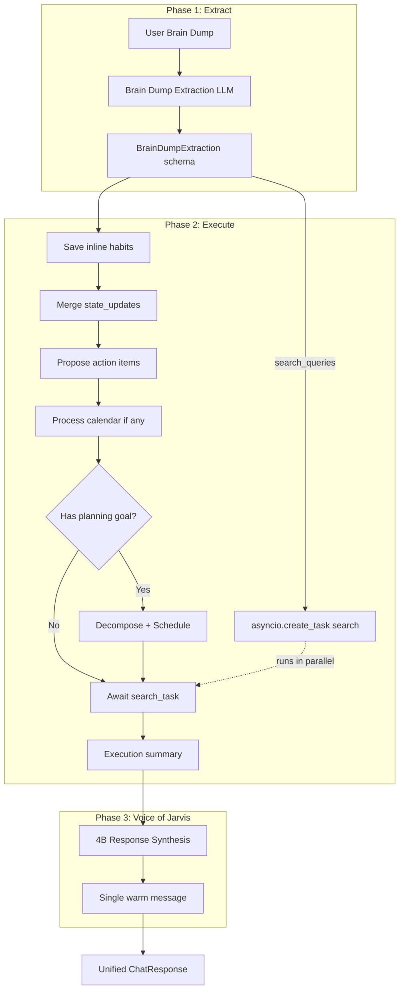

# Brain Dump Multi-Intent Extraction Plan

## Problem

Currently, the Control Policy uses a **single-intent classifier** that picks one dominant intent. Prompts like *"Plan my day to do X, Y, Z. Oh, and I hate mornings. Remind me to call my mom"* get forced into one bucket (often BEHAVIORAL_CONSTRAINT), so only the habit is saved and no schedule is produced. Web search ("look up SpaceX launch"), temporal state ("I'm tired today"), and combined actions are ignored.

## Solution: Extract All, Route All, Execute All, Speak as One

A single LLM call extracts every component from the prompt. We execute each in sequence, then synthesize a unified, warm response via a lightweight "Voice of Jarvis" model call.

---

## Current Flow vs Updated Flow

**Current flow** ([app/services/analytical/control_policy.py](app/services/analytical/control_policy.py)):

1. Single-intent classification (4B) → PLAN_DAY | CALENDAR_SYNC | KNOWLEDGE_INGESTION | BEHAVIORAL_CONSTRAINT | ACTION_ITEM
2. If ingestion intent → `process_ingestion` → return ChatResponse with fixed INGESTION_MESSAGES
3. If PLAN_DAY → `_extract_and_save_inline_habits` (only when intent is PLAN_DAY) → fetch habits → translate → decompose → schedule → return ChatResponse
4. CLOUD_KEYWORDS in decompose only trigger Gemini for real-time research; extraction itself never considers search intent

**Updated flow**:

1. **Extract** (4B): Brain dump extraction → `BrainDumpExtraction` with all components
2. **Execute**: habits → state → action items → calendar (sequential). Search starts via `asyncio.create_task` as soon as search_queries are identified, so it runs in parallel with planning (local model). Planning: fetch habits → translate → decompose → schedule. Await search task before synthesis.
3. **Synthesize** (4B): Pass execution summary to "Voice of Jarvis" → single warm `message`
4. Return ChatResponse with `message` from synthesis, plus schedule, action_proposals, search_result, etc.

---

## Architecture




---

## 1. Schema: BrainDumpExtraction

Add to [app/schemas/context.py](app/schemas/context.py):

```python
class BrainDumpExtraction(BaseModel):
    """Extracted components from a brain-dump prompt."""
    planning_goal: Optional[str] = None  # "Plan my day to do X, Y, Z" -> use for decompose
    inline_habits: List[str] = Field(default_factory=list)  # e.g. ["I hate mornings"]
    state_updates: List[str] = Field(default_factory=list)  # e.g. ["I'm feeling really tired today"]
    action_items: List[str] = Field(default_factory=list)   # e.g. ["remind me to call my mom"]
    search_queries: List[str] = Field(default_factory=list)  # e.g. ["latest updates on SpaceX launch"]
    has_calendar: bool = False
    calendar_text: Optional[str] = None   # If has_calendar, pass to calendar extractor
    has_knowledge: bool = False          # Stub for future PDF/syllabus inline refs
```

**Key distinctions**:

- **inline_habits**: Long-term preferences stored in Strategy Hub (behavioral_constraints). Persistent.
- **state_updates**: Temporary, today-only constraints (e.g. "I'm tired", "take it easy"). Never saved to DB. Passed to habit translator for today's schedule only.
- **search_queries**: Triggers Deep Research (L9). When non-empty, call Gemini with web grounding; include results in response. Complements CLOUD_KEYWORDS by extracting search intent even when user phrases it naturally ("look up", "what's the latest on", "search for").

---

### Temporal Intelligence: Mood vs. Character

This distinction is core to **Resilience Engineering**. A truly agentic system must separate:


| Metaphor      | Storage                 | Examples                                                   | Lifecycle                          |
| ------------- | ----------------------- | ---------------------------------------------------------- | ---------------------------------- |
| **Character** | Strategy Hub (Supabase) | "I hate mornings", "no meetings before 10"                 | Persistent; Jarvis knows every day |
| **Mood**      | None (transient)        | "I'm feeling sick today", "huge burst of energy right now" | Today only; forgotten tomorrow     |


**Why not store "I'm tired"?** If we saved it to the database, Jarvis would think you are sick forever. Tomorrow, when you wake up feeling great, the system would still apply tired-constraints. By treating state_updates as **Transient Overrides**, we keep the Strategy Hub clean and get automatic recovery.

**Logic flow (Temporal Intelligence):**

1. **Extraction:** 4B identifies "I'm feeling tired" as `state_update` (mood), not `inline_habit` (character).
2. **Logic injection:** Control Policy passes permanent habits + state_updates to the 27B model in a single call to `translate_habits_to_slots`.
3. **Dynamic constraint:** 27B sees both:
  - Permanent: "I hate mornings" → minimal_work 0–180
  - Temporary: "I'm tired" → cap difficulty of **all** tasks today at 0.4
4. **Result:** `daily_context` for OR-Tools encodes: *"Normally block mornings; today also cap difficulty at 0.4 for the whole day."*
5. **Tomorrow:** No memory of "I'm tired" → standard high-performance schedule.

---

## 2. Extraction Prompt

Create `BRAIN_DUMP_EXTRACTION_PROMPT` in [app/services/analytical/control_policy.py](app/services/analytical/control_policy.py) (or a new `brain_dump_extractor.py` module):

- Input: raw user message
- Output: `BrainDumpExtraction` (JSON via `response_schema`)
- Instructions:
  - **planning_goal**: Schedule tasks, break down goal, plan day. Clean goal string only.
  - **inline_habits**: Long-term constraints (I hate mornings, no meetings before 10).
  - **state_updates**: Mood, not character. Transient overrides (I'm tired, feeling sick, huge burst of energy, take it easy, go light on difficulty). Today only; never saved.
  - **action_items**: Reminders, tasks to schedule later (call my mom, apply for internship).
  - **search_queries**: Look up, search, latest on, current events, real-time research.
  - **calendar_text** / **has_calendar**: Timetables, meeting schedules, class schedules.
  - **has_knowledge**: Stub; PDF/syllabus refs.
- Use SLM (4B) for speed.

---

## 3. Execution Flow in execute_agentic_flow

Replace the current flow:


| Current                       | New                                            |
| ----------------------------- | ---------------------------------------------- |
| Classify single intent        | Extract all components (`BrainDumpExtraction`) |
| Branch: ingestion OR plan_day | Execute each non-empty component in order      |
| Fixed INGESTION_MESSAGES      | Voice of Jarvis synthesis                      |


**Execution order:**

1. **Habits** (if `inline_habits` non-empty): For each, call `store_behavioral_constraint`. Persistent in Strategy Hub.
2. **State updates** (if `state_updates` non-empty): Do **not** save. Logic injection: append to habits text before calling `translate_habits_to_slots`, e.g. `habits_text + "\n\n[Temporary, today only — do not store]: " + "; ".join(state_updates)`. The 27B model sees both permanent habits and temporary mood; it produces slots with appropriate overrides (e.g. "I'm tired" → whole-day max_difficulty 0.4).
3. **Action items** (if `action_items` non-empty): For each, call `propose_action_item`; collect proposals. Include in response.
4. **Calendar** (if `has_calendar` and `calendar_text`): Call `process_ingestion` with intent_override=CALENDAR_SYNC and payload=calendar_text.
5. **Search** (if `search_queries` non-empty): Start **immediately** via `asyncio.create_task` the moment search_queries are identified (right after extraction). While the local model runs habits → translate → decompose → schedule, the Deep Research task runs in parallel (Gemini with web grounding). By the time planning finishes, search results are already waiting; `await` the task before building the response. Use `force_cloud=True` or a dedicated Gemini grounding call. *(Implementation: `search_task = asyncio.create_task(run_deep_research(queries))` early; `search_result = await search_task` before Voice of Jarvis. Gemini 1.5 supports Google Search grounding.)*
6. **Planning** (if `planning_goal` non-empty): Run existing PLAN_DAY pipeline:
  - Fetch habits from Strategy Hub (includes newly saved inline habits)
  - Append state_updates to habits string before translate (temporary constraints)
  - `translate_habits_to_slots`
  - Decompose using `planning_goal` (not full user_prompt)
  - Run schedule
7. **Knowledge** (if `has_knowledge`): Stub; defer.

---

## 4. ChatResponse Extensions

[app/schemas/context.py](app/schemas/context.py) `ChatResponse` needs to support multiple outcomes:

- `action_proposals: Optional[List[dict]] = None` — list of `ActionItemProposal` when we extracted action items.
- `search_result: Optional[dict] = None` — when search_queries were executed: `{ "queries": [...], "summaries": [...] }`.
- Keep `ingestion_result` for calendar/knowledge.
- `message` — **always** from Voice of Jarvis synthesis (see below), not templates.

---

## 5. Voice of Jarvis (Response Synthesis)

Avoid returning 4 separate status messages. After all executions complete, pass an **execution summary** to a 4B model:

**Input to synthesis:** Structured summary of what was done, e.g.:

```
habits_saved: ["I hate mornings"]
state_applied: ["I'm tired today - lighter schedule"]
action_proposals: [{"title": "Call mom", ...}]
calendar_extracted: true
search_done: ["latest SpaceX launch updates"]
schedule_generated: true
```

**Prompt:** "You are Jarvis, a warm, capable AI assistant. The user sent a message and we executed the following. Write a single, natural 1-2 sentence response that acknowledges what we did. Be concise but human. Do not list bullet points."

**Output:** Single `message` string, e.g. *"I've noted your morning preference and the call to your mom; I've also built a lighter schedule for you since you're feeling a bit tired today. Here's the plan."*

Use SLM (4B) for this synthesis; keep it fast and cheap.

---

## 6. Fallback: Pure Single-Intent

If extraction fails or returns all-empty, fall back to the current single-intent classifier and route as today. This preserves backward compatibility.

---

## 7. File Changes Summary


| File                                                                                       | Change                                                                                                                                                                                          |
| ------------------------------------------------------------------------------------------ | ----------------------------------------------------------------------------------------------------------------------------------------------------------------------------------------------- |
| [app/schemas/context.py](app/schemas/context.py)                                           | Add `BrainDumpExtraction` (with search_queries, state_updates); add `action_proposals`, `search_result` to ChatResponse                                                                         |
| [app/services/analytical/control_policy.py](app/services/analytical/control_policy.py)     | Replace classification with extraction; implement multi-execution; add Voice of Jarvis synthesis; spawn search via `asyncio.create_task` when search_queries identified, await before synthesis |
| [app/services/analytical/habit_translator.py](app/services/analytical/habit_translator.py) | Accept combined habits + state_updates string; 27B produces daily_context with both permanent (e.g. minimal_work mornings) and transient (e.g. whole-day max_difficulty 0.4) constraints        |
| [app/services/extraction/orchestrator.py](app/services/extraction/orchestrator.py)         | Optional: expose `process_ingestion` with payload override for calendar_text                                                                                                                    |
| New: `app/services/analytical/voice_of_jarvis.py` (optional)                               | Dedicated module for execution-summary → warm message synthesis                                                                                                                                 |
| [app/models/brain/litellm_conf.py](app/models/brain/litellm_conf.py)                       | Add helper or reuse hybrid_route_query for search (Gemini with web grounding)                                                                                                                   |


---

## 8. Examples: End-to-End

**Example A (habit + action + planning):**

Input: *"Plan my day to write 3 blog posts. Oh, and I hate mornings. Remind me to call my mom."*

Extraction: `planning_goal`, `inline_habits: ["I hate mornings"]`, `action_items: ["remind me to call my mom"]`

Execution: Save habit → propose action → fetch habits + translate → decompose → schedule

Voice of Jarvis: *"I've noted your morning preference and the call to your mom; here's your schedule."*

---

**Example B (search + planning):**

Input: *"Plan my day to study, and look up the latest updates on the SpaceX launch."*

Extraction: `planning_goal: "Plan my day to study"`, `search_queries: ["latest updates on SpaceX launch"]`

Execution: Run Deep Research (Gemini) for search query → decompose + schedule (parallel or sequential)

Voice of Jarvis: *"I've pulled the latest on the SpaceX launch for you, and here's your study schedule."*

---

**Example C (state + planning — full Jarvis-level):**

Input: *"Plan my day to do X, Y, and Z. Oh, and I hate mornings. And also remind me to call my mom. I'm feeling really tired today."*

Extraction: `planning_goal`, `inline_habits`, `action_items`, `state_updates: ["I'm feeling really tired today"]`

Execution: Save habit → propose action → fetch habits + append state_updates → translate (temporary max_difficulty) → decompose → schedule

Voice of Jarvis: *"I've noted your morning preference and the call to your mom; I've also built a lighter schedule for you since you're feeling a bit tired today. Here's the plan."*

---

## 9. User Prompt Cases (Coverage)

The extraction prompt should recognize:


| User says                                                                      | Extract                                                 |
| ------------------------------------------------------------------------------ | ------------------------------------------------------- |
| "Plan my day to do X, Y, Z. Oh, and I hate mornings. Remind me to call my mom" | planning_goal, inline_habits, action_items              |
| "Plan my day to study, and look up the latest updates on the SpaceX launch"    | planning_goal, search_queries                           |
| "I'm feeling really tired today, so take it easy on the difficulty"            | state_updates                                           |
| "I'm sick, go light on tasks today"                                            | state_updates                                           |
| "I have a huge burst of energy right now"                                      | state_updates                                           |
| "No meetings before 10, and plan my day to write 3 posts"                      | inline_habits, planning_goal                            |
| "Remind me to call my mom"                                                     | action_items                                            |
| "Apply for internship by Friday"                                               | action_items                                            |
| "Here's my class schedule: Mon 9-11 OS, Tue 2-4 DB"                            | has_calendar, calendar_text                             |
| "What's the weather today? Also plan my morning"                               | search_queries, planning_goal                           |
| "I want to focus on health this week"                                          | planning_goal (meta-goal) or inline_habits (preference) |
| "Add my syllabus PDF and plan my study schedule"                               | has_knowledge, planning_goal (stub knowledge)           |


---

## 10. Edge Cases

- **Only habits:** e.g. "I hate mornings" → planning_goal=null → save habit, Voice of Jarvis message, no schedule.
- **Only action items:** e.g. "Remind me to call my mom" → propose action, Voice of Jarvis, no schedule.
- **Only state_updates:** e.g. "I'm tired today" with no planning_goal → pass to translator; if no schedule requested, return message: "Noted. When you're ready to plan, I'll keep things light."
- **Habits + planning:** Extract both; save habits first; planning sees them.
- **State + planning:** state_updates merged into habits string for translate; schedule respects temporary constraints.
- **Search + planning:** Run both; include search results in response; Voice of Jarvis weaves both into message.
- **Empty extraction:** Fall back to single-intent classifier.

