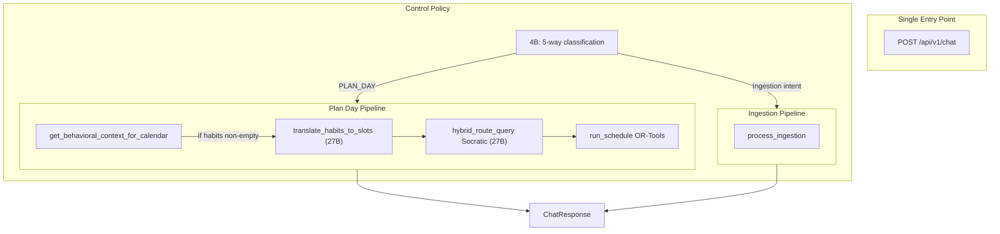

# Control Policy (Unified Backend Router) Implementation Plan

## Architecture Overview




---

## Enterprise Guardrails (Hardware and UX)

These three guards are critical for Apple Silicon (M4 Pro) and production UX:

**1. Zero-Habit Short-Circuit (Save Compute)**  
If no habits exist in Supabase, `get_behavioral_context_for_calendar` returns `""`. Do not pass an empty string to the 27B Habit Translator—it wastes 5–10 seconds and may hallucinate.  

- **Fix:** In `execute_agentic_flow`, if `not habits or not habits.strip()`, set `daily_context = []` and skip `translate_habits_to_slots` entirely.  
- **Fix:** In `translate_habits_to_slots`, add an early return: `if not habits_text or not habits_text.strip(): return []`.

**2. Sequential Safety (Avoid OOM)**  
Do not run Habit Translation (27B) and Socratic Chunker (27B) concurrently with `asyncio.gather()`. LM Studio with 24GB unified memory can OOM or queue-block if both hit the server at once.  

- **Fix:** Keep the flow strictly sequential: Fetch habits -> (translate if habits) -> Decompose -> Solve. Never parallelize the 27B calls.

**3. Graceful LLM Failure (Anti-Guilt UI)**  
If `hybrid_route_query` raises `ValidationError`, `JSONDecodeError`, or returns invalid ExecutionGraph, do not propagate 502 to the frontend.  

- **Fix:** Wrap the decompose step in `try/except`. On failure, return `ChatResponse(intent="PLAN_DAY", message="I struggled to break that goal down. Could you clarify what exactly you want to achieve?", schedule=None, execution_graph=None)`. This keeps the UI clean and encourages recalibration.

---

## 1. Update Schemas

**File:** [app/schemas/context.py](app/schemas/context.py)

- Add `PLAN_DAY = "PLAN_DAY"` to `IntentType` enum (line 15, after `ACTION_ITEM`)
- Add `ChatResponse` model:

```python
class ChatResponse(BaseModel):
    intent: str = Field(description="Classified intent (e.g. PLAN_DAY, BEHAVIORAL_CONSTRAINT)")
    message: str = Field(description="Friendly agentic response for the user")
    schedule: Optional[dict] = Field(default=None, description="OR-Tools output: status, schedule, goal_metadata")
    execution_graph: Optional[dict] = Field(default=None, description="ExecutionGraph from reasoning")
    ingestion_result: Optional[dict] = Field(default=None, description="IngestionPipelineResult when intent is ingestion")
```

- Add `TimeSlotsResponse` for habit translator LLM output:

```python
class TimeSlotsResponse(BaseModel):
    slots: List[TimeSlot] = Field(default_factory=list)
```

---

## 2. Add intent_override to process_ingestion

**File:** [app/services/extraction/orchestrator.py](app/services/extraction/orchestrator.py)

Add optional parameter `intent_override: Optional[IntentType] = None` to `process_ingestion` (line 77).

When `intent_override` is provided:

- Skip `_classify(text)` call
- Use `IntentClassification(intent=intent_override, confidence=1.0, summary="")` for routing
- Proceed with existing switch logic on `classification.intent`

This avoids a redundant 4B call when the Control Policy has already classified.

---

## 3. Extract Reusable Schedule Logic

**File:** [app/api/v1/endpoints/schedule.py](app/api/v1/endpoints/schedule.py)

Extract the core logic into a module-level function:

```python
def run_schedule(graph: ExecutionGraph, daily_context: List[TimeSlot]) -> GenerateScheduleResponse:
    """Reusable schedule generation. Raises HTTPException on INFEASIBLE."""
```

Move lines 110–171 into this function. The `generate_schedule` endpoint will call `run_schedule(request.graph, request.daily_context)`.

---

## 4. Create Habit Translator

**New file:** [app/services/analytical/habit_translator.py](app/services/analytical/habit_translator.py)

```python
HABIT_TRANSLATOR_PROMPT = (
    "You translate human habits into a daily schedule context. "
    "The user will provide their behavioral constraints. "
    "Output a JSON object with a 'slots' array of TimeSlot objects for TODAY. "
    "Assume day starts at 0 (8:00 AM) and 1440 = 8:00 AM tomorrow. "
    "Example: 'I hate mornings' -> blocked or minimal_work slot start_min: 0, end_min: 180. "
    "Each slot needs: name, start_min, end_min, availability (blocked|minimal_work|full_focus). "
    "Return strictly valid JSON with a 'slots' array."
)

async def translate_habits_to_slots(habits_text: str) -> List[TimeSlot]:
    """Convert raw habit text to OR-Tools TimeSlots via 27B."""
```

- **Short-circuit:** If `not habits_text or not habits_text.strip()`, return `[]` immediately (no LLM call).
- Otherwise: call `hybrid_route_query` with `response_schema=TimeSlotsResponse`, no `model_override` (uses 27B).
- Return `result.slots` from parsed `TimeSlotsResponse`.

---

## 5. Create Control Policy

**New file:** [app/services/analytical/control_policy.py](app/services/analytical/control_policy.py)

**Unified classification prompt** (5-way, includes PLAN_DAY):

```
Classify into one of: PLAN_DAY, CALENDAR_SYNC, KNOWLEDGE_INGESTION, BEHAVIORAL_CONSTRAINT, ACTION_ITEM.
PLAN_DAY: User wants to plan their day, schedule tasks, break down a goal (e.g. "Plan my day to study SARIMAX", "Schedule my coding tasks").
[Retain existing rules for the other 4 intents]
```

`**execute_agentic_flow(user_prompt: str, user_id: str, db_client) -> ChatResponse`:**

1. **Classify:** Call `hybrid_route_query` with `model_override=SLM_ROUTER_MODEL`, `response_schema=IntentClassification`, extended prompt. Parse to get `IntentType`.
2. **Ingestion route:** If intent in `{CALENDAR_SYNC, KNOWLEDGE_INGESTION, BEHAVIORAL_CONSTRAINT, ACTION_ITEM}`:
  - Call `process_ingestion(payload=user_prompt, user_id=user_id, db_client=db_client, intent_override=intent)`
  - Build `ChatResponse(intent=..., message="Saved." / appropriate message, ingestion_result=result.model_dump())`
3. **Plan Day route:** If intent == `PLAN_DAY`:
  - `habits = await get_behavioral_context_for_calendar(user_id, db_client.supabase)`
  - **Zero-habit short-circuit:** If `not habits or not habits.strip()`, set `daily_context = []`. Else `daily_context = await translate_habits_to_slots(habits)`. (Never call 27B when habits are empty.)
  - **Decompose (strictly sequential after translate):** Wrap in try/except. Call `hybrid_route_query` with `SYSTEM_PROMPT`, `response_schema=ExecutionGraph`, `lenient_validation=True`; apply same retry logic (undersized → Gemini fallback) as decompose-goal. On `ValidationError`, `JSONDecodeError`, or other parse failure after retry: return `ChatResponse(intent="PLAN_DAY", message="I struggled to break that goal down. Could you clarify what exactly you want to achieve?", schedule=None, execution_graph=None)`.
  - Call `run_schedule(graph, daily_context)` (import from schedule endpoint).
  - On `HTTPException(422)` (INFEASIBLE): return `ChatResponse` with `message="Schedule infeasible; try reducing scope."`, `schedule=None`, `execution_graph=graph.model_dump()`.
  - On success: return `ChatResponse` with `message="Here's your schedule."`, `schedule=schedule_response.model_dump()`, `execution_graph=graph.model_dump()`.

**Imports:** `SLM_ROUTER_MODEL`, `GEMINI_API_KEY`, `hybrid_route_query`, `SYSTEM_PROMPT` from reasoning, `ExecutionGraph`, `run_schedule`, `get_behavioral_context_for_calendar`, `process_ingestion`, `translate_habits_to_slots`

---

## 6. Create Chat Endpoint

**New file:** [app/api/v1/endpoints/chat.py](app/api/v1/endpoints/chat.py)

- Request body: `{ "user_prompt": str, "user_id": str }`
- `db_client = request.app.state.db_client`
- `response = await execute_agentic_flow(user_prompt, user_id, db_client)`
- Return `response`

---

## 7. Register Router

**File:** [app/api/v1/router.py](app/api/v1/router.py)

- Add `from app.api.v1.endpoints import chat`
- Add `api_router.include_router(chat.router, prefix="/chat", tags=["Chat"])`

---

## File Summary


| Action | File                                                                                                 |
| ------ | ---------------------------------------------------------------------------------------------------- |
| Modify | [app/schemas/context.py](app/schemas/context.py) – PLAN_DAY, ChatResponse, TimeSlotsResponse         |
| Modify | [app/services/extraction/orchestrator.py](app/services/extraction/orchestrator.py) – intent_override |
| Modify | [app/api/v1/endpoints/schedule.py](app/api/v1/endpoints/schedule.py) – extract run_schedule          |
| Create | [app/services/analytical/**init**.py](app/services/analytical/__init__.py) – package init            |
| Create | [app/services/analytical/habit_translator.py](app/services/analytical/habit_translator.py)           |
| Create | [app/services/analytical/control_policy.py](app/services/analytical/control_policy.py)               |
| Create | [app/api/v1/endpoints/chat.py](app/api/v1/endpoints/chat.py)                                         |
| Modify | [app/api/v1/router.py](app/api/v1/router.py) – register chat router                                  |


---

## Edge Cases

- **Empty habits:** Short-circuit: `daily_context = []` without calling `translate_habits_to_slots`; schedule runs with no blocks
- **INFEASIBLE:** Catch 422, return ChatResponse with explanatory message and execution_graph (user can recalibrate)
- **Decompose failure:** Same retry logic as decompose-goal; if both fail, return graceful ChatResponse with message "I struggled to break that goal down..." (no 502)
- **db_client is None:** Control Policy should handle; `get_behavioral_context_for_calendar` and `process_ingestion` both accept optional client and degrade gracefully

