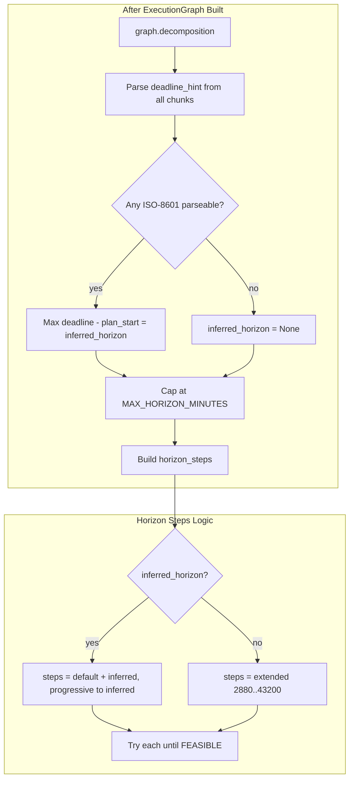

# Deadline-Based Horizon for Multi-Week Scheduling

## Problem

Tasks spanning 2+ weeks are packed into at most 5 days because `horizon_steps = [2880, 4320, 7200]` in [app/services/analytical/control_policy.py](app/services/analytical/control_policy.py) never extends beyond 7200 minutes. Users with goals like "Study for exam on March 20" need the schedule distributed across the full span.

## Approach: Deadline-Inferred Horizon + Extended Fallback




---

## 1. Deadline Parsing Utility

**New file:** `app/utils/deadline_parser.py`

- `**parse_deadline_to_date(hint: str | None, ref: datetime) -> datetime | None`**
  - Parse ISO-8601 (`2026-03-20`, `2026-03-07`) via existing logic — reuse or mirror [app/services/analytical/horizon_expander.py](app/services/analytical/horizon_expander.py) `_parse_iso_date`.
  - Return `datetime` at start-of-day for the parsed date; `None` if unparseable.
  - **Phase 1:** ISO-8601 only. No new dependencies.
  - **Phase 2 (optional):** Add `dateparser` for NL strings ("before Friday exam", "next week") — would require adding `dateparser` to [pyproject.toml](pyproject.toml).
- `**compute_horizon_from_deadlines(graph: ExecutionGraph, plan_start: datetime) -> int | None`**
  - Iterate `graph.decomposition`, collect all `chunk.deadline_hint`.
  - For each, call `parse_deadline_to_date(hint, plan_start)`.
  - Take the **maximum** (furthest) parsed date.
  - Return `min((max_date - plan_start).total_seconds() / 60, MAX_HORIZON_MINUTES)` as int, or `None` if no parseable deadlines.
  - Use `plan_start` as the reference "today" for relative semantics (future dates only; ignore past deadlines).

---

## 2. Control Policy Integration

**File:** [app/services/analytical/control_policy.py](app/services/analytical/control_policy.py)

In `_run_plan_day_flow`, after `graph = ExecutionGraph(**data)` and before the horizon loop:

1. **Import:** `from app.utils.deadline_parser import compute_horizon_from_deadlines`
2. **Compute inferred horizon:**

```python
   inferred_horizon = compute_horizon_from_deadlines(graph, plan_start)
   

```

1. **Build `horizon_steps` dynamically:**
  - If `inferred_horizon` is not None and > `DEFAULT_HORIZON_MINUTES`:
    - `base_steps = [DEFAULT_HORIZON_MINUTES, 4320, 7200]` (try short first for fast solve)
    - Add inferred if not already covered: ensure `max(base_steps + [inferred_horizon])` is the ceiling.
    - `horizon_steps = sorted(set(base_steps + [inferred_horizon]))` then filter `<= MAX_HORIZON_MINUTES`.
  - Else (no parseable deadline):
    - Extend fallback: `horizon_steps = [2880, 4320, 7200, 10080, 20160, 43200]` (2d, 3d, 5d, 7d, 14d, 30d), filtered by `MAX_HORIZON_MINUTES`.
2. **Loop unchanged:** Iterate `horizon_steps`, call `run_schedule` with each `horizon_min`, break on success.

---

## 3. LLM Prompt Enhancement (Optional but Recommended)

**File:** [app/api/v1/endpoints/reasoning.py](app/api/v1/endpoints/reasoning.py)

Add to `SYSTEM_PROMPT` (e.g. after rule 5):

- "When the user mentions a deadline (exam date, due date, 'by Friday'), include it in `deadline_hint` as ISO-8601 (YYYY-MM-DD) when possible. Example: 'exam on March 20' -> deadline_hint: '2026-03-20'. Put the deadline on the final or most relevant chunk."

This increases the chance the backend can parse deadlines without adding NL parsing.

---

## 4. TMT Integration (Future Enhancement)

Currently [app/api/v1/endpoints/schedule.py](app/api/v1/endpoints/schedule.py) uses `DEFAULT_DELAY_HOURS = 24` for every task. A natural follow-up: pass per-chunk `delay_hours` from parsed `deadline_hint` into `_compute_tmt_priority`, so tasks with nearer deadlines get higher priority (scheduled earlier). Out of scope for this plan.

---

## 5. File Summary


| File                                        | Change                                                                          |
| ------------------------------------------- | ------------------------------------------------------------------------------- |
| `app/utils/deadline_parser.py`              | New: `parse_deadline_to_date`, `compute_horizon_from_deadlines`                 |
| `app/services/analytical/control_policy.py` | Import deadline util; compute `inferred_horizon`; build dynamic `horizon_steps` |
| `app/api/v1/endpoints/reasoning.py`         | (Optional) Add deadline_hint/ISO-8601 instruction to SYSTEM_PROMPT              |


---

## 6. Edge Cases

- **All chunks missing deadline_hint:** Fall back to extended steps; behavior improves over current (can now reach 14d, 30d).
- **Past deadline:** Ignore (return None for that chunk) or treat as "as soon as possible" — document in parser.
- **Mixed chunk deadlines:** Use max (furthest); horizon covers entire goal span.
- **Invalid ISO in hint:** Skip; no crash. Parser returns None.

---

## 7. Testing

- Unit: `parse_deadline_to_date("2026-03-20", ref) -> date 2026-03-20`; `parse_deadline_to_date("invalid", ref) -> None`.
- Unit: `compute_horizon_from_deadlines` with graph where last chunk has `deadline_hint: "2026-03-20"` and `plan_start` = 2026-03-05 → horizon ~15 days.
- Integration: Plan-day flow with "Study for exam March 20" → schedule spans multiple days up to March 20.

