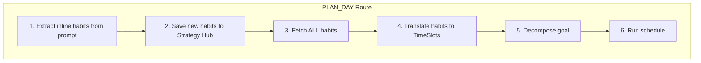

# Habit Application and Intent Collision Fix

## Problem Summary

1. **Habit not applied:** "No heavy programming before 11 AM" is stored but schedules still place heavy tasks (e.g. AuthService) at 8:25 AM.
2. **Intent collision:** "Plan my day to study, and by the way I hate mornings" routes to PLAN_DAY but does not save "I hate mornings" to Strategy Hub.
3. **UX clarity:** Users need explicit feedback that habits will apply to the next plan.
4. **Recalibration:** System must efficiently recalibrate tasks, schedules, and goals whenever a new plan or habit is added—without hardcoding.

---

## Design Principles: Natural Processing, No Hardcoding

- **LLM-driven interpretation:** Time ranges, constraints, and habit semantics are derived by the LLM from natural language. Avoid fixed keyword lists (e.g. "morning", "before 11") in application logic.
- **Prompt guidance over code rules:** Provide rich examples and rules in prompts; let the model infer start_min, end_min, availability, and max_difficulty from context. Use fallback prompts only when the primary output is invalid.
- **Stateless recalibration:** Every PLAN_DAY request performs a full fresh computation using the latest habits. No cached or stale schedule state.

---

## Recalibration Strategy

Whenever a new plan or habit affects the user's state, the system must produce a consistent, up-to-date schedule.


| Trigger                      | Backend Behavior                                                                                                                               | Frontend Guidance                                                                                                                   |
| ---------------------------- | ---------------------------------------------------------------------------------------------------------------------------------------------- | ----------------------------------------------------------------------------------------------------------------------------------- |
| **PLAN_DAY**                 | Full recalibration: extract inline habits → save → fetch all habits → translate → decompose → schedule. Always uses latest Strategy Hub state. | N/A                                                                                                                                 |
| **BEHAVIORAL_CONSTRAINT**    | Habit stored. No plan to update (plans are ephemeral).                                                                                         | Return `suggested_action: "replan"` so UI can offer "Regenerate your schedule" or auto-trigger a new PLAN_DAY if a plan is visible. |
| **Inline habit in PLAN_DAY** | Save new habit first, then fetch (now includes it), translate, decompose, schedule. Same plan respects the newly extracted habit.              | N/A                                                                                                                                 |


**Efficiency (optional):** Merge inline habit extraction with classification—a single 4B call returns `intent` plus `extracted_habits` when PLAN_DAY. Reduces one LLM round-trip. Defer if complexity outweighs benefit.

---

## Architecture: Updated PLAN_DAY Flow




---

## 1. Strengthen Habit Translator Prompt (LLM-Driven, No Hardcoding)

**File:** [app/services/analytical/habit_translator.py](app/services/analytical/habit_translator.py)

Replace `HABIT_TRANSLATOR_PROMPT` with a prompt that guides the model to interpret habits naturally:

- **Context:** Day starts at 0 (8:00 AM); 1440 = 8:00 AM next day. Derive start_min/end_min from natural language (e.g. "before 11 AM" → end_min 180; "after lunch" → start_min 480; "morning" → 0–180).
- **Availability:** NEVER use `full_focus` for time ranges the user wants to avoid or limit. Use `blocked` for complete avoidance (e.g. sleep), `minimal_work` for "only easy/short tasks" (e.g. "no heavy work before 11 AM" → max_difficulty 0.3, max_task_duration 10).
- **Examples** (for model guidance, not for code logic): "I hate mornings" → minimal_work 0–180; "no heavy programming before 11 AM" → same with max_difficulty 0.3; "I have a meeting 2–3 PM" → blocked 840–900.
- **Output:** Strictly valid JSON with a `slots` array. Each slot needs name, start_min, end_min, availability, and optionally max_task_duration, max_difficulty for minimal_work.

---

## 2. LLM Retry Fallback (Replace Keyword-Based Logic)

**File:** [app/services/analytical/habit_translator.py](app/services/analytical/habit_translator.py)

If the primary call returns empty `slots` but `habits_text` is non-empty:

- **Do NOT** use hardcoded keyword checks (no "morning", "before 11" in code).
- **Instead:** Make a second LLM call with a fallback prompt: "The user's constraints were: [habits_text]. The previous translation returned no slots. Interpret this text and output at least one TimeSlot. Infer time ranges from phrases like 'morning', 'before 11', 'after lunch', 'evening'. Use minimal_work or blocked as appropriate. Return strictly valid JSON with a 'slots' array."
- If the retry also fails (empty or parse error), return `[]`—do not invent slots. Log for debugging.

---

## 3. Inline Habit Extraction (Intent Collision Fix)

**File:** [app/services/analytical/control_policy.py](app/services/analytical/control_policy.py)

**Add import:** `store_behavioral_constraint` from `app.services.extraction.behavioral_store`.

**Add helper** (above `execute_agentic_flow`):

```python
async def _extract_and_save_inline_habits(
    user_prompt: str, user_id: str, supabase_client
) -> None:
    """Scans a planning prompt for new long-term habits and saves them before scheduling."""
```

- **System prompt (natural extraction):** "You extract behavioral habits and preferences from user text. Identify any long-term constraints (e.g. 'I hate mornings', 'no meetings before 10', 'I work best in the evening'). Ignore one-off tasks or today's specific goals. If there are no general habits, return exactly 'NONE'. Return only the habit phrase(s), no preamble."
- Call `hybrid_route_query` with `model_override=SLM_ROUTER_MODEL`, no `response_schema` (raw string).
- If result is non-empty, does not contain "NONE" (case-insensitive), and `len(result.strip()) > 5`, call `store_behavioral_constraint`.
- Wrap in try/except; log on failure; non-blocking (do not abort PLAN_DAY).

**Update PLAN_DAY branch:** Insert as first step:

```python
if intent == IntentType.PLAN_DAY:
    supabase = db_client.supabase if db_client and hasattr(db_client, "supabase") else None
    await _extract_and_save_inline_habits(user_prompt, user_id, supabase)
    habits = await get_behavioral_context_for_calendar(user_id, supabase)
    # ... rest unchanged
```

---

## 4. Proactive UX Hints and Dual-Mode UI Support

**File:** [app/services/analytical/control_policy.py](app/services/analytical/control_policy.py)

- Update `INGESTION_MESSAGES[IntentType.BEHAVIORAL_CONSTRAINT]` to: `"Got it, I've noted your preference. Your schedule constraints have been updated."`
- This phrasing works for both frontend modes:
  - **Ask before applying:** UI shows popup "Would you like to recalculate your schedule?" when `suggested_action="replan"`.
  - **Auto-apply new habits:** UI silently resends a PLAN_DAY request in the background when `suggested_action="replan"`.
- Backend remains stateless; React reads `suggested_action` and applies the user's preference (from settings/toggle).

---

## 5. Add suggested_action to ChatResponse

**File:** [app/schemas/context.py](app/schemas/context.py)

Add to `ChatResponse`:

```python
suggested_action: Optional[str] = Field(
    default=None,
    description="Frontend hint: e.g. 'replan' when user saved a habit and may want to refresh schedule",
)
```

**File:** [app/services/analytical/control_policy.py](app/services/analytical/control_policy.py)

- When returning ChatResponse for `BEHAVIORAL_CONSTRAINT`, set `suggested_action="replan"`.
- All other ChatResponse returns keep `suggested_action=None` (default).

---

## 6. Edge Cases to Handle


| Edge Case                                               | Handling                                                                                                                      |
| ------------------------------------------------------- | ----------------------------------------------------------------------------------------------------------------------------- |
| Inline extractor returns task text (e.g. "Plan my day") | Prompt instructs "NONE"; len > 5 filter; consider rejecting if extracted contains dominant planning verbs.                    |
| Multiple habits in one prompt                           | Store as single constraint; LLM returns concatenated or first habit. Acceptable for v1.                                       |
| supabase_client is None                                 | `_extract_and_save_inline_habits` skips save; `get_behavioral_context_for_calendar` returns ""; schedule runs with no blocks. |
| Habit translator returns full_focus                     | Strengthened prompt forbids it; LLM retry fallback re-interprets if slots empty.                                              |
| Schedule INFEASIBLE                                     | Agentic message (Section 8): habit-aware, suggests reducing scope or relaxing constraints.                                    |
| Conflicting habits                                      | Both stored; translator receives concatenated text; LLM resolves; solver may INFEASIBLE—graceful message.                     |
| Duplicate habit                                         | Both stored; translator may output duplicate slots; solver tolerates. Optional dedupe later.                                  |
| Habit with no time component ("I prefer silence")       | Translator returns [] or no block; plan proceeds normally.                                                                    |
| Recalibration: habit added after plan displayed         | Backend stateless; return suggested_action: "replan"; frontend offers "Regenerate" or auto-triggers PLAN_DAY.                 |
| Recalibration: plan with inline habit                   | Extract → save → fetch → translate → decompose → schedule; single request yields consistent schedule.                         |
| Translator retry also fails                             | Return []; schedule without blocks; log for debugging.                                                                        |
| **Simultaneous contradiction** (goal vs habit)          | e.g. "Plan 4 hours of heavy coding, but I refuse to code before 4 PM" → INFEASIBLE. Use agentic message (Section 8).          |


---

## 7. UI Integration for suggested_action (Dual-Mode Support)

**File:** [app/services/analytical/control_policy.py](app/services/analytical/control_policy.py)

Frontend will support a user toggle: "Auto-apply new habits" vs "Ask before applying."

- **Message:** `"Got it, I've noted your preference. Your schedule constraints have been updated."` (covers both modes; does not imply manual re-plan).
- **suggested_action:** Keep `"replan"`. React reads this and either shows a popup or silently fires PLAN_DAY based on user settings.
- Backend stays stateless; no mode flag sent from frontend.

---

## 8. Simultaneous Contradiction (Habit vs Goal)

**File:** [app/services/analytical/control_policy.py](app/services/analytical/control_policy.py)

When inline habit + goal are mathematically contradictory (e.g. "Plan 4 hours of heavy coding, but I refuse to code before 4 PM"), OR-Tools returns INFEASIBLE (422).

**Update the INFEASIBLE except block in the PLAN_DAY route:**

- Replace the generic message with an agentic, habit-aware one:
  - **New message:** `"This schedule is mathematically impossible to fit into your day, especially considering your personal constraints. Try reducing the scope of your tasks or temporarily relaxing a habit."`
- Include `suggested_action: "replan"` in the ChatResponse so the UI can offer "Try again" or "Adjust your constraints."
- **Future enhancement:** Use an LLM call to generate a tailored suggestion (e.g. "Consider splitting this across 2 days" or "Your 'no coding before 4 PM' constraint leaves only ~4 hours; try 3 tasks instead of 5") from the goal + habits. Defer if latency/cost is a concern.

---

## File Summary


| Action | File                                                                                                                                                                                         |
| ------ | -------------------------------------------------------------------------------------------------------------------------------------------------------------------------------------------- |
| Modify | [app/services/analytical/habit_translator.py](app/services/analytical/habit_translator.py) – prompt, LLM retry fallback (no keyword hardcoding)                                              |
| Modify | [app/services/analytical/control_policy.py](app/services/analytical/control_policy.py) – inline extraction, PLAN_DAY order, BEHAVIORAL message, suggested_action, INFEASIBLE agentic message |
| Modify | [app/schemas/context.py](app/schemas/context.py) – suggested_action on ChatResponse                                                                                                          |


---

## Acceptance Criteria

1. User: "Plan my day to study, and by the way I hate mornings" → habit "I hate mornings" saved; schedule respects morning block (no heavy tasks 0–180).
2. User: "I hate coding in the mornings. No heavy programming before 11 AM." → stored; next PLAN_DAY: heavy tasks (difficulty > 0.4 or duration > 15) start at or after minute 180.
3. User: "Plan my coding day. Build auth module, write tests, review PR." (with habit already stored) → schedule enforces morning constraint.
4. BEHAVIORAL_CONSTRAINT response includes message "Your schedule constraints have been updated." and `suggested_action: "replan"` (supports dual-mode UI).
5. **Recalibration:** Every PLAN_DAY uses latest habits (no stale state). Adding a habit, then planning, produces a schedule that respects the new habit in one request.
6. **Natural processing:** No hardcoded keyword checks (e.g. "morning", "before 11") in Python; time interpretation is LLM-driven via prompts.
7. **INFEASIBLE (habit vs goal):** Contradictory prompt (e.g. "4 hours heavy coding, no coding before 4 PM") returns agentic message about constraints; optionally `suggested_action: "replan"`.

