# Habit Deletion and Data Provenance Implementation

## Summary

This plan adds (1) a `DELETE /behavioral-constraint/{id}` endpoint with IDOR protection, and (2) provenance preservation from Docling through to ChromaDB with Chroma-safe metadata. No schema changes required.

---

## Part 1: Habit Deletion (L7 Strategy Hub)

### 1.1 Add `delete_behavioral_constraint` in behavioral_store.py

**File:** [app/services/extraction/behavioral_store.py](app/services/extraction/behavioral_store.py)

- Accept `constraint_id: str`, `user_id: Optional[str]` (optional for backward compat, but endpoint should require it for multi-tenant security), optional `supabase_client`
- Use `_get_supabase()` when client not provided
- **IDOR protection:** When `user_id` is provided, always chain `.eq("user_id", user_id)` on the delete query so a user cannot delete another user's constraint by guessing UUIDs
- Return `{"status": "deleted", "id": constraint_id}` on success
- Return `{"status": "error", "reason": "..."}` when Supabase unavailable
- For 404: optionally `select("id").eq("id", constraint_id).eq("user_id", user_id).execute()` first; if `result.data` empty, return error so endpoint can raise 404

### 1.2 Add DELETE endpoint in ingestion.py

**File:** [app/api/v1/endpoints/ingestion.py](app/api/v1/endpoints/ingestion.py)

- Route: `@router.delete("/behavioral-constraint/{constraint_id}")`
- **IDOR protection:** `user_id` should be **required** when the app is multi-tenant. Obtain from authenticated context (e.g. `request.state.user_id`, JWT, or session) rather than an optional query param. If `user_id` cannot be determined, return 401.
- Pass `user_id` to `delete_behavioral_constraint` so the delete is always scoped
- On `status == "error"`: 503 if not configured, 404 if not found, 500 otherwise
- Success: `{"status": "deleted", "id": constraint_id}`

**Multi-tenant assumption:** If the app stores `user_id` in `behavioral_constraints`, enforce it on every delete. Avoid making `user_id` an optional query param that clients can omit—that would allow IDOR.

---

## Part 2: Data Provenance (L6 Extraction → L4 Vector DB)

### 2.1 Add `extract_document_with_provenance` in docling_helper.py

**File:** [app/utils/docling_helper.py](app/utils/docling_helper.py)

**Docling duplication fix (critical):** Do **not** use `doc.iterate_items()`. Docling extracts a table as a whole `TableItem` and also extracts every single cell as a `TextItem`. Using `iterate_items()` would store table data twice in the Vector DB. Filtering by `doc.texts` + `doc.tables` + `doc.lists` perfectly fixes this—each logical unit is yielded exactly once.

**Logic:**

1. Reuse same converter setup as `extract_document`
2. Call `converter.convert(f.name)` to get `DoclingDocument`
3. Build ordered list of items:
   - **doc.tables:** For each `TableItem`, use `item.export_to_markdown(doc)` for text; `item.prov` for provenance
   - **doc.texts:** For each text item, use `item.text`; check that it is **not** a descendant of a table (e.g. via `parent` / `self_ref` or by tracking table `self_ref`s and skipping text items whose parent chain includes a table). If tables are top-level and table cell text lives inside `TableItem.data`, then `doc.texts` may not include table cells—verify and filter if needed
   - **doc.lists / groups:** Add list items if they are separate from `doc.texts`; same provenance extraction
4. For each item, extract `prov`: use first `ProvenanceItem`; `page_no: int`, `bbox: [l, t, r, b]`
5. Return `list[dict]` with `{"text": "...", "metadata": {"page_no": int, "bbox": [l,t,r,b]}}`. Use `page_no: 0, bbox: []` when prov empty

### 2.2 ChromaDB metadata sanitizer and Anchor Bbox

**File:** [app/services/extraction/knowledge_ingester.py](app/services/extraction/knowledge_ingester.py)

**Problems:** Per [Chroma Adding Data](https://docs.trychroma.com/docs/collections/add-data) and [Metadata Filtering](https://docs.trychroma.com/docs/querying-collections/metadata-filtering):

1. **None sanitizer (mandatory):** The ChromaDB Python client throws a hard exception and crashes the ingestion pipeline if any metadata value is `None`. A sanitizer that replaces `None` with safe defaults is **required** before every `collection.add()`.
2. **Metadata bloat:** Storing a giant array of 50 bounding boxes for a single chunk bloats the database. Storing a single **Anchor Bbox** (the first box of the chunk) is much cleaner and gives the UI exactly what it needs to scroll to the right place later.
3. **Chroma constraints:** Metadata values must be `str`, `int`, `float`, or `bool`, or flat arrays of one type. **Empty arrays are not allowed.** **Nested arrays (arrays of arrays) are not supported.**

**Solution:**

1. **Metadata sanitizer (mandatory):** Before every `collection.add(..., metadatas=[meta])`, run `_sanitize_chroma_metadata(meta)` that:
   - Replaces `None` with `""` for string-like keys, `0` for numeric keys
   - **Omits keys** whose value would be an empty list (Chroma rejects empty arrays)
   - Ensures all values are `str`, `int`, `float`, or `bool`, or flat lists of one type
   - Drops keys with invalid types

2. **Anchor Bbox (single bbox per chunk):** Store **one** bbox per chunk—the first contributing item's bbox. Format: `[l, t, r, b]` as a list of 4 floats (Chroma supports `FloatArray`). If no bbox, omit the key entirely (do not pass `[]`).

3. **page_nos:** Use `[1, 2, 3]` (flat `int[]`, Chroma allows this) or comma-separated string `"1,2,3"`. Cap at ~10 pages to avoid bloat. Omit key if empty.

**Example sanitizer:**

```python
def _sanitize_chroma_metadata(meta: dict) -> dict:
    """Mandatory before collection.add(). Chroma crashes on None or invalid types."""
    sanitized = {}
    for k, v in meta.items():
        if v is None:
            v = "" if k in ("source", "intent", "deadline") else 0
        if isinstance(v, list):
            v = [x for x in v if x is not None]
            if not v:
                continue  # omit empty arrays - Chroma rejects them
            v = v[:10]  # cap size
        sanitized[k] = v
    return sanitized
```

### 2.3 Update knowledge_ingester

- New signature: `ingest_knowledge(extracted_text=None, extracted_items=None, source=..., intent=..., deadline_detected=...)`
- When `extracted_items` provided: concatenate text, provenance-aware chunking, aggregate page_nos and compute **Anchor Bbox** (first bbox only) per chunk
- **Before every `collection.add()`:** run `_sanitize_chroma_metadata()` on each chunk's metadata—mandatory to avoid Chroma crash on `None`
- Merge: `source`, `intent`, `deadline`, `page_nos` (sanitized, omitted if empty), `bbox` (single Anchor Bbox, omitted if empty)

### 2.4 Update orchestrator

**File:** [app/services/extraction/orchestrator.py](app/services/extraction/orchestrator.py)

- `_extract_text` returns `(text, provenance_items | None)`
- For file: call `extract_document_with_provenance`, derive `text = "\n\n".join(i["text"] for i in items)`, return `(text, items)`
- For `KNOWLEDGE_INGESTION`: pass `extracted_items` when available, else `extracted_text`

---

## Data Flow

```mermaid
flowchart TB
    subgraph Part1 [Habit Deletion with IDOR protection]
        Client1[Client]
        EP1["DELETE /behavioral-constraint/id"]
        Auth[Authenticated user_id]
        BS1[delete_behavioral_constraint]
        DB1[(behavioral_constraints)]
        Client1 --> Auth --> EP1 --> BS1 --> DB1
        BS1 -->|"eq user_id"| DB1
    end

    subgraph Part2 [Provenance Pipeline]
        File[PDF bytes]
        DH[extract_document_with_provenance]
        DH -->|"doc.texts + doc.tables + doc.lists"| Items
        Items["Items without duplication"]
        Orch[orchestrator]
        KI[ingest_knowledge]
        Sanit[_sanitize_chroma_metadata]
        Chroma[(ChromaDB)]
        Items --> Orch --> KI
        KI -->|"chunk + Anchor Bbox"| Sanit --> Chroma
    end
```



---

## Implementation Order

1. **behavioral_store.py** – `delete_behavioral_constraint` with `user_id` enforcement
2. **ingestion.py** – DELETE endpoint with authenticated `user_id`
3. **docling_helper.py** – `extract_document_with_provenance` using doc.texts + doc.tables + doc.lists
4. **knowledge_ingester.py** – `extracted_items` support, Anchor Bbox, `_sanitize_chroma_metadata`, provenance-aware chunking
5. **orchestrator.py** – Update `_extract_text` and `process_ingestion`

---

## Security and Robustness

| Concern | Mitigation |
|--------|------------|
| IDOR on habit deletion | Require authenticated `user_id`; always `.eq("user_id", user_id)` on delete |
| Docling table duplication | Use `doc.texts` + `doc.tables` + `doc.lists`—never `iterate_items()`. Table + cells would be stored twice otherwise. |
| ChromaDB None crash | **Mandatory** None sanitizer before `collection.add()`; Chroma throws hard exception on `None` |
| Metadata bloat | Store single Anchor Bbox (first bbox of chunk), not 50 bboxes; cap `page_nos` |
| Chroma empty/nested arrays | Omit keys with empty lists; Chroma rejects empty arrays and nested arrays (per [Chroma docs](https://docs.trychroma.com/docs/collections/add-data)) |

---

## References

- [Chroma Getting Started](https://docs.trychroma.com/docs/overview/getting-started) – Add data with `collection.add(ids, documents, metadatas)`
- [Chroma Adding Data](https://docs.trychroma.com/docs/collections/add-data) – Metadata: str, int, float, bool, or arrays of one type; empty arrays not allowed
- [Chroma Metadata Filtering](https://docs.trychroma.com/docs/querying-collections/metadata-filtering) – Nested arrays not supported; array operators `$contains`, `$not_contains`
