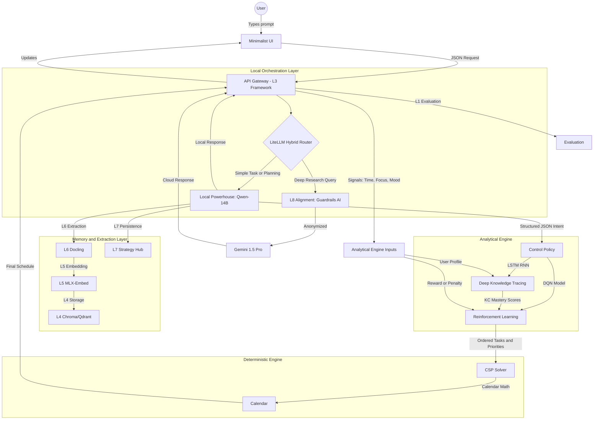

# Jarvis Backend Folder Structure and Conda Install Script

## Context

The PDF specifies a production-ready repository for the Jarvis AI Productivity Backend—a 9-layer agentic RAG stack optimized for Apple M4 Pro. The workspace (`[.env](.env)`) already has Supabase credentials configured.

## 1. Folder Structure

Create the exact structure from the PDF at the workspace root:

```
Jarvis-Engine/
├── app/
│   ├── main.py                    # FastAPI entry, LiteLLM router init
│   ├── api/
│   │   └── v1/
│   │       ├── endpoints/
│   │       │   ├── reasoning.py   # Socratic task chunking
│   │       │   ├── schedule.py    # OR-Tools solver execution
│   │       │   ├── analytical.py  # DKT mastery & RL updates
│   │       │   └── telemetry.py   # UI signal ingestion
│   │       └── router.py          # Centralized endpoint routing
│   ├── core/
│   │   ├── psychology/
│   │   │   ├── woop.py            # WOOP behavioral logic
│   │   │   └── pacing.py          # Anti-guilt adaptive capacity
│   │   ├── or_tools/
│   │   │   ├── solver.py          # CP-SAT constraint modeling
│   │   │   └── constraints.py     # Sleep, precedence, buffer logic
│   │   └── config.py              # MPS/MLX, DB secrets
│   ├── models/
│   │   ├── brain/
│   │   │   ├── qwen_mlx.py        # Local LLM wrapper (4-bit MLX)
│   │   │   └── litellm_conf.py    # Hybrid routing (Gemini 1.5 Pro)
│   │   ├── analytical/
│   │   │   ├── dkt_lstm.py        # LSTM Deep Knowledge Tracing
│   │   │   └── dqn_rl.py          # Deep Q-Network pathfinding
│   │   └── forecast/
│   │       └── capacity_ts.py     # SARIMAX cognitive energy prediction
│   ├── db/
│   │   ├── supabase_py.py         # Supabase client
│   │   └── migrations/           # SQL schema (User_State, etc.)
│   └── utils/
│       ├── docling_helper.py      # PDF extraction, KC mapping
│       └── metrics.py             # TCR, TTFT, self-efficacy tracking
├── tests/
│   ├── conftest.py                # Pytest configuration
│   ├── test_scheduler.py          # OR-Tools INFEASIBLE tests
│   └── test_chunker.py            # JSON schema validation
├── pyproject.toml                 # Dependencies (uv/pip compatible)
├── .env                           # Already exists with Supabase
├── install.sh                     # Conda env + package install
└── docs/
    └── POLICY_ENGINE_ARCHITECTURE.md   # Architecture README with diagram
```

All new directories will be created with placeholder `__init__.py` files so Python treats them as packages. Empty placeholder files (e.g. `main.py`, `solver.py`) will be created to establish the layout.

## 2. install.sh Design

The script will:

1. **Check for conda**
  Detect `conda` (or `mamba`) and exit with instructions if missing.
2. **Create conda environment**
  - Env name: `jarvis` (or configurable)  
  - Python: **3.11**  
  - Rationale: MLX and PyTorch MPS support it; OR-Tools needs 3.9+.
3. **Activate and install packages**
  - Use `conda run` or `source activate` to install inside the env.  
  - Prefer `pip install -e .` using `pyproject.toml` so dependencies are centralized.  
  - Fallback: `pip install -r requirements.txt` if pyproject is not used for deps.
4. **Platform check**
  - Optional: Detect macOS (Darwin) and warn if not Apple Silicon for MLX/GPU use.  
  - MLX and MPS are Apple Silicon–specific.
5. **Post-install**
  - Optionally run a minimal smoke test (`python -c "import fastapi; import mlx"`) to verify install.  
  - Print activation command: `conda activate jarvis`.

## 3. pyproject.toml Dependencies

Packages will be declared in `pyproject.toml` (PEP 621) under `[project.optional-dependencies]` or `[project.dependencies]`:


| Layer/Phase | Package             | Purpose                                   |
| ----------- | ------------------- | ----------------------------------------- |
| L3          | fastapi, uvicorn    | API gateway                               |
| L3          | pydantic            | WOOP/ExecutionGraph JSON validation       |
| L2          | mlx, mlx-lm         | Qwen-14B local inference on Apple Silicon |
| L9          | litellm             | Hybrid local/cloud routing                |
| L2          | ortools             | CP-SAT scheduler                          |
| Phase 4     | torch               | DKT LSTM, DQN (MPS backend)               |
| L7          | supabase            | Supabase client                           |
| Forecast    | pandas, statsmodels | SARIMAX cognitive capacity                |
| L6          | docling             | PDF extraction, KC mapping                |
| L1          | pytest              | Unit tests                                |


**Phase 2+ packages** (can be added later): `chromadb`, `qdrant-client`, `ragas`, `deepeval`, `guardrails-ai` for vector DB, evaluation, and PII filtering.

## 4. Policy Engine Architecture README

Create `[docs/POLICY_ENGINE_ARCHITECTURE.md](docs/POLICY_ENGINE_ARCHITECTURE.md)` documenting the end-to-end request flow. The Mermaid diagram (click directives removed per renderer limitations):




**Component definitions** (in README body; replaces click tooltips):


| Component            | Definition                                                                                                       |
| -------------------- | ---------------------------------------------------------------------------------------------------------------- |
| LiteLLM Router       | Ensures sensitive data is processed locally and offloads high-level research to the cloud.                       |
| Local LLM (Qwen-14B) | Performs the majority of semantic logic, extracting intent and structuring tasks.                                |
| L8 PII Filter        | Privacy gateway: replaces PII with consistent placeholders before sending to the cloud.                          |
| Docling              | IBM Docling: handles unstructured materials and preserves the semantic structure of documents.                   |
| Vector DB            | Stores processed information and supports the identification of knowledge gaps.                                  |
| DKT                  | Deep Knowledge Tracing: tracks the probability that a user understands a specific Knowledge Component over time. |
| RL                   | Reinforcement Learning: determines the optimal path to a goal using a Deep Q-Network.                            |
| CSP                  | Constraint Satisfaction Problem solver: uses integer programming to fit tasks into available calendar slots.     |


## 5. Implementation Notes

- **Empty files**: Create minimal `__init__.py` and stub files; no business logic in this phase.
- **.env**: Keep existing `.env` and reference `SUPABASE_URL`, `SUPABASE_SERVICE_KEY` in `app/core/config.py`.
- **env name**: Default `jarvis`; allow override via `JARVIS_ENV_NAME` or `--env-name`.
- **Idempotency**: Script should be safe to run multiple times (e.g. skip env create if it exists, or use `--force`).

## 6. Files to Create


| File                                                        | Action                                                       |
| ----------------------------------------------------------- | ------------------------------------------------------------ |
| `app/__init__.py` through `app/utils/__init__.py`           | Create package inits                                         |
| `app/main.py`, `app/core/config.py`                         | Minimal stubs                                                |
| `app/api/v1/endpoints/*.py`, `app/api/v1/router.py`         | Minimal stubs                                                |
| `app/core/psychology/woop.py`, `pacing.py`                  | Minimal stubs                                                |
| `app/core/or_tools/solver.py`, `constraints.py`             | Minimal stubs                                                |
| `app/models/brain/qwen_mlx.py`, `litellm_conf.py`           | Minimal stubs                                                |
| `app/models/analytical/dkt_lstm.py`, `dqn_rl.py`            | Minimal stubs                                                |
| `app/models/forecast/capacity_ts.py`                        | Minimal stub                                                 |
| `app/db/supabase_py.py`                                     | Minimal stub                                                 |
| `app/db/migrations/`                                        | Directory + `.gitkeep`                                       |
| `app/utils/docling_helper.py`, `metrics.py`                 | Minimal stubs                                                |
| `tests/conftest.py`, `test_scheduler.py`, `test_chunker.py` | Minimal stubs                                                |
| `pyproject.toml`                                            | Full dependency spec                                         |
| `install.sh`                                                | Conda env creation + pip install                             |
| `docs/POLICY_ENGINE_ARCHITECTURE.md`                        | Architecture README with Mermaid diagram and component table |


