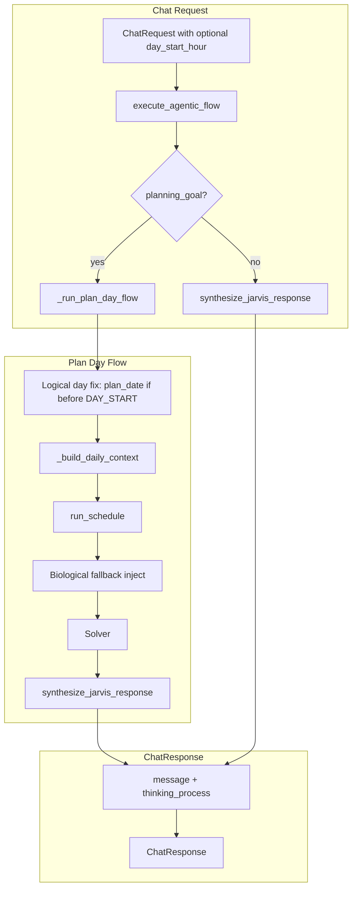

# Multi-Day Scheduler Final Safeguards

## Overview

This plan adds four safeguards: (1) per-user/configurable `day_start_hour`, (2) late-night logical day fix, (3) extraction of thinking/ blocks for the UI, and (4) Dynamic Biological Fallback to protect new users without sleep habits.

---

## 1. Per-User Day Start Hour

**Rationale**: Different users have different "logical day" boundaries (e.g., night owls start at 10 AM).

**Approach** (incremental):

- **Phase A (this PR)**: Add optional `day_start_hour: Optional[int]` to [ChatRequest](app/api/v1/endpoints/chat.py). When provided, override `DAY_START_HOUR` for that request. Pass through to `execute_agentic_flow` and down to horizon calculation.
- **Phase B (future)**: Add `get_user_day_start_hour(user_id)` in [behavioral_store](app/services/extraction/behavioral_store.py) that reads from a `user_preferences` table; fall back to config. Not in scope for this plan.

**Files**:

- [app/api/v1/endpoints/chat.py](app/api/v1/endpoints/chat.py): Add `day_start_hour: Optional[int] = Field(default=None, ge=0, le=23)`
- [app/services/analytical/control_policy.py](app/services/analytical/control_policy.py): Add `day_start_hour_override: Optional[int] = None` to `execute_agentic_flow` and `_run_plan_day_flow`; use `resolved_day_start = day_start_hour_override or DAY_START_HOUR` in horizon logic.

---

## 2. Late-Night Logical Day Fix

**Issue**: When a user plans at 1 AM, the current logic uses "today's" date. But 1 AM is still "yesterday's" schedule window (they haven't started the new day).

**Fix**: If `plan_start.hour < DAY_START_HOUR`, treat the logical day as yesterday.

**File**: [app/services/analytical/control_policy.py](app/services/analytical/control_policy.py)

**Logic** (inside `_run_plan_day_flow`):

```python
from datetime import timedelta

plan_start = datetime.now(timezone.utc)
plan_date = plan_start.date()
# Logical Day Fix: 1 AM is still "yesterday's" schedule window
if plan_start.hour < resolved_day_start:
    plan_date -= timedelta(days=1)

horizon_start = datetime.combine(plan_date, time(resolved_day_start, 0), tzinfo=timezone.utc)
past_minutes = max(0, int((plan_start - horizon_start).total_seconds() / 60))
```

**Note**: `past_minutes` can be negative if we're before 8 AM (e.g., 3 AM) — we already use `max(0, ...)`, so that's handled. For 1 AM, `plan_date` becomes yesterday; `horizon_start` = yesterday 8 AM; `plan_start - horizon_start` ≈ 17 hours → `past_minutes` ≈ 1020, blocking from horizon 0 until "now" (1 AM today).

---

## 3. Extract Thinking Process ( Blocks) for UI

**Rationale**: Reasoning models may emit `<think>...</think>` blocks. Extract them for the frontend reasoning UI and strip from the main user-facing message.

### 3a. Schema Update

**File**: [app/schemas/context.py](app/schemas/context.py)

Add to `ChatResponse`:

```python
thinking_process: Optional[str] = Field(
    default=None,
    description="The extracted internal <think> monologue from the LLM.",
)
```

### 3b. Voice of Jarvis: New Return Type

**File**: [app/services/analytical/voice_of_jarvis.py](app/services/analytical/voice_of_jarvis.py)

- Add new function `synthesize_jarvis_response(execution_summary) -> tuple[str, str | None]` with the extraction logic.
- Keep `synthesize_message` as a thin wrapper that calls `synthesize_jarvis_response` and returns the first element (for backward compatibility during migration) — or replace all call sites and remove it.

**Extraction logic** (after `msg = result if isinstance(result, str) else str(result)`):

```python
import re

thinking_process = None
think_match = re.search(r'<think>(.*?)</think>', msg, flags=re.DOTALL | re.IGNORECASE)
if think_match:
    thinking_process = think_match.group(1).strip()

clean_text = re.sub(r'<think>.*?</think>', '', msg, flags=re.DOTALL | re.IGNORECASE)
if "Thinking Process" in clean_text or "Draft:" in clean_text:
    parts = re.split(r'Draft:|Final Polish:', clean_text, flags=re.IGNORECASE)
    clean_text = parts[-1].strip() if len(parts) > 1 else clean_text.split('\n\n')[-1]
clean_text = clean_text.strip().replace('"', '').replace('*', '')
return clean_text, thinking_process
```

**Return**: `tuple[str, str | None]` — `(message, thinking_process)`.

### 3c. Short-Circuit Returns in synthesize_jarvis_response

When returning early (e.g., `spread_across_days` or fallback templates) without calling the LLM, return `(message, None)`:

```python
if execution_summary.get("spread_across_days"):
    return "I've spread this across multiple days to fit your constraints. Here's your schedule.", None
```

On exception, fallback templates also return `(message, None)`.

### 3d. Update All Call Sites

**File**: [app/services/analytical/control_policy.py](app/services/analytical/control_policy.py)

- Replace `synthesize_message` with `synthesize_jarvis_response` everywhere.
- Unpack: `unified_message, thinking_process = await synthesize_jarvis_response(summary_data)` and pass both into `ChatResponse`.

**All ChatResponse instantiation sites** (every one must include `thinking_process`):


| Location                                      | Source of message                                       | thinking_process         |
| --------------------------------------------- | ------------------------------------------------------- | ------------------------ |
| `_fallback_single_intent` (ingestion)         | `synthesize_jarvis_response` or `INGESTION_MESSAGES`    | From synthesis or `None` |
| `_fallback_single_intent` (PLAN_DAY fallback) | `_run_plan_day_flow`                                    | Nested                   |
| `_run_plan_day_flow` (decomposition fail)     | Fixed "I struggled to break..."                         | `None`                   |
| `_run_plan_day_flow` (schedule success)       | `synthesize_jarvis_response` or "Here's your schedule." | From synthesis or `None` |
| `_run_plan_day_flow` (infeasible)             | Fixed "mathematically impossible"                       | `None`                   |
| `execute_agentic_flow` (ingestion-only)       | `synthesize_jarvis_response`                            | From synthesis           |


For fixed-message paths, always pass `thinking_process=None`.

---

## 4. Dynamic Biological Fallback

**Rationale**: Users define biological routines (sleep, eating, gym) via natural language; the Habit Translator converts them into `daily_context` blocks. For "Cold Start" users who haven't defined a sleep schedule, we must inject a default so the solver doesn't schedule tasks at 3 AM.

**File**: [app/api/v1/endpoints/schedule.py](app/api/v1/endpoints/schedule.py)

**Placement**: At the start of `run_schedule`, before initializing the `JarvisScheduler`, check `daily_context` for sleep-related slots. If none exist, inject fallback. (`TimeSlot` and `Availability` are already imported in schedule.py.)

**Core check** (from user spec):

```python
# Check if user already provided a biological sleep habit via natural language
has_sleep_habit = any(
    "sleep" in slot.name.lower() or "night" in slot.name.lower()
    for slot in daily_context
)
```

**Injection** (single-slot reference: `name="Default Sleep / Recharge"`, `start_min=960`, `end_min=1440`). For multi-day horizons, inject one block per day so day 1 and day 2 nights are also blocked:

```python
if not has_sleep_habit:
    MINUTES_PER_DAY = 1440
    SLEEP_START = 960   # midnight (intra-day: 0=8 AM, 960=midnight)
    SLEEP_END = 1440    # 8 AM
    max_days = horizon_minutes // MINUTES_PER_DAY + 1
    for d in range(max_days):
        start = d * MINUTES_PER_DAY + SLEEP_START
        end = d * MINUTES_PER_DAY + SLEEP_END
        if end > horizon_minutes:
            break
        daily_context.append(TimeSlot(
            name=f"Default Sleep / Recharge_d{d}",
            start_min=start,
            end_min=end,
            availability=Availability.BLOCKED,
            recurring=True,
        ))
```

**Why multi-day**: A single slot (960-1440) only blocks day 0. For a 48h horizon, day 1's night (2400-2880) would be unscheduled without the loop.

---

## Flow Summary




---

## File Change Summary


| File                                                                                     | Change                                                                                                                     |
| ---------------------------------------------------------------------------------------- | -------------------------------------------------------------------------------------------------------------------------- |
| [app/schemas/context.py](app/schemas/context.py)                                         | Add `thinking_process: Optional[str]` to `ChatResponse`                                                                    |
| [app/api/v1/endpoints/chat.py](app/api/v1/endpoints/chat.py)                             | Add `day_start_hour: Optional[int]` to `ChatRequest`                                                                       |
| [app/services/analytical/voice_of_jarvis.py](app/services/analytical/voice_of_jarvis.py) | Add `synthesize_jarvis_response` returning `(str, str                                                                      |
| [app/services/analytical/control_policy.py](app/services/analytical/control_policy.py)   | Late-night fix; pass `day_start_hour`; use `synthesize_jarvis_response`; pass `thinking_process` into every `ChatResponse` |
| [app/api/v1/endpoints/schedule.py](app/api/v1/endpoints/schedule.py)                     | Add biological fallback before processing slots                                                                            |


---

## Implementation Order

1. Schema: Add `thinking_process` to `ChatResponse`.
2. Voice of Jarvis: Add `synthesize_jarvis_response`, extraction logic, short-circuit returns.
3. Control policy: Late-night fix, replace `synthesize_message` with `synthesize_jarvis_response`, add `thinking_process` to all `ChatResponse` instantiations.
4. Schedule: Biological fallback at start of `run_schedule`.
5. Chat endpoint: Add optional `day_start_hour` to `ChatRequest` and pass through.

---

## Testing Strategy

1. **Late-night**: Plan at 2 AM → `plan_date` = yesterday; horizon blocks align to yesterday 8 AM.
2. **Thinking process**: Mock LLM output with ... → `thinking_process` populated; main message has tags stripped.
3. **Biological fallback**: `daily_context` with no sleep/night slot → solver does not schedule 960–1440 (day 0) or 2400–2880 (day 1).
4. **Per-user day_start**: `ChatRequest` with `day_start_hour=9` → horizon starts at 9 AM.

