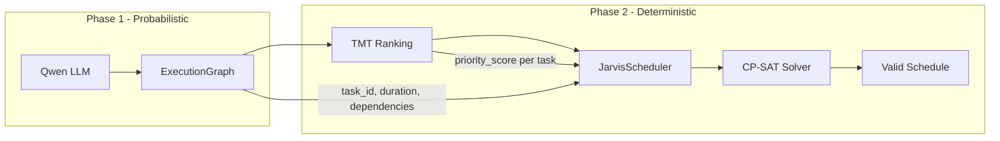

# Phase 2: The Deterministic Scheduler (OR-Tools)

## Architectural Context

The Jarvis Blueprints establish a critical split: **LLMs extract intent** (Phase 1), **OR-Tools enforce temporal math** (Phase 2). LLMs hallucinate overlaps and double-bookings; the CP-SAT solver ensures 100% constraint satisfaction. This is the core of the "Anti-Guilt Architecture"—the human is the *system constraint*; the solver respects biological limits (sleep, single-tasking) and rebrands infeasibility as a signal for Socratic recalibration rather than user failure.




---

## 1. Create [app/core/or_tools/solver.py](app/core/or_tools/solver.py)

**Imports:** `cp_model` from `ortools.sat.python` (not `ortools.sat.python.cp_model`—use `from ortools.sat.python import cp_model`; the `CpModel` class is in `ortools.sat.python.cp_model`—verify: `from ortools.sat.python import cp_model` gives the module; we need `cp_model.CpModel`, `cp_model.CpSolver`).

**Class: `JarvisScheduler`**


| Method                                                            | Behavior                                                                                                                                                                                                                                                                                                                                                                                                                                                                                                                                  |
| ----------------------------------------------------------------- | ----------------------------------------------------------------------------------------------------------------------------------------------------------------------------------------------------------------------------------------------------------------------------------------------------------------------------------------------------------------------------------------------------------------------------------------------------------------------------------------------------------------------------------------- |
| `__init__(self, horizon_minutes=2880)`                            | Initialize `self.model = cp_model.CpModel()`, store `horizon`, empty `tasks: dict` and `hard_blocks: list`                                                                                                                                                                                                                                                                                                                                                                                                                                |
| `add_hard_block(self, start_min, end_min, name)`                  | `duration = end_min - start_min`. **Do NOT use `NewFixedIntervalVar`** — it does not exist in the Python OR-Tools API and will raise `AttributeError`. Use `model.new_interval_var(start_min, duration, end_min, f"hard_{name}")` with standard integers. Append result to `hard_blocks` list. [OR-Tools CP docs](https://developers.google.com/optimization/cp) confirm `NewIntervalVar` accepts integer constants for start, size, end.                                                                                                 |
| `add_task(self, task_id, duration, priority_score, dependencies)` | Create `start_var = model.new_int_var(0, horizon, ...)`, `end_var = model.new_int_var(0, horizon, ...)`, `interval_var = model.new_interval_var(start_var, duration, end_var, ...)`. Store `{task_id: {"interval": ..., "start": ..., "end": ..., "priority": ..., "dependencies": [...]}}`.                                                                                                                                                                                                                                              |
| `build_dependencies(self)`                                        | For each task B, for each dep A in `B.dependencies`, add `model.add(tasks[B]["start"] >= tasks[A]["end"])`. Skip if A not in `tasks` (invalid ref).                                                                                                                                                                                                                                                                                                                                                                                       |
| `solve(self)`                                                     | (1) Collect all interval vars: tasks + hard_blocks. (2) `model.add_no_overlap(all_intervals)`. (3) Call `build_dependencies()`. (4) **TMT-weighted objective** (see Correction 2 below): Minimize `obj = makespan + Σ(priority_score_i * start_i)`. Use `model.minimize(weight_makespan * obj_var + sum(priority_i * start_i for each task))`. This ensures high-priority tasks are scheduled earlier. (5) `solver = cp_model.CpSolver()`, `status = solver.solve(model)`. Return schedule dict if OPTIMAL/FEASIBLE, else `"INFEASIBLE"`. |


**Documentation:** Add module- and method-level docstrings emphasizing Anti-Guilt Architecture, Theory of Constraints (user as bottleneck), and that AddNoOverlap prevents LLM-hallucinated overlaps.

**OR-Tools API notes (Python snake_case):**

- Use `model.new_interval_var(start, size, end, name)` for ALL intervals. For fixed blocks: pass integers `(start_min, duration, end_min)`.
- `model.add_no_overlap(interval_vars)` — disjunctive constraint (one-at-a-time).
- Reference: [OR-Tools Constraint Optimization](https://developers.google.com/optimization/cp), [Job Shop Problem](https://developers.google.com/optimization/scheduling/job_shop).

---

## CRITICAL CORRECTIONS (must implement)

### Correction 1: OR-Tools API — No `NewFixedIntervalVar`

The blueprint PDF uses `NewFixedIntervalVar()` pseudocode. **This method does not exist in the Python OR-Tools API** and will raise `AttributeError` at runtime.

**Fix:** Create fixed blocks with `model.new_interval_var(start_min, duration, end_min, name)` using standard Python integers. The solver accepts integer constants for start, size, and end.

### Correction 2: Activate TMT Priority in the Objective

If the solver only minimizes makespan, it ignores TMT scores entirely — high-priority tasks may be scheduled at 4 PM instead of 8 AM.

**Fix:** Use a **weighted combined objective**:

- Minimize makespan (finish the day efficiently)
- **AND** minimize `Σ(priority_score_i × start_i)` so high-priority tasks start earlier

Example: `model.minimize(weight_makespan * makespan_var + sum(priority_i * start_i for each task))`. Choose `weight_makespan` (e.g., 10–20) so both terms contribute; typical scale: makespan ≈ 500–2880, sum(priority×start) ≈ 5k–50k for 10 tasks.

### Correction 3: Force Modern Python API (snake_case)

Many older OR-Tools tutorials use legacy C++ CamelCase (e.g., `NewIntVar`). **You MUST use the modern, official Python API snake_case methods** to prevent `AttributeError`.

**Strict method names to use:**

- `model.new_int_var`
- `model.new_interval_var`
- `model.add_no_overlap`
- `model.add`
- `model.add_max_equality`
- `model.minimize`

---

## 2. Create [app/api/v1/endpoints/schedule.py](app/api/v1/endpoints/schedule.py)

**Imports:** `APIRouter`, `HTTPException` from FastAPI; `ExecutionGraph` from `app.api.v1.endpoints.reasoning`; `JarvisScheduler` from `app.core.or_tools.solver`.

**TMT (Temporal Motivation Theory) function:**

```
Motivation = (Expectancy * Value) / (Impulsiveness * Delay)
```

- **Expectancy** = 1.0 (default)
- **Value** = `task.difficulty_weight` (0.0–1.0 from TaskChunk)
- **Impulsiveness** = 1.5 (constant)
- **Delay** = hours until deadline; default 24 if `deadline_hint` is missing or unparseable

For Phase 2, use **Delay = 24** always (no deadline parsing). Scale to integer: `priority_score = max(1, int(motivation * 100))` to avoid zero.

**Endpoint: `POST /generate-schedule`**

- **Request body:** `ExecutionGraph` (Pydantic model)
- **Logic:**
  1. Initialize `JarvisScheduler(horizon_minutes=2880)`
  2. Add hard block: sleep from 1380 to 1860 (11 PM to 7 AM next day; 480 min)
  3. For each `TaskChunk` in `graph.decomposition`:
    - Compute TMT score → `priority_score`
    - Call `scheduler.add_task(task_id, duration_minutes, priority_score, dependencies)`
  4. Call `scheduler.solve()`
  5. If `"INFEASIBLE"`: raise `HTTPException(422, detail="Schedule infeasible; consider reducing scope or extending deadline.")`
  6. If feasible: return response with `schedule` (task_id → `{start, end, tmt_score}`) and `goal_metadata`

**Response schema (Pydantic):**

```python
{
  "status": "FEASIBLE" | "OPTIMAL",
  "schedule": {
    "task_1": {"start_min": 60, "end_min": 90, "tmt_score": 2.78},
    ...
  },
  "goal_metadata": { ... }  # pass-through from ExecutionGraph
}
```

**Documentation:** Docstrings for TMT math, sleep block rationale, and Anti-Guilt handling of INFEASIBLE (Socratic recalibration trigger).

---

## 3. Update [app/api/v1/router.py](app/api/v1/router.py)

- Add: `from app.api.v1.endpoints import schedule`
- Add: `api_router.include_router(schedule.router, prefix="/schedule", tags=["Scheduling"])`

Result: `POST /api/v1/schedule/generate-schedule` will be available.

---

## 4. Implementation Details

### Sleep block

- 1380 min = 23:00 (11 PM) on day 0
- 1860 min = 07:00 (7 AM) on day 1 (24*60 + 7*60 = 1860)
- Duration = 480 minutes

### Dependency handling

- `build_dependencies()` must run before `solve()`. Call it inside `solve()` after adding tasks, before building the objective.
- If a dependency references a non-existent `task_id`, log or skip (don’t crash).

### Export surface

- [app/core/or_tools/**init**.py](app/core/or_tools/__init__.py): Export `JarvisScheduler` for clean imports.

---

## 5. File Summary


| File                               | Action                                                |
| ---------------------------------- | ----------------------------------------------------- |
| `app/core/or_tools/solver.py`      | Replace with full `JarvisScheduler` implementation    |
| `app/api/v1/endpoints/schedule.py` | Replace with TMT + `POST /generate-schedule` endpoint |
| `app/api/v1/router.py`             | Add schedule router                                   |
| `app/core/or_tools/__init__.py`    | Export `JarvisScheduler`                              |


---

## 6. Testing Checklist (Post-Implementation)

- Unit test: hard block + single task → task scheduled after block
- Unit test: dependency A → B → B starts after A ends
- Unit test: impossible constraint (e.g., 50 hours of tasks in 24 hours) → INFEASIBLE
- API test: `POST /api/v1/schedule/generate-schedule` with valid `ExecutionGraph` → 200 + schedule
- API test: over-constrained graph → 422 with informative message

