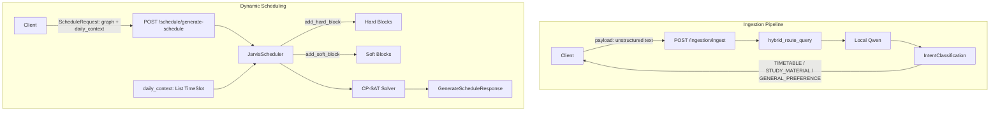

# Phase 3: Context Ingestion and Dynamic Scheduling

## Architecture Overview




## 1. Create `app/schemas/context.py`

New schema module defining the Semantic Router and timetable models. Create `app/schemas/` directory (no prior schemas package exists).

**Models to define:**


| Model                  | Purpose                                                                                 |
| ---------------------- | --------------------------------------------------------------------------------------- |
| `IntentType`           | Enum: `TIMETABLE`, `STUDY_MATERIAL`, `GENERAL_PREFERENCE`                               |
| `IntentClassification` | `intent`, `confidence` (0–1), `summary`                                                 |
| `Availability`         | Enum: `BLOCKED`, `MINIMAL_WORK`, `FULL_FOCUS`                                           |
| `TimeSlot`             | `name`, `start_min`, `end_min`, `availability`, `max_task_duration?`, `max_difficulty?` |


`FULL_FOCUS` slots are informational (no block added); only `BLOCKED` and `MINIMAL_WORK` affect the solver.

**Add** `app/schemas/__init__.py` to export the new models.

---

## 2. Create `app/api/v1/endpoints/ingestion.py`

New ingestion endpoint as the API Gateway for unstructured data (Slack, PDF text, emails).

- **Router:** `APIRouter()` with prefix `/ingestion` (wired in `router.py`)
- **Request model:** `IngestionRequest` with `payload: str`
- **Endpoint:** `POST /ingest` (async, uses `await hybrid_route_query`)

**System prompt:**

```
You are the Jarvis Semantic Router. Analyze the user's incoming unstructured text (Slack messages, PDF text, emails). Classify the text into one of three intents: TIMETABLE, STUDY_MATERIAL, or GENERAL_PREFERENCE. Return strictly valid JSON.
```

**Flow:**

1. Accept `IngestionRequest`
2. Call `hybrid_route_query(user_prompt=request.payload, system_prompt=..., response_schema=IntentClassification)`
3. `hybrid_route_query` returns `dict` when schema is used; validate with `IntentClassification.model_validate(result)`
4. Return `IntentClassification` as JSON

**Error handling:** Match `reasoning.py`—catch validation errors, return 502 with detail.

---

## 3. Extend OR-Tools Solver with Soft Blocks

**File:** [app/core/or_tools/solver.py](app/core/or_tools/solver.py)

### 3.1 Add `add_soft_block`

```python
def add_soft_block(
    self, start_min: int, end_min: int, name: str,
    max_task_duration: int = 15, max_difficulty: float = 0.4
) -> None
```

- Create fixed interval (same as hard block) via `model.new_interval_var`
- Store in `self.soft_blocks: list[tuple]` as `(interval_var, max_duration, max_difficulty)`

### 3.2 Add `difficulty_weight` to `add_task`

- New optional param: `difficulty_weight: float = 1.0`
- Store in `tasks[task_id]["difficulty_weight"]`
- Used to determine if a task qualifies for soft blocks

### 3.3 Update `solve()`

- Main `add_no_overlap`: tasks + hard_blocks only (soft blocks excluded)
- For each soft block: for each task where `duration > max_duration` OR `difficulty_weight > max_difficulty`:
  - `model.add_no_overlap([task["interval"], soft_block_interval])`
- Qualifying tasks (short, low-difficulty) can be scheduled in soft block windows; others cannot

**Logic:** Soft blocks act as hard blocks only for non-qualifying tasks. Qualifying tasks may overlap them.

---

## 4. Update Schedule Endpoint

**File:** [app/api/v1/endpoints/schedule.py](app/api/v1/endpoints/schedule.py)

### 4.1 New Request Model

```python
class ScheduleRequest(BaseModel):
    graph: ExecutionGraph
    daily_context: List[TimeSlot] = Field(default_factory=list)
```

### 4.2 Endpoint Changes

- Change signature from `graph: ExecutionGraph = Body(...)` to `request: ScheduleRequest`
- Remove hardcoded sleep block (`SLEEP_START_MIN`, `SLEEP_END_MIN`, `scheduler.add_hard_block(...)`)
- Replace with dynamic loop over `request.daily_context`:
  - `BLOCKED` → `add_hard_block(start_min, end_min, name)`
  - `MINIMAL_WORK` → `add_soft_block(start_min, end_min, name, max_difficulty=slot.max_difficulty or 0.4, max_duration=slot.max_task_duration or 15)`
  - `FULL_FOCUS` → no block (available for scheduling)

### 4.3 Pass `difficulty_weight` to Scheduler

When calling `scheduler.add_task()`, add `difficulty_weight=chunk.difficulty_weight` so the solver can apply soft-block logic. Extend `add_task` signature to accept it.

### 4.4 Backward Compatibility

Clients that currently send only `graph` (no `daily_context`) will receive `daily_context=[]` by default. No blocks will be added beyond tasks. **Note:** Callers wishing to enforce sleep must include a sleep `TimeSlot` in `daily_context`.

---

## 5. Update API Router

**File:** [app/api/v1/router.py](app/api/v1/router.py)

- Add: `from app.api.v1.endpoints import reasoning, schedule, ingestion`
- Add: `api_router.include_router(ingestion.router, prefix="/ingestion", tags=["Ingestion"])`

---

## File Change Summary


| File                                | Action                         |
| ----------------------------------- | ------------------------------ |
| `app/schemas/__init__.py`           | Create (export context models) |
| `app/schemas/context.py`            | Create                         |
| `app/api/v1/endpoints/ingestion.py` | Create                         |
| `app/api/v1/endpoints/schedule.py`  | Modify                         |
| `app/core/or_tools/solver.py`       | Modify                         |
| `app/api/v1/router.py`              | Modify                         |


---

## Data Flow

1. **Ingestion:** User sends unstructured text → Semantic Router classifies → Returns `IntentClassification`
2. **Scheduling:** User sends `ScheduleRequest(graph, daily_context)` → Scheduler applies blocks from `daily_context` → Solver produces schedule
3. **Future:** TIMETABLE intent will eventually drive timetable extraction (Docling + LLM) that populates `daily_context`; STUDY_MATERIAL and GENERAL_PREFERENCE will route to Vector DB and Strategy Hub respectively (out of scope for this phase).

---

## Out of Scope (Future Phases)

- Docling PDF parsing and timetable extraction
- Vector DB / Strategy Hub persistence for STUDY_MATERIAL and GENERAL_PREFERENCE
- Day-of-week / multi-day mapping (TimeSlots use horizon-relative minutes; client/ingestion pipeline handles day→minute mapping)

