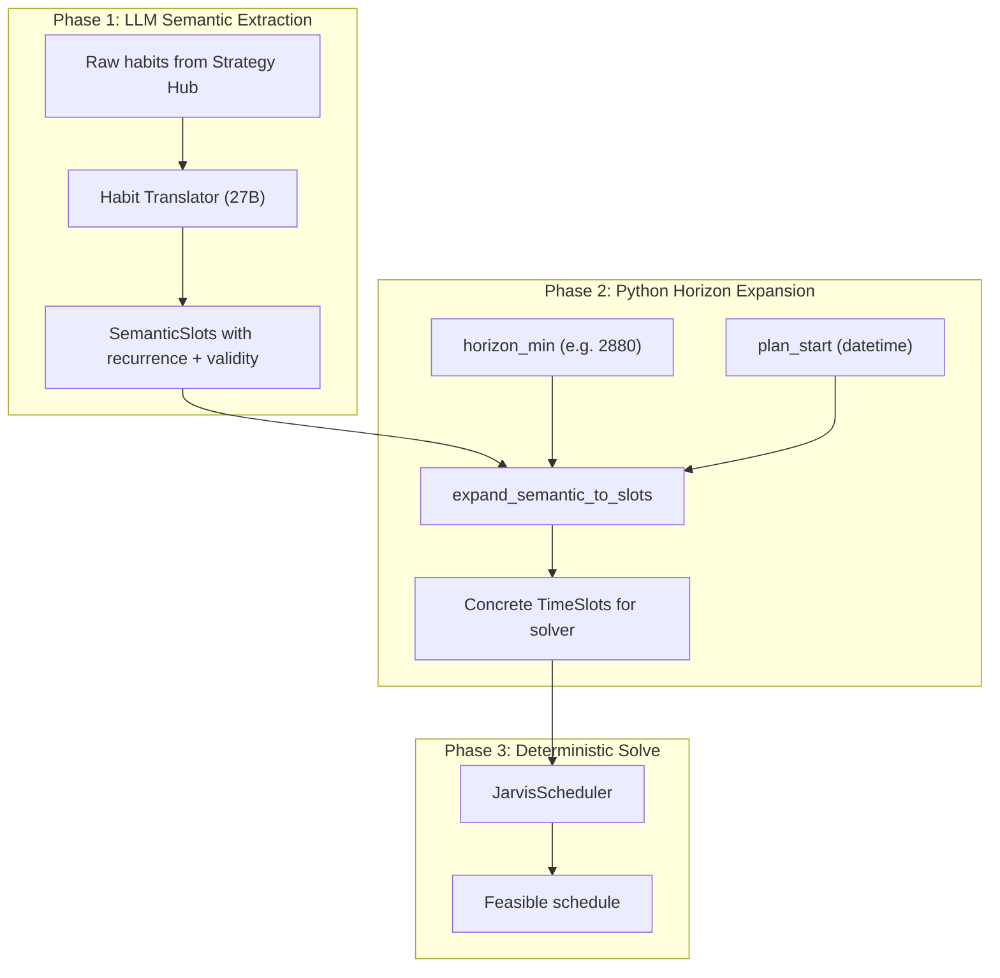
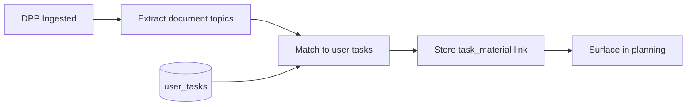

# Recurring Habits and Temporal Intelligence Plan

## Vision: Reactive to Proactive

**Reactive:** User asks Jarvis to plan → Jarvis plans.

**Proactive:** User drops a Math DPP PDF → Jarvis chunks it, saves to ChromaDB, and simultaneously creates an ActionItemProposal: "Solve Math DPP Chapter 4" with `suggested_action: schedule_dpp_review`. Voice of Jarvis says: "I've saved the Math DPP and added a reminder to solve it before your Friday class." User completes the DPP and rates it 3 (Hard). SM-2 kicks in and schedules review in 1 day.

Jarvis manages cognitive progression, not just time.

---

## Proactive Scenarios (Architecture)


| Scenario                     | Behavior                                                                                                                                                                                                                                 |
| ---------------------------- | ---------------------------------------------------------------------------------------------------------------------------------------------------------------------------------------------------------------------------------------- |
| **1. Semester 6 Timetable**  | 27B extracts slots plus hunts for validity. If no semester end date found → `needs_end_date: true`. Voice of Jarvis asks: "When do your finals end so I know when to expire this schedule?"                                              |
| **2. Math DPP**              | After chunking, 4B SLM scans for actionable content. Extracts "Solve Math DPP 4", deadlines. Creates ActionItemProposal with `suggested_action: schedule_dpp_review`. Returns in IngestionPipelineResult.                                |
| **3. SM-2 Tracker**          | User grades task 0–5. `sm2_engine.calculate_sm2()` computes EF and next interval. Scheduler surfaces it on `next_review_date`.                                                                                                           |
| **4. Task-Material Linking** | DPP on "Probability & Statistics" ingested. Extract document_topics. Match via embedding similarity to user's "Probability & Statistics" task. Store in task_materials. Voice: "I've linked this to your Probability & Statistics task." |


---

## Architecture: Option A (Semantic LLM + Python Math)




**Key principle**: LLM extracts semantics (recurrence, validity); Python performs flawless temporal math (day boundaries, modulo 1440, weekday checks).

---

## 1. Schema: Semantic Habit Model

**File:** [app/schemas/context.py](app/schemas/context.py)

Add new models for LLM output and internal representation:

```python
RecurrenceType = Literal["daily", "weekdays", "weekends", "weekly", "monthly", "yearly", "once"]

# For weekly/monthly: 0=Mon, 1=Tue, ..., 6=Sun. None = applies to any day.
WeekdaySpec = Optional[int]  # 0-6 or None

class SemanticTimeSlot(BaseModel):
    """LLM output: semantic representation before horizon expansion."""
    name: str
    start_min: int = Field(ge=0, le=1440)  # Intra-day start (0 = 8 AM)
    end_min: int = Field(ge=0, le=1440)     # Intra-day end
    availability: Availability
    recurrence: RecurrenceType = "daily"
    weekday: Optional[int] = None           # 0-6 for weekly/monthly; e.g. "every Monday" -> 0
    valid_from: Optional[str] = None       # ISO-8601 or null = now
    valid_until: Optional[str] = None      # ISO-8601 or null = indefinite
    max_task_duration: Optional[int] = None
    max_difficulty: Optional[float] = None
```

**Update `TimeSlot`** (used by solver): Add `recurring: bool = False` for backward compatibility. The expansion step will produce `TimeSlot` instances with concrete `start_min`/`end_min` in horizon space.

**Update `TimeSlotsResponse`**: Support both `slots: List[TimeSlot]` (legacy) and `semantic_slots: List[SemanticTimeSlot]` (new). Prefer semantic when present.

**For Proactive Ingestion (Section 9):** Add `valid_until: Optional[str]` and `needs_end_date: bool = False` to `ExtractedTimeSlots`. `IngestionPipelineResult` already has `action_proposal`; use it for proactive knowledge tasks. Add `suggested_action: "schedule_dpp_review"` (or similar) to ActionItemProposal when created from DPP/syllabus.

---

## 2. Habit Translator: Semantic Output

**File:** [app/services/analytical/habit_translator.py](app/services/analytical/habit_translator.py)

### 2.1 Extend prompt for recurrence and validity

Add to `HABIT_TRANSLATOR_PROMPT`:

- **Recurrence**: "Infer recurrence from phrasing. Default: daily. 'weekdays' = Mon–Fri; 'weekends' = Sat–Sun; 'every Monday' = weekly + weekday 0; 'every Friday' = weekly + weekday 4; 'monthly' / 'yearly' / 'once' when explicit."
- **Weekday** (for weekly/monthly): "If user says 'every Monday', set weekday 0; Tuesday 1; ... Sunday 6. Use null when not applicable."
- **Validity**: "If user says 'until exams', 'this semester', 'for the next 3 months', set valid_until to a duration or placeholder (e.g. valid_until: 'semester_end'). Use null for indefinite."
- **Output schema**: Each slot includes `recurrence`, `weekday` (optional), `valid_from`, `valid_until`.

### 2.2 New response schema

Create `SemanticTimeSlotsResponse` with `semantic_slots: List[SemanticTimeSlot]`.

### 2.3 Return semantic slots

`translate_habits_to_slots` returns `List[SemanticTimeSlot]` instead of `List[TimeSlot]`. The control policy will call the expansion step before `run_schedule`.

---

## 3. Horizon Expansion: Pure Python Logic

**New file:** [app/services/analytical/horizon_expander.py](app/services/analytical/horizon_expander.py)

### 3.1 Constants

```python
MINUTES_PER_DAY = 1440
WEEKDAY_MON_FRI = (0, 1, 2, 3, 4)  # Monday=0 in Python weekday()
WEEKDAY_SAT_SUN = (5, 6)
```

### 3.2 Core function

```python
def expand_semantic_slots_to_time_slots(
    semantic_slots: List[SemanticTimeSlot],
    horizon_minutes: int,
    plan_start: datetime,
) -> List[TimeSlot]:
    """
    Replicate each semantic slot across the horizon based on recurrence.
    Returns concrete TimeSlots with start_min/end_min in horizon space (0..horizon_minutes).
    """
```

### 3.3 Expansion rules (per PDF and Option A)


| recurrence | Logic                                                                                                                                                                                       |
| ---------- | ------------------------------------------------------------------------------------------------------------------------------------------------------------------------------------------- |
| daily      | For each day offset `d` in `0, 1, 2, ...` where `d * 1440 + end_min <= horizon_minutes`: add slot `(d*1440 + start_min, d*1440 + end_min)`                                                  |
| weekdays   | Same as daily, but only if `(plan_start + timedelta(days=d)).weekday()` in `WEEKDAY_MON_FRI`                                                                                                |
| weekends   | Same, but `weekday()` in `WEEKDAY_SAT_SUN`                                                                                                                                                  |
| weekly     | If weekday specified: only days where `(plan_start + timedelta(days=d)).weekday() == slot.weekday` (e.g. every Monday). Else: every 7 days (d in 0, 7, 14, ...).                            |
| monthly    | For each month in horizon: include only days matching weekday (e.g. first Monday) or same day-of-month if weekday null. Use date.weekday() and date.day for calendar-accurate expansion.    |
| yearly     | Include only days where `(plan_start + timedelta(days=d))` has same (month, day) as plan_start (anniversary). For 30-day horizons typically 0 matches; for 400+ days yields multiple slots. |
| once       | Single slot on day 0 only                                                                                                                                                                   |


### 3.4 Validity filtering

Before expanding, filter semantic slots where `valid_until < plan_start` or `valid_from > plan_start + horizon`. For placeholders like `"semester_end"`, treat as indefinite (apply) until we add a knowledge-store lookup.

### 3.5 Validity Windows (Strategy Hub Resolution)

For **monthly or yearly plans**, use the Strategy Hub to resolve relative date placeholders. Example: `valid_until: "finals"` can be dynamically updated once the system extracts the exact date from an uploaded exam schedule.

**Mechanism:**

- Store placeholder mappings in Strategy Hub (`user_calendar_anchors` table): `user_id`, `anchor_key` (e.g. "finals", "semester_end"), `resolved_date` (ISO-8601).
- When calendar/knowledge ingestion extracts explicit dates (e.g. "Finals: June 15, 2026"), upsert into this mapping.
- Before horizon expansion, resolve `valid_until` placeholders by looking up the mapping. If unresolved, treat as indefinite or prompt user (via `needs_end_date` flow).

---

## 4. Database: Behavioral Constraints Schema

**File:** [app/db/migrations/002_habit_recurrence_and_validity.sql](app/db/migrations/002_habit_recurrence_and_validity.sql)

```sql
ALTER TABLE behavioral_constraints
ADD COLUMN IF NOT EXISTS recurrence TEXT DEFAULT 'daily',
ADD COLUMN IF NOT EXISTS valid_from TIMESTAMPTZ,
ADD COLUMN IF NOT EXISTS valid_until TIMESTAMPTZ,
ADD COLUMN IF NOT EXISTS structured_semantics JSONB DEFAULT '{}';
```

`structured_semantics` stores `{recurrence, weekday, start_min, end_min, availability, valid_from, valid_until}` when the translator produces structured output. Enables:

- Skipping LLM re-translation when semantics are already stored
- Querying habits by validity window

---

## 5. Control Policy and Schedule Wiring

**File:** [app/services/analytical/control_policy.py](app/services/analytical/control_policy.py)

- Change `translate_habits_to_slots` return type to `List[SemanticTimeSlot]`.
- After translation, call `expand_semantic_slots_to_time_slots(semantic_slots, horizon_minutes=2880, plan_start=datetime.now())`.
- Pass expanded `List[TimeSlot]` to `run_schedule`.

**File:** [app/api/v1/endpoints/schedule.py](app/api/v1/endpoints/schedule.py)

- Add optional `horizon_minutes` and `plan_start` to `run_schedule` (or to a wrapper). Default `horizon_minutes=2880`.
- When `daily_context` is provided as raw slots (legacy API), bypass expansion. When semantic slots are provided, run expansion first.

---

## 6. Configurable Horizon for Long-Term Planning

**File:** [app/core/config.py](app/core/config.py)

Add:

```python
DEFAULT_HORIZON_MINUTES: int = 2880   # 48 hours
MAX_HORIZON_MINUTES: int = 43200      # 30 days (per PDF: month-long planning)
```

**Solver:** [app/core/or_tools/solver.py](app/core/or_tools/solver.py)

- `JarvisScheduler` already accepts `horizon_minutes`. Ensure it scales (the CP-SAT solver handles large horizons; 43,200 min is reasonable).

---

## 7. SM-2 Spaced Repetition (SuperMemo-2 Math Engine)

SM-2 calculates optimal intervals between habit repetitions. When you finish a task and grade it 0–5, the engine computes EF and tells the scheduler exactly when to surface it again.

### 7.1 SM-2 Algorithm (Exact Implementation)

**New file:** [app/services/analytical/sm2_engine.py](app/services/analytical/sm2_engine.py)

```python
import math
from datetime import datetime, timedelta

def calculate_sm2(quality: int, repetitions: int, previous_ef: float, previous_interval: int) -> dict:
    """
    SuperMemo-2 algorithm.
    Quality: 0-5 (0 = blackout, 5 = perfect recall/execution).
    Returns: repetitions, ef, next_interval_days, next_review_date.
    """
    if quality < 3:
        repetitions = 0
        interval = 1
    else:
        repetitions += 1
        if repetitions == 1:
            interval = 1
        elif repetitions == 2:
            interval = 6
        else:
            interval = math.ceil(previous_interval * previous_ef)

    new_ef = previous_ef + (0.1 - (5 - quality) * (0.08 + (5 - quality) * 0.02))
    new_ef = max(1.3, new_ef)  # EF floor 1.3

    return {
        "repetitions": repetitions,
        "ef": round(new_ef, 3),
        "next_interval_days": int(interval),
        "next_review_date": datetime.now() + timedelta(days=interval),
    }
```

**Additional functions:** `record_completion(tracker_id, quality)` (loads tracker, calls `calculate_sm2`, persists, returns `next_review_date`), `get_due_trackers(user_id, as_of_date)` for PLAN_DAY injection.

### 7.2 Database

**File:** [app/db/migrations/003_habit_trackers.sql](app/db/migrations/003_habit_trackers.sql)

Same schema as before: `habit_trackers` with `repetitions`, `quality_last`, `ef`, `next_interval_days`, `last_done_at`.

### 7.3 Solver Integration

SM-2 output feeds into `ExecutionGraph` as pre-scheduled tasks (e.g. "Review Math DPP Ch. 4" on `next_review_date`). Scheduler receives these as decomposition entries. Full CSP min-delay constraints deferred if complex.

### 7.4 API

`POST /api/v1/habits/tracker/{id}/complete` with body `{ quality: 0-5 }`. Returns `{ next_review_date, next_interval_days }`.

### 7.5 SM-2 Refinement (EF Floor)

Ensure the Easiness Factor (EF) **never drops below 1.3**. Standard behavioral persistence research suggests that if a habit becomes "harder" than that, it is likely too difficult for effective long-term repetition and should be broken down further by the Socratic Chunker. The `max(1.3, new_ef)` in `calculate_sm2` enforces this.

---

## 8. Edge Cases and Validation


| Case                                      | Handling                                                           |
| ----------------------------------------- | ------------------------------------------------------------------ |
| Horizon 48h, daily habit                  | Slots for day 0 and day 1 (0–180, 1440–1620)                       |
| Horizon 7 days                            | 7 daily blocks for "no work before 11 AM"                          |
| "Weekdays only"                           | Filter expansion by `plan_start.weekday()`                         |
| "Every Monday"                            | weekly + weekday 0; expansion includes only Mondays in horizon     |
| "First Friday of each month"              | monthly + weekday 4; match day <= 7 and weekday == 4               |
| "Yearly on my exam date"                  | yearly; match (month, day) of plan_start                           |
| "Until June"                              | Store `valid_until`; filter in expansion when we have date context |
| Conflicting recurrence (daily + weekdays) | Both stored; expansion produces correct slots per rule             |
| Empty semantic_slots                      | Return `[]`; schedule runs with no blocks                          |
| Semantic slot exceeds 1440                | Clamp; log warning                                                 |


---

## 9. Proactive Document Intelligence

### 9.1 Proactive Calendar Extraction (Sem 6 Timetable)

**File:** [app/services/extraction/calendar_extractor.py](app/services/extraction/calendar_extractor.py)

**System prompt update:** "When extracting a timetable, look for a semester end date, exam date, or validity period. If found, output it as valid_until (ISO-8601). If it is clearly a semester/term schedule but NO end date is mentioned, set a flag needs_end_date: true. We will use this to ask the user."

**Schema:** Extend `ExtractedTimeSlots` with `valid_until: Optional[str]` and `needs_end_date: bool = False`. Add `valid_until` to `pending_calendar_updates`.

**Flow:** If `needs_end_date: true`, Voice of Jarvis will ask: "By the way, when do your finals end so I know when to expire this schedule?"

### 9.2 Proactive Knowledge Extraction (Math DPP, Syllabus)

**File:** [app/services/extraction/knowledge_ingester.py](app/services/extraction/knowledge_ingester.py)

**Logic update:** After chunking and storing in ChromaDB, send a fast **4B SLM** request:

```
"Analyze this document. Is it actionable? (e.g., a Daily Practice Problem, an assignment, a syllabus). If yes, extract 'action_items' (e.g., 'Solve Math DPP 4') and any mentioned 'deadlines'. Return JSON."
```

**Action:** If the SLM finds actionable items, convert them into `ActionItemProposal` objects with `suggested_action: "schedule_dpp_review"` (or `add_to_schedule`, `remind_before_deadline` as appropriate). Return in `IngestionPipelineResult`.

**Flow:** Document is chunked → saved to ChromaDB → 4B scans for actionability → creates ActionItemProposal(s) → orchestrator returns them as `action_proposal` or `action_proposals` in the pipeline result. Voice of Jarvis incorporates: "I've saved the Math DPP and added a reminder to solve it before your Friday class."

**Schema:** `IngestionPipelineResult` already has `action_proposal: Optional[ActionItemProposal]`. For multiple items, extend to `action_proposals: List[ActionItemProposal]` or return the first/primary one. Add `suggested_actions` including `"schedule_dpp_review"` when applicable.

### 9.3 Voice of Jarvis (Asking for Missing Dates)

**File:** [app/services/analytical/voice_of_jarvis.py](app/services/analytical/voice_of_jarvis.py)

**Logic:** If `execution_summary.get("needs_end_date")` is true (set when `calendar_result.needs_end_date` from extraction), append to the synthesis prompt:

```
"Make sure to politely ask the user when this timetable/semester ends, so we can set an expiration date for these classes."
```

**Implementation:**

- In `synthesize_message`, if `execution_summary.get("needs_end_date")` is true, append to `VOICE_OF_JARVIS_PROMPT` (or the per-call system prompt): "Make sure to politely ask the user when this timetable/semester ends, so we can set an expiration date for these classes."
- Control Policy, when returning ingestion response for CALENDAR_SYNC, builds `execution_summary` with `calendar_extracted`, `needs_end_date` from `calendar_result`. Calls `synthesize_message(execution_summary)` instead of fixed `INGESTION_MESSAGES[intent]`.
- For KNOWLEDGE_INGESTION with `action_proposal`, include in `execution_summary` so Voice mentions the DPP/reminder.

### 9.4 Orchestrator and Control Policy Integration

**File:** [app/services/extraction/orchestrator.py](app/services/extraction/orchestrator.py)

- **CALENDAR_SYNC:** Pass `valid_until`, `needs_end_date` from `ExtractedTimeSlots` into result. Include `calendar_result` (with `needs_end_date`) in pipeline result.
- **KNOWLEDGE_INGESTION:** After `ingest_knowledge`, run proactive 4B extraction. If actionable items found, set `action_proposal` on `IngestionPipelineResult`.

**File:** [app/services/analytical/control_policy.py](app/services/analytical/control_policy.py)

- For ingestion-only responses (CALENDAR_SYNC, KNOWLEDGE_INGESTION): instead of fixed `INGESTION_MESSAGES`, call `synthesize_message(execution_summary)` where `execution_summary` includes `calendar_result` (with `needs_end_date`) and/or `action_proposal`. This enables Voice of Jarvis to ask for semester end or mention the DPP reminder.

### 9.5 Extensibility

- **Validity window resolution:** `valid_until: "finals"` or `"semester_end"` resolved from Strategy Hub `user_calendar_anchors` (Section 3.5). When an exam schedule is uploaded, extract dates and update the mapping dynamically.
- **N scenarios:** DPP, syllabus, assignment, sample paper → each yields appropriate ActionItemProposal with `suggested_action` tuned to document type.

---

## 10. Task–Material Linking (Topic-to-Task Matching)

**Scenario:** User plans "Study for maths mid sem" → decomposition yields 5 tasks: Mathematical Thinking, Probability & Statistics, Linear Algebra, etc. Later, user uploads a DPP on Probability and Statistics. The system should **automatically link** the DPP to the "Probability & Statistics" task as materials.

**Not implemented today.** This section defines the industry-standard implementation.

### 10.1 Architecture




### 10.2 Persist User Tasks

**Schema:** `user_tasks` table (or extend Strategy Hub):

```sql
CREATE TABLE user_tasks (
    id UUID PRIMARY KEY DEFAULT gen_random_uuid(),
    user_id TEXT NOT NULL,
    plan_id TEXT,
    task_id TEXT NOT NULL,
    title TEXT NOT NULL,
    topic_keywords TEXT[],
    created_at TIMESTAMPTZ DEFAULT NOW()
);

CREATE TABLE task_materials (
    id UUID PRIMARY KEY DEFAULT gen_random_uuid(),
    user_id TEXT NOT NULL,
    task_id TEXT NOT NULL,
    source_type TEXT NOT NULL,
    source_id TEXT NOT NULL,
    document_topics TEXT[],
    linked_at TIMESTAMPTZ DEFAULT NOW(),
    UNIQUE(user_id, task_id, source_id)
);
```

**Flow:** After each PLAN_DAY, persist `graph.decomposition` to `user_tasks` (user_id, task_id, title). Optionally extract `topic_keywords` from task title via LLM or simple tokenization (e.g. "Probability & Statistics" → ["Probability", "Statistics"]).

### 10.3 Extract Document Topics (Granular)

**Extend proactive 4B extraction** in knowledge_ingester to also output:

```json
{
  "action_items": ["Solve Math DPP 4"],
  "deadlines": [],
  "document_topics": ["Probability", "Statistics"]
}
```

**Prompt addition:** "Extract 1–5 granular topic tags that describe the document content (e.g. 'Probability', 'Statistics', 'Calculus limits'). These will be used to match the document to the user's existing study tasks."

### 10.4 Semantic Matching (Industry Standard)

**Option A — Embedding similarity (recommended):** Use the same embedding model as ChromaDB. Embed (a) document topics (concatenated) and (b) each task title. Compute cosine similarity. Assign document to task with highest score above a threshold.

**Cosine similarity threshold:** Use a threshold between **0.6 and 0.8** to prevent noisy or incorrect links. If no task meets the threshold, save the document to the general knowledge base (ChromaDB) without a specific task link. Avoid forcing weak matches.

**Option B — LLM classification:** "This document covers Probability and Statistics. The user's tasks are: 1) Mathematical Thinking, 2) Probability & Statistics, 3) Linear Algebra. Which task does this document belong to? Return task_id only." Use when user_tasks count is small (< 20).

**Option C — Hybrid:** Embedding for ranking, LLM for confirmation when top-2 scores are close (e.g. within 0.1).

**Implementation:** New file [app/services/extraction/task_material_linker.py](app/services/extraction/task_material_linker.py):

```python
SIMILARITY_THRESHOLD = 0.65  # Configurable; 0.6–0.8 recommended to avoid noisy links

async def link_document_to_tasks(
    user_id: str,
    document_topics: list[str],
    source_id: str,
    source_type: str = "chunk",
    threshold: float = SIMILARITY_THRESHOLD,
) -> list[str]:
    """Match document to user tasks via embedding similarity. Returns matched task_ids. Empty list if no match above threshold."""
```

### 10.5 Integration Flow

1. **Knowledge ingestion:** After proactive extraction, if `document_topics` is non-empty, call `link_document_to_tasks(user_id, document_topics, source_id)`. For each matched task_id, insert into `task_materials`.
2. **Voice of Jarvis:** "I've saved the Math DPP and linked it to your Probability & Statistics task."
3. **Planning:** When decomposing a goal (or when building schedule), optionally fetch `task_materials` for the user. Attach `materials: List[str]` to TaskChunk or inject into `completion_criteria` (e.g. "Solve 3 problems from DPP Ch. 4 (linked materials)").

### 10.6 TaskChunk Schema Extension

Add optional field to TaskChunk (or to a wrapper used when fetching for display):

```python
linked_material_ids: Optional[List[str]] = None  # Chunk IDs or document IDs
```

When the reasoning engine builds ExecutionGraph, it can optionally enrich each TaskChunk with linked materials from `task_materials` for the user's current/last plan.

### 10.7 Edge Cases


| Case                      | Handling                                                                                                                    |
| ------------------------- | --------------------------------------------------------------------------------------------------------------------------- |
| No user_tasks exist       | Skip linking; document saved to ChromaDB only.                                                                              |
| No match above threshold  | Save to ChromaDB only; do not create task_materials link. User can manually associate later (future).                       |
| Multiple tasks match      | Link to top match only, or link to all above threshold (e.g. "Probability" and "Statistics" might match one combined task). |
| Same document re-ingested | Upsert in task_materials (UNIQUE on user_id, task_id, source_id).                                                           |


---

## 11. File Summary


| Action | File                                                                                                                                                                        |
| ------ | --------------------------------------------------------------------------------------------------------------------------------------------------------------------------- |
| Modify | [app/schemas/context.py](app/schemas/context.py) — SemanticTimeSlot, RecurrenceType, TimeSlot.recurring; ExtractedTimeSlots.needs_end_date                                  |
| Modify | [app/services/analytical/habit_translator.py](app/services/analytical/habit_translator.py) — semantic prompt, SemanticTimeSlotsResponse                                     |
| Create | [app/services/analytical/horizon_expander.py](app/services/analytical/horizon_expander.py) — expand_semantic_slots_to_time_slots                                            |
| Create | [app/services/analytical/sm2_engine.py](app/services/analytical/sm2_engine.py) — calculate_sm2, record_completion, get_due_trackers                                         |
| Modify | [app/services/analytical/voice_of_jarvis.py](app/services/analytical/voice_of_jarvis.py) — ask for semester end when needs_end_date                                         |
| Modify | [app/services/analytical/control_policy.py](app/services/analytical/control_policy.py) — call expander; pass calendar_result to Voice; persist decomposition to user_tasks  |
| Modify | [app/api/v1/endpoints/schedule.py](app/api/v1/endpoints/schedule.py) — optional horizon/plan_start; expansion when semantic                                                 |
| Create | [app/db/migrations/002_habit_recurrence_and_validity.sql](app/db/migrations/002_habit_recurrence_and_validity.sql)                                                          |
| Create | [app/db/migrations/003_habit_trackers.sql](app/db/migrations/003_habit_trackers.sql) — SM-2 trackers table                                                                  |
| Create | [app/db/migrations/004_user_tasks_and_task_materials.sql](app/db/migrations/004_user_tasks_and_task_materials.sql) — user_tasks, task_materials                             |
| Modify | [app/core/config.py](app/core/config.py) — DEFAULT_HORIZON_MINUTES, MAX_HORIZON_MINUTES                                                                                     |
| Modify | [app/services/extraction/calendar_extractor.py](app/services/extraction/calendar_extractor.py) — valid_until, needs_end_date prompt                                         |
| Modify | [app/services/extraction/knowledge_ingester.py](app/services/extraction/knowledge_ingester.py) — 4B proactive extraction + document_topics → ActionItemProposal             |
| Create | [app/services/extraction/task_material_linker.py](app/services/extraction/task_material_linker.py) — embedding-based task matching                                          |
| Modify | [app/services/extraction/orchestrator.py](app/services/extraction/orchestrator.py) — pass needs_end_date, action_proposal; call task_material_linker after knowledge ingest |
| Modify | Migration 002 or new — add `valid_until TIMESTAMPTZ` to `pending_calendar_updates`                                                                                          |
| Create | Migration — `user_calendar_anchors` (user_id, anchor_key, resolved_date) for validity placeholder resolution                                                                |
| Create | `POST /api/v1/habits/tracker/{id}/complete` — SM-2 completion endpoint                                                                                                      |


---

## 12. Testing Strategy

- **Unit:** `expand_semantic_slots_to_time_slots` with `recurrence=daily`, horizon 2880 → assert slots at (0,180) and (1440,1620).
- **Unit:** `recurrence=weekdays` with `plan_start` = Saturday → assert only day 0 (Saturday) excluded or day 2 (Monday) included per logic.
- **Unit:** `recurrence=weekly`, `weekday=0` (Monday) with 14-day horizon → assert slots only on Mondays.
- **Unit:** `recurrence=monthly` with 35-day horizon → assert slots on same calendar date each month.
- **Unit:** `recurrence=yearly` with 400-day horizon → assert slots on anniversary date(s).
- **Unit:** SM-2 `compute_next_interval`: q=5 after 1st rep → interval increases; q=0 → reset to 1.
- **Integration:** Full PLAN_DAY with "never schedule work before 11 AM" → schedule should have no tasks in 0–180 or 1440–1620.
- **Integration:** Sem 6 timetable with "semester ends June 15" → extracted valid_until; calendar slots expire at that date.
- **Integration:** Sem 6 timetable with NO end date → needs_end_date true; Voice of Jarvis asks when finals end.
- **Integration:** Math DPP ingestion → ActionItemProposal with "Solve Math DPP Ch. 4", suggested_actions including "schedule_dpp_review".
- **Integration:** User plans "Study maths mid sem" (5 tasks) → then ingests DPP on Probability → document_topics ["Probability","Statistics"] → link_document_to_tasks matches "Probability & Statistics" task → task_materials row created; Voice says "linked to your Probability & Statistics task."
- **Regression:** Legacy `daily_context` (raw TimeSlots) still works without expansion.

---

## 13. Future Phases (Out of Scope)

- **SARIMAX integration:** Energy forecasting for capacity adjustment; RL policy refinement.

