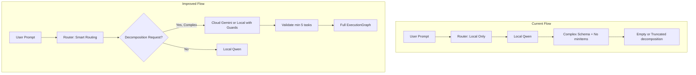

# SARIMAX Engine Response Quality Fix

## Problem Summary

When the user asks the SARIMAX decomposition prompt through the Jarvis Engine, they receive either:

- **Empty decomposition** (`decomposition: []`) with valid `goal_metadata` and `cognitive_load_estimate`, or
- **502 errors** due to parsing/validation failures

In LM Studio's direct chat, the same prompt produces rich, structured micro-tasks with Objectives, Actions, Focus points, and If-Then implementation intentions. The engine's constrained JSON-only output path and schema design cause the local model to underperform.

---

## Root Cause Analysis

### 1. Schema Allows Empty Decomposition (Primary)

`[app/api/v1/endpoints/reasoning.py](app/api/v1/endpoints/reasoning.py)` defines:

```python
decomposition: List[TaskChunk] = Field(
    ...,
    description="Ordered list of atomic micro-tasks..."
)
```

There is **no `min_length`** constraint. The Pydantic schema (and thus the JSON schema sent to the LLM) permits `[]` as valid. When the ExecutionGraph schema is large and complex (5 nested models, ~15 fields), local models may "play it safe" and output minimal valid JSON: fill `goal_metadata` and `cognitive_load_estimate` from the prompt, and return an empty `decomposition` array.

### 2. No Explicit `max_tokens`

`[app/models/brain/litellm_conf.py](app/models/brain/litellm_conf.py)` does not set `max_tokens` in `completion_kwargs`. The default (often 1024–2048 for local models) may truncate the response before the model finishes generating 5+ detailed TaskChunks. Truncation would typically cause `JSONDecodeError` rather than empty list, but low limits can still pressure the model toward shorter outputs.

### 3. Markdown Fence Sanitization Not Applied in LiteLLM Path

`[hybrid_route_query](app/models/brain/litellm_conf.py)` calls `response_schema.model_validate_json(content)` on raw content. Local models (Qwen-27B, etc.) often wrap JSON in ` 

```json ...

``` `. The sanitizer `_sanitize_llm_json()` exists in [reasoning.py](app/api/v1/endpoints/reasoning.py) but is **only used when `hybrid_route_query` returns a string**. When `response_schema` is provided, LiteLLM parses internally and returns a dict—but the internal `model_validate_json(content)` runs on unsanitized content and will fail, raising a 502 before the endpoint can sanitize.

### 4. Model and Prompt Asymmetry

| Dimension | LM Studio Chat | Jarvis Engine |
|-----------|----------------|---------------|
| System prompt | Minimal or custom | Long CLT/WOOP prompt + strict schema |
| Output format | Freeform prose + structure | JSON only, no commentary |
| Schema constraint | None | ExecutionGraph (complex nested) |
| Model | User-selected (e.g., Qwen 27B) | `LOCAL_LLM_MODEL` (default: `openai/qwen-local`) |

The engine's constraints (JSON-only, strict schema, no prose) make the task harder for local models. LM Studio allows natural, structured prose that the model handles well.

### 5. No Fallback to Cloud for Complex Decomposition

`[app/models/brain/litellm_conf.py](app/models/brain/litellm_conf.py)` routes to Cloud Gemini only when `CLOUD_KEYWORDS` (e.g., "latest news", "current events") appear in the prompt. Academic decomposition prompts like SARIMAX contain none of these, so they always go to the local model. Gemini handles structured output robustly and could reliably produce 5+ high-quality TaskChunks.

---

## Architecture: Current vs Improved Flow



---

## Correction Plan

### Fix 1: Enforce Minimum 5 Tasks in Schema and Prompt

**File:** [app/api/v1/endpoints/reasoning.py](app/api/v1/endpoints/reasoning.py)

- Add `min_length=5` to `decomposition` Field so the JSON schema explicitly requires at least 5 TaskChunks. Pydantic v2: `Field(..., min_length=5)`.
- Extend `SYSTEM_PROMPT` with an explicit rule: *"Rule 7: The decomposition array MUST contain at least 5 TaskChunk objects. An empty or undersized decomposition is invalid and indicates failure to complete the task."*

### Fix 2: Sanitize Content in `hybrid_route_query` Before Parsing

**File:** [app/models/brain/litellm_conf.py](app/models/brain/litellm_conf.py)

- Import or replicate the markdown fence stripping logic (e.g., the regex from reasoning.py).
- When `response_schema` is provided and `content` is truthy, sanitize `content` before calling `model_validate_json()`. If `model_validate_json` fails on the first attempt, retry once with sanitized content before propagating the error.

### Fix 3: Set `max_tokens` for Decomposition Requests

**File:** [app/models/brain/litellm_conf.py](app/models/brain/litellm_conf.py)

- Add `max_tokens` parameter to `hybrid_route_query` (default `4096` when `response_schema` is provided, or make it configurable via `completion_kwargs`).
- When `response_schema` is passed, set `max_tokens=4096` (or higher) to ensure sufficient space for 5+ detailed TaskChunks with ImplementationIntentions.

### Fix 4: Add Post-Response Validation and Retry/Cloud Fallback

**File:** [app/api/v1/endpoints/reasoning.py](app/api/v1/endpoints/reasoning.py)

- After receiving `ExecutionGraph` from `hybrid_route_query`, check `len(decomposition) < 5`.
- If undersized and the request was routed to local model: retry once by routing to Cloud Gemini (add a `force_cloud` or similar mechanism to `hybrid_route_query`), or raise a clear 502 with message: *"Model returned insufficient tasks; try again or use a model with stronger structured-output capability."*
- Alternatively: introduce a "decomposition complexity" heuristic (e.g., prompt contains "decompose", "micro-tasks", "at least 5") to route such prompts to Cloud Gemini by default, aligning with the [POLICY_ENGINE_ARCHITECTURE.md](docs/POLICY_ENGINE_ARCHITECTURE.md) hybrid routing design.

### Fix 5: Extend Router to Route Decomposition Prompts to Cloud (Optional but Recommended)

**File:** [app/models/brain/litellm_conf.py](app/models/brain/litellm_conf.py)

- Add `DECOMPOSITION_KEYWORDS` (e.g., "decompose", "micro-tasks", "granular", "at least 5") to the routing logic.
- If the prompt contains decomposition keywords **and** `response_schema` is an ExecutionGraph-like schema, route to Cloud Gemini. This keeps sensitive or simple chats local while offloading complex academic decomposition to Gemini, which handles structured output well.
- Document this behavior in [docs/POLICY_ENGINE_ARCHITECTURE.md](docs/POLICY_ENGINE_ARCHITECTURE.md).

### Fix 6: Add Few-Shot Example to System Prompt (Optional)

**File:** [app/api/v1/endpoints/reasoning.py](app/api/v1/endpoints/reasoning.py)

- Add a minimal one-task example in the system prompt showing the exact JSON shape expected for one `TaskChunk` with `implementation_intention`. This helps local models align with the schema when few-shot is feasible without exceeding context limits.

---

## Validation Steps

1. **Unit test**: Call `decompose-goal` with the SARIMAX prompt; assert `len(decomposition) >= 5` and that each task has `completion_criteria` and `implementation_intention` where appropriate.
2. **Integration test**: Compare engine output to LM Studio reference (objectives, actions, focus, If-Then). Ensure parity on task count and quality.
3. **Regression**: Verify simple prompts (e.g., "Plan my day") still route locally and perform correctly.

---

## Summary of File Changes


| File                                                                     | Changes                                                                                                                                                       |
| ------------------------------------------------------------------------ | ------------------------------------------------------------------------------------------------------------------------------------------------------------- |
| [app/api/v1/endpoints/reasoning.py](app/api/v1/endpoints/reasoning.py)   | Add `min_length=5` to decomposition; extend SYSTEM_PROMPT with Rule 7; add post-response validation and optional retry/fallback                               |
| [app/models/brain/litellm_conf.py](app/models/brain/litellm_conf.py)     | Sanitize content before `model_validate_json`; add `max_tokens` when `response_schema` present; add `force_cloud` param; add `DECOMPOSITION_KEYWORDS` routing |
| [docs/POLICY_ENGINE_ARCHITECTURE.md](docs/POLICY_ENGINE_ARCHITECTURE.md) | Document decomposition routing and fallback behavior                                                                                                          |


