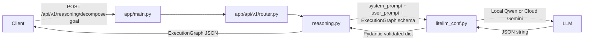

# Phase 1: Socratic Task Chunker Implementation

## Context

The existing codebase has:

- A working LiteLLM hybrid router at [app/models/brain/litellm_conf.py](app/models/brain/litellm_conf.py) with `hybrid_route_query()` that already supports `response_schema` (Pydantic model passed as `response_format` to LiteLLM)
- Empty stub files ready to be populated: [app/api/v1/endpoints/reasoning.py](app/api/v1/endpoints/reasoning.py) and [app/api/v1/router.py](app/api/v1/router.py)
- The main FastAPI app at [app/main.py](app/main.py) which currently has a temporary `/test-chat` endpoint but does not yet include the v1 API router

All `__init__.py` files for the package hierarchy already exist.

## Architecture




## File 1: [app/api/v1/endpoints/reasoning.py](app/api/v1/endpoints/reasoning.py) (populate stub)

### Pydantic Schemas

Define five models that encode the behavioral psychology directly into the type system:

- `**ImplementationIntention**`: The WOOP "Plan" stage. Two fields:
  - `obstacle_trigger` (str) -- the anticipated friction point from Mental Contrasting
  - `behavioral_response` (str) -- the deterministic "If-Then" action that bypasses procrastination
- `**TaskChunk**`: A single atomic unit of work constrained by Cognitive Load Theory:
  - `task_id` (str)
  - `title` (str)
  - `duration_minutes` (int, `Field(..., le=25)`) -- the strict Pomodoro ceiling; a neurobiological constraint, not a suggestion
  - `difficulty_weight` (float, `Field(..., ge=0.0, le=1.0)`) -- feeds into the future DKT/RL analytical engine
  - `dependencies` (List[str]) -- precedence graph for the CSP solver in Phase 2
  - `completion_criteria` (str) -- Field description must enforce germane load: "A specific, verifiable action the user can perform to prove task mastery (e.g., 'Solve 3 practice problems without referencing notes'). Vague criteria like 'Review chapter' are invalid. This transforms the user from passive recipient to active schema builder."
  - `implementation_intention` (Optional[ImplementationIntention])
- `**GoalMetadata**`: Maps the WOOP framework:
  - `goal_id` (str)
  - `objective` (str) -- the "Wish"
  - `outcome_visualization` (str) -- the "Outcome" (emotional saliency)
  - `mastery_level_target` (int, `Field(..., ge=1, le=5)`)
- `**ExecutionGraph**`: The master response model:
  - `goal_metadata` (GoalMetadata)
  - `decomposition` (List[TaskChunk])
  - `cognitive_load_estimate` (Dict[str, float]) -- must contain `intrinsic_load`

### System Prompt

The system prompt must go **all-in on the psychology** so the LLM understands *why* the constraints exist, preventing shallow task truncation. Use this exact phrasing as the foundation:

> "You are the Jarvis Reasoning Engine, a proactive preparation engine designed to eliminate the user's mental overhead. The user's prefrontal cortex is a finite resource. You must recursively decompose their monolithic goal into sub-25-minute micro-tasks. This 25-minute limit is a strict neurobiological Pomodoro constraint to prevent working memory depletion. For every obstacle you identify, you must generate a deterministic 'If-Then' Implementation Intention to bypass human procrastination."

Additional directives appended after the core phrasing:

- Each task must have a **verifiable, actionable** `completion_criteria` that forces Socratic schema construction (germane cognitive load). Example: "Can explain the three laws of thermodynamics without notes" -- not "Review thermodynamics"
- Estimate `cognitive_load_estimate.intrinsic_load` (0.0-1.0 scale) for the overall goal
- Output **strictly valid JSON** matching the `ExecutionGraph` schema. No markdown fences, no commentary outside JSON

### Endpoint

- `POST /decompose-goal`, accepts `user_prompt: str` via `Body(..., embed=True)`
- Calls `hybrid_route_query(user_prompt, system_prompt, response_schema=ExecutionGraph)`
- Handles both dict return (validate through `ExecutionGraph`) and string return (parse JSON, then validate)
- Returns validated `ExecutionGraph` with `response_model=ExecutionGraph`

### Field Descriptions

Every Pydantic `Field` should carry a `description` that reflects the psychological rationale (e.g., why 25 min is the max, what "difficulty_weight" feeds into downstream, etc.). This serves as living documentation and also gets passed to the LLM via `response_format`.

## File 2: [app/api/v1/router.py](app/api/v1/router.py) (populate stub)

- Create `api_router = APIRouter()`
- `api_router.include_router(reasoning.router, prefix="/reasoning", tags=["Reasoning"])`

## File 3: [app/main.py](app/main.py) (update)

- Import `api_router` from `app.api.v1.router`
- Add `app.include_router(api_router, prefix="/api/v1")`
- The existing `/test-chat` endpoint can remain for now (useful for quick LLM smoke tests)

## Response Handling: Sanitization and Edge Cases

`hybrid_route_query` returns `str | dict`. Local models like Qwen-27B are notoriously "helpful" and may wrap valid JSON in markdown code fences even when told not to.

### Markdown fence sanitization (critical for local models)

Add a `_sanitize_llm_json(raw: str) -> str` helper in `reasoning.py` that strips markdown wrappers before parsing:

- Strip leading/trailing whitespace
- If the string starts with ``

```json `or` 

``` `, remove the opening fence and the closing`  

``` ``

- Return the clean JSON string

### Response flow

- **dict path**: `hybrid_route_query` already called `model_validate_json()` internally and returned a dict. Wrap in `ExecutionGraph(**data)` for final validation
- **str path**: Run through `_sanitize_llm_json()` first, then `json.loads()`, then `ExecutionGraph(**data)`
- On `json.JSONDecodeError` or Pydantic `ValidationError`, raise `HTTPException(status_code=502)` with a clear message about LLM reasoning error

