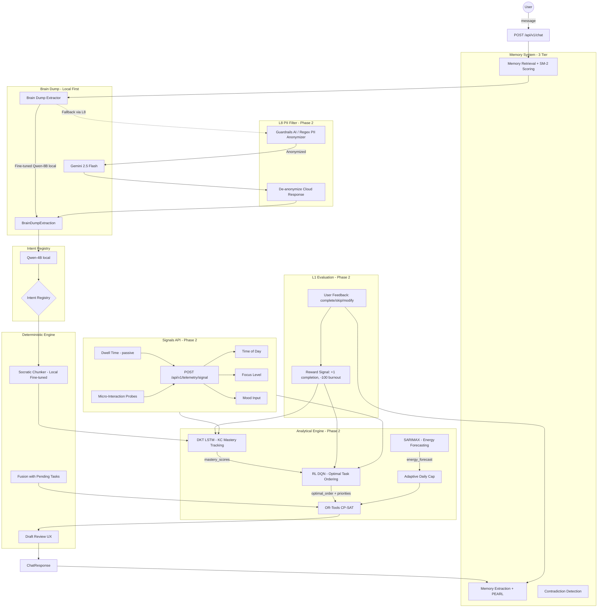

# Future Architecture — Phase 2 and Beyond

This document preserves the full specifications for components that are **PLANNED but not yet implemented**. These were designed during the initial architecture phase and validated against research literature (Deep Knowledge Tracing, Reinforcement Learning for education, time-series forecasting for cognitive capacity).

**Why they're deferred:** These components require user behavioral data that can only be collected once the core loop (Phase 1) is working reliably with real users. Without sufficient training data, these models would produce meaningless outputs — or worse, confidently wrong outputs that degrade the scheduling experience.

**When to bring them back:** Each section includes a "Prerequisites" subsection with concrete data thresholds and dependency requirements. The general ordering is:

1. **DKT** — first, because it only needs task completion events (100+ per user)
2. **RL** — second, because it depends on DKT mastery scores as input
3. **SARIMAX** — can be built in parallel with DKT/RL, needs 4+ weeks of continuous usage data
4. **L8 PII Filter** — when cloud LLM usage increases beyond minimal fallback
5. **L1 Evaluation** — when the core loop is stable and optimization signals are needed
6. **Signals API** — builds on top of RL + DKT; provides the real-time input channel

**Full future pipeline:**

```
Brain Dump → Intent → Control Policy → DKT (mastery) → RL (ordering) → CP-SAT (schedule) → Voice of Jarvis
```

---

## Phase 2 Architecture Diagram



---

## 1. Deep Knowledge Tracing (DKT)

### What It Does

DKT is an LSTM-based recurrent neural network that tracks a user's mastery of individual Knowledge Components (KCs) over time. A Knowledge Component is a fine-grained skill or concept — for example, "binary search implementation", "integration by parts", or "React useEffect cleanup".

As the user completes (or struggles with) tasks related to specific KCs, the DKT model updates its internal hidden state to produce a mastery probability for each KC. This mastery probability directly influences scheduling: low-mastery KCs get more time allocation and earlier scheduling priority.

**Key insight:** Unlike static difficulty ratings, DKT captures the *trajectory* of learning. A user who failed a topic last week but succeeded yesterday has a different mastery profile than one who has never attempted it.

### Math

The DKT model is a single-layer LSTM that processes a sequence of user interactions:

**Input at each timestep:**

```
x_t = {q_t, a_t}
```

Where:
- `q_t` = one-hot encoded Knowledge Component tag (which KC the task relates to)
- `a_t` = binary performance signal (1 = completed successfully, 0 = failed/skipped)

The combined input is a concatenation: if there are `K` total Knowledge Components, the input vector has dimension `2K` — the first `K` dimensions encode the KC identity, the next `K` encode the KC identity masked by the performance signal.

**LSTM hidden state update:**

```
f_t = sigma(W_f * [h_{t-1}, x_t] + b_f)        # forget gate
i_t = sigma(W_i * [h_{t-1}, x_t] + b_i)        # input gate
c_t = f_t * c_{t-1} + i_t * tanh(W_c * [h_{t-1}, x_t] + b_c)   # cell state
o_t = sigma(W_o * [h_{t-1}, x_t] + b_o)        # output gate
h_t = o_t * tanh(c_t)                           # hidden state
```

**Output (mastery prediction):**

```
y_t = sigma(W_yh * h_t + b_y)
```

Where:
- `y_t` is a vector of dimension `K` (one mastery probability per KC)
- `sigma` is the sigmoid function, ensuring output is in [0, 1]
- `y_t[k]` represents `P(mastery_k | h_t)` — the probability the user has mastered KC `k` given all interactions up to time `t`

**Loss function:**

Binary cross-entropy between predicted mastery and actual performance on the next interaction:

```
L = -sum(a_{t+1} * log(y_t[q_{t+1}]) + (1 - a_{t+1}) * log(1 - y_t[q_{t+1}]))
```

**Hyperparameters (initial):**
- Hidden dimension: 128
- Number of LSTM layers: 1
- Learning rate: 0.001
- Sequence length: variable (all interactions per user, padded/truncated to max 200)
- Batch size: 32
- Optimizer: Adam

### Training Data Schema

The DKT model requires a sequence of interaction records per user:

```json
{
  "user_id": "uuid",
  "interactions": [
    {
      "timestamp": "2026-04-15T14:30:00Z",
      "kc_tag": "binary_search",
      "performance": 1,
      "task_id": "goal123_chunk_4",
      "duration_minutes": 18,
      "difficulty_weight": 0.6
    },
    {
      "timestamp": "2026-04-15T15:00:00Z",
      "kc_tag": "dynamic_programming",
      "performance": 0,
      "task_id": "goal123_chunk_7",
      "duration_minutes": 25,
      "difficulty_weight": 0.85
    }
  ]
}
```

**Source of `kc_tag`:** Extracted during the Socratic Chunker phase. Each `TaskChunk` already has metadata that can be mapped to a KC taxonomy. The taxonomy itself will need to be built per-domain (CS, math, etc.) or learned via embedding clustering.

**Source of `performance`:** Derived from L1 Evaluation signals — task completed (1), task skipped (0), task modified (partial — binarize based on completion percentage threshold, e.g., >= 70% = 1).

**Minimum data requirement:** 100+ interaction records per user before the model produces reliable mastery estimates. Below this threshold, fall back to the current heuristic `difficulty_weight` from the Socratic Chunker.

### Integration Points

1. **Input from Socratic Chunker:** After goal decomposition produces `TaskChunk` objects, each chunk's KC tag is fed to the DKT model to retrieve current mastery probability.

2. **Output to TaskChunk:** DKT mastery probability replaces or modifies the static `difficulty_weight` field:
   ```
   adjusted_difficulty = 1.0 - mastery_probability
   ```
   Low mastery (e.g., 0.2) produces high adjusted difficulty (0.8), causing the scheduler to allocate more time and schedule the task earlier.

3. **Output to RL:** Mastery scores for all relevant KCs are included in the RL state vector, allowing the RL agent to make ordering decisions based on the user's current knowledge state.

4. **Update from L1 Evaluation:** After each task completion/skip event, the DKT model receives a new `(kc_tag, performance)` pair and updates its hidden state.

### Prerequisites

- **Data:** 100+ task completion events per user with KC tags and performance signals
- **Infrastructure:** KC taxonomy per domain (can start with LLM-generated tags, refine later)
- **Dependencies:** L1 Evaluation must be collecting completion/skip/modify events
- **Validation:** Compare DKT-predicted mastery against actual next-task performance; AUC > 0.7 before deploying to production scheduling

### Stub Location

`app/models/analytical/dkt_lstm.py` — currently contains only a module docstring. Implementation will add the LSTM model class, training loop, inference method, and a `get_mastery_scores(user_id, kc_tags) -> dict[str, float]` interface.

---

## 2. Reinforcement Learning (DQN)

### What It Does

The Deep Q-Network (DQN) agent learns an optimal policy for ordering tasks within a planning session. Instead of relying solely on Temporal Motivation Theory (TMT) heuristics for priority weights in the CP-SAT solver, the RL agent learns from actual user outcomes which task orderings lead to the best results (completions, flow states, no burnout).

The RL agent does **not** replace the CP-SAT solver — it provides *priority weights* and *ordering preferences* that the solver uses as soft constraints. The solver still handles hard constraints (time blocks, dependencies, daily caps).

### State Space, Action Space, Reward Function

**State Space `s_t`:**

A feature vector representing the current planning context:

| Feature | Type | Description |
|---------|------|-------------|
| `chapters_remaining` | int | Number of incomplete task chunks across all goals |
| `time_until_deadline` | float | Hours until the nearest deadline (normalized to [0, 1] over max horizon) |
| `energy_cycle_phase` | float | Current position in the user's circadian energy cycle (from SARIMAX, or heuristic until then) |
| `mastery_scores` | float[] | DKT mastery probabilities for KCs relevant to pending tasks |
| `tasks_completed_today` | int | Number of tasks already completed in current session |
| `current_cognitive_load` | float | Estimated cumulative cognitive load (sum of intrinsic_load for completed tasks) |
| `time_of_day` | float | Current hour normalized to [0, 1] |
| `day_of_week` | int | 0-6 (Monday-Sunday) |
| `streak_length` | int | Consecutive days with at least one task completion |

**Action Space `a_t`:**

Discrete actions representing which task to schedule next:

```
A = {task_1, task_2, ..., task_n, BREAK}
```

Where each `task_i` is an index into the pending task list, and `BREAK` is a special action that inserts a rest period. The action space is dynamic (changes as tasks are completed).

**Reward Function `R(s_t, a_t, s_{t+1})`:**

| Event | Reward | Rationale |
|-------|--------|-----------|
| Task completed successfully | +1 | Core positive signal |
| Task completed with active recall pass | +2 | Mastery-oriented bonus |
| Milestone progress (e.g., 25%/50%/75% of goal) | +3 | Intermediate progress reward |
| Consistent Pomodoro adherence (completed within estimated time) | +0.5 | Encourages accurate estimation |
| Task skipped | -0.5 | Mild penalty — may indicate poor ordering |
| Task modified (reduced scope) | -0.2 | Very mild — adaptation is acceptable |
| Burnout signal detected (3+ consecutive skips, or explicit mood signal) | -100 | Catastrophic penalty — the system must never cause burnout |
| Exam failure / deadline missed | -100 | Catastrophic penalty — the system must prevent this |
| BREAK taken when cognitive load is high | +0.3 | Encourages healthy pacing |

**Discount factor:** `gamma = 0.95` (values long-term outcomes but not too far ahead)

### Policy Definition

The policy `pi(a|s)` maps states to action probabilities. The DQN approximates the Q-function:

```
Q(s, a; theta) ≈ E[R_t + gamma * max_a' Q(s', a'; theta)]
```

Where `theta` are the neural network weights.

**Network architecture:**

```
Input (state vector, dim ~20-50)
  → Dense(128, ReLU)
  → Dense(64, ReLU)
  → Dense(|A|, linear)    # Q-value per action
```

**Training approach:**
- Experience replay buffer (size 10,000)
- Target network updated every 100 steps
- Epsilon-greedy exploration: `epsilon` starts at 1.0, decays to 0.1 over 1000 episodes
- Batch size: 32
- Optimizer: Adam, learning rate 0.001

**Output to CP-SAT:** The RL agent produces priority weights for each pending task:

```python
priority_weights = {}
for task in pending_tasks:
    q_values = dqn.predict(current_state)
    priority_weights[task.task_id] = q_values[task_index]
```

These weights replace the TMT-only priority calculation in the CP-SAT solver's objective function.

### Integration with DKT Output

The RL agent depends on DKT mastery scores as part of its state representation:

1. **State enrichment:** Before the RL agent selects an action, the DKT model provides mastery probabilities for all KCs relevant to pending tasks. These are included in the state vector.

2. **Informed ordering:** The RL agent can learn patterns like "schedule low-mastery tasks during high-energy periods" or "interleave easy and hard tasks to maintain engagement" — patterns that emerge from the interaction between mastery state and user outcomes.

3. **Joint update:** When a task completion event occurs:
   - DKT updates mastery for the relevant KC
   - RL receives a reward signal and updates Q-values
   - Both models are updated before the next scheduling decision

### Prerequisites

- **DKT must be operational:** RL needs mastery scores as state input. Without DKT, the state space is impoverished and the agent will learn suboptimal policies.
- **L1 Evaluation must be collecting:** Reward signals come from completion/skip/modify events.
- **Sufficient episodes:** At least 500 planning sessions per user before the policy is reliable. Until then, fall back to TMT-only priority.
- **Simulation environment:** Consider building a user simulator (based on collected behavioral data) to pre-train the RL agent before deploying with real users.

### Stub Location

`app/models/analytical/dqn_rl.py` — currently contains only a module docstring. Implementation will add the DQN model class, replay buffer, training loop, and a `get_priority_weights(state, pending_tasks) -> dict[str, float]` interface.

---

## 3. SARIMAX Cognitive Energy Forecasting

### What It Does

SARIMAX (Seasonal AutoRegressive Integrated Moving Average with eXogenous variables) predicts the user's cognitive energy capacity for upcoming time periods. Instead of using a fixed heuristic for `compute_adaptive_daily_cap` (the current approach based on slack ratio), SARIMAX produces a data-driven forecast of how much productive work the user can handle at each hour of the day.

This enables truly personalized scheduling: a user who is consistently sharp at 6 AM but crashes at 2 PM will get a different schedule than one who peaks at 10 AM.

### Seasonality Parameters

SARIMAX captures multiple overlapping seasonal patterns in cognitive capacity:

| Parameter | Period | What It Captures |
|-----------|--------|-----------------|
| `S=24` | 24 hours (daily) | Circadian rhythm — energy peaks and troughs within a day. Most users have a morning peak, post-lunch dip, and evening secondary peak. |
| `S=7` | 7 days (weekly) | Weekly rhythm — many users have different energy patterns on weekdays vs weekends, or specific low-energy days (e.g., Monday after a weekend). |
| `S=365` | 365 days (annual) | Seasonal/academic rhythm — exam periods, semester breaks, seasonal affective patterns. Only relevant after 1+ year of data. |

**SARIMAX order notation:** `SARIMAX(p, d, q)(P, D, Q, S)`

Initial parameters (to be tuned via AIC/BIC):
- Non-seasonal: `(1, 1, 1)` — one AR term, one differencing, one MA term
- Seasonal (daily): `(1, 1, 1, 24)`
- Seasonal (weekly): `(1, 0, 1, 7)` — applied as a second seasonal layer or via weekly aggregation

The annual seasonality (`S=365`) requires 2+ years of data and will be added later as a long-term enhancement.

### Exogenous Variables

Exogenous variables are external factors that influence cognitive capacity but are not part of the time series itself:

| Variable | Source | Expected Effect |
|----------|--------|----------------|
| `time_tracking_signals` | Signals API — actual hours worked per day | High hours yesterday → lower capacity today (fatigue) |
| `task_completion_rate` | L1 Evaluation — ratio of completed to planned tasks | Sustained low rate → capacity estimate should decrease |
| `mood_input` | Signals API — user-reported mood (1-5 scale) | Low mood → reduced cognitive capacity |
| `sleep_duration` | Inferred from usage patterns or explicit input | Short sleep → reduced next-day capacity |
| `task_difficulty_avg` | Average `difficulty_weight` of completed tasks | Sustained high difficulty → faster energy drain |
| `break_frequency` | Number of BREAK actions taken | More breaks may indicate either good pacing or fatigue |

### Integration with Adaptive Pacing

Currently, `compute_adaptive_daily_cap` in `utils/pacing.py` uses a heuristic based on slack ratio:

```
slack >= 10 → 90 min/day
slack >= 5  → 120 min/day
slack >= 3  → 180 min/day
otherwise   → 240 min/day (max)
```

With SARIMAX, this becomes:

```python
def compute_adaptive_daily_cap(user_id: str, date: date) -> int:
    forecast = sarimax_model.forecast(user_id, horizon=24)  # next 24 hours

    # Sum predicted capacity across productive hours
    total_capacity_minutes = sum(
        forecast[hour].predicted_capacity
        for hour in productive_hours
    )

    # Apply safety ceiling
    return min(total_capacity_minutes, MAX_DAILY_CAP)
```

The forecast also feeds into the CP-SAT solver as time-varying capacity constraints: high-energy hours get allocated difficult tasks, low-energy hours get easy tasks or breaks.

**Hourly capacity output:**

```json
{
  "user_id": "uuid",
  "forecast_date": "2026-04-16",
  "hourly_capacity": [
    {"hour": 8, "predicted_minutes": 45, "confidence": 0.82},
    {"hour": 9, "predicted_minutes": 50, "confidence": 0.85},
    {"hour": 10, "predicted_minutes": 55, "confidence": 0.87},
    {"hour": 14, "predicted_minutes": 20, "confidence": 0.75},
    {"hour": 15, "predicted_minutes": 30, "confidence": 0.78}
  ]
}
```

### Prerequisites

- **Data:** 4+ weeks of continuous usage data per user (daily task completions, timestamps, durations)
- **Signals API:** Must be collecting time-of-day and mood signals (at minimum)
- **Validation:** Compare SARIMAX forecast against actual productive output; RMSE should be lower than the heuristic baseline
- **Fallback:** If SARIMAX confidence is below threshold (< 0.6), fall back to the heuristic pacing. Always maintain the heuristic as a safe default.

### Stub Location

`app/models/forecast/capacity_ts.py` — currently contains only a module docstring. Implementation will add the SARIMAX model wrapper, training/fitting pipeline, forecast method, and a `forecast_capacity(user_id, horizon_hours) -> list[HourlyCapacity]` interface. Consider using `statsmodels.tsa.statespace.sarimax.SARIMAX` as the underlying implementation.

---

## 4. L8 PII Filter

### What It Does

The L8 PII (Personally Identifiable Information) Filter is a privacy gateway that sits between the Jarvis engine and any cloud LLM calls (currently Gemini 2.5 Flash). Before any user content is sent to a cloud provider, the PII filter:

1. **Detects** PII in the outgoing prompt (names, emails, phone numbers, addresses, student IDs, course-specific identifiers)
2. **Replaces** each PII instance with a consistent, typed placeholder
3. **Forwards** the anonymized prompt to the cloud LLM
4. **De-anonymizes** the cloud response by replacing placeholders back with original values

This ensures that even if the cloud provider logs prompts, no user-identifiable information is exposed.

### Anonymization Strategy

**Consistent placeholder mapping:** Each PII instance gets a deterministic placeholder that persists within a single request-response cycle:

| PII Type | Example Input | Placeholder |
|----------|---------------|-------------|
| Person name | "Murali Madhav" | `[PERSON_1]` |
| Email | "murali@example.com" | `[EMAIL_1]` |
| Phone | "+91-9876543210" | `[PHONE_1]` |
| Address | "123 Main St, Chennai" | `[ADDRESS_1]` |
| Student ID | "CS2024001" | `[STUDENT_ID_1]` |
| Date of birth | "March 15, 2004" | `[DOB_1]` |
| Institution | "IIT Madras" | `[INSTITUTION_1]` |

**Consistency rules:**
- The same entity always maps to the same placeholder within a request (if "Murali" appears 3 times, all become `[PERSON_1]`)
- Different entities of the same type get incrementing indices (`[PERSON_1]`, `[PERSON_2]`)
- The mapping is stored in memory only for the duration of the request — never persisted

**De-anonymization:** After receiving the cloud LLM response, reverse the mapping:
```
"[PERSON_1] should focus on [INSTITUTION_1] coursework"
→ "Murali should focus on IIT Madras coursework"
```

### Implementation Approach

Two implementation options, evaluated in order of preference:

**Option A: Guardrails AI (preferred)**
- Use the Guardrails AI library with a PII detection guardrail
- Provides pre-built validators for common PII types
- Supports custom validators for domain-specific PII (student IDs, course codes)
- Integrates as middleware in the `hybrid_route_query` function

**Option B: Regex + spaCy NER**
- Regex patterns for structured PII (emails, phones, IDs)
- spaCy Named Entity Recognition for unstructured PII (names, locations)
- More control but requires more maintenance
- Fallback if Guardrails AI is too heavy for local inference

**Integration point:** The PII filter wraps the cloud LLM call path in `hybrid_route_query`:

```python
async def hybrid_route_query(prompt, ...):
    if should_use_cloud(prompt):
        anonymized_prompt, pii_map = pii_filter.anonymize(prompt)
        cloud_response = await call_gemini(anonymized_prompt)
        return pii_filter.deanonymize(cloud_response, pii_map)
    else:
        return await call_local(prompt)  # local calls don't need PII filtering
```

### Prerequisites

- **Trigger:** When cloud LLM usage increases beyond the current minimal fallback pattern (currently only used when local model fails or for real-time research queries)
- **Dependencies:** None — this is independent of DKT/RL/SARIMAX
- **Testing:** Create a test suite with synthetic PII-containing prompts; verify 100% detection rate for common PII types before deploying
- **Performance:** PII detection must add < 100ms latency to the cloud call path

---

## 5. L1 Evaluation

### What It Does

L1 Evaluation is the feedback collection and quality assessment layer. It captures how users interact with the schedules and tasks that Jarvis produces, converting these interactions into structured signals that feed the DKT and RL models.

Without L1 Evaluation, the system is "open-loop" — it produces schedules but never learns whether they were good. L1 closes the loop.

### Feedback Signal Design

**Explicit signals (user-initiated):**

| Signal | Trigger | Data Captured |
|--------|---------|--------------|
| Task completed | User marks task done | `task_id`, timestamp, actual duration, optional quality rating (0-5) |
| Task skipped | User explicitly skips | `task_id`, timestamp, optional reason (too hard / not relevant / no time) |
| Task modified | User changes scope/duration | `task_id`, original vs modified fields, timestamp |
| Schedule rating | End of day | Overall satisfaction (1-5), optional free-text feedback |

**Implicit signals (system-inferred):**

| Signal | Detection Method | Interpretation |
|--------|-----------------|----------------|
| Dwell time | Time between task start notification and completion/skip | Long dwell on easy task → possible struggle or distraction |
| Task reordering | User manually reorders scheduled tasks | System ordering was suboptimal |
| Repeated rescheduling | Same task appears in 3+ consecutive schedules without completion | Task may need decomposition or difficulty adjustment |
| Session abandonment | User stops interacting mid-schedule | Possible overwhelm or burnout |

### Metrics

**Schedule quality metrics (evaluated per planning session):**

| Metric | Formula | Target |
|--------|---------|--------|
| Completion rate | `completed_tasks / scheduled_tasks` | > 0.7 |
| On-time rate | `tasks_completed_within_estimate / completed_tasks` | > 0.6 |
| Skip rate | `skipped_tasks / scheduled_tasks` | < 0.2 |
| Burnout indicator | `consecutive_skips >= 3 OR mood_signal <= 2` | 0 (never) |

**Model quality metrics (evaluated via Ragas/DeepEval):**

| Metric | What It Measures | Tool |
|--------|-----------------|------|
| Faithfulness | Does the schedule respect stated constraints? | Ragas |
| Relevance | Are decomposed tasks relevant to the stated goal? | Ragas |
| Coherence | Is the task ordering logical (dependencies, difficulty progression)? | DeepEval |
| Harmlessness | Does the schedule avoid overwork patterns? | Custom validator |

### RL Reward Loop

L1 Evaluation feeds the RL agent's reward function:

```
User completes task → L1 captures completion event
    → Reward signal: +1 (or +2 if active recall pass)
    → RL agent updates Q-values for the state-action pair that led to this task being scheduled at this time
    → DKT updates mastery for the task's KC

User skips 3 consecutive tasks → L1 detects burnout pattern
    → Reward signal: -100
    → RL agent learns to avoid the state-action sequence that led to this situation
    → System triggers Socratic recalibration (reduce scope)
```

**Delayed rewards:** Some rewards are only observable after a delay (e.g., exam results, deadline outcomes). The system must support:
- Storing pending reward signals with a `reward_due_date`
- Retroactively updating RL Q-values when delayed rewards arrive
- Discounting delayed rewards more heavily (`gamma^delay_steps`)

### Prerequisites

- **Core loop stability:** The basic plan-day flow must work reliably before adding evaluation complexity
- **Frontend:** A minimal UI is needed to capture explicit signals (complete/skip/modify buttons)
- **Supabase schema:** New tables for `evaluation_events` and `session_metrics`
- **Dependencies:** None — L1 can be built independently, but its full value is realized when DKT and RL consume its signals

---

## 6. Signals API

### What It Does

The Signals API is a telemetry endpoint that collects real-time contextual signals from the user and their environment. These signals enrich the RL state space and provide exogenous variables for SARIMAX forecasting.

Unlike L1 Evaluation (which captures task-level outcomes), the Signals API captures *ambient context* — how the user is feeling, what time it is, how focused they are — independent of any specific task.

### Endpoint Design

```
POST /api/v1/telemetry/signal
```

**Request body:**

```json
{
  "user_id": "uuid",
  "signal_type": "mood" | "focus" | "energy" | "context",
  "value": 3.5,
  "metadata": {
    "source": "manual" | "passive" | "probe",
    "device": "desktop" | "mobile",
    "context": "pre_session" | "mid_session" | "post_session"
  },
  "timestamp": "2026-04-16T14:30:00Z"
}
```

**Response:**

```json
{
  "status": "accepted",
  "signal_id": "uuid",
  "adaptive_response": {
    "action": "none" | "suggest_break" | "reduce_difficulty" | "extend_session",
    "reason": "Energy level below threshold for current task difficulty"
  }
}
```

The `adaptive_response` field allows the system to immediately react to concerning signals (e.g., very low energy mid-session) without waiting for the next full scheduling cycle.

### Signal Types

**Active signals (user-reported):**

| Signal | Scale | Collection Method | Frequency |
|--------|-------|-------------------|-----------|
| Mood | 1-5 (very low to very high) | Quick emoji or slider input | Start/end of session, optionally mid-session |
| Focus | 1-5 (distracted to deep focus) | Self-report after Pomodoro | After each task or Pomodoro block |
| Energy | 1-5 (exhausted to energized) | Quick slider | Start of session, after breaks |

**Passive signals (system-inferred):**

| Signal | Source | Inference |
|--------|--------|-----------|
| Dwell time | Time on task page without interaction | Long dwell → low focus or high difficulty |
| Interaction velocity | Clicks/keystrokes per minute | Rapid interaction → high engagement; none → distraction |
| Session timing | When user opens/closes the app | Habitual usage patterns → circadian preferences |
| Break patterns | When user takes breaks vs. continues | Natural energy cycle boundaries |

**Micro-interaction probes:**

Lightweight questions injected at natural transition points (between tasks, after breaks):

- "How was that task?" (1-5 difficulty rating)
- "Ready for the next one?" (yes / need a break / done for today)
- "How are you feeling?" (emoji selection)

These must be **non-intrusive** — maximum 1 probe per 30 minutes, skippable, and never blocking task flow.

### Integration with RL + DKT

**To RL:**
- Signals are included in the RL state vector (mood, focus, energy as continuous features)
- Low energy/mood signals can trigger the BREAK action preference
- Patterns of signal values before task success/failure help the RL agent learn context-dependent scheduling

**To DKT:**
- Context signals are stored alongside interaction records
- Allows DKT to distinguish between "user failed because they don't know the material" vs. "user failed because they were exhausted"
- Future: condition mastery estimates on context (mastery when focused vs. mastery when tired)

**To SARIMAX:**
- Mood, energy, and focus signals are exogenous variables in the SARIMAX model
- Historical signal patterns improve capacity forecasting accuracy

### Prerequisites

- **Frontend:** A minimal UI to collect active signals (mood/focus/energy inputs)
- **RL + DKT:** Signals are most valuable when these models can consume them. Without RL/DKT, signals can still be stored for future model training.
- **Privacy:** Signal data is sensitive behavioral information. Must be stored locally (Supabase) and never sent to cloud without anonymization.
- **UX research:** Determine optimal probe frequency and placement to maximize signal quality without annoying users. Start conservative (1 probe per session) and increase based on user feedback.
- **Supabase schema:** New `user_signals` table: `signal_id, user_id, signal_type, value, metadata (JSONB), created_at`
