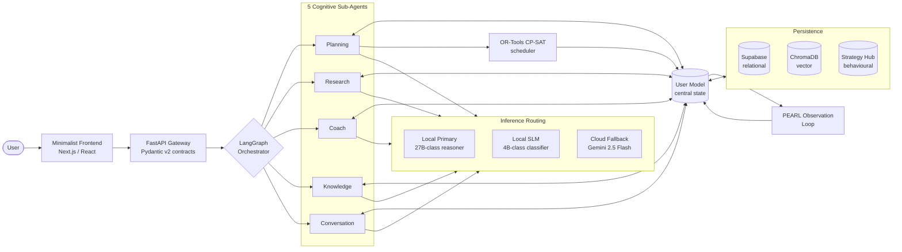
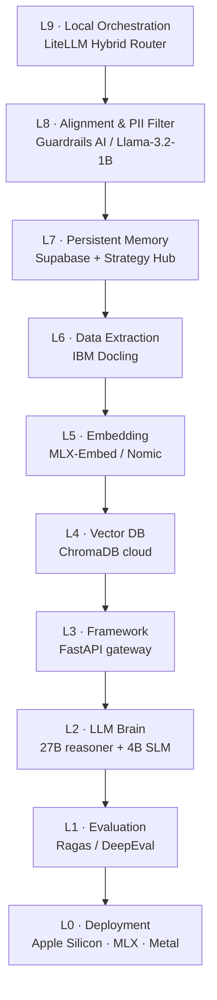
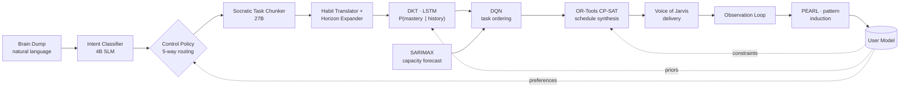
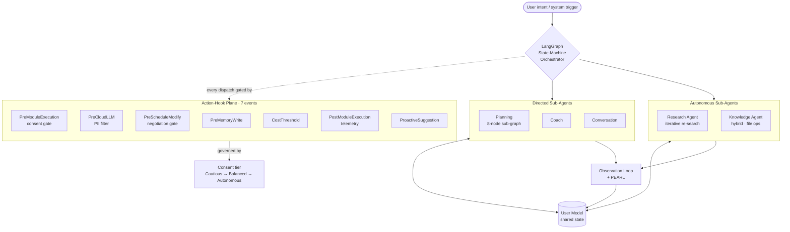
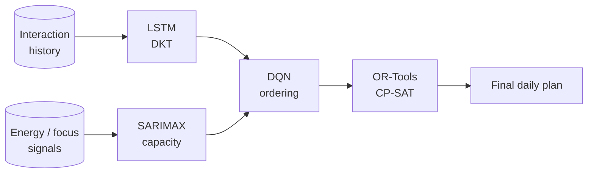
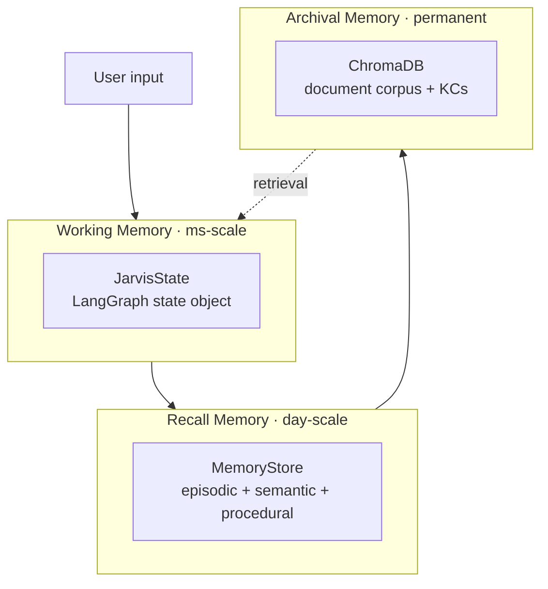
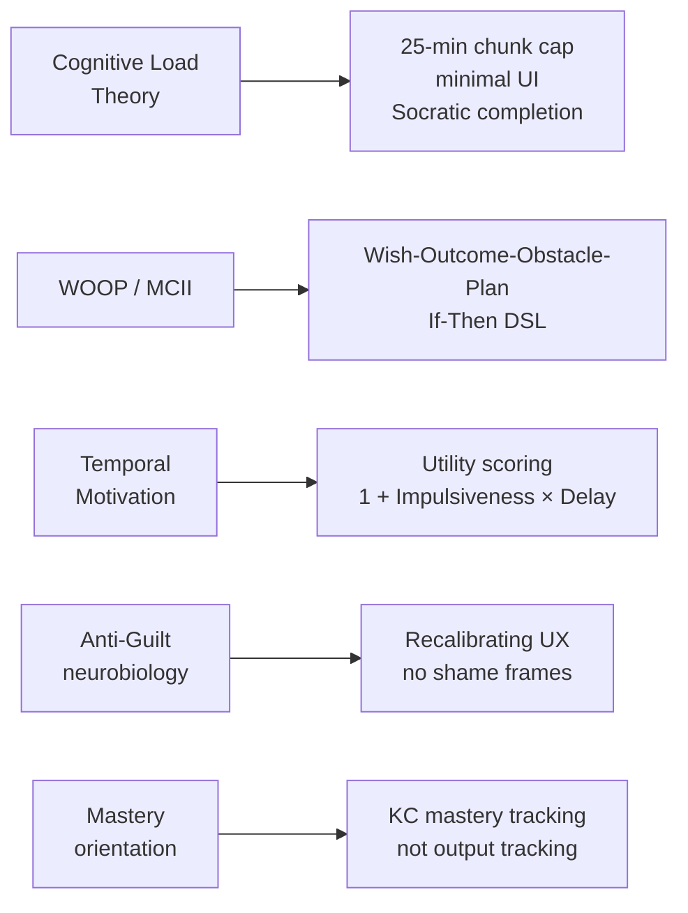
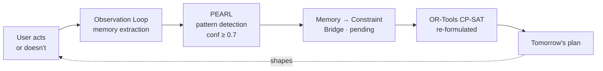

# JARVIS — Technical Complexity Brief

**A supplementary document submitted alongside the attendance waiver request of**
**C Murali Madhav · 3rd Year, B.Tech CSE (AI) · Newton School of Technology, Rishihood University**

---

## Purpose of this Document

The waiver letter outlines the *scheduling* reason behind the reduced classroom hours: the Watt-IF research project, the Sanas AI internship, and the Jarvis startup. This brief addresses a different question:

> *"Why is Jarvis demanding enough, on its own, to justify protected research and build hours during the 6th semester?"*

The objective here is not to advertise the product. It is to give the committee a faithful technical view of what Jarvis actually is.

The short version: Jarvis is **not a planner application**. It is an **adaptive personal-intelligence framework** — a sub-agent cognitive operating system that observes a single user across surfaces, builds a deepening model of how that person thinks and acts, and routes that understanding into whichever specialised cognitive module the moment requires. Daily planning is the *first vertical* the framework is being trained on, not its identity. The same substrate (User Model + PEARL observation + sub-agent dispatch + memory→constraint bridge) is being designed to generalise — to research assistance, to learning, to coaching, to ambient interaction with the user's other tools. The scheduler is a muscle; PEARL and the User Model are the brain.

In concrete technical terms it is a **9-layer agentic AI stack with a sub-agent cognitive operating system, four mathematical subsystems (one in production, three designed and awaiting data), and a behavioural memory layer designed to recursively rewrite its own decision-making constraints** — so the time commitment described in the letter is interpretable in context.

Wherever possible, components are mapped back to the syllabus of the very courses in which my attendance has dropped (AML, DL, ADM). The intent is to show that this work is not an extracurricular distraction from the curriculum; it is, in many parts, an applied extension of it.

A note on epistemic discipline: I have tried throughout to distinguish what is **shipped today**, what is **in active migration**, and what is **designed and awaiting either data or engineering hours**. Section 9 carries that breakdown explicitly. The committee should feel free to verify any of these claims directly against the project repository.

---

## 1. Executive Summary

Jarvis is a **local-first, hyper-personalised adaptive intelligence framework**. It models one user across modalities — text, documents, calendar, behaviour, ambient signals — and routes that understanding through specialised cognitive sub-agents that each handle a different *mode* of intelligence (planning, research, coaching, knowledge work, conversation). Productivity scheduling is the first vertical it is being deployed in; the framework itself is domain-agnostic by design. It is being built as the founding product of a startup that recently won the **Nexus Startup Hackathon**, is in active **Y Combinator** application, and has a scheduled **Antler / VC pitch**.

The system is not a CRUD task tracker, not a chat wrapper, and not a single-purpose planner. It is a research-grade stack composed of:

- A **9-layer agentic RAG architecture** (L0–L9) running across local Apple-Silicon inference and selective cloud fallback.
- A **sub-agent cognitive operating system** — a LangGraph state-machine orchestrator dispatching **5 specialised cognitive sub-agents** (Planning, Research, Coach, Knowledge, Conversation), governed by a **7-event action-hook plane** with tiered consent (Cautious → Balanced → Autonomous), all sharing a central **User Model**. Planning is partly compiled today; Research and Knowledge are mid-migration from function imports to fully compiled sub-graphs.
- Four mathematical subsystems, with explicit production status:
  - **OR-Tools CP-SAT** constraint-programming scheduler — *in production*; the deterministic core of the daily plan.
  - **Deep Knowledge Tracing (DKT)** — an LSTM-based mastery estimator, *designed; stub pending the per-user data threshold (~100 task completions).*
  - **Deep Q-Network (DQN) reinforcement learner** for task ordering under cognitive-load constraints, *designed; stub gated on DKT output.*
  - **SARIMAX** seasonal time-series forecaster for cognitive-energy capacity, *designed; stub pending ~4 weeks of continuous user data.*
- A **3-tier memory system** (Working / Recall / Archival) backed by Supabase, ChromaDB and an in-process state graph.
- A **PEARL-style observation loop** + a **Memory→Constraint Bridge** (the bridge is the next implementation milestone) that converts behavioural patterns into hard scheduling constraints. Once shipped, this loop makes Jarvis a system whose scheduling math is *rewritten by its own observations* — the architectural commitment underlying what we internally call "true Jarvis".

A condensed summary of the surface area:

| Dimension | Scale |
|---|---|
| Architectural layers | 9 (L0 deployment → L9 orchestration) |
| Cognitive sub-agents | 5 (LangGraph state-machine; mix of directed + autonomous) |
| Mathematical subsystems | 4 — 1 in production (CP-SAT) + 3 designed (DKT, DQN, SARIMAX) |
| Memory tiers | 3 (Working, Recall, Archival) |
| Psychological frameworks operationalised | 5 (CLT, WOOP, TMT, Anti-Guilt, Mastery Orientation) |
| Action / governance hooks | 7 (consent, PII, schedule modify, memory write, cost, post-execution, proactive) |
| Models in routing pool | 3 (local 27B-class reasoner, local 4B-class SLM, cloud fallback) |

The remainder of this document expands each of these.

---

## 2. The Problem Class — Why Jarvis Is a Research-Grade Build

Most "AI productivity" apps reduce to: *LLM call + database + UI*. Jarvis is positioned against a harder problem class:

> **Given an evolving user with limited cognitive capacity, partially observable goals, latent psychological state, recurring obstacles, and noisy self-reports — produce, every day, an executable schedule that maximises long-horizon mastery and well-being while remaining locally private and computationally feasible on consumer hardware.**

Each underlined phrase is its own technical problem:

- *Evolving user* → online learning / non-stationary RL.
- *Limited cognitive capacity* → CLT-driven load model, SARIMAX capacity forecasting.
- *Partially observable goals* → Socratic chunking + intent classification under uncertainty.
- *Latent psychological state* → behavioural memory + PEARL pattern induction.
- *Recurring obstacles* → WOOP If-Then implementation intentions.
- *Noisy self-reports* → infer-don't-ask (no "did you complete this?" prompts).
- *Locally private* → local-first inference, PII pseudonymisation before any cloud egress.
- *Computationally feasible* → strict sequencing of large-model calls (no concurrent 27B inference on 24 GB unified memory).

This is a research-thesis-grade problem decomposition. The build is hard not because of code volume, but because each subsystem is itself a small research artefact that must remain consistent with every other subsystem.

---

## 3. System Architecture

> **A note on model identifiers in the diagrams that follow.** Production today runs **Qwen-27B + Qwen-4B** via LM Studio, with **Gemini 2.5 Flash** as cloud fallback. The diagrams depict the **v2 architecture** the project is actively migrating to; the planned model swap is to **Gemma 4 26B + Gemma 4 E4B**, with the routing structure unchanged. Where a diagram says *"local 26B"* or *"local 4B SLM"*, read it as the *role* (primary reasoner / fast classifier), independent of which specific model fills the slot.

### 3.1 Top-Level Topology

The architectural commitment is unusual: the **User Model sits at the centre, not the LLM**. Every sub-agent reads from and writes to this model. The product's identity is the *stateful intelligence around the user*, not the language model.

---

### 3.2 The 9-Layer Agentic RAG Stack (L0 → L9)

Each layer is independently designed and independently testable. The full stack is *agentic* in the technical sense: control flow is decided by the model + state graph, not hard-coded.

---

### 3.3 Cognitive Loop — End-to-End Data Flow

The full pipeline from a single user input to a delivered plan touches every learnable component in the system:

The arrow most worth highlighting is the dotted **Memory → Constraint** edge: behavioural observations stored in the User Model are translated into hard constraints inside the CP-SAT solver. This bridge is the **next implementation milestone** — see §9 — and is the architectural commitment that, once shipped, distinguishes Jarvis from planners that only *retrieve* memories rather than letting them rewrite the solver formulation. To my knowledge no other planner is built around this loop. We treat this as a *structural differentiator*, not a marketing claim, and Section 9 makes the current shipped state explicit.

---

## 4. The Sub-Agent Framework — Jarvis as a Cognitive Operating System

The single most architecturally distinctive piece of Jarvis is not any individual model — it is the **internal framework** we are building to compose those models. Concretely, Jarvis is structured as a small *cognitive operating system*: a typed state machine that **dispatches specialised sub-agents**, **gates each dispatch through a hook plane**, and **shares a single User Model across all of them**. The pattern is heavily influenced by Claude Code's internal architecture, but adapted around a stateful, person-centred core rather than a stateless coding agent.

### 4.1 Why a sub-agent framework, and not just a monolithic chain

A planner that has to do all of (a) decompose goals, (b) research the web, (c) coach the user, (d) ingest documents, and (e) hold an open conversation cannot be expressed as a single prompt or a single chain. Each of these is a different *mode of cognition*: different tools, different LLM tiers, different success criteria, different failure semantics. We treat them as **separately compiled sub-agents** (target architecture) that are dispatched by an orchestrator in response to classified intent, conversation phase, and prior module history.

### 4.2 The framework, in one diagram

### 4.3 The five sub-agents

| # | Sub-agent | Type | Internal structure (target) | Migration status (May 2026) | Primary LLM tier | What it owns |
|---|---|---|---|---|---|---|
| 1 | **Planning** | Directed | 8-node compiled `StateGraph` | Partly compiled; orchestrator migration in progress | Local 27B | Brain-dump → decompose → fuse → solve → draft |
| 2 | **Research** | Autonomous | 5-node loop with re-search | Function imports today; promotion to compiled sub-graph in progress | Cloud + local 27B | Web + RAG, can iterate until satisfied |
| 3 | **Coach** | Directed | Single node | Function form today | Local 4B SLM | Anti-guilt, progress, mastery framing |
| 4 | **Knowledge** | Hybrid | 6-node sub-graph | Function imports today; promotion to compiled sub-graph in progress | Local 4B + 27B | Document ingestion, file ops, calendar parse |
| 5 | **Conversation** | Directed | Single node | Function form today | Local 4B SLM | Open chat with personality |

Two flavours are deliberate: **directed sub-agents** are invoked for one well-defined cognitive operation; **autonomous sub-agents** can iterate, re-plan, and decide when they are done. The orchestrator does not micromanage autonomous agents — it dispatches and waits.

### 4.4 The action-hook governance plane

Around every sub-agent dispatch is a **hook pipeline**. Hooks are blocking gates that can ALLOW, DENY, ASK, or MODIFY the call. This is how *consent, privacy, cost, and proactivity* are enforced — not as ad-hoc checks scattered through the code, but as a uniform governance layer.

Crucially, the hook pipeline is paired with a **tiered autonomy model**. The user trains Jarvis's autonomy over time:

| Tier | Auto-allowed | Asks first |
|---|---|---|
| **Cautious** (default) | Read memory, classify, decompose | Schedule changes, constraint adds, memory writes |
| **Balanced** (after a week of use) | + single-goal schedule changes | Multi-goal replans, habit modifications |
| **Autonomous** (opt-in) | + proactive suggestions, auto-replan | Irreversible actions only |

This is what allows Jarvis to *grow into* being a true assistant rather than starting as either an over-eager auto-pilot or a permanently-asking dialog box.

### 4.5 State-aware routing

The orchestrator is not a dumb intent → module map. It reads three signals before routing:

1. **Conversation phase** — `GREETING / PLANNING / NEGOTIATION / REVIEW / CHAT`. A `NEGOTIATION` phase short-circuits classification entirely.
2. **Modules already invoked this turn** — prevents recursion and informs anti-guilt fallback (e.g. if `planning_module` failed → route to `coach_module`).
3. **Intent classification** — only after the above are considered.

This is closer to a *cognitive controller* than a router, and it is the part of the framework we expect to keep evolving as new sub-agents are added.

### 4.6 Why this is hard, and worth flagging to the committee

The framework is the substrate on which everything else is built. Getting it right requires holding in one's head, simultaneously:

- LangGraph's typed state model and edge semantics,
- the lifetime of every variable in `JarvisState` across sub-agent calls,
- the seven hook contracts (which can mutate the very call they intercept),
- streaming SSE event mapping for a live frontend,
- the User-Model invalidation rules (writes from one sub-agent must invalidate caches read by another),
- and the *sequential* constraint on 27B inference (no two concurrent calls on a 24 GB device).

This is the part of the build that absorbs the largest fraction of focused engineering hours, and it is also the part with the longest tail of subtle correctness issues — the kind of work that does not survive interruption.

---

## 5. Mathematical and ML Subsystems

This section is intentionally precise because the overlap with AML, DL and ADM is closest here. Three of the four subsystems described below are **stubs** at present — fully designed in the codebase and in `docs/FUTURE_ARCHITECTURE.md`, but gated on per-user data thresholds before training is meaningful. The fourth (CP-SAT) is in production. This is the same status reflected in §1 and §9.

### 5.1 Deep Knowledge Tracing (DKT) — `app/models/analytical/dkt_lstm.py` *(designed; stub pending ~100 completions per user)*

A recurrent network estimating per-Knowledge-Component mastery over time:

$$P(\text{mastery}_t \mid h_t), \quad h_t = \text{LSTM}(h_{t-1}, x_t)$$

- **Input** $x_t$: a sequence of `(KC_tag, performance_signal)` pairs.
- **Output**: a mastery probability per Knowledge Component.
- The output is designed to feed `difficulty_weight` for each TaskChunk; lower-mastery KCs receive proportionally more schedule allocation.

**DL syllabus mapping:** RNN/LSTM internals, sequence modelling, hidden-state dynamics.

---

### 5.2 Reinforcement Learning — DQN · `app/models/analytical/dqn_rl.py` *(designed; stub gated on DKT output)*

A Deep Q-Network for task-ordering under load.

- **State** $s_t$: $(\text{chapters remaining},\ \text{time-to-deadline},\ \text{current energy})$
- **Reward**:
  $r = +1$ (task done + active recall passed) $-\,100$ (exam fail / burnout)
- **Intermediate shaping**: milestone progress, Pomodoro adherence.
- **Policy objective**: maximise cumulative reward subject to a cognitive-load ceiling.
- **Coupling**: DKT mastery scores feed RL priors; RL ordering feeds the CP-SAT solver.

**DL / AML syllabus mapping:** Q-learning, value approximation, exploration–exploitation, reward shaping.

---

### 5.3 SARIMAX Cognitive-Energy Forecasting — `app/models/forecast/capacity_ts.py` *(designed; stub pending ~4 weeks of continuous user data)*

A Seasonal AutoRegressive Integrated Moving Average model with eXogenous regressors:

- AR component → past energy → future energy.
- I component → stationarising via differencing; removes burnout drift.
- Seasonal periods: $m \in \{24, 7, 365\}$ (hourly, weekly, annual cycles).
- Exogenous regressors: time-tracking signals, completion rates, self-reports.

**AML syllabus mapping:** classical time-series modelling, seasonality, exogenous regression — direct curriculum overlap.

---

### 5.4 OR-Tools CP-SAT Scheduler *(in production)*

A constraint-programming solver synthesises the final daily plan under:

- Per-day time-budget constraints,
- Per-task duration windows,
- Behavioural memory constraints (from PEARL — e.g. *"no heavy work before 11 AM"* — wired once the Memory→Constraint Bridge ships, see §9),
- Spaced-repetition constraints (SM-2, EF floor 1.3),
- Anti-guilt INFEASIBLE handling (renegotiate, do not blame the user).

**ADM mapping:** constraint satisfaction, propagation, conflict resolution — formal discrete-mathematics territory.

---

### 5.5 Combined Mathematical Pipeline (target)

Four heterogeneous mathematical components — three learners (recurrent, time-series, value-based RL) and one combinatorial solver — designed to communicate through a single User Model. Keeping their inputs and outputs *contractually consistent* (all Pydantic v2 schemas) is a non-trivial part of the engineering load even before the learners are trained.

---

## 6. Memory Architecture

| Tier | Lifetime | Backed by | Examples |
|---|---|---|---|
| **Working** (JarvisState) | Per turn | In-process state graph | Current intent, tool calls, partial plan |
| **Recall** (MemoryStore) | Days–months | Supabase + Strategy Hub | "User avoids deep work before 11 AM" |
| **Archival** | Permanent | ChromaDB | Uploaded notes, textbook chunks, KCs |

**Three memory categories within Recall:**
- *Episodic* — timestamped task completions.
- *Semantic* — embedded document knowledge.
- *Procedural* — induced behavioural rules ("never schedules X after Y").

The induction of *procedural* memory is performed by **PEARL** — the system's pattern-discovery loop. When PEARL detects a recurring behavioural pattern (e.g. the user repeatedly pushes early-morning study slots), it writes a structured rule to `preference_json` in the Strategy Hub. From that point — once the Memory→Constraint Bridge (§9) is wired — the rule will act as a *constraint* on future plans. This is the closed loop the product is built around.

---

## 7. Psychological Foundations Operationalised in Code

A core thesis of the project is that productivity systems fail because they do not model human psychology. Jarvis operationalises five frameworks directly into runtime behaviour:

Each framework is implemented as runtime logic — not marketing copy. For instance:
- The **TMT** utility uses the canonical $1 + I \cdot D$ denominator to avoid degenerate division.
- **WOOP** is structured as a four-stage Socratic flow; the obstacle-surfacing step is designed to gate schedule generation. The `implementation_intention` schema is already wired into `TaskChunk`; the chunker-side prompt generation is being tightened (see roadmap).
- **Anti-Guilt** appears as deterministic INFEASIBLE handling in the CP-SAT layer — slipped deadlines reschedule to the next optimal window rather than red-alerting.

---

## 8. Engineering Complexity Factors

Beyond the algorithmic surface area, the build is constrained by physical and contractual realities that materially affect daily engineering load.

| Factor | Why it costs time |
|---|---|
| **Local-first hard requirement** | All inference must default to on-device models on a 24 GB unified-memory M4 Pro. |
| **Sequential 27B inference** | Two large-model calls in flight will OOM the device — *every* call path must be linearised. |
| **Pydantic v2 contracts everywhere** | Each sub-agent boundary is a typed schema; refactors propagate through the entire graph. |
| **7 governance hooks** | PreModule consent, PostModule telemetry, PreScheduleModify negotiation, PreCloudLLM PII, PreMemoryWrite, CostThreshold, ProactiveSuggestion. |
| **PII boundary** | No identifying token leaves the device unless pseudonymised at L8. |
| **Anti-guilt invariants** | Every user-visible string and every failure path is reviewed against the anti-guilt rule set. |
| **Stateful evaluation** | DKT, RL and SARIMAX must be evaluated *jointly* — testing them in isolation is misleading. |
| **Sub-agent state coherence** | UserModel cache invalidation across concurrent sub-agent reads/writes is a classic distributed-state problem at single-process scale. |

These are not nice-to-haves. They are non-negotiable invariants of the system; relaxing any of them collapses the product into an ordinary planner app, which is precisely what Jarvis is built *not* to be.

---

## 9. Implementation Status (as of May 2026)

This section is the source of truth for the present-tense state of the system. Every "planned" or "in active migration" claim elsewhere in the brief reduces to the column it appears in here.

```mermaid
flowchart LR
    subgraph DONE [Implemented]
        D1[Brain-Dump Extraction]
        D2[Control Policy · 5-way routing]
        D3[Socratic Task Chunker]
        D4[OR-Tools CP-SAT scheduler]
        D5[Habit Translator + Horizon Expander]
        D6[Multi-Goal Fusion]
        D7[Voice of Jarvis]
        D8[Workspace Builder · RAG + web]
        D9[Knowledge Ingestion · Docling]
        D10[Task–Material Linker · 0.65 threshold]
        D11[SM-2 Spaced Repetition]
        D12[Calendar Extractor + approval flow]
        D13[Anti-Guilt scaffolding]
        D14[UserModel facade · build_chat_context]
        D15[Observation Loop · 500ms cap]
    end

    subgraph PROG [In Active Migration · next 1–2 sessions]
        P1[LangGraph orchestrator migration]
        P2[Sub-graph promotion · Research + Knowledge]
        P3[Memory → Constraint Bridge · 4–6h]
        P4[Action-Hook tier system · 3–5h]
    end

    subgraph PLAN [Designed · stub awaiting data or hours]
        N1[DKT LSTM · needs 100+ completions / user]
        N2[DQN RL · depends on DKT]
        N3[SARIMAX capacity · needs 4 weeks data]
        N4[L8 PII Filter · Guardrails AI]
        N5[L1 Evaluation · Ragas / DeepEval]
        N6[Signals API]
        N7[Minimalist React frontend]
        N8[MCP server adapter]
        N9[Skills system]
    end
```

The "In Active Migration" and "Designed" columns are precisely the work that intersects most directly with **AML / DL / ADM** content for this semester, and is what the requested waiver period is intended to enable.

---

## 10. Mapping to 6th-Semester Coursework

Already covered in Section 5 of the waiver letter; restated compactly here for completeness:

| Course | Jarvis component using its content |
|---|---|
| Advanced Machine Learning | SARIMAX (time-series), GMM clustering, embedding-space linkers |
| Deep Learning | DKT (LSTM), DQN (RL), attention layers in the Conversation sub-agent |
| Advanced Discrete Mathematics | OR-Tools CP-SAT, NetworkX graph reasoning, formal proofs of constraint feasibility, state-machine semantics in the orchestrator |
| Operating Systems | Local inference orchestration, sequential GPU memory budgeting on Apple Silicon, sub-agent dispatch as a process-scheduling analogue |

In other words: **the missed classroom hours are being spent applying the same syllabus to a real, peer-evaluated system.**

---

## 11. External Validation and Mentorship

To contextualise the seriousness of the build:

- **Nexus Startup Hackathon** — winning entry, on-campus.
- **Y Combinator** — application active.
- **Antler / VC pitch** — scheduled, materials in preparation.
- **Faculty input** — the project receives architectural feedback from **Mr. Ashwin Tewari** (faculty), who also advises the Watt-IF research effort. The committee is welcome to verify directly.
- **Live project page** — [jarvis.muralimadhav.com](https://jarvis.muralimadhav.com) — the committee can inspect the current product surface directly.

The waiver period is the runway needed to keep these milestones on track without compromising the SGPA threshold, which has been restored post-retests.

---

## 12. Long-Term Direction — Adaptive Intelligence and Open Source

### 12.1 The recursive self-improvement loop (target architecture)

Jarvis's trajectory is not feature-scope expansion. It is **recursive refinement of its own model of the user**, intended to operate as a closed loop:

Read carefully, this loop describes a system whose **objective function is rewritten by its own observations**. Once the bridge ships (§9), the CP-SAT solver that runs tomorrow will not be the same solver that ran yesterday — its constraint set will have been mutated by what happened in between.

Over months, Jarvis is intended to converge to a model of one specific user that no general-purpose LLM can match by parameter count alone — because the LLM will be operating on a constraint surface that has been continuously shaped by behavioural ground truth specific to that person.

The endpoint of this trajectory is what we internally call **"true Jarvis"**: an intelligence that is not merely trained on humans in aggregate, but *co-evolved with one human*. We are deliberate in not over-claiming — this is a research direction, not a marketing label. The architecture commits us to walking that road; whether we reach the destination is an empirical question that depends on data, time, and the engineering hours protected by exactly the kind of waiver requested in the accompanying letter.

### 12.2 The framework as an artefact of its own

Several substrates of the system are general enough that they may have value beyond Jarvis. We are deliberately keeping them decoupled enough to be extractable, with the *option* of eventual open-source release once the proprietary integration work has reached maturity. No release is committed today; this is a design constraint, not a promise.

| Component | Why it generalises |
|---|---|
| **Sub-agent + Action-Hook framework** | A small cognitive-OS scaffold around LangGraph: typed state, sub-graph dispatch, hook plane, tiered consent. Useful for any agentic system that needs governance. |
| **Memory → Constraint Bridge** pattern | A generic adapter from behavioural memory stores to OR-style solver constraints. Applicable to any planner that wants to learn from its own user. |
| **PEARL pattern-detector library** | Statistical detectors for common user behaviour patterns (skip rates, time-of-day preferences, duration multipliers). LLM-free, runs on any sqlite-shaped event log. |
| **Psychology framework toolkit** | CLT, WOOP, TMT, anti-guilt, mastery-orientation primitives as composable, model-agnostic modules. |

The closed-source moat is the *integrated* User Model and the proprietary tuning of these components for personal productivity — not the components themselves. The strategy mirrors LangChain's open-core / LangSmith-closed-product split, and it is consistent with the broader trend of agentic frameworks (Claude Code's plugin system, MCP) becoming developer commons while the experiences built atop them remain product surface.

This intent is itself a non-trivial design constraint: writing a component to be *eventually open-sourceable* requires it to have a clean interface, a decoupled state model, and documentation suitable for an external reader — all of which costs additional engineering hours in the present.

### 12.3 Why this is a *framework*, not a planner

The architectural choices documented in §3, §4 and §6 — User Model at the centre, sub-agent dispatch, hook-governed autonomy, memory→constraint bridge — are deliberately **not specific to scheduling**. The same substrate composes naturally with any domain that has the same shape:

- *State that evolves with use* (User Model)
- *Multiple specialised modes of cognition* (sub-agents — easy to add new ones)
- *A need to govern autonomy and privacy* (hook plane + tier system)
- *A long-running observation loop that should change future behaviour* (PEARL + bridge)

That shape applies to **research assistance** (the Research sub-agent already exists), to **learning** (DKT + KC mastery is one such application), to **coaching** (Coach sub-agent), to **ambient personal-OS use cases** (calendar, files, notifications, IDE), and in principle to any future vertical where one user benefits from an intelligence that *adapts to them specifically* rather than to humans in aggregate. Adding a new vertical is a matter of registering a new sub-agent and a new hook contract — not rebuilding the core. The planner is one such vertical that we are building deeply because it is the wedge product; it is *not the ceiling of what the framework can become*.

This is what we mean when we describe Jarvis internally as a *super-intelligent personal framework* rather than as a productivity app. The phrase is aspirational — Section 12.1's hedging applies in full — but the architecture is set up to grow in that direction without the foundational rewrites that single-purpose products eventually require.

### 12.4 Multi-surface client direction

Jarvis is being designed to live across the user's devices, not on a single screen. The intended client surfaces are:

- **Web app** — the current development surface, running today at [jarvis.muralimadhav.com](https://jarvis.muralimadhav.com).
- **macOS native app** — for the always-on desktop assistant role: ambient capture, system-level shortcuts, low-latency local inference.
- **iOS app** — for capture and check-ins on the move; brain-dump from anywhere, surface the day's plan at a glance.

The architectural commitment is that **all three clients talk to the same User Model**, not to siloed per-device state. A constraint added on iOS instantly informs the next plan generated on macOS; a memory written on the web shows up the next time the iOS app syncs. The three surfaces are *windows into one intelligence*, not three separate apps that happen to share a brand.

This is a non-trivial multi-surface coordination problem — sync conflict resolution, partial-network operation, sub-agent dispatch from any client, consistent consent-tier enforcement across surfaces — and is one of the reasons the underlying framework (§4) is being built with such care today: the abstractions chosen now determine whether the multi-client roll-out is a clean extension or a rewrite.

---

## 13. Closing Note

Jarvis is not a side-hobby app and is not framed as one. It is a multi-subsystem AI research build with a defined architectural thesis, a sub-agent cognitive operating system in active migration, four mathematical components (one in production, three designed and awaiting data), a recursively self-modifying decision loop as its long-term direction, and an external validation trail that is already non-trivial. The substrate is deliberately domain-agnostic — productivity is the first vertical, not the destination. Parts of the underlying framework are being designed with eventual open-source release in mind, and the eventual product surface spans web, macOS and iOS as windows into a single shared intelligence.

The classroom hours that would have been used for in-person attendance are instead being used to make this system real — in courses whose syllabi the system itself directly extends.

I respectfully submit this brief alongside the waiver request so that the committee has a faithful technical picture of the workload behind it.

— *C Murali Madhav*
*B.Tech CSE (AI), 6th Semester, NST Rishihood University*
