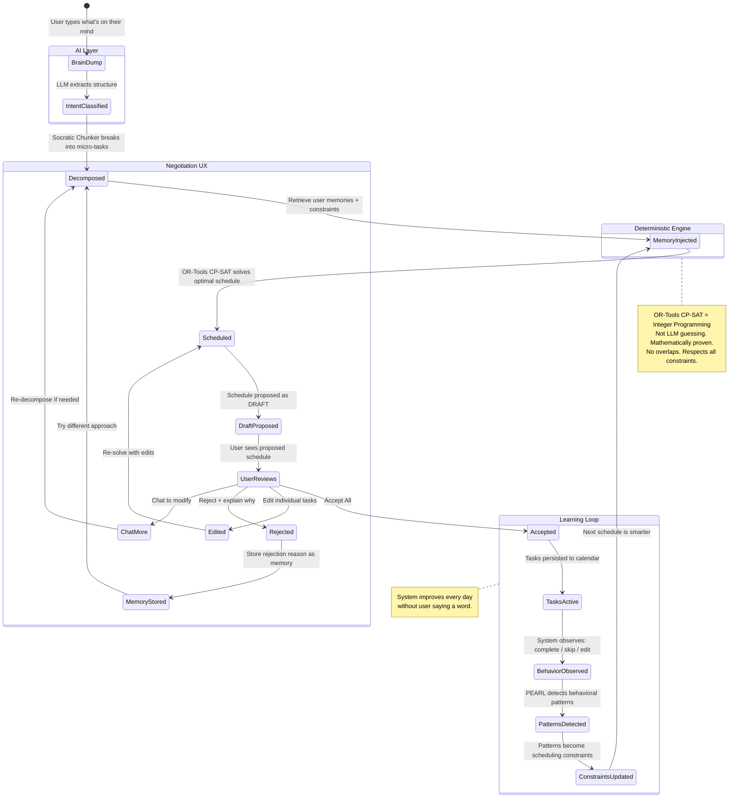
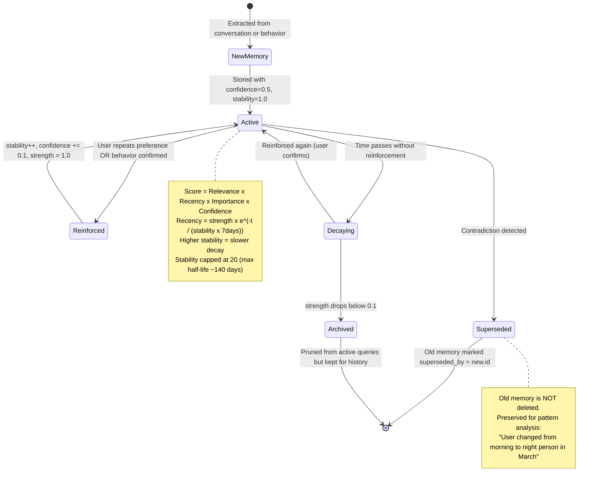
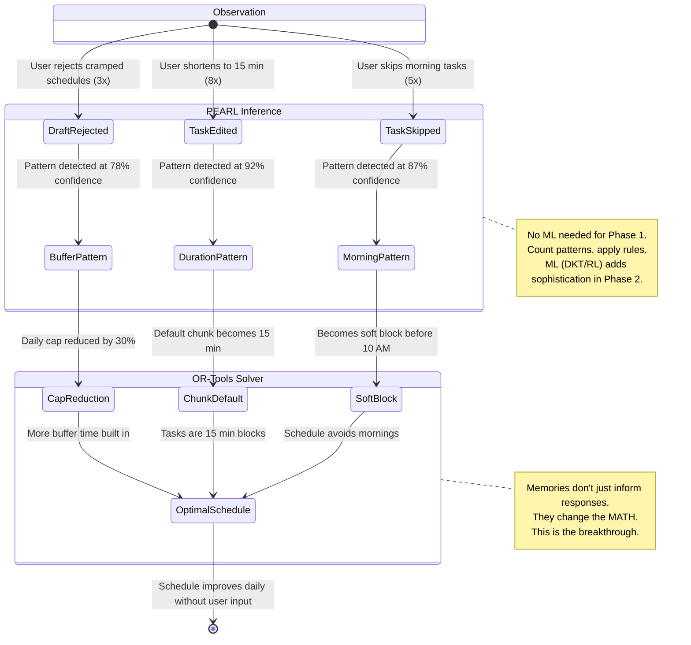
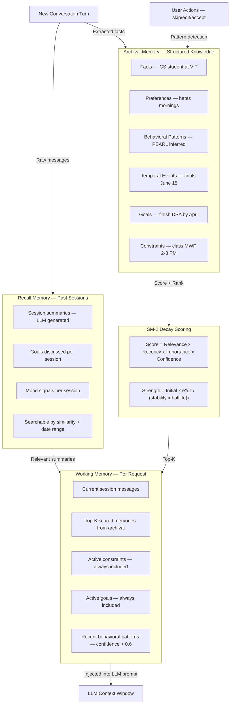
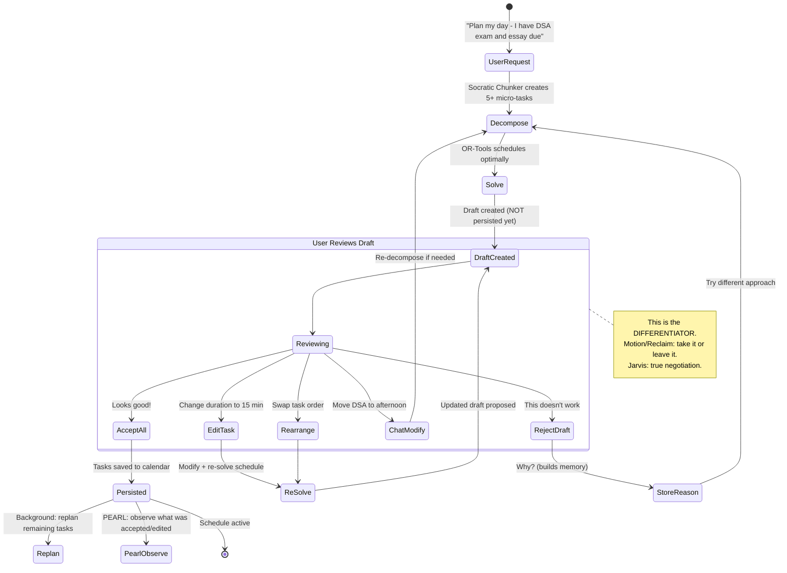
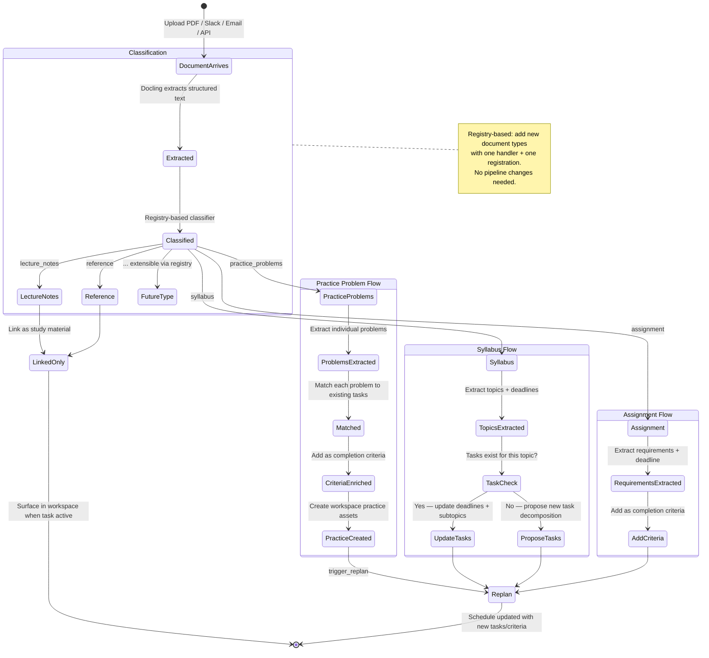
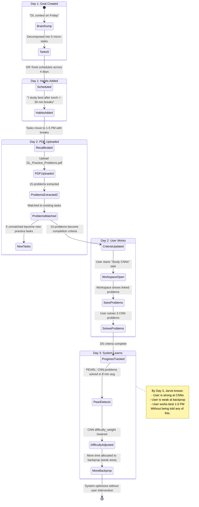
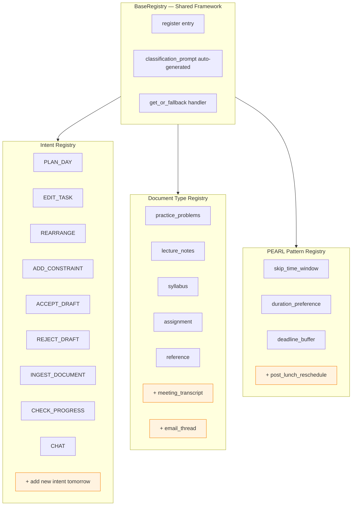
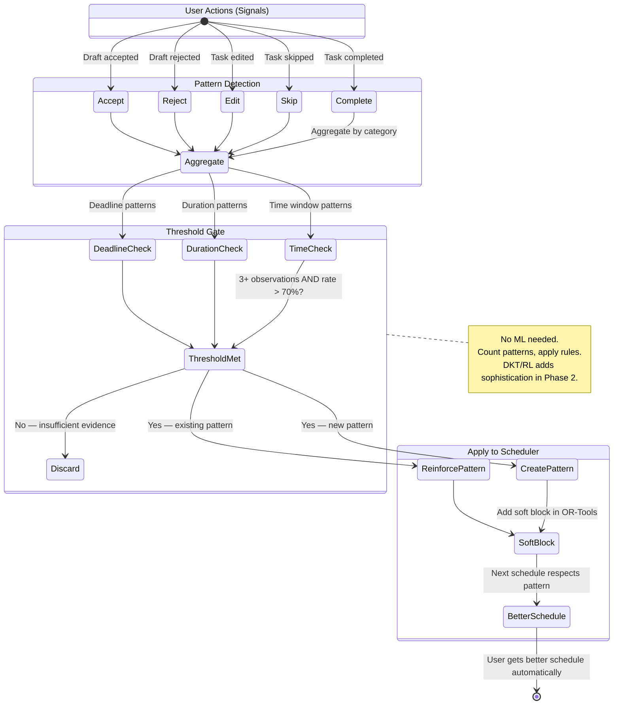
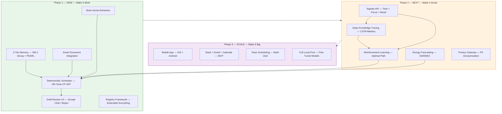

# Jarvis — Architecture Diagrams

**Last updated:** 2026-03-28
**Full spec:** [Architecture Reset Design Spec](superpowers/specs/2026-03-28-jarvis-architecture-reset-design.md)

> Open any diagram in [Mermaid Live Editor](https://mermaid.live) for full-screen zoom, pan, and SVG/PNG export.

---

## 1. The Core Loop — What Jarvis Does

**One sentence:** User brain-dumps chaos, Jarvis returns a mathematically valid schedule, user negotiates until satisfied, system learns.



---

## 2. Memory Lifecycle — How Jarvis Remembers

**One sentence:** Memories are extracted from conversations, scored by relevance, reinforced by behavior, and decay naturally if not confirmed — like human memory.



---

## 3. Memory-to-Constraint Bridge — The Moat

**One sentence:** ChatGPT's memory affects what it says. Jarvis's memory changes the mathematical constraints in the scheduler. The system rewires itself.



---

## 4. Three-Tier Memory Architecture

**One sentence:** Inspired by MemGPT's OS-like memory management — working memory for now, recall for past sessions, archival for permanent knowledge.



---

## 5. Draft Negotiation Flow — The UX Differentiator

**One sentence:** No competitor lets you negotiate your schedule. Jarvis proposes, you review/edit/counter, Jarvis re-solves. True collaboration.



---

## 6. Document Intelligence Pipeline

**One sentence:** Upload a PDF and Jarvis classifies it, extracts problems, matches them to your tasks, and enriches your completion criteria. Not just storage — understanding.



---

## 7. The Day-by-Day Scenario

**One sentence:** Shows how goal creation, habits, and document uploads integrate seamlessly over time.



---

## 8. Registry Framework — Extensible Everything

**One sentence:** Every subsystem uses the same pattern: define a handler, register it, done. The LLM classifier auto-discovers new types. No retraining, no pipeline changes.



---

## 9. PEARL Behavioral Pattern Detection

**One sentence:** The system observes user actions, detects patterns above a confidence threshold, and automatically applies them as scheduling constraints.



---

## 10. Platform Roadmap — Phase 1 / 2 / 3

**One sentence:** Phase 1 delivers a working product with behavioral learning. Phase 2 adds ML-powered intelligence. Phase 3 scales to mobile and teams.



---

## The Moat — Competitive Comparison

| Dimension | Jarvis | ChatGPT / Claude | Motion / Reclaim |
|-----------|--------|-----------------|-----------------|
| **Scheduling** | OR-Tools CP-SAT (mathematically proven, no overlaps) | LLM generates text (hallucinates times) | Basic auto-scheduler |
| **Memory** | Changes the scheduler constraints (behavioral inference) | Changes responses only | No memory |
| **Psychology** | Anti-guilt (failure = recalibrate, not shame) | None | "Overdue" notifications |
| **Documents** | Extracts problems, enriches task criteria, surfaces in workspace | Reads and summarizes | No document support |
| **Negotiation** | Draft review: accept / edit / reject / chat to modify | Take it or leave it | Take it or leave it |
| **Extensibility** | Registry framework (new capability = 1 function + register) | N/A | Closed system |
| **Privacy path** | Local-first roadmap (cloud now, on-device Phase 2) | Cloud only | Cloud only |
| **Learning** | SM-2 memory decay + PEARL behavioral patterns | Static memory | No learning |

---

## How to Use These Diagrams

### For Slide Decks
1. Copy the Mermaid code block for the diagram you want
2. Paste into [Mermaid Live Editor](https://mermaid.live)
3. Export as SVG or PNG (top-right corner)
4. Drop into Google Slides / Keynote / PowerPoint

### For Batch Export
```bash
npm install -g @mermaid-js/mermaid-cli
mmdc -i docs/PITCH_ARCHITECTURE.md -o slides/ -e png
```

### For Animated Presentation
Consider using these tools to animate the flow:
- **Excalidraw** — hand-drawn style, great for whiteboard presentations
- **D2** (d2lang.com) — animated diagram transitions
- **Reveal.js** — slide framework with Mermaid plugin for step-by-step reveals
- **Mermaid in Notion/Obsidian** — renders live, good for interactive demos

### Recommended Pitch Flow (3 slides minimum)
1. **Slide 1:** Diagram 1 (Core Loop) — "What it does"
2. **Slide 2:** Diagram 3 (Memory-to-Constraint Bridge) — "Why it's different"
3. **Slide 3:** Diagram 10 (Platform Roadmap) — "Where it goes"

### If you have 7 slides:
1. Core Loop (Diagram 1)
2. Memory Lifecycle (Diagram 2)
3. Memory-to-Constraint Bridge (Diagram 3)
4. Draft Negotiation (Diagram 5)
5. Document Intelligence (Diagram 6)
6. Day-by-Day Scenario (Diagram 7)
7. Platform Roadmap (Diagram 10)
