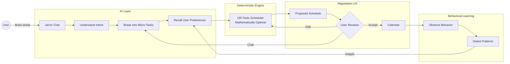
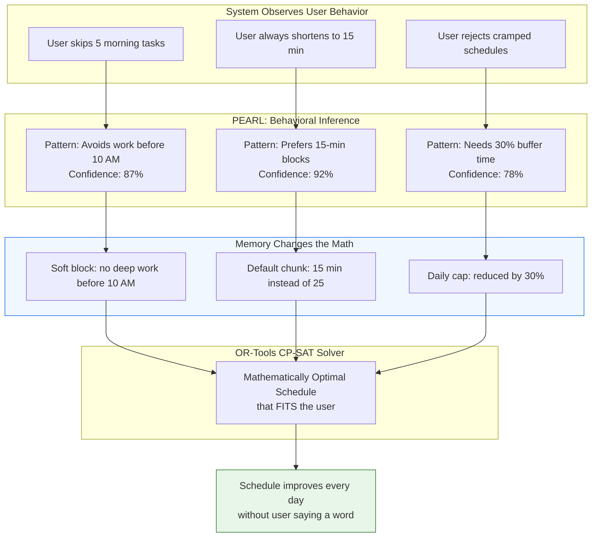
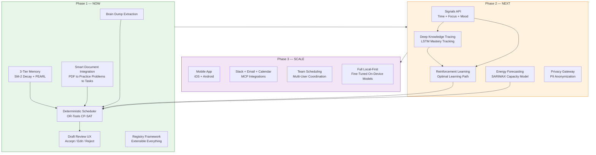

# Jarvis — Architecture for VC Pitch

**Pitch date:** Wednesday, April 1, 2026

> Open these diagrams in [Mermaid Live Editor](https://mermaid.live) for full-screen, zoomable SVG/PNG export.

---

## Slide 1: "What It Does" — The Core Loop

**Talking point:** "User brain-dumps what's on their plate. Jarvis turns it into a mathematically valid schedule using OR-Tools (not LLM guessing). The user reviews, edits, negotiates — then accepts. The system learns from every interaction."



---

## Slide 2: "Why It's Different" — The Memory-to-Constraint Bridge

**Talking point:** "ChatGPT's memory affects what it *says*. Jarvis's memory changes the *mathematical constraints* in the scheduler. When we detect you skip morning tasks, we don't just tell you — we stop scheduling deep work before 10 AM. The system literally rewires itself."



---

## Slide 3: "Where It Goes" — Platform Vision

**Talking point:** "Phase 1 is live: reliable scheduling with behavioral learning. Phase 2 adds Deep Knowledge Tracing to track what you've mastered, Reinforcement Learning to optimize your learning path, and energy forecasting. Every piece plugs into the same extensible framework — adding a new capability is one function and one registration call."



---

## The Moat (One Slide Summary)

| What | Jarvis | ChatGPT / Claude | Motion / Reclaim |
|------|--------|-----------------|-----------------|
| Scheduling | **OR-Tools CP-SAT** (mathematically proven) | LLM generates text (hallucinates) | Basic auto-scheduler |
| Memory | **Changes the scheduler** (constraints from behavior) | Changes responses only | No memory |
| Psychology | **Anti-guilt** (failure = recalibrate, not shame) | None | "Overdue" notifications |
| Documents | **Extracts problems, enriches tasks** | Reads and summarizes | No document support |
| Extensibility | **Registry framework** (add capabilities in 1 function) | N/A | Closed system |
| Privacy | **Local-first path** (cloud now, local Phase 2) | Cloud only | Cloud only |

---

## How to Present These Diagrams

1. **Copy the Mermaid code** for each diagram
2. **Paste into [Mermaid Live Editor](https://mermaid.live)**
3. **Export as SVG or PNG** (top right corner)
4. **Drop into your slide deck** (Google Slides, Keynote, etc.)

Or use **Mermaid CLI** to batch-export:
```bash
npm install -g @mermaid-js/mermaid-cli
mmdc -i PITCH_ARCHITECTURE.md -o slides/ -e png
```
