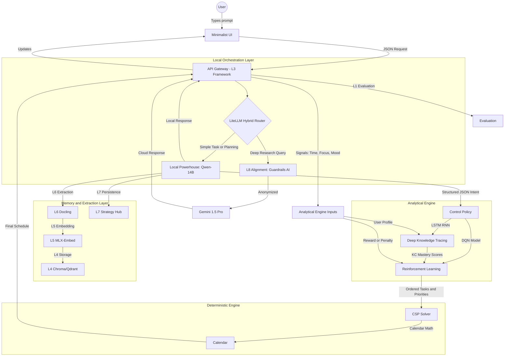

# Policy Engine Architecture

This document describes the end-to-end request flow of the Jarvis AI Productivity Backend, from user input to final schedule output.

## Request Flow Diagram

## Routing Behavior (Local-First)

The LiteLLM Hybrid Router adheres to a **Local-First** principle:

1. **Local by default**: All requests—including goal decomposition, academic topics (e.g., SARIMAX), and structured-output tasks—go to the local Qwen model first. The local model is capable of the content; prior issues were primarily formatting constraints (mitigated by markdown sanitization, max_tokens, and schema clarity).
2. **Cloud Gemini (L9 Real-Time Research)**: Reserved exclusively for queries containing "latest news", "current events", "search the web", "real-time", or "recent developments". Technical and academic prompts stay local.
3. **Last-resort fallback**: When the local model fails (e.g., returns fewer than 5 micro-tasks, or Pydantic validation fails), the engine retries once via Cloud Gemini. This is a safety net—not proactive routing. If GEMINI_API_KEY is unset or the retry still fails, a 502 is returned.

## Component Definitions

| Component | Definition |
|-----------|------------|
| **LiteLLM Router** | Local-First: processes all requests locally. Offloads only Real-Time Research (L9) and uses Cloud as last-resort fallback when local validation fails. |
| **Local LLM (Qwen-14B)** | Performs the majority of semantic logic, extracting intent and structuring tasks. |
| **L8 PII Filter** | Privacy gateway: replaces PII with consistent placeholders before sending to the cloud. |
| **Docling** | IBM Docling: handles unstructured materials and preserves the semantic structure of documents. |
| **Vector DB** | Stores processed information and supports the identification of knowledge gaps. |
| **DKT** | Deep Knowledge Tracing: tracks the probability that a user understands a specific Knowledge Component over time. |
| **RL** | Reinforcement Learning: determines the optimal path to a goal using a Deep Q-Network. |
| **CSP** | Constraint Satisfaction Problem solver: uses integer programming to fit tasks into available calendar slots. |
