# Policy Engine Architecture

This document describes the end-to-end request flow of the Jarvis AI Productivity Backend, from user input to final schedule output.

We have scaled the implementation (brain-dump extraction, multi-goal fusion, workspace, ingestion pipeline, multi-day safeguards), but the **Target Architecture** below remains the design vision. DKT, RL, CSP, Calendar, Signals, and L1 Evaluation are what we are building toward.

**Plan Sources:** Implementation plans live in `docs/superpowers/plans/` — brain_dump, control_policy, litellm_hybrid_router, global_recalibration, proactive_task_workspace, multi-day_safeguards, adaptive_pacing, and others.

> **Tip:** For zoom/pan, copy any diagram below and paste it into [Mermaid Live Editor](https://mermaid.live) — it supports interactive zoom and export to SVG/PNG.

---

## Target Architecture (Original Design Vision)

This is the architecture we are building toward. DKT, RL, L8 PII, L1 Evaluation, and Signals are planned; CSP and Calendar are implemented (OR-Tools CP-SAT produces the schedule).

<strong>Target Request Flow — Expand</strong>

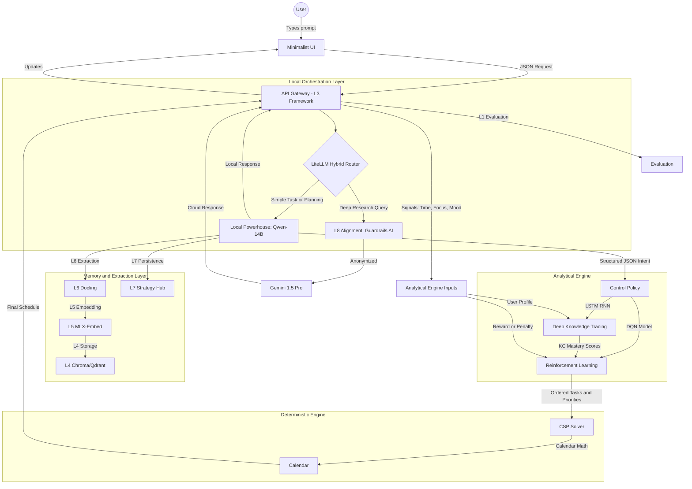
```mermaid
flowchart TD
    User((User)) -->|Types prompt| UI[Minimalist UI]
    UI -->|JSON Request| API[API Gateway - L3 Framework]

    subgraph LocalOrch [Local Orchestration Layer]
        API --> Router{LiteLLM Hybrid Router}
        Router -->|Simple Task or Planning| LocalLLM[Local Powerhouse: Qwen-14B]
        Router -->|Deep Research Query| L8PII[L8 Alignment: Guardrails AI]
    end

    subgraph MemExtract [Memory and Extraction Layer]
        LocalLLM -->|L6 Extraction| Docling[L6 Docling]
        Docling -->|L5 Embedding| Embedding[L5 MLX-Embed]
        Embedding -->|L4 Storage| VectorDB[L4 Chroma/Qdrant]
        LocalLLM -->|L7 Persistence| Memory[L7 Strategy Hub]
    end

    subgraph Analytical [Analytical Engine]
        LocalLLM -->|Structured JSON Intent| Logic[Control Policy]
        Logic -->|LSTM RNN| DKT[Deep Knowledge Tracing]
        Logic -->|DQN Model| RL[Reinforcement Learning]
        DKT -->|KC Mastery Scores| RL
    end

    subgraph Deterministic [Deterministic Engine]
        RL -->|Ordered Tasks and Priorities| CSP[CSP Solver]
        CSP -->|Calendar Math| Calendar[Calendar]
    end

    L8PII -->|Anonymized| CloudLLM[Gemini 1.5 Pro]

    CloudLLM -->|Cloud Response| API
    LocalLLM -->|Local Response| API
    Calendar -->|Final Schedule| API
    API -->|L1 Evaluation| Eval[Evaluation]
    API -->|Updates| UI

    API -->|Signals: Time, Focus, Mood| Signals[Analytical Engine Inputs]
    Signals -->|Reward or Penalty| RL
    Signals -->|User Profile| DKT
```

---

## Current Implementation — High-Level Overview

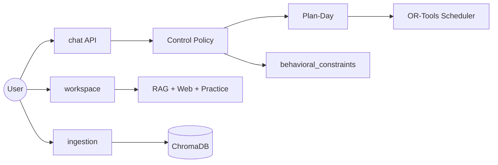
```mermaid
flowchart LR
    User((User)) --> Chat[chat API]
    User --> Ingest[ingestion]
    User --> Workspace[workspace]
    Chat --> Control[Control Policy]
    Control --> Plan[Plan-Day]
    Control --> Habits[behavioral_constraints]
    Plan --> Schedule[OR-Tools Scheduler]
    Workspace --> RAG[RAG + Web + Practice]
    Ingest --> Chroma[(ChromaDB)]
```

---

## Request Flow Diagrams (Expandable)

<strong>Entry Points & Chat Flow</strong>

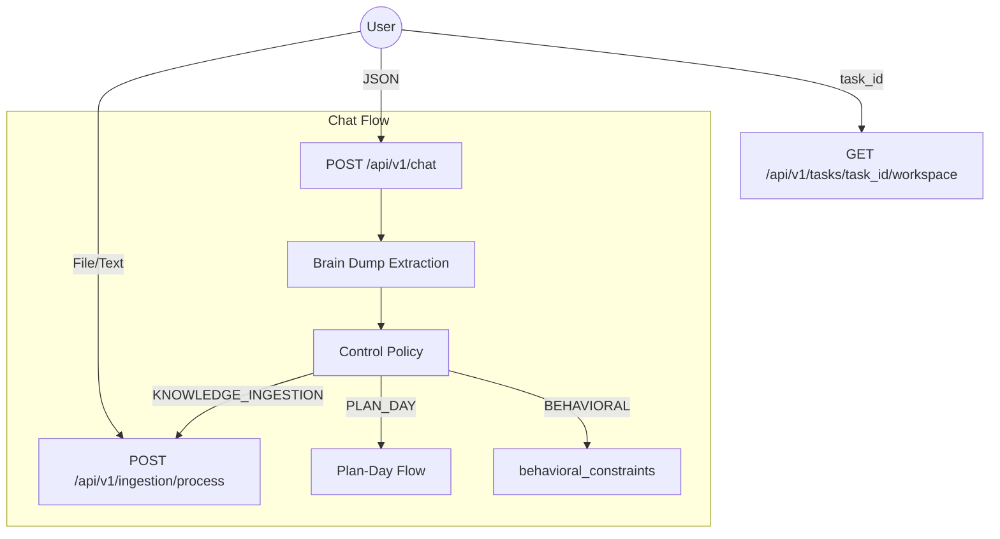
```mermaid
flowchart TD
    User((User)) -->|JSON| ChatAPI[POST /api/v1/chat]
    User -->|File/Text| IngestAPI[POST /api/v1/ingestion/process]
    User -->|task_id| WorkspaceAPI[GET /api/v1/tasks/task_id/workspace]

    subgraph ChatFlow [Chat Flow]
        ChatAPI --> BrainDump[Brain Dump Extraction]
        BrainDump --> ControlPolicy[Control Policy]
        ControlPolicy -->|PLAN_DAY| PlanDayFlow[Plan-Day Flow]
        ControlPolicy -->|KNOWLEDGE_INGESTION| IngestAPI
        ControlPolicy -->|BEHAVIORAL| HabitsStore[behavioral_constraints]
    end
```

<strong>Plan-Day Flow (Full)</strong>

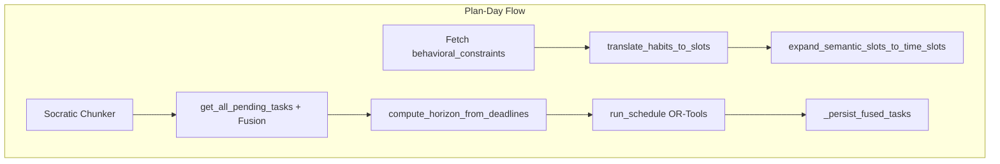
```mermaid
flowchart TD
    subgraph PlanDayFlow [Plan-Day Flow]
        HabitsFetch[Fetch behavioral_constraints]
        HabitTranslate[translate_habits_to_slots]
        HorizonExpand[expand_semantic_slots_to_time_slots]
        Decompose[Socratic Chunker]
        Fusion[get_all_pending_tasks + Fusion]
        HorizonCalc[compute_horizon_from_deadlines]
        RunSchedule[run_schedule OR-Tools]
        Persist[_persist_fused_tasks]
        HabitsFetch --> HabitTranslate --> HorizonExpand
        Decompose --> Fusion --> HorizonCalc --> RunSchedule --> Persist
    end
```

<strong>Deterministic Engine (CSP + Calendar)</strong>

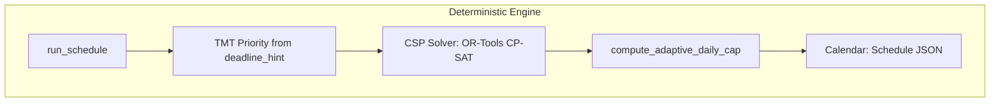
```mermaid
flowchart TD
    subgraph Deterministic [Deterministic Engine]
        RunSchedule[run_schedule] --> TMT[TMT Priority from deadline_hint]
        TMT --> CSP[CSP Solver: OR-Tools CP-SAT]
        CSP --> AdaptivePacing[compute_adaptive_daily_cap]
        AdaptivePacing --> Calendar[Calendar: Schedule JSON]
    end
```

<strong>Analytical Engine (Planned)</strong>

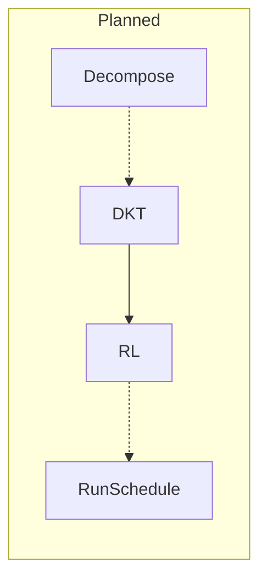
```mermaid
flowchart LR
    subgraph Analytical [Planned]
        Decompose[Decompose] -.-> DKT[DKT]
        DKT --> RL[RL]
        RL -.-> RunSchedule[RunSchedule]
    end
```

<strong>Workspace & Ingestion</strong>

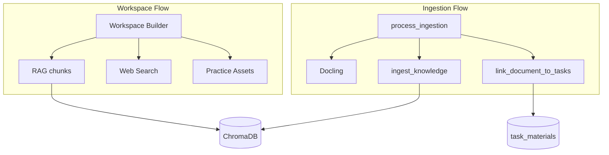
```mermaid
flowchart TD
    subgraph Workspace [Workspace Flow]
        WSB[Workspace Builder] --> RAG[RAG chunks]
        WSB --> WebSearch[Web Search]
        WSB --> PracticeGen[Practice Assets]
    end

    subgraph Ingestion [Ingestion Flow]
        Orchestrator[process_ingestion] --> Docling[Docling]
        Orchestrator --> IngestKnowledge[ingest_knowledge]
        Orchestrator --> LinkTasks[link_document_to_tasks]
    end

    RAG --> ChromaDB[(ChromaDB)]
    IngestKnowledge --> ChromaDB
    LinkTasks --> TaskMaterials[(task_materials)]
```

<strong>Full Diagram (All-in-One)</strong>

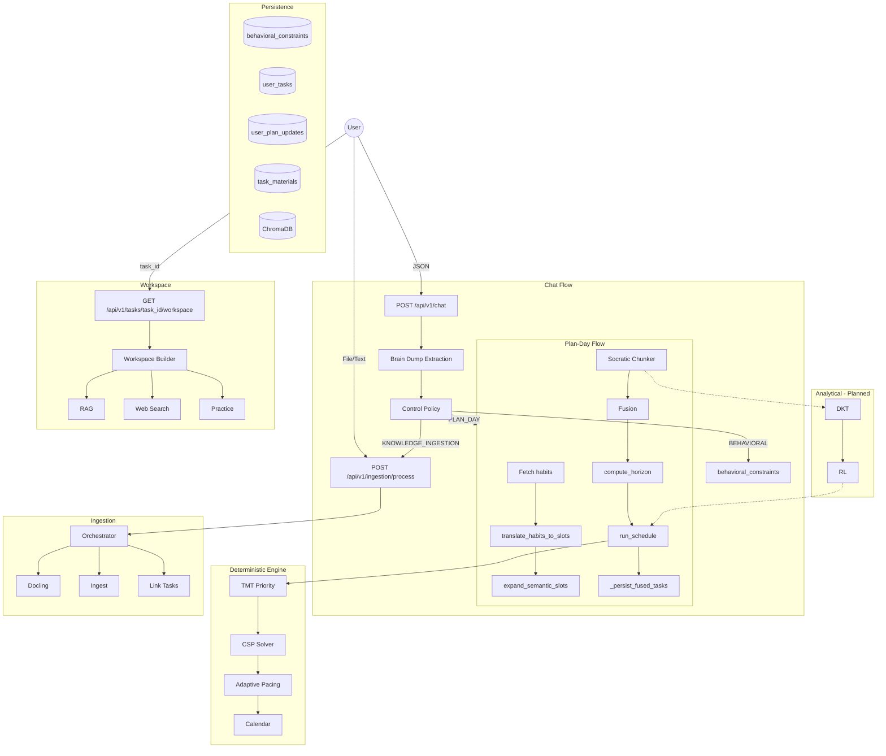
```mermaid
flowchart TD
    User((User)) -->|JSON| ChatAPI[POST /api/v1/chat]
    User -->|File/Text| IngestAPI[POST /api/v1/ingestion/process]
    User -->|task_id| WorkspaceAPI[GET /api/v1/tasks/task_id/workspace]

    subgraph ChatFlow [Chat Flow]
        ChatAPI --> BrainDump[Brain Dump Extraction]
        BrainDump --> ControlPolicy[Control Policy]
        ControlPolicy -->|PLAN_DAY| PlanDayFlow[Plan-Day Flow]
        ControlPolicy -->|KNOWLEDGE_INGESTION| IngestAPI
        ControlPolicy -->|BEHAVIORAL| HabitsStore[behavioral_constraints]
    end

    subgraph PlanDayFlow [Plan-Day Flow]
        HabitsFetch[Fetch habits]
        HabitTranslate[translate_habits_to_slots]
        HorizonExpand[expand_semantic_slots]
        Decompose[Socratic Chunker]
        Fusion[Fusion]
        HorizonCalc[compute_horizon]
        RunSchedule[run_schedule]
        Persist[_persist_fused_tasks]
        HabitsFetch --> HabitTranslate --> HorizonExpand
        Decompose --> Fusion --> HorizonCalc --> RunSchedule --> Persist
    end

    subgraph Analytical [Analytical - Planned]
        DKT[DKT]
        RL[RL]
        Decompose -.-> DKT
        DKT --> RL
        RL -.-> RunSchedule
    end

    subgraph Deterministic [Deterministic Engine]
        RunSchedule --> TMT[TMT Priority]
        TMT --> CSP[CSP Solver]
        CSP --> AdaptivePacing[Adaptive Pacing]
        AdaptivePacing --> Calendar[Calendar]
    end

    subgraph Memory [Persistence]
        behavioral_constraints[(behavioral_constraints)]
        user_tasks[(user_tasks)]
        user_plan_updates[(user_plan_updates)]
        task_materials[(task_materials)]
        ChromaDB[(ChromaDB)]
    end

    subgraph WorkspaceFlow [Workspace]
        WorkspaceAPI --> WSB[Workspace Builder]
        WSB --> RAG[RAG]
        WSB --> WebSearch[Web Search]
        WSB --> PracticeGen[Practice]
    end

    subgraph IngestionFlow [Ingestion]
        IngestAPI --> Orchestrator[Orchestrator]
        Orchestrator --> Docling[Docling]
        Orchestrator --> IngestKnowledge[Ingest]
        Orchestrator --> LinkTasks[Link Tasks]
    end
```

## Plan References (from docs/superpowers/plans/)

| Plan | Implements |
|------|------------|
| `brain_dump_multi-intent_extraction_75316b3c.plan.md` | Brain dump extraction, multi-intent, Voice of Jarvis |
| `control_policy_implementation_35f8055b.plan.md` | Unified /chat, Control Policy orchestration |
| `litellm_hybrid_router_e31db90a.plan.md` | LiteLLM routing, local vs cloud |
| `global_recalibration_multi-goal_fusion_64b9cf4d.plan.md` | Multi-goal fusion, get_all_pending_tasks |
| `proactive_task_workspace_4f102155.plan.md` | Workspace builder, RAG, web search, practice assets |
| `multi-day_safeguards_and_thinking_process_19b2ee1f.plan.md` | Late-night fix, biological fallback, thinking_process |
| `adaptive_pacing_intelligence_ee66a636.plan.md` | Adaptive pacing, compute_adaptive_daily_cap |
| `pacing_tmt_deadline_improvements_59567a95.plan.md` | TMT, deadline-based horizon |
| `phase_3_context_ingestion_309c7795.plan.md` | Docling, ingest_knowledge, task-material linking |

---

## Plan-Specific Architecture Diagrams

Diagrams below are derived from the plan files in `docs/superpowers/plans/`. **Expand each section** to view the Mermaid diagram.

| Plan File | Diagram | Description |
|-----------|---------|-------------|
| `brain_dump_multi-intent_extraction_75316b3c.plan.md` | Brain Dump | Extract → Execute → Synthesize (Phase 1 Extract, Phase 2 Execute with parallel search, Phase 3 Voice of Jarvis) |
| `control_policy_implementation_35f8055b.plan.md` | Control Policy | Single entry point, 5-way classification, Plan Day vs Ingest routing, Plan Day pipeline (FetchHabits → Translate → Decompose → Solve) |
| `global_recalibration_multi-goal_fusion_64b9cf4d.plan.md` | Global Recalibration | Request → Decompose → Retrieve Pending → Fusion (namespace, master_chunk_list, horizon, adaptive cap) → Persist |
| `proactive_task_workspace_4f102155.plan.md` | Proactive Workspace | User → Workspace endpoint → Fetch task → Builder (RAG + WebSearch + PracticeGen) → Learning style routing → Aggregate → TaskWorkspace |
| `proactive_task_workspace_4f102155.plan.md` | Dynamic Practice Asset Generator | Inputs (Chunks, TaskTitle, TopicKw, UserPrompt) → LLM classify → Paths A/B/C → Output types (Quiz, LeetCode, Codeforces, YouTube, Blog, Article, Custom) |
| `proactive_task_workspace_4f102155.plan.md` + `phase_3_context_ingestion_309c7795.plan.md` | ChromaDB-to-Task Linking | Ingestion: Doc → ingest_knowledge → ChromaDB + Topics → link_document_to_tasks → task_materials. Workspace: task_materials → Query ChromaDB → Chunks |
| `phase_3_context_ingestion_309c7795.plan.md` | Phase 3 Ingestion | Client → POST ingestion → HybridRouter → LLM → Intent. Schedule: Client → POST schedule → Scheduler → hard/soft blocks → CP-SAT → Response |
| `litellm_hybrid_router_e31db90a.plan.md` | LiteLLM Router | user_prompt → Router → CLOUD_KEYWORDS match → Gemini vs Local Qwen → Response |
| `adaptive_pacing_intelligence_ee66a636.plan.md` + `pacing_tmt_deadline_improvements_59567a95.plan.md` | Adaptive Pacing + TMT | slack_ratio, compute_adaptive_daily_cap, TMT from deadline_hint, horizon retry |
| `multi-day_safeguards_and_thinking_process_19b2ee1f.plan.md` | Multi-Day Safeguards | Late-night fix, biological fallback, horizon_start, thinking_process |

---

<strong>1. Brain Dump: Extract → Execute → Synthesize</strong> (brain_dump_multi-intent_extraction)

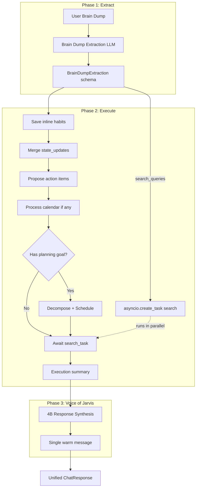
```mermaid
flowchart TB
    subgraph extraction [Phase 1: Extract]
        UserPrompt[User Brain Dump]
        ExtractLLM[Brain Dump Extraction LLM]
        BrainDumpSchema[BrainDumpExtraction schema]
        UserPrompt --> ExtractLLM
        ExtractLLM --> BrainDumpSchema
    end

    subgraph execution [Phase 2: Execute]
        BrainDumpSchema --> SaveHabits[Save inline habits]
        BrainDumpSchema -->|search_queries| SpawnSearch[asyncio.create_task search]
        SaveHabits --> MergeState[Merge state_updates]
        MergeState --> ProposeActions[Propose action items]
        ProposeActions --> ProcessCalendar[Process calendar if any]
        ProcessCalendar --> PlanDay{Has planning goal?}
        PlanDay -->|Yes| Decompose[Decompose + Schedule]
        PlanDay -->|No| AwaitSearch
        Decompose --> AwaitSearch[Await search_task]
        SpawnSearch -.->|runs in parallel| AwaitSearch
        AwaitSearch --> ExecSummary[Execution summary]
    end

    subgraph synthesis [Phase 3: Voice of Jarvis]
        ExecSummary --> VoiceLLM[4B Response Synthesis]
        VoiceLLM --> UnifiedMessage[Single warm message]
    end

    UnifiedMessage --> ChatResponse[Unified ChatResponse]
```

<strong>2. Control Policy: Single Entry, Plan vs Ingest</strong> (control_policy)

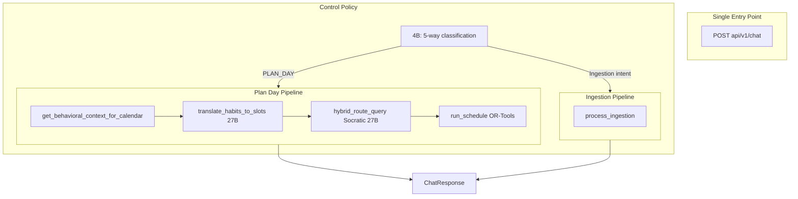
```mermaid
flowchart TD
    subgraph Entry [Single Entry Point]
        Chat[POST api/v1/chat]
    end

    subgraph ControlPolicy [Control Policy]
        Classify[4B: 5-way classification]
        Classify -->|PLAN_DAY| PlanDayFlow[Plan Day Flow]
        Classify -->|Ingestion intent| IngestFlow[Ingestion Flow]
    end

    subgraph PlanDayFlow [Plan Day Pipeline]
        FetchHabits[get_behavioral_context_for_calendar]
        Translate[translate_habits_to_slots 27B]
        Decompose[hybrid_route_query Socratic 27B]
        Solve[run_schedule OR-Tools]
        FetchHabits --> Translate
        Translate --> Decompose
        Decompose --> Solve
    end

    subgraph IngestFlow [Ingestion Pipeline]
        ProcessIngest[process_ingestion]
    end

    PlanDayFlow --> ChatResponse[ChatResponse]
    IngestFlow --> ChatResponse
```

<strong>3. Global Recalibration: Fusion Flow</strong> (global_recalibration)

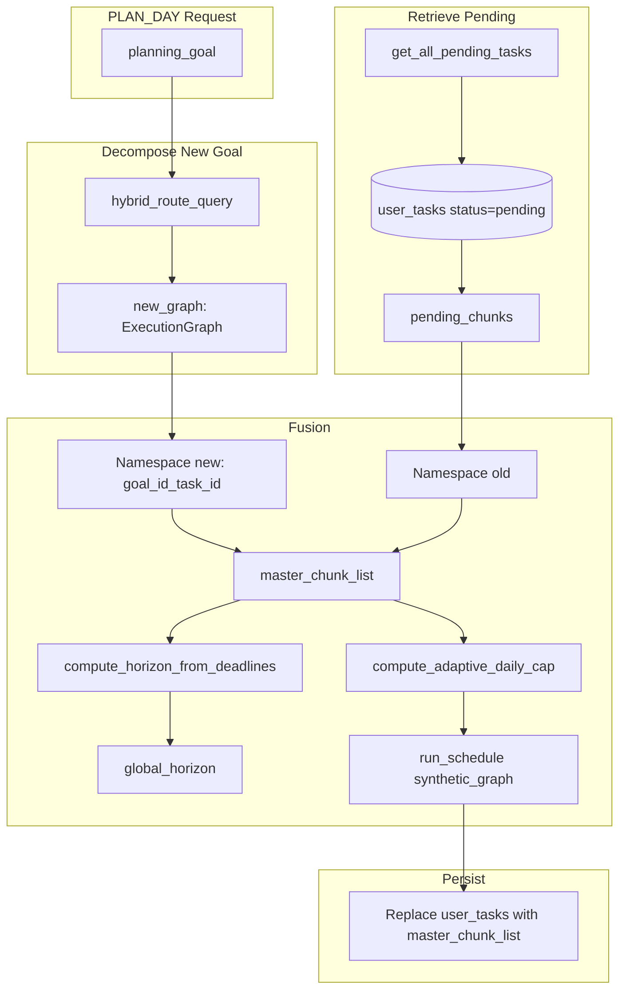
```mermaid
flowchart TD
    subgraph Request [PLAN_DAY Request]
        A[planning_goal]
    end

    subgraph Decompose [Decompose New Goal]
        A --> B[hybrid_route_query]
        B --> C[new_graph: ExecutionGraph]
    end

    subgraph Retrieve [Retrieve Pending]
        D[get_all_pending_tasks]
        D --> E[(user_tasks status=pending)]
        E --> F[pending_chunks]
    end

    subgraph Fusion [Fusion]
        C --> G[Namespace new: goal_id_task_id]
        F --> H[Namespace old]
        G --> I[master_chunk_list]
        H --> I
        I --> J[compute_horizon_from_deadlines]
        J --> K[global_horizon]
        I --> L[compute_adaptive_daily_cap]
        L --> M[run_schedule synthetic_graph]
    end

    subgraph Persist [Persist]
        M --> N[Replace user_tasks with master_chunk_list]
    end
```

<strong>4. Workspace: RAG + Web Search + Practice Gen</strong> (proactive_task_workspace)

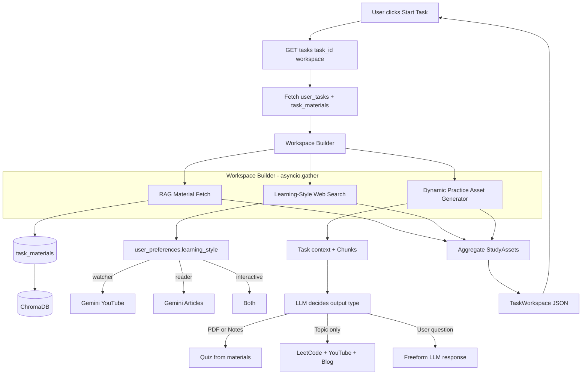
```mermaid
flowchart TD
    User[User clicks Start Task] --> WorkspaceEndpoint[GET tasks task_id workspace]
    WorkspaceEndpoint --> FetchTask[Fetch user_tasks + task_materials]
    FetchTask --> Builder[Workspace Builder]

    subgraph builder [Workspace Builder - asyncio.gather]
        RAG[RAG Material Fetch]
        WebSearch[Learning-Style Web Search]
        PracticeGen[Dynamic Practice Asset Generator]
    end

    Builder --> RAG
    Builder --> WebSearch
    Builder --> PracticeGen

    RAG --> TaskMaterials[(task_materials)]
    TaskMaterials --> ChromaDB[(ChromaDB)]

    WebSearch --> LearningStyle[user_preferences.learning_style]
    LearningStyle -->|watcher| GeminiYouTube[Gemini YouTube]
    LearningStyle -->|reader| GeminiArticles[Gemini Articles]
    LearningStyle -->|interactive| GeminiBoth[Both]

    PracticeGen --> Context[Task context + Chunks]
    Context --> LLMRouter[LLM decides output type]
    LLMRouter -->|PDF or Notes| Quiz[Quiz from materials]
    LLMRouter -->|Topic only| Links[LeetCode + YouTube + Blog]
    LLMRouter -->|User question| Freeform[Freeform LLM response]

    RAG --> Aggregate[Aggregate StudyAssets]
    WebSearch --> Aggregate
    PracticeGen --> Aggregate
    Aggregate --> TaskWorkspace[TaskWorkspace JSON]
    TaskWorkspace --> User
```

<strong>5. Workspace: Dynamic Practice Asset Generator</strong>

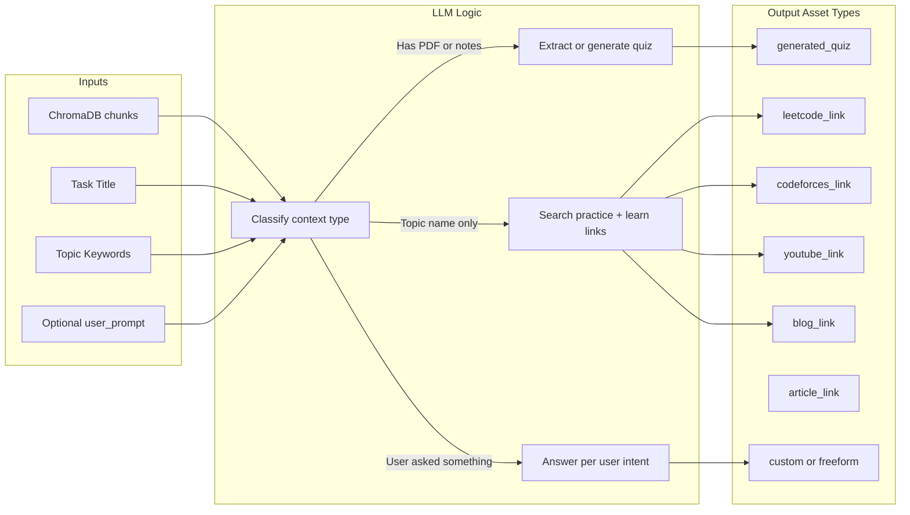
```mermaid
flowchart LR
    subgraph inputs [Inputs]
        Chunks[ChromaDB chunks]
        TaskTitle[Task Title]
        TopicKw[Topic Keywords]
        UserPrompt[Optional user_prompt]
    end

    subgraph logic [LLM Logic]
        Classify[Classify context type]
        Classify -->|Has PDF or notes| PathA[Extract or generate quiz]
        Classify -->|Topic name only| PathB[Search practice + learn links]
        Classify -->|User asked something| PathC[Answer per user intent]
    end

    subgraph outputs [Output Asset Types]
        Quiz[generated_quiz]
        LeetCode[leetcode_link]
        Codeforces[codeforces_link]
        YouTube[youtube_link]
        Blog[blog_link]
        Article[article_link]
        Custom[custom or freeform]
    end

    Chunks --> Classify
    TaskTitle --> Classify
    TopicKw --> Classify
    UserPrompt --> Classify

    PathA --> Quiz
    PathB --> LeetCode
    PathB --> Codeforces
    PathB --> YouTube
    PathB --> Blog
    PathC --> Custom
```

<strong>6. Ingestion: ChromaDB-to-Task Linking</strong> (proactive + phase_3)

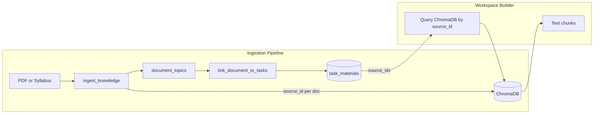
```mermaid
flowchart LR
    subgraph ingest [Ingestion Pipeline]
        Doc[PDF or Syllabus] --> Ingest[ingest_knowledge]
        Ingest -->|source_id per doc| Chroma[(ChromaDB)]
        Ingest --> Topics[document_topics]
        Topics --> Linker[link_document_to_tasks]
        Linker --> TaskMaterials[(task_materials)]
    end

    subgraph workspace [Workspace Builder]
        TaskMaterials -->|source_ids| RAGQuery[Query ChromaDB by source_id]
        RAGQuery --> Chroma
        Chroma --> Chunks[Text chunks]
    end
```

<strong>7. Phase 3: Ingestion + Dynamic Scheduling</strong>

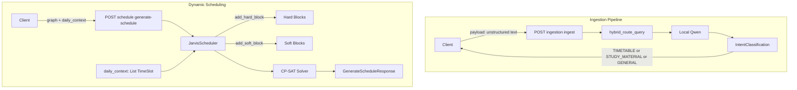
```mermaid
flowchart TB
    subgraph ingestion [Ingestion Pipeline]
        Client[Client] -->|payload: unstructured text| IngestPOST[POST ingestion ingest]
        IngestPOST --> HybridRouter[hybrid_route_query]
        HybridRouter --> LLM[Local Qwen]
        LLM --> Intent[IntentClassification]
        Intent -->|TIMETABLE or STUDY_MATERIAL or GENERAL| Client
    end

    subgraph scheduling [Dynamic Scheduling]
        ScheduleClient[Client] -->|graph + daily_context| SchedulePOST[POST schedule generate-schedule]
        SchedulePOST --> Scheduler[JarvisScheduler]
        dailyContext[daily_context: List TimeSlot] --> Scheduler
        Scheduler -->|add_hard_block| HardBlocks[Hard Blocks]
        Scheduler -->|add_soft_block| SoftBlocks[Soft Blocks]
        Scheduler --> CSP[CP-SAT Solver]
        CSP --> Response[GenerateScheduleResponse]
    end
```

<strong>8. LiteLLM: Local vs Cloud Routing</strong> (litellm_hybrid_router)

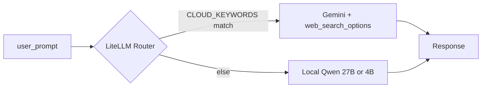
```mermaid
flowchart LR
    Request[user_prompt] --> Router{LiteLLM Router}
    Router -->|CLOUD_KEYWORDS match| Cloud[Gemini + web_search_options]
    Router -->|else| Local[Local Qwen 27B or 4B]
    Cloud --> Response[Response]
    Local --> Response
```

<strong>9. Adaptive Pacing + TMT</strong> (adaptive_pacing, pacing_tmt)

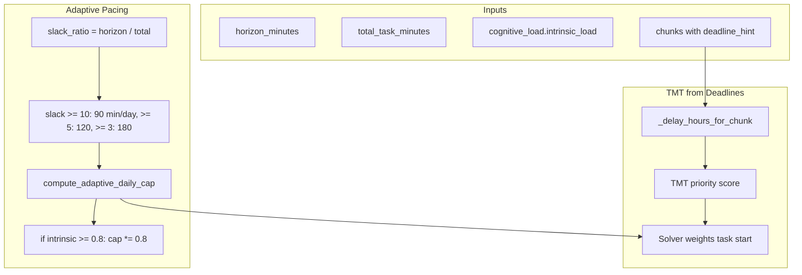
```mermaid
flowchart TD
    subgraph inputs [Inputs]
        Horizon[horizon_minutes]
        Total[total_task_minutes]
        Intrinsic[cognitive_load.intrinsic_load]
        Chunks[chunks with deadline_hint]
    end

    subgraph pacing [Adaptive Pacing]
        Slack[slack_ratio = horizon / total]
        Slack --> Tiers[slack >= 10: 90 min/day, >= 5: 120, >= 3: 180]
        Tiers --> Cap[compute_adaptive_daily_cap]
        Cap --> Cognitive[if intrinsic >= 0.8: cap *= 0.8]
    end

    subgraph tmt [TMT from Deadlines]
        Chunks --> Delay[_delay_hours_for_chunk]
        Delay --> Priority[TMT priority score]
        Priority --> Solver[Solver weights task start]
    end

    Cap --> Solver
```

<strong>10. Multi-Day Safeguards</strong> (multi-day_safeguards)

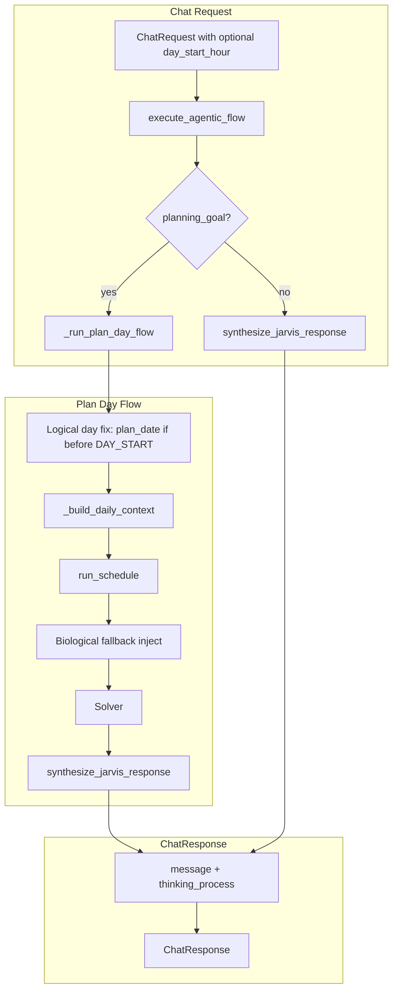
```mermaid
flowchart TD
    subgraph ChatFlow [Chat Request]
        A[ChatRequest with optional day_start_hour] --> B[execute_agentic_flow]
        B --> C{planning_goal?}
        C -->|yes| D[_run_plan_day_flow]
        C -->|no| E[synthesize_jarvis_response]
    end

    subgraph PlanDayFlow [Plan Day Flow]
        D --> F[Logical day fix: plan_date if before DAY_START]
        F --> G[_build_daily_context]
        G --> H[run_schedule]
        H --> I[Biological fallback inject]
        I --> J[Solver]
        J --> K[synthesize_jarvis_response]
    end

    subgraph Response [ChatResponse]
        K --> L[message + thinking_process]
        E --> L
        L --> M[ChatResponse]
    end
```

## Implemented APIs

| Endpoint | Description |
|----------|-------------|
| `POST /api/v1/chat` | Unified entry; brain-dump extraction, plan-day, ingestion, habits |
| `GET /api/v1/tasks/{task_id}/workspace` | Proactive workspace (RAG + web search + practice) |
| `POST /api/v1/tasks/{task_id}/complete` | Mark task completed with quality rating; triggers background replan |
| `POST /api/v1/tasks/{task_id}/skip` | Skip a task; triggers background replan |
| `PATCH /api/v1/tasks/{task_id}` | Update task fields (title, duration, difficulty, deadline, status) |
| `DELETE /api/v1/tasks/{task_id}` | Delete a task; triggers background replan |
| `GET /api/v1/tasks/` | List tasks for a user (optionally filtered by status) |
| `POST /api/v1/ingestion/process` | Document ingestion, task-material linking |
| `POST /api/v1/schedule/generate-schedule` | Direct OR-Tools schedule from ExecutionGraph |
| `GET/POST /api/v1/habits/*` | Habits CRUD |
| `POST /api/v1/reasoning/decompose-goal` | Socratic Chunker |

## Task Lifecycle

Tasks follow a state machine through their lifecycle:

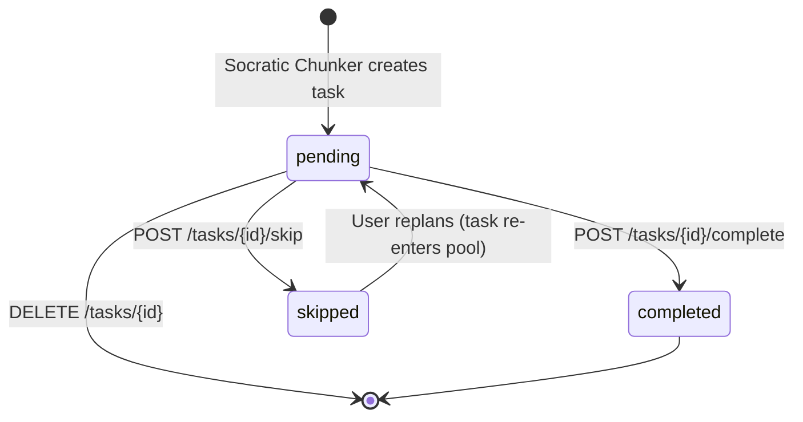
```mermaid
stateDiagram-v2
    [*] --> pending: Socratic Chunker creates task
    pending --> completed: POST /tasks/{id}/complete
    pending --> skipped: POST /tasks/{id}/skip
    pending --> [*]: DELETE /tasks/{id}
    completed --> [*]
    skipped --> pending: User replans (task re-enters pool)
```

- **pending**: Created by decomposition, awaiting scheduling or completion
- **completed**: User finished the task (quality 0-5 recorded for future DKT)
- **skipped**: User chose not to do it (may re-enter on replan)
- **deleted**: Permanently removed

On `complete`, `skip`, or `delete`, `trigger_replan()` fires in the background to re-solve the remaining schedule without blocking the HTTP response.

## Replan Triggers

Schedule recalculation can be triggered by multiple sources:

| # | Trigger | Type | Status |
|---|---------|------|--------|
| 1 | User says "replan" / "reschedule" | User-initiated | Implemented |
| 2 | New goal submission | User-initiated | Implemented |
| 3 | Task completed | User-initiated | Implemented (triggers background replan) |
| 4 | Task skipped | User-initiated | Implemented (triggers background replan) |
| 5 | Task deleted | User-initiated | Implemented (triggers background replan) |
| 6 | Constraint change ("meeting at 2 PM") | User-initiated | Partial (saved, returns suggested_action) |
| 7 | Deadline change | User-initiated | Partial (persisted, no auto-replan) |
| 8 | Document ingestion affects tasks | Signal-driven | Partial (links but no auto-replan) |
| 9 | Morning auto-plan | System-initiated | Planned (P2) |
| 10 | End-of-day rollover | System-initiated | Planned (P2) |
| 11 | SM-2 due injection | System-initiated | Planned (P2) |
| 12 | External message (Slack/email MCP) | Signal-driven | Planned (P2) |
| 13 | Burnout / completion rate deviation | Signal-driven | Planned (needs telemetry) |
| 14 | DKT mastery decay | Signal-driven | Planned (needs DKT) |

### Background Replan Flow

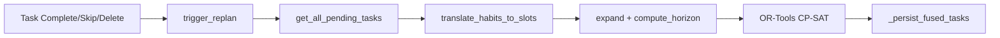
```mermaid
flowchart LR
    Trigger[Task Complete/Skip/Delete] --> TriggerReplan[trigger_replan]
    TriggerReplan --> FetchPending[get_all_pending_tasks]
    FetchPending --> TranslateHabits[translate_habits_to_slots]
    TranslateHabits --> ExpandHorizon[expand + compute_horizon]
    ExpandHorizon --> Solve[OR-Tools CP-SAT]
    Solve --> Persist[_persist_fused_tasks]
```

## Component Definitions

| Component | Definition |
|-----------|------------|
| **Control Policy** | Master orchestrator for /chat: brain-dump extraction, multi-intent execution, plan-day flow, ingestion routing. |
| **LiteLLM Router** | Local-first: Qwen 27B (decompose), Qwen 4B (router/SLM), Gemini (L9 search). Offloads Real-Time Research and last-resort fallback. |
| **L8 PII Filter** *(Planned)* | Privacy gateway: replaces PII with consistent placeholders before sending to the cloud. |
| **Habit Translator** | Converts natural-language constraints (behavioral_constraints) to SemanticTimeSlots. |
| **Horizon Expander** | Replicates semantic slots across multi-day horizon into concrete TimeSlots. |
| **Socratic Chunker** | Decomposes goals into TaskChunks (25-min ceiling) via LLM. |
| **CSP Solver** | Constraint Satisfaction Problem solver: uses integer programming (OR-Tools CP-SAT) to fit tasks into available calendar slots. Implements TMT priorities from deadline_hint, AddNoOverlap, dependencies. |
| **Calendar** | Final schedule output (JSON with time blocks). Produced by CSP after calendar math. |
| **OR-Tools CP-SAT** | Current implementation of the CSP solver. |
| **Adaptive Pacing** | compute_adaptive_daily_cap: slack-ratio-driven daily cap; prevents cramming. |
| **ChromaDB / Vector DB** | Vector store for ingested knowledge (L4 Storage); task_materials links to user_tasks. |
| **Docling** | IBM Docling: handles unstructured materials and preserves semantic structure. (L6 Extraction) |
| **Workspace Builder** | Fetches RAG chunks, learning-style web search, dynamic practice assets for task focus mode. |
| **DKT** *(Planned)* | Deep Knowledge Tracing: tracks the probability that a user understands specific Knowledge Components over time via LSTM RNN. Feeds mastery scores into RL. |
| **RL** *(Planned)* | Reinforcement Learning: determines the optimal path to a goal using a Deep Q-Network. Consumes DKT mastery; produces ordered tasks and priorities for the CSP solver. |
| **L1 Evaluation** *(Planned)* | User feedback, reward signals. Feeds Signals back into Analytical Engine. |
| **Signals** *(Planned)* | Time, Focus, Mood inputs from API. Reward/penalty → RL; User Profile → DKT. |

## Data Model

| Store | Purpose |
|-------|---------|
| `behavioral_constraints` | Habits, preferences (raw_text, constraint_type) |
| `user_tasks` | Task decomposition (task_id, goal_id, title, status, duration_minutes, dependencies, deadline_hint, actual_duration_minutes) |
| `user_plan_updates` | Goal-level deadlines (goal_id, deadline_date) |
| `user_preferences` | learning_style for workspace |
| `task_materials` | Links documents to tasks (source_id → ChromaDB) |
| `pending_calendar_updates` | Extracted timetables awaiting approval |
| `task_completion_signals` | Quality ratings + actual duration on completion (DKT/RL input pipeline) |

## Multi-Day Safeguards (Implemented)

- **Late-night logical day**: If `plan_start.hour < DAY_START_HOUR`, the logical day is yesterday.
- **Biological fallback**: When no sleep habit exists, inject Midnight–8 AM block so the solver does not schedule tasks at 3 AM.
- **Horizon retry**: On INFEASIBLE, retry with extended horizon (48h → 72h → 5d) to spread across days.
- **horizon_start**: Mandatory in schedule response for React UI; `wall_time = horizon_start + timedelta(minutes=start_min)`.
- **thinking_process**: Extracted <think> blocks from Voice of Jarvis for reasoning UI.

## Global Recalibration (Multi-Goal Fusion)

Multi-goal fusion is implemented:

- `get_all_pending_tasks` fetches pending chunks from user_tasks
- Fusion merges new decomposition with pending; namespaces by goal_id; excludes current goal's old tasks
- `compute_horizon_from_deadlines` runs on fused chunks
- Single schedule across all goals; TMT prioritizes by deadline
- `_persist_fused_tasks` replaces all pending rows with the fused master chunk list

## Layered Architecture (Design Reference)

The system is designed around a layered model. Implemented layers are in use; planned layers are documented for future implementation. This aligns with the **Target Architecture** above.

| Layer | Name | Status | Purpose |
|-------|------|--------|---------|
| L1 | Evaluation | Planned | User feedback, reward signals → Signals → RL/DKT |
| L3 | API Gateway | Implemented | Request routing, /chat, /ingestion, /workspace |
| L4 | Storage | Implemented | ChromaDB (knowledge), Supabase (constraints, tasks) |
| L5 | Embedding | Implemented | ChromaDB embeddings for RAG |
| L6 | Extraction | Implemented | Docling, brain-dump extraction |
| L7 | Persistence | Implemented | behavioral_constraints, user_tasks, user_plan_updates (Strategy Hub) |
| L8 | PII Filter | Planned | Privacy gateway before cloud sends |
| L9 | Real-Time Research | Implemented | Gemini + web_search_options |
| Analytical | DKT | Planned | Knowledge Component mastery tracking (LSTM RNN) |
| Analytical | RL | Planned | Optimal pathfinding via DQN |
| Deterministic | CSP | Implemented | OR-Tools CP-SAT; integer programming for calendar slots |
| Deterministic | Calendar | Implemented | Schedule JSON output |

## Routing Behavior (Local-First)

The LiteLLM Hybrid Router adheres to a **Local-First** principle:

1. **Local by default**: All requests—including goal decomposition, academic topics (e.g., SARIMAX), and structured-output tasks—go to the local Qwen model first (Qwen 27B for heavy lifting). The SLM (Qwen 4B) handles fast intent classification.
2. **Cloud Gemini (L9 Real-Time Research)**: Reserved for queries containing "latest news", "current events", "search the web", "real-time", or "recent developments". Uses Gemini with web_search_options.
3. **Last-resort fallback**: When the local model fails (e.g., returns fewer than 5 micro-tasks, or Pydantic validation fails), the engine retries once via Cloud Gemini. If GEMINI_API_KEY is unset or the retry still fails, a 502 is returned.

---

## Full System Vision — Combined Overview

This section combines the **Target Architecture**, **Plan-Specific Diagrams**, and **Current Implementation** into one end-to-end view. Use this to understand how to proceed with implementation.

<strong>Combined Diagram A: Entry Points and Routing</strong>

```mermaid
flowchart TD
    User((User)) -->|prompt| ChatAPI[POST chat]
    User -->|file/text| IngestAPI[POST ingestion process]
    User -->|task_id| WorkspaceAPI[GET tasks workspace]

    ChatAPI --> BrainDump[Brain Dump Extraction 4B]
    BrainDump --> BrainDumpSchema[BrainDumpExtraction]
    BrainDumpSchema --> ControlPolicy[Control Policy]
    ControlPolicy -->|PLAN_DAY| PlanDayFlow
    ControlPolicy -->|INGESTION| IngestAPI
    ControlPolicy -->|BEHAVIORAL| HabitsStore[(behavioral_constraints)]

    subgraph PlanDayFlow [Plan Day Flow]
        direction TB
        FetchHabits[Fetch habits]
        HabitTranslate[Translate 27B]
        HorizonExpand[Expand slots]
        Decompose[Decompose 27B]
        Fusion[get_all_pending_tasks + Fusion]
        HorizonCalc[compute_horizon]
        RunSchedule[run_schedule]
        Persist[_persist_fused_tasks]
        FetchHabits --> HabitTranslate --> HorizonExpand
        Decompose --> Fusion --> HorizonCalc --> RunSchedule --> Persist
    end

    IngestAPI --> Orchestrator[process_ingestion]
    Orchestrator --> Docling[Docling]
    Orchestrator --> IngestKnowledge[ingest_knowledge]
    Orchestrator --> LinkTasks[link_document_to_tasks]
    IngestKnowledge --> Chroma[(ChromaDB)]
    LinkTasks --> TaskMaterials[(task_materials)]

    WorkspaceAPI --> WSB[Workspace Builder]
    WSB --> RAG[RAG Fetch]
    WSB --> WebSearch[Web Search]
    WSB --> PracticeGen[Practice Assets]
    RAG --> Chroma
```

<strong>Combined Diagram B: Plan Day to Schedule</strong>

```mermaid
flowchart TD
    subgraph PlanDay [Plan Day Pipeline Detail]
        Decompose[Decompose: new_graph]
        GetPending[get_all_pending_tasks]
        Namespace[Namespace goal_id_task_id]
        Merge[master_chunk_list]
        Horizon[compute_horizon_from_deadlines]
        Pacing[compute_adaptive_daily_cap]
        Synthetic[synthetic_graph]
        Decompose --> Namespace
        GetPending --> Merge
        Namespace --> Merge
        Merge --> Horizon
        Merge --> Pacing
        Merge --> Synthetic
    end

    subgraph Solver [Deterministic Engine]
        RunSched[run_schedule]
        BioFallback[Biological fallback inject]
        TMT[TMT from deadline_hint]
        CSP[OR-Tools CP-SAT]
        Calendar[Schedule JSON]
        RunSched --> BioFallback
        BioFallback --> TMT
        TMT --> CSP
        CSP --> Calendar
    end

    Horizon --> RunSched
    Pacing --> RunSched
    Synthetic --> RunSched

    Calendar --> Voice[Voice of Jarvis]
    Voice --> Response[ChatResponse: message + thinking_process]
```

<strong>Combined Diagram C: Target + Current + Planned</strong>

```mermaid
flowchart TB
    subgraph Entry [Entry Layer]
        UI[Minimalist UI]
        API[API Gateway L3]
        UI --> API
    end

    subgraph Router [LiteLLM Router]
        API --> RouterNode{Router}
        RouterNode -->|Local| LocalLLM[Qwen 27B or 4B]
        RouterNode -->|Cloud L9| Gemini[Gemini]
    end

    subgraph BrainDump [Brain Dump - Implemented]
        LocalLLM --> Extract[Extract]
        Extract --> Execute[Execute]
        Execute --> Synthesize[Voice of Jarvis]
    end

    subgraph Control [Control Policy - Implemented]
        Execute --> Route{Route}
        Route -->|PLAN_DAY| Plan[Plan Day]
        Route -->|INGESTION| Ingest[Ingestion]
    end

    subgraph Analytical [Analytical - Planned]
        Decompose[Decompose] -.-> DKT[DKT]
        DKT --> RL[RL]
        RL -.-> Schedule[Scheduler]
    end

    subgraph Deterministic [Deterministic - Implemented]
        Plan --> Fusion[Fusion]
        Fusion --> Schedule
        Schedule --> CSP[CSP Solver]
        CSP --> Calendar[Calendar]
    end

    subgraph Storage [Storage]
        Chroma[(ChromaDB)]
        Supabase[(Supabase)]
    end

    subgraph Eval [Evaluation - Planned]
        API --> EvalNode[L1 Evaluation]
        EvalNode -.-> Signals[Signals]
        Signals -.-> RL
        Signals -.-> DKT
    end

    Calendar --> API
    Synthesize --> API
```

<strong>Combined Diagram D: End-to-End Flow Summary</strong>

```mermaid
flowchart LR
    subgraph Input [User Input]
        Prompt[Brain dump prompt]
        File[File or text]
        Task[task_id]
    end

    subgraph Extract [Extract]
        Prompt --> BD[Brain Dump 4B]
        BD --> Schema[planning_goal habits action_items search]
    end

    subgraph Execute [Execute]
        Schema --> H[Save habits]
        Schema --> A[Action items]
        Schema --> C[Calendar]
        Schema --> S[Search parallel]
        Schema --> P{planning_goal?}
        H --> P
        P -->|yes| Plan[Plan Day]
        P -->|no| Voice
    end

    subgraph PlanDay [Plan Day]
        Plan --> F[Fetch + Translate + Expand]
        F --> D[Decompose]
        D --> Fus[Fusion]
        Fus --> Sch[Schedule]
        Sch --> Pers[Persist]
    end

    subgraph Output [Output]
        PlanDay --> Voice[Voice of Jarvis]
        S --> Voice
        Voice --> Resp[ChatResponse]
    end

    Input --> Extract
    Execute --> Output
```

<strong>Combined version from Gemini (corrected — Implemented vs Planned)</strong>

```mermaid
flowchart TB
    %% STYLES: Implemented = solid green; Planned = dashed purple
    classDef implemented fill:#e8f5e9,stroke:#4caf50,stroke-width:2px;
    classDef planned fill:#f3e5f5,stroke:#9c27b0,stroke-width:2px,stroke-dasharray: 5 5;
    classDef db fill:#fff3e0,stroke:#ff9800,stroke-width:2px;

    User((User)) -->|Prompt / File / Action| UI[Minimalist UI]:::implemented
    UI -->|JSON API| API[API Gateway - L3 Framework]:::implemented

    subgraph L9_Routing [Local Orchestration & Privacy Gateway]
        API --> Router{LiteLLM Hybrid Router}:::implemented
        Router -->|Local-First / Standard| LocalLLM[Local Powerhouse: Qwen 4B/27B]:::implemented
        Router -->|Deep Research / Grounding| L8[L8: PII Filter / Guardrails]:::planned
        L8 -.->|Anonymized| CloudLLM[Cloud: Gemini 1.5 Pro]
    end

    subgraph L_Control [The Brain: Extraction & Control]
        LocalLLM --> BrainDump[Brain Dump Extractor 4B]:::implemented
        BrainDump -->|Extract All| IntentSchema[Goals, Habits, Actions, State, Search]:::implemented
        IntentSchema --> CP[Control Policy Orchestrator]:::implemented
    end

    subgraph CP_Routes [Control Policy Intent Routes]
        CP -->|PLAN_DAY| FetchHabits
        CP -->|KNOWLEDGE_INGESTION| Orchestrator
        CP -->|CALENDAR_SYNC| Orchestrator
        CP -->|ACTION_ITEM| Orchestrator
        CP -->|BEHAVIORAL| Habits
    end

    subgraph L_Ingestion [L6: Extraction & Knowledge]
        Orchestrator[process_ingestion]:::implemented --> Docling[IBM Docling w/ Provenance]:::implemented
        Docling --> IngestKnowledge[ingest_knowledge]:::implemented
        IngestKnowledge --> Chroma[(L4 Vector DB: Chroma)]:::db
        Orchestrator --> Linker[link_document_to_tasks]:::implemented
        Linker --> TaskMats[(task_materials)]:::db
    end

    subgraph L_Analytical [Analytical Engine: The Planners]
        FetchHabits[Fetch habits]:::implemented --> Translate[translate_habits_to_slots 27B]:::implemented
        Translate --> HorizonExpand[expand_semantic_slots_to_time_slots]:::implemented
        FetchHabits --> Decompose[Socratic Chunker 27B]:::implemented
        Decompose --> Fusion[Global Recalibration: Multi-Goal Fusion]:::implemented

        %% Target Architecture: DKT → RL → CSP (Planned)
        Decompose -.->|Task Graph| DKT[Deep Knowledge Tracing / LSTM]:::planned
        DKT -.->|Mastery Scores| RL[Reinforcement Learning / DQN]:::planned
        RL -.->|Ordered Tasks & Priorities| RunSched

        Fusion --> Horizon[compute_horizon_from_deadlines]:::implemented
        Fusion --> Pacing[compute_adaptive_daily_cap]:::implemented
    end

    subgraph L_Deterministic [Deterministic Engine: The Solver]
        Horizon --> RunSched[run_schedule]:::implemented
        Pacing --> RunSched
        Fusion --> RunSched
        HorizonExpand --> RunSched
        RunSched --> BioFallback[Biological fallback inject]:::implemented
        BioFallback --> TMT[TMT Deadline Priority]:::implemented
        TMT --> CSP[OR-Tools CP-SAT Solver]:::implemented
        CSP -->|Load Balancing| Calendar[Schedule & Calendar Math]:::implemented
    end

    subgraph L_Workspace [Proactive Task Workspace]
        API -->|Start Task| WSB[Workspace Builder]:::implemented
        WSB --> RAG[RAG Fetch from Chroma]:::implemented
        WSB --> Web[Curated Web Search: Watcher/Reader]:::implemented
        WSB --> Gen[Dynamic Practice / DPP Generator]:::implemented
    end

    subgraph L_Persistence [L7: Strategy Hub & Persistence]
        Fusion <-->|Fetch/Replace| UserTasks[(user_tasks)]:::db
        CP <-->|Persist/Retrieve| Habits[(behavioral_constraints)]:::db
        CP <-->|Goal Deadlines| PlanUpdates[(user_plan_updates)]:::db
    end

    subgraph L_Eval [L1: Evaluation & Signals]
        API -.-> Eval[L1 Evaluation]:::planned
        API -.-> Signals[Time, Focus, Biometric Signals]:::planned
        Signals -.->|Update State| DKT
        Signals -.->|Reward/Penalty| RL
    end

    %% Synthesis & Output
    Calendar --> Voice[Voice of Jarvis Synthesis 4B]:::implemented
    CloudLLM -.->|L9 search results| Voice
    Voice -->|ChatResponse + thinking_process| API
    Chroma -.->|RAG query| RAG
    Gen --> LocalLLM
    Web --> CloudLLM
```

**Legend**

| Style | Meaning |
|-------|---------|
| **Solid green** | **Implemented** — Brain Dump, Control Policy, all 5 intent routes (PLAN_DAY, KNOWLEDGE_INGESTION, CALENDAR_SYNC, ACTION_ITEM, BEHAVIORAL), Plan Day pipeline (Fetch → Translate → Expand → Decompose → Fusion → run_schedule), Deterministic Engine (TMT, CSP, Calendar), Workspace, Ingestion, Persistence |
| **Dashed purple** | **Planned** — L8 PII Filter, DKT, RL, L1 Evaluation, Signals. Target flow: Decompose → DKT → RL → run_schedule (RL supplies ordered tasks & priorities; currently TMT does this) |

*Note: Horizon = compute_horizon_from_deadlines; HorizonExpand = expand_semantic_slots_to_time_slots.*

### How to Proceed with Implementation

1. **Reference the Plan-Specific Diagrams** above for each component's detail.
2. **Follow the Plan References table** — each plan file in `docs/superpowers/plans/` maps to a diagram.
3. **Target Architecture** remains the design vision; **Combined Diagram C** shows what is implemented vs planned.
4. **Combined Diagram B** shows the Plan Day → Schedule path including Fusion, TMT, and Multi-Day safeguards.
5. **Combined Diagram D** gives a linear summary for quick reference.

Architecture verification for Jarvis is required can you add the most recent architecture in mermaid code to
  @Jarvis-Engine/docs/POLICY_ENGINE_ARCHITECTURE.md  which is being currently used ... when a user prompt comes how does the
  prompt being decided what action to take care of .. sometimes it can be docs , pdf etc and it should store it in chrome db in
  thatcase and also decide what to do with it  
─────────────────────────────────────────────────