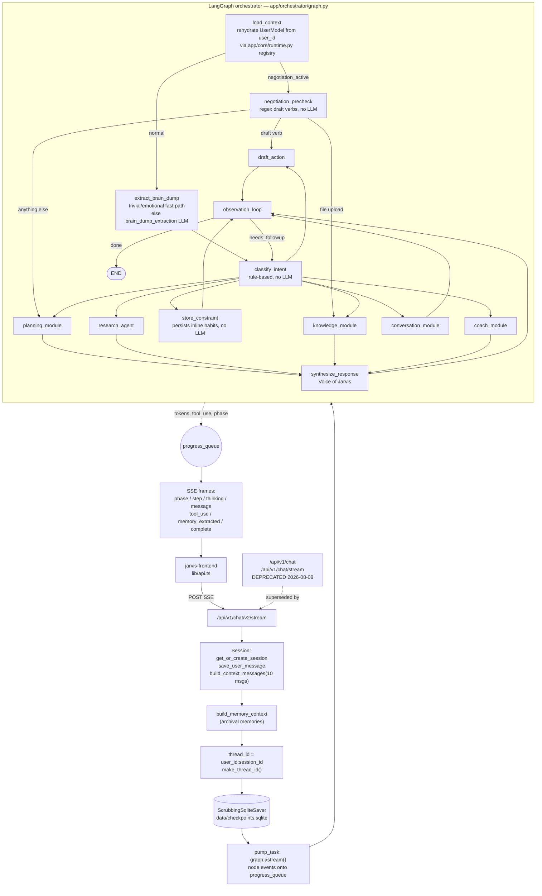
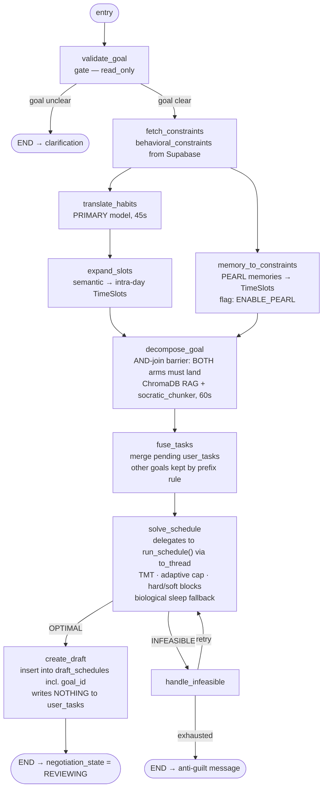
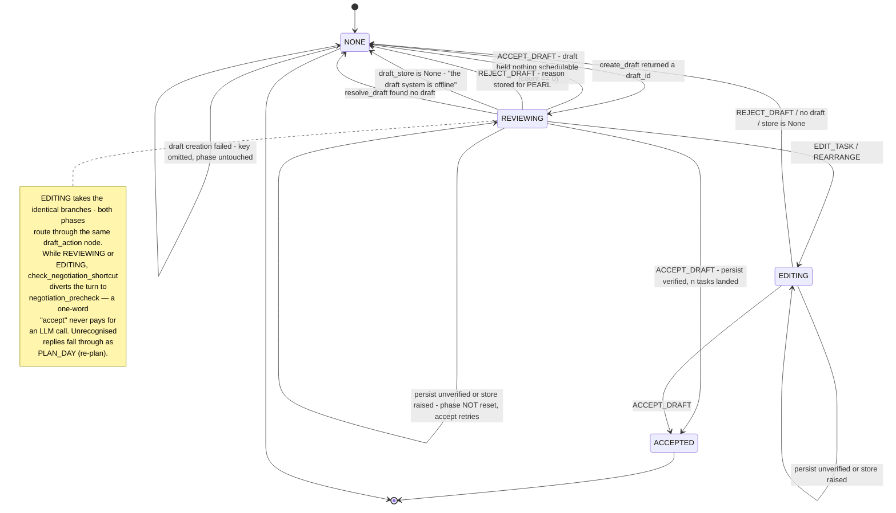

# Jarvis Engine — Project Status

**Last Updated:** 2026-08-08
**Branch:** `spine-may1-wip`
**Scope of this document:** what the code actually does today. Every number and
claim below was checked against the repository at the commit that carries this
file. Where something is a stub, it says stub.

---

## Current State: v2 Is the Architecture

The **LangGraph orchestrator** (`app/orchestrator/`) is the live request path.
It replaces `execute_agentic_flow()` in `app/services/analytical/control_policy.py`,
which now survives only as a library of helpers the v2 graph calls into
(`_persist_fused_tasks`, `BRAIN_DUMP_EXTRACTION_PROMPT`).

- **The one entry point:** `POST /api/v1/chat/v2/stream` (SSE).
- **Deprecated:** `POST /api/v1/chat`, `POST /api/v1/chat/stream`,
  `POST /api/v1/chat/confirm-schedule` and `POST /api/v1/chat/accept-schedule`
  carry `deprecated=True` in their FastAPI route metadata and log a warning per
  call. The frontend calls `/v2/stream` unconditionally — the
  `NEXT_PUBLIC_USE_V2` flag was retired — but still uses `/accept-schedule` as
  its no-draft fallback, which is why that route is hardened rather than gone
  (see the persistence note below).
- **Conversation state survives the turn:** an async SQLite checkpointer
  (`data/checkpoints.sqlite`) persists graph state per `(user_id, session_id)`
  thread, so a draft proposed on one turn is still under review on the next.

**Test suite: 510 tests collected — 509 passed, zero xfails, in ~6 seconds.**
39 test files. The suite runs fully offline: `tests/conftest.py` installs a
socket guard that fails any non-localhost connect, so no test can reach
Supabase, Gemini, or ChromaDB. (Updated 2026-08-13: the previous strict
xfail — the single-task pacing bug — is fixed; see Known Issues #4.)

```bash
.venv/bin/python -m pytest tests/ -q     # or just: pytest tests/
```

---

## Diagram 1 — Unified v2 Request Flow



Notes that matter and are easy to get wrong:

- `load_context` is not a no-op. On a live turn the facade arrives pre-wired; on
  a **checkpoint-resumed** turn only `user_id` survived serialization, so the
  node rebuilds `UserModel` from the process-wide client registry
  (`app/core/runtime.py`), which the FastAPI lifespan populates.
- The checkpointer **scrubs transients** before writing: `user_model`,
  `progress_callback`, `progress_queue`, `db_client`, `draft_store`, and
  `file_base64` / `file_bytes` / `file_name`. The file fields are a privacy
  scrub, not a serialization one — checkpoint rows are never pruned, so an
  uploaded document would otherwise sit in an unencrypted local SQLite file
  forever.
- Thread ids are **user-scoped** (`user_id:session_id`). A session-only key
  would let a resumed turn rebuild another user's facade.
- Streaming is real. The graph runs in a background `pump_task` while the SSE
  generator drains one shared queue, so tokens leave as they are produced
  instead of arriving in a single burst at the end. Client disconnect cancels
  the pump.

---

## Diagram 2 — Planning Module (real compiled shape)

This is the graph `build_module_graph(planning_module)` actually compiles —
verified by dumping the compiled edge list, not by reading the declaration.
Before 2026-08-08 the five steps from `decompose_goal` onward
(`decompose_goal`, `fuse_tasks`, `solve_schedule`, `handle_infeasible`,
`create_draft`) were **unreachable and had never executed once**; the research
agent was severed one node earlier still (`plan_research -> __end__`). The
barrier-semantics fix in `app/core/module_framework.py` is what made the v2
planning pipeline run end to end for the first time.



- **`validate_goal` runs first, ahead of the fan-out.** It used to sit beside
  the constraint branches and route into `decompose_goal`, which cannot work:
  LangGraph's AND-join waits on node *completion* and ignores its members'
  branches, so decomposition fired even on the arm where the goal was too vague.
  `build_module_graph` now raises at build time if a step mixes a routing
  dependency with plain ones, and an **orphan check** refuses to compile a
  module with steps unreachable from the entry point.
- **`solve_schedule` delegates**, it does not reimplement. TMT deadline
  weighting, `compute_adaptive_daily_cap`, hard/soft calendar blocks and the
  biological sleep fallback all live inside `run_schedule`. The call goes
  through `asyncio.to_thread`: CP-SAT is a synchronous solve, and a bare call
  freezes the event loop — every queued SSE frame stalls behind it. The solve
  itself is capped at `SOLVER_MAX_TIME_SECONDS` (30s, `JARVIS_SOLVER_MAX_TIME_SECONDS`
  overrides); an expired cap returns the best schedule found, or `UNKNOWN`,
  which takes the INFEASIBLE branch.
- **One goal, one namespace.** `decompose_goal` derives a `goal_id` via
  `derive_goal_id` (the model's `goal_metadata.goal_id` → a slug of the
  objective/planning goal → `plan_{uuid8}`) and prefixes every chunk and every
  dependency ref as `{goal_id}_{task_id}`. `fuse_tasks` then decides membership
  by that prefix — pending rows from *other* goals are carried into the plan,
  rows from *this* goal are replaced by the fresh decomposition. Matching on
  task_id equality was F5: the decomposer's ids are positional, so a new plan
  shadowed an unrelated older one and `_persist_fused_tasks`'s
  delete-then-replace erased it on accept. `create_draft` stores the same
  `goal_id` on the `draft_schedules` row.
- **Retry ladder:** `HORIZON_RETRY_SEQUENCE = [4320, 7200, 10080, 20160, 43200]`
  minutes — 3d → 5d → 7d → 14d → 30d. Exhaustion returns an anti-guilt
  clarification ("a scope problem, not a you problem"), never a 500.
- **Nothing is committed here.** `create_draft` proposes; `user_tasks` is
  written only on accept.
- **Feature flags** are env vars with the `JARVIS_` prefix and default to *on*:
  `memory_to_constraints` is gated on `ENABLE_PEARL`, i.e. `JARVIS_ENABLE_PEARL`,
  disabled only by setting it to `0`. A skipped step emits a `tool_use` SSE event
  with `status: "skipped"` and returns `{}`, so the AND-join still fires.

---

## Diagram 3 — Draft Negotiation State Machine



Only **two** of the eight exits keep the phase, and they keep it by *omitting*
the `negotiation_state` key rather than writing it — LangGraph merges node output
by key, so an omitted key leaves the channel untouched:

| Branch in `_apply_draft_action` | Returns | Phase after |
|---|---|---|
| `draft_store is None` | message + `NONE` | NONE |
| `resolve_draft` → no draft | message + `NONE` | NONE |
| ACCEPT, `count > 0` | message + `ACCEPTED` | ACCEPTED |
| ACCEPT, `count == 0` (nothing schedulable) | message + `NONE` | NONE |
| ACCEPT, `count is None` (write did not land) | **message only** | unchanged — retry |
| `handle_draft_action` outer `except` (store raised) | **message only** | unchanged — retry |
| REJECT_DRAFT | message + `NONE` | NONE |
| EDIT_TASK / REARRANGE | message + `EDITING` + `draft_id` | EDITING |

The split is deliberate: a *retryable* failure (the write did not commit, or
Supabase threw) must leave the draft exactly where it was so "accept" tries
again, while an *unretryable* one (no store, no draft, empty draft) must clear
the phase — otherwise `check_negotiation_shortcut` locks the thread into
re-planning forever.

`NegotiationPhase` also declares `PROPOSED`, and `_NEGOTIATION_ACTIVE` treats it
as a live phase, but nothing in `app/` ever writes it — drafts go straight to
`REVIEWING`. It is dead but harmless.

The two properties that make this safe:

1. **Full-coverage acceptance matcher.** `_is_acceptance` requires that *every*
   word of the normalized message be consumed by acceptance phrases — presence
   is not enough. "looks good, lock it in" accepts; "looks good but move the
   calculus block later" does not. Negations (`don't`, `not yet`, `hold off`)
   and any `?` disqualify outright. This matters because ACCEPT_DRAFT is the
   only v2 intent that writes to `user_tasks`, and `_persist_fused_tasks`
   deletes every pending row before inserting.
2. **plan_id-verified persistence.** `accept_draft_and_persist` writes first,
   then re-reads `user_tasks` filtered on the freshly minted `plan_id`, and only
   then flips the draft's status to `accepted`. Verifying on task_ids would read
   an outage as a success, because `fuse_tasks` carries pre-existing pending rows
   forward under the same ids. Returns `n > 0` (verified), `0` (nothing
   schedulable), or `None` (write did not land — draft stays pending, user can
   retry).

Both the conversational path (`handle_draft_action` in the orchestrator) and the
REST path (`POST /api/v1/drafts/{id}/accept`) import the same
`app/services/draft_actions.py`, so they cannot drift.

The deprecated no-draft fallback the frontend still calls,
`POST /api/v1/chat/accept-schedule`, now reuses the same `_count_persisted`
read-back: it captures the `plan_id` from `_persist_fused_tasks` and answers
`503 {"status": "failed"}` unless rows carrying it come back. It used to reply
`{"status": "accepted"}` unconditionally — including with no Supabase client at
all.

---

## Component Inventory

### Implemented and wired into the live path

| Component | Location | What it does |
|---|---|---|
| LangGraph orchestrator | `app/orchestrator/graph.py` | 12-node graph; entry `load_context`, negotiation shortcut, rule-based intent classification, module fan-out, synthesis, observation loop |
| State-aware routing | `app/orchestrator/routing.py` | `INTENT_TO_MODULE`, draft-action diversion, negotiation shortcut, follow-up loop |
| SQLite checkpointer | `app/orchestrator/checkpoint.py` | `ScrubbingSqliteSaver` over `AsyncSqliteSaver`; transient scrubbing on `aput`/`aput_writes` plus a serde-failure fallback that nulls-and-logs |
| Serializable state | `app/orchestrator/state.py` | `user_id` in state; `user_model` marked non-serializable and rehydrated |
| Runtime client registry | `app/core/runtime.py` | Process-wide `db` / `memory_store` singletons for code with no request scope |
| ModuleStep framework | `app/core/module_framework.py` | Declarative steps → compiled LangGraph; AND-join barriers, `routes_to` branches, timeouts, feature flags, SSE `tool_use` events, orphan check |
| Module registry | `app/modules/__init__.py` | `planning_module`, `research_agent`, `knowledge_module` registered at lifespan startup |
| Planning module | `app/modules/planning_graph.py` | Diagram 2 above — end to end, with drafts, TMT, full horizon ladder |
| Draft actions | `app/services/draft_actions.py` | Shared accept/resolve/coerce logic for the graph node and the REST API |
| Drafts REST API | `app/api/v1/endpoints/drafts.py` | GET / accept / reject / modify / delete / PATCH task / rearrange / chat — all on the live Supabase-backed `DraftStore` |
| Real token streaming | `app/api/v1/endpoints/chat.py` | Background pump task + shared queue; `token` → `event: message`, `thinking_token` → `event: thinking` |
| Model router | `app/core/model_router.py` | Task → role (PRIMARY/FAST/CLOUD); local-first, cloud on `force_cloud` kwarg, per-request ContextVar, or `GEMINI_PRIMARY` |
| Model auto-detection | `app/core/config.py` | Probes LM Studio `/v1/models`; heavy markers `27b/26b/22b/14b/12b`, fast markers `e4b/e2b/-4b/1b/3b`; Gemma preferred, qwen accepted; env pins outrank detection |
| Memory system | `app/services/memory/` | 3-tier memory, SM-2 decay, extractor, retriever, PEARL detectors |
| Memory → constraint bridge | `app/services/memory/constraint_bridge.py` | `memories_to_constraints` turns stored preferences into solver `TimeSlot`s — this is the moat |
| Observation loop | `app/core/observation.py` | Post-turn: background memory extraction, inline PEARL + cognitive state under a hard 500 ms cap; skipped on trivial input |
| Coach module | `app/modules/coach.py` | Bandura 4-sources mastery coaching via `route_llm_call` |
| Conversation module | `app/modules/conversation.py` | CHAT replies streamed through `route_llm_call` — same PII gate as everything else |
| OR-Tools scheduler | `app/core/or_tools/`, `app/api/v1/endpoints/schedule.py` | CP-SAT; `run_schedule` is the single reusable entry |
| Store resilience | `app/db/`, `app/services/` | An explicitly-passed `None` client is honoured as "degraded", so chat degrades instead of 500-ing when the DB is down |

### Stub-quality internals (nodes exist, bodies are thin)

| Component | Reality |
|---|---|
| `app/modules/research_graph.py` | `execute_search` is real (`perform_learning_style_search`). `plan_research` returns constants, `evaluate_results` is a pure decision point, **`summarize` has no LLM** — it returns `f"Found {n} results for your query."` — and `link_to_tasks` returns `[]`. `research_state_out` propagates only `search_results` and `error`; the summary is dropped on the floor. |
| `app/modules/knowledge_graph.py` | `ingest_document` is real (`process_ingestion` → Docling → ChromaDB). `classify_content` is a two-keyword check; `extract_calendar` returns a hardcoded `{"status": "pending_approval"}`; `link_to_tasks`, `propose_actions`, `file_operations` all return empties. |
| `app/orchestrator/hooks.py` | 7 handlers registered, **2 events have call sites**: `PreCloudLLM` (in `model_router.route_llm_call` and `voice_of_jarvis`) and `PreModuleExecution` (in `module_wrapper`). `PreScheduleModify`, `PostModuleExecution`, `PreMemoryWrite`, `CostThreshold`, `ProactiveSuggestion` are never invoked by app code. The PII filter itself is regex-only (email + US-format phone). |
| `app/core/psychology/woop.py` | Declarations only; WOOP fields are produced by the decomposition prompt, not by this module. |
| `app/api/v1/endpoints/analytical.py`, `telemetry.py` | Files exist but are **not mounted** in `app/api/v1/router.py`. |

### Deferred (design preserved, no implementation)

| Component | Why |
|---|---|
| DKT (LSTM knowledge tracing) | Data-starved — needs 100+ completion events per user |
| RL (DQN task ordering) | Needs DKT mastery scores as state input |
| SARIMAX energy forecasting | Needs 4+ weeks of continuous usage for seasonal decomposition |
| L1 Evaluation (Ragas/DeepEval) | Needs a stable core loop before feedback signals mean anything |
| Signals API | Consumers (DKT/RL) do not exist yet |
| Hooks tier system | Its own design — see Spec 3 |

Full specifications preserved in [FUTURE_ARCHITECTURE.md](FUTURE_ARCHITECTURE.md).

---

## Storage Map

### Supabase (relational)

**Two migration sets exist**, and they are not equivalent:

- `app/db/migrations/` — 14 numbered files (`001`–`014`), the historical set,
  hand-run in the Supabase SQL Editor. This is the complete schema.
- `supabase/migrations/` — 8 timestamped files in Supabase-CLI format,
  reconciled on 2026-08-08 against the restored project (the newest,
  `20260808000000_user_tasks_actual_duration.sql`, adds the
  `user_tasks.actual_duration_minutes` column the task-lifecycle completion
  path writes). It mirrors only `009`–`012` plus four later additions.
  **`001`–`008` have no CLI-format
  counterpart**, so `supabase db push` into a clean project would not create
  `behavioral_constraints`, `pending_calendar_updates`, `habit_trackers`,
  `user_tasks`, `task_materials`, `user_calendar_anchors`, `user_plan_updates`
  or `ingested_documents`.

Tables the code reads or writes:

| Table | Used by | Defined in |
|---|---|---|
| `user_tasks` | planning persistence on accept, task lifecycle (incl. `actual_duration_minutes` on completion) | `app/db/migrations/004` (+ `006`, `007`, `013`, `014`); CLI: only the `20260401000000` / `20260501000001` / `20260808000000` ALTERs |
| `draft_schedules` | `DraftStore`, draft REST API, `create_draft` | `011` · CLI `20260329000002` |
| `behavioral_constraints` | `UserModel.get_behavioral_constraints`, habit storage | `001` (+ `002`) · **CLI: none** |
| `user_memories` | 3-tier memory, SM-2 decay | `010` · CLI `20260329000001` |
| `chat_sessions`, `chat_messages` | session + history service | `009` (+ `012`) · CLI `20260329000000`, `20260331000000` |
| `user_preferences` | learning style for workspace | `011` · CLI `20260329000002` |
| `pending_action_items` | action proposals | `011` · CLI `20260329000002` |
| `task_completion_signals` | completion telemetry | `011` · CLI `20260329000002` |
| `task_workspaces` | proactive workspace cache | **CLI `20260501000002` only** — no numbered counterpart |
| `habit_trackers` | SM-2 spaced repetition | `003` · **CLI: none** |
| `task_materials` | document ↔ task RAG bridge | `004` · **CLI: none** |
| `ingested_documents` | ingestion provenance | `008` · **CLI: none** |
| `pending_calendar_updates` | timetable approval flow | `001` (+ `002`) · **CLI: none** |
| `user_plan_updates` | goal-level deadlines | `006` · **CLI: none** |
| `user_state` | startup health probe only (`DatabaseClient.check_connection`) | **no migration anywhere** |

Created by migrations but with no live call site: `user_calendar_anchors`
(`005` — the placeholder-resolution feature was never built),
`conversation_sessions` / `conversation_messages` (`010`), `extracted_problems`
and `task_completion_criteria` (`011`).

### Local SQLite

`data/checkpoints.sqlite` (override with `JARVIS_CHECKPOINT_DB`). LangGraph
checkpoint rows, one thread per `(user_id, session_id)`. Gitignored via `data/`.

### ChromaDB

`CloudClient` when `CHROMA_API_KEY` + `CHROMA_TENANT` are set, otherwise a local
in-process client. Collection `jarvis_knowledge`, cosine space, filtered by
`user_id`. Read by `decompose_goal` for RAG-augmented decomposition.

---

## Known Issues

1. **Research module has no cognition.** `summarize` returns a string literal
   with a result count and no LLM call at all; `link_to_tasks` returns `[]`; the
   summary never reaches orchestrator state. The knowledge module's
   `extract_calendar`, `link_to_tasks` and `propose_actions` are equally thin.
   Node cognition is deferred to **Spec 3**.

2. **Hooks are consent theater.** 5 of 7 registered hook events have no call
   site anywhere in `app/`, and there is no tier system — no way to say "this
   action needs consent, that one does not". Shipping a half-wired safety layer
   was judged worse than shipping none, so wiring-or-cutting is **Spec 3**
   (design decision D8 in the 2026-08-08 spec).

3. **DKT / RL / SARIMAX are data-starved**, not merely unimplemented. Building
   them against synthetic data would teach them the wrong things.

4. **FIXED 2026-08-13** — `compute_adaptive_daily_cap` broke single-task plans
   (cap floored at the longest task and rounded to whole task-atoms; the former
   strict xfail now passes). Original description: It forces
   `target_days >= 2`, so one 25-minute task gets a 13 min/day cap — below the
   task's own duration — and CP-SAT can place it nowhere. Every rung of the
   horizon ladder lowers the cap further, so the user is told "I couldn't fit
   everything in even with a 30-day window" for a single 25-minute task. Pinned
   by `tests/test_planning_graph.py::test_solve_schedule__real_solver__single_small_task__is_feasible`
   as `xfail(strict=True)` — the moment it is fixed, that test fails loudly and
   must be un-marked. Fix belongs in `app/utils/pacing.py` (floor the cap at the
   longest task).

5. **Checkpoint DB grows without bound.** `data/checkpoints.sqlite` has no
   pruning, retention window, or vacuum. Every turn of every thread accumulates.
   The file-field scrubbing keeps uploads out of it, but the row count only ever
   goes up.

6. **`conversation_history` bypasses the PII gate.** The `PreCloudLLM` hook is
   applied to `prompt` only — `system_prompt` and `conversation_history` go to
   the cloud unfiltered. L8 remains a regex placeholder (email + US phone), not
   a real privacy gateway.

7. **`validate_goal` rejects terse real goals.** The gate is
   `len(goal.strip()) < 5`, so "DSA" or "gym" is treated as too vague and
   returns a clarification instead of planning.

8. **`draft_schedules` has no `schedule` column.** The solver's output map is
   not persisted with the draft, so accepted tasks land in `user_tasks` without
   wall-clock times. `_schedule_map_of` already handles the column for when it
   arrives.

9. **The two migration sets have diverged.** `supabase/migrations/` (CLI format)
   mirrors only `009`–`012` of `app/db/migrations/` plus four later additions.
   `001`–`008` were never ported, and `task_workspaces` exists only in the CLI
   set. A `supabase db push` into a clean project therefore produces an
   incomplete schema, and `user_state` has no migration in either set. See the
   Storage Map above for the per-table breakdown.

10. **`analytical.py` and `telemetry.py` are dead files** — present in
    `app/api/v1/endpoints/` but never included in `app/api/v1/router.py`.

11. **A failed decomposition still produces a schedule.** `fuse_tasks`
    `depends_on=["decompose_goal"]` with no routing on the error, so when
    `decompose_goal` returns `{"error": ..., "task_chunks": []}` the graph walks
    on: `fuse_tasks` merges the user's *pending* rows (nothing was namespaced,
    so none are replaced), `solve_schedule` schedules those and returns
    `"error": None`, which overwrites the decomposition failure. The user is
    shown a plausible plan made entirely of stale tasks and is never told the
    goal they typed was never decomposed. This is the same class of bug as the
    two fixed on 2026-08-08 — `/chat/accept-schedule` answering `"accepted"`
    without writing (now verifies the `plan_id` landed and answers 503
    otherwise, and is marked deprecated), and `/drafts/{id}/chat` answering
    `"modified"` with no modifier wired (now 501) — an untruthful success, not a
    crash, which is why no test caught it. Fix is a routing edge on
    `decompose_goal`; follow-up task, deliberately not folded into the
    final-review wave.

---

## Test Coverage

**510 collected · 509 passed · zero xfails · 39 files · ~6 s · fully offline.**

Verification: `.venv/bin/python -m pytest tests/ -q` (the bare `pytest tests/`
form works too — `[tool.pytest.ini_options]` puts the repo root on `sys.path`).

`tests/conftest.py` monkeypatches `socket.socket.connect` / `connect_ex` to
raise on any non-localhost address for the duration of the session, so a test
that tries to reach Supabase, Gemini or ChromaDB fails instead of silently
making a paid call.

Areas covered, by file:

| File | Covers |
|---|---|
| `test_orchestrator.py`, `test_routing_helpers.py` | Graph wiring, intent → module routing, negotiation shortcut, draft-verb matching |
| `test_checkpointer.py` | Transient scrubbing (incl. the uploaded-file keys), serde-failure fallback, user-scoped thread ids |
| `test_module_framework.py`, `test_module_registration.py`, `test_modules.py` | ModuleStep compilation, AND-join barriers, routing/plain dependency conflict, orphan check |
| `test_planning_graph.py` | Every planning node, the horizon ladder, `run_schedule` delegation, draft creation |
| `test_draft_flow.py`, `test_draft_endpoints.py`, `test_draft_integration.py`, `test_draft_store.py` | Accept matcher coverage, plan_id-verified persistence, REST endpoints on the real store, `/drafts/{id}/chat` → 501 |
| `test_chat_accept_schedule.py` | The no-draft fallback: persists-and-verifies vs. 503 on a swallowed write, no client, or a plan_id with no rows behind it |
| `test_model_router.py`, `test_model_detection.py` | Role routing, `GEMINI_PRIMARY` behaviour incl. unstructured calls, 12B/14B + qwen detection, env pins |
| `test_memory_*.py` (6 files), `test_pearl*.py` (2) | 3-tier memory, SM-2 decay, retrieval, extraction, constraint bridge, wiring, PEARL patterns |
| `test_document_*.py` (3 files) | Document type registry, classification, ingestion end-to-end |
| `test_scheduler.py`, `test_chunker.py` | Real CP-SAT constraints; chunk parsing |
| `test_store_resilience.py` | Explicit-`None` client sentinel — degrade, don't 500 |
| `test_observation.py`, `test_hooks.py`, `test_user_model.py`, `test_clarification.py`, `test_task_lifecycle.py`, `test_chat_history.py`, `test_chat_sessions_integration.py`, `test_core_pipeline.py`, `test_integration.py`, `test_intent_routing.py`, `test_registry.py` | Observation loop, hook pipeline semantics, user model facade, clarification paths, task lifecycle, session/history persistence, registries |

---

## Where to Read Next

- **v2 design:** `docs/superpowers/specs/2026-04-12-jarvis-architecture-v2-design.md`
- **ModuleStep framework:** `docs/superpowers/specs/2026-04-13-module-step-framework-design.md`
- **Tonight's stabilization work:** `docs/superpowers/specs/2026-08-08-one-brain-stabilization-unification-design.md`
  and its plan in `docs/superpowers/plans/`
- **v1 pipeline (deprecated, historical):** `POLICY_ENGINE_ARCHITECTURE.md`
- **Deferred analytics specs:** `FUTURE_ARCHITECTURE.md`
