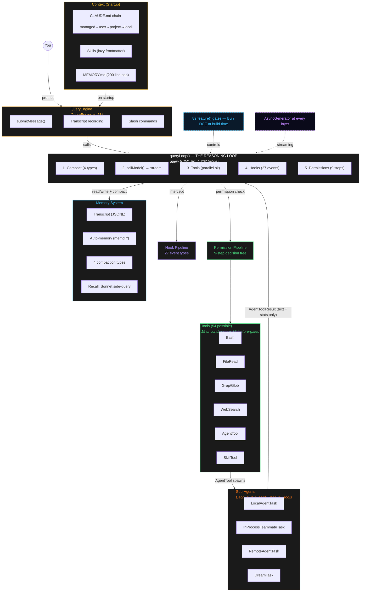
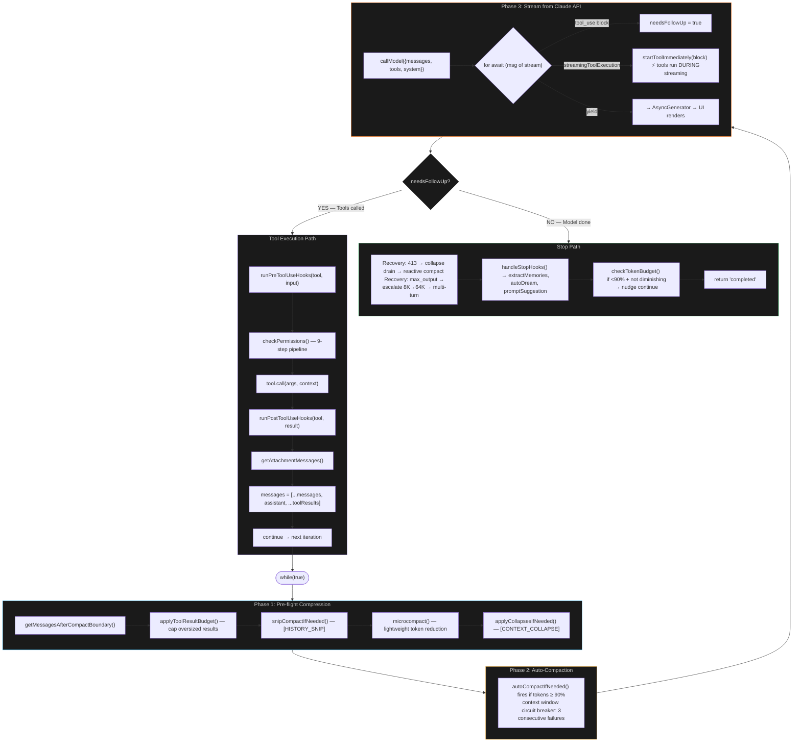
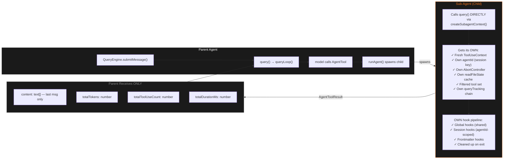
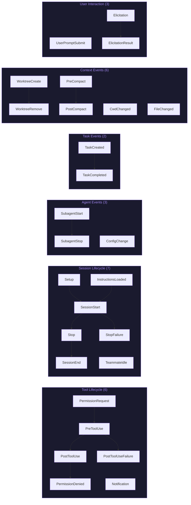
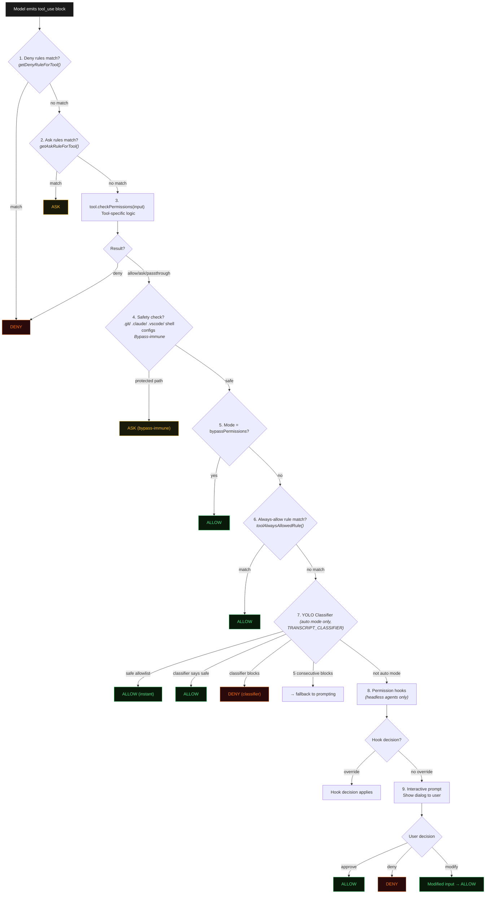
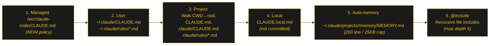
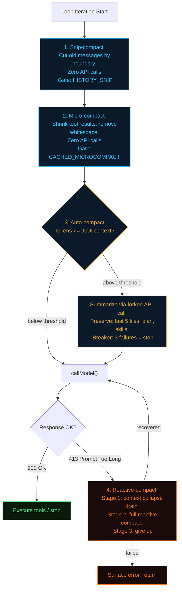
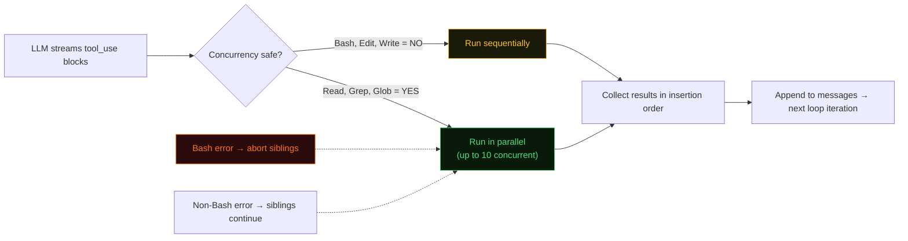
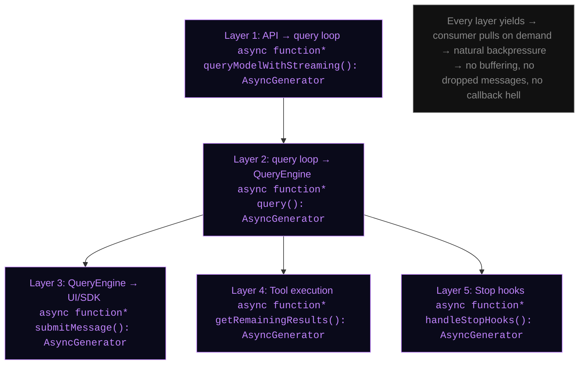

# Claude Code — Complete Verified Architecture

**Date:** 2026-04-12
**Author:** Madhav + Claude (Opus 4.6)
**Status:** Verified + Peer-Reviewed (v2)
**Method:** 4 deep-dive agents, 300K+ tokens of source code analyzed, peer-reviewed for accuracy

> This document is a reference architecture of Claude Code's internals, derived from exhaustive line-by-line analysis of `claude-code-src-code-main/src/`. Every claim is traced to source files. This serves as the foundation for Jarvis's architecture v2 spec.

---

## Table of Contents

1. [High-Level Architecture](#1-high-level-architecture)
2. [The Reasoning Loop (queryLoop)](#2-the-reasoning-loop)
3. [Sub-Agent System](#3-sub-agent-system)
4. [Hook Pipeline (27 Events)](#4-hook-pipeline)
5. [Permission Pipeline (9 Steps)](#5-permission-pipeline)
6. [Memory & Compaction (4 Types)](#6-memory--compaction)
7. [Tool & Skill System](#7-tool--skill-system)
8. [Feature Gating (89 Flags)](#8-feature-gating)
9. [AsyncGenerator Streaming](#9-asyncgenerator-streaming)
10. [Key Corrections to Simplified Diagrams](#10-key-corrections)

---

## 1. High-Level Architecture



### Key Numbers at a Glance

| Metric | Count | Source |
|--------|-------|--------|
| Tools | **54** (19 unconditional + 35 feature-gated) | `tools.ts` |
| Hook events | **27** across 6 categories | `coreTypes.ts:25-53` |
| Feature flags | **89** via Bun DCE | `feature()` calls across src/ |
| Permission steps | **9** | `permissions.ts` |
| Compaction types | **4** (micro, auto, snip, reactive) | `query.ts` + `compact/` |
| Task types | **4** (Local, InProcess, Remote, Dream) | `tasks/` |
| Skill sources | **5** (bundled, user, project, plugin, MCP) | `loadSkillsDir.ts` |
| Context tiers | **4** (managed → user → project → local) | `claudemd.ts` |

---

## 2. The Reasoning Loop

The heart of Claude Code is `queryLoop()` at `query.ts:241 (fn) / :307 (while)` — a `while(true)` loop where each iteration = one API call + optional tool execution.



### Loop State Transitions

| Transition | Trigger | Line |
|-----------|---------|------|
| `collapse_drain_retry` | 413 recovered via context collapse | 1110 |
| `reactive_compact_retry` | 413 recovered via reactive compact | 1162 |
| `max_output_tokens_escalate` | Escalate from 8K to 64K | 1217 |
| `max_output_tokens_recovery` | Multi-turn max_output recovery | 1247 |
| `stop_hook_blocking` | Stop hook returned blocking errors | 1302 |
| `token_budget_continuation` | Under token budget, keep going | 1338 |
| `next_turn` | Normal tool execution → next iteration | 1725 |

### Loop Exit Reasons

| Reason | Trigger | Line |
|--------|---------|------|
| `blocking_limit` | Token count at hard limit | 647 |
| `completed` | Normal completion / API error | 1357 |
| `aborted_streaming` | User interrupted during streaming | 1051 |
| `aborted_tools` | User interrupted during tool execution | 1515 |
| `hook_stopped` | Tool hook prevented continuation | 1520 |
| `stop_hook_prevented` | Stop hook prevented continuation | 1279 |
| `max_turns` | Max turn limit reached | 1711 |
| `prompt_too_long` | Recovery exhausted on 413 | 1175 |

---

## 3. Sub-Agent System

Sub-agents run their own full `query()` loop with independent hook pipelines. Each sub-agent intercepts tool calls independently (PreToolUse/PostToolUse scoped by its own `agentId`). The parent agent receives only the final `AgentToolResult` — no visibility into individual tool calls, hook results, or intermediate messages.

> Source: `runAgent.ts:700-757`, `hooks.ts:3394`, `agentToolUtils.ts:276-357`



### Parent CANNOT See

- Individual tool calls made by child
- Hook results within child
- Intermediate messages
- Compaction events

### Four Task Types

| Type | Purpose | Key Difference |
|------|---------|----------------|
| **LocalAgentTask** | Standard background sub-agent | Same process, async `query()` loop |
| **InProcessTeammateTask** | Swarm member | Team identity (`name@team`), mailbox, can be idle |
| **RemoteAgentTask** | Cloud execution | Runs in CCR, polling-based progress, ant-only |
| **DreamTask** | Memory consolidation | Auto-dream background, pattern extraction |

### Recursive Sub-Agent Nesting

Fork guard applies to **ALL users** (not USER_TYPE restricted). Fork children explicitly block recursive spawning via `FORK_BOILERPLATE_TAG` detection. `queryTracking.depth` tracks depth for telemetry only — no hard limit enforced.

> **Source:** `constants/tools.ts:36-46`, `forkedAgent.ts:78-89`

---

## 4. Hook Pipeline

27 hook events across 6 categories, defined at `entrypoints/sdk/coreTypes.ts:25-53`.



### Hook Scoping

Hooks are resolved per-agent via the `agentId` session key:

1. **Global hooks** — from `~/.claude/settings.json` (shared across all agents)
2. **Session hooks** — keyed by `agentId`, scoped to one agent's lifetime
3. **Frontmatter hooks** — from agent definition YAML, registered via `registerFrontmatterHooks()`
4. **SDK registered hooks** — programmatic hooks via the SDK API

> **Source:** `utils/hooks.ts:3394`, `types/hooks.ts:1-291`, `schemas/hooks.ts:1-223`

### Hook Response Capabilities

A hook can:
- **Continue** — let the operation proceed
- **Suppress output** — hide tool output from the model
- **Stop** — halt the loop with a reason
- **Set decision** — override permission decision (allow/deny/ask)
- **Inject system message** — add context to the conversation

---

## 5. Permission Pipeline

9-step decision tree from "model wants to call a tool" to "tool executes or is denied."



### Permission Rule Sources (8)

| Source | Location |
|--------|----------|
| `userSettings` | `~/.claude/settings.json` |
| `projectSettings` | `.claude/settings.json` |
| `localSettings` | `.claude.local.json` |
| `flagSettings` | `CLAUDE_CODE_*_PERMISSIONS` env var |
| `policySettings` | Organization policy |
| `cliArg` | `--permissions` flag |
| `command` | `/permissions` slash command |
| `session` | Runtime session-scoped |

### YOLO Auto-Mode Classifier

- **Safe tool allowlist** (instant allow): FileRead, Grep, Glob, LSP, Task tools, Sleep, SendMessage
- **Classifier API call**: Sends transcript + proposed action, returns `shouldBlock` + `confidence`
- **Denial tracking**: After 5 consecutive classifier blocks → fallback to user prompting
- **Gate**: `feature('TRANSCRIPT_CLASSIFIER')`

> **Source:** `utils/permissions/permissions.ts`, `utils/permissions/yoloClassifier.ts`, `utils/permissions/classifierDecision.ts`

---

## 6. Memory & Compaction

### Context Loading Order (Startup)



> Files loaded in reverse priority order — latest files (closest to CWD) get highest model attention.
> Source: `utils/claudemd.ts:790`

### Four Compaction Types



> **Source:** `services/compact/microCompact.ts`, `services/compact/autoCompact.ts`, `query.ts:401` (snip), `query.ts:1119-1166` (reactive)

### Memory Recall (memdir/)

- **Write**: Model creates `.md` files with YAML frontmatter (`type: user | feedback | project | reference`)
- **Read**: **Sonnet side-query** scores relevance against available memories (not embedding similarity)
- **Cap**: 200 memory files max, MEMORY.md index ≤ 200 lines / 25KB
- **Staleness**: Memories >1 day old get caveat warning about potential outdatedness

> **Source:** `memdir/memdir.ts`, `memdir/findRelevantMemories.ts`, `memdir/memoryAge.ts`

---

## 7. Tool & Skill System

### Tool Interface (`Tool.ts`)

Every tool implements:

```
Tool {
  name: string
  inputSchema: Zod         → exposed to LLM as JSON schema
  call(args, ctx)          → execution
  checkPermissions(input)  → allow / ask / deny / passthrough
  isConcurrencySafe(input) → can run in parallel?
  isReadOnly(input)        → side-effect free?
  maxResultSizeChars       → persist to disk if exceeded
  description(input)       → dynamic description for model
  prompt()                 → system prompt text
  isEnabled()              → active? (feature-gated)
}
```

### Tool Execution: StreamingToolExecutor



**Key detail:** Tools can start executing **while the model is still streaming** via `StreamingToolExecutor.addTool()`. This overlaps model generation time with tool execution time.

### Skill System

Skills are **meta-tools** — markdown files with YAML frontmatter, invoked via `SkillTool` (itself a registered tool).

| Aspect | Detail |
|--------|--------|
| **Sources** | Bundled, user (`~/.claude/skills/`), project (`.claude/skills/`), plugin, MCP |
| **Loading** | **Lazy** — only frontmatter at startup, full content on invocation |
| **Execution** | **Inline** (inject into conversation) or **Fork** (spawn sub-agent via `runAgent()`) |
| **Tool access** | Skills CAN invoke tools. `allowed-tools` frontmatter restricts which. |
| **Key frontmatter** | `name`, `description`, `when_to_use`, `allowed-tools`, `model`, `context` (fork\|inline), `hooks`, `agent`, `effort`, `paths`, `arguments` |

> **Source:** `skills/loadSkillsDir.ts`, `skills/bundledSkills.ts`, `tools/SkillTool/SkillTool.ts`

---

## 8. Feature Gating

`feature('FLAG')` → boolean. **Bun's built-in DCE** (Dead Code Elimination) — entire code blocks are stripped at build time. Not runtime env vars.

### Feature Flags by Domain (89 unique)

| Domain | Count | Examples |
|--------|-------|---------|
| **Agents & Coordination** | 7 | `COORDINATOR_MODE`, `FORK_SUBAGENT`, `AGENT_TRIGGERS`, `AGENT_TRIGGERS_REMOTE`, `AGENT_MEMORY_SNAPSHOT`, `BG_SESSIONS`, `BUILTIN_EXPLORE_PLAN_AGENTS` |
| **Tools & Capabilities** | 14 | `WEB_BROWSER_TOOL`, `WORKFLOW_SCRIPTS`, `MONITOR_TOOL`, `TOKEN_BUDGET`, `ULTRAPLAN`, `ULTRATHINK`, `MCP_SKILLS`, `EXPERIMENTAL_SKILL_SEARCH`, `TEMPLATES`, `DAEMON`, `TORCH`, `LODESTONE`, `SKILL_IMPROVEMENT`, `RUN_SKILL_GENERATOR` |
| **Memory & Context** | 7 | `EXTRACT_MEMORIES`, `CONTEXT_COLLAPSE`, `HISTORY_SNIP`\*, `REACTIVE_COMPACT`, `CACHED_MICROCOMPACT`, `COMPACT_REMINDERS`\*, `AWAY_SUMMARY` |
| **Classifier & Permissions** | 4 | `TRANSCRIPT_CLASSIFIER`, `BASH_CLASSIFIER`, `POWERSHELL_AUTO_MODE`, `VERIFICATION_AGENT`\* |
| **Kairos & Assistant** | 8 | `KAIROS`, `KAIROS_BRIEF`, `KAIROS_CHANNELS`, `KAIROS_DREAM`, `KAIROS_GITHUB_WEBHOOKS`, `KAIROS_PUSH_NOTIFICATION`, `PROACTIVE`, `BUILDING_CLAUDE_APPS` |
| **Infrastructure** | 8 | `BRIDGE_MODE`, `DIRECT_CONNECT`, `SSH_REMOTE`, `CHICAGO_MCP`, `CCR_MIRROR`, `CCR_AUTO_CONNECT`, `CCR_REMOTE_SETUP`, `UDS_INBOX` |
| **UI & Display** | 9 | `BUDDY`, `VOICE_MODE`, `STREAMLINED_OUTPUT`, `AUTO_THEME`, `HISTORY_PICKER`, `MESSAGE_ACTIONS`, `TERMINAL_PANEL`, `MCP_RICH_OUTPUT`, `HISTORY_SNIP`\* |
| **Analytics & Telemetry** | 9 | `SHOT_STATS`, `MEMORY_SHAPE_TELEMETRY`, `ENHANCED_TELEMETRY_BETA`, `PERFETTO_TRACING`, `COWORKER_TYPE_TELEMETRY`, `SLOW_OPERATION_LOGGING`, `HOOK_PROMPTS`, `COMPACT_REMINDERS`\*, `VERIFICATION_AGENT`\* |
| **Build & Platform** | 23+ | `IS_LIBC_GLIBC`, `IS_LIBC_MUSL`, `ANTI_DISTILLATION_CC`, `BYOC_ENVIRONMENT_RUNNER`, `SELF_HOSTED_RUNNER`, `NATIVE_CLIPBOARD_IMAGE`, `NATIVE_CLIENT_ATTESTATION`, ... |

> \* Cross-domain flags: `HISTORY_SNIP` (Memory + UI), `COMPACT_REMINDERS` (Memory + Analytics), `VERIFICATION_AGENT` (Classifier + Analytics). Counts are per-domain grouping; 89 unique flags total.

---

## 9. AsyncGenerator Streaming

The entire system uses `AsyncGenerator<T>` — not callbacks, not promises, not event emitters. This is an **architectural choice** that enables real-time streaming at every layer with natural backpressure.



### Why AsyncGenerator (Not Callbacks or EventEmitter)

1. **Backpressure** — consumer controls pace; producer blocks on `yield` until consumer pulls
2. **Composition** — generators compose via `yield*` delegation
3. **Error propagation** — `throw()` into generator cleanly unwinds the stack
4. **Cancellation** — `return()` on the generator stops production immediately
5. **No lost messages** — unlike EventEmitter where listeners can miss events between subscribe and emit

---

## 10. Key Corrections to Simplified Diagrams

The simplified architecture diagram commonly shared online is ~80% accurate but has these important corrections:

| # | Simplified Diagram Says | Actual (Verified) |
|---|------------------------|-------------------|
| 1 | "Agent → Reasoning Loop" (one box) | **3 layers**: `QueryEngine.submitMessage()` → `query()` → `queryLoop()` |
| 2 | Sub-agents use QueryEngine | Sub-agents call **`query()` directly** via `createSubagentContext()` |
| 3 | Hooks sit between Agent and Tools | Hooks are **inside the loop**, wrapping each tool execution |
| 4 | "auto-compacts when full" | Fires **proactively at loop top**, before API call. 4 types, not 1 |
| 5 | Tools run after streaming completes | Tools start **during streaming** via `StreamingToolExecutor` |
| 6 | Sub-agents inherit parent's hooks | Session-scoped by **own `agentId`** — independent pipeline |
| 7 | "Skills" shown alongside tools | Skills are a **meta-tool** — `SkillTool` is tool #N of 54 |
| 8 | "CLAUDE.md" (single file) | **4-tier chain**: managed → user → project → local |
| 9 | Memory uses embedding similarity | Recall uses **Sonnet side-query** for relevance scoring |
| 10 | Stop hooks just stop | Trigger **memory extraction + auto-dream + prompt suggestion** |
| 11 | Simple hooks (Pre/Post) | **27 hook events** across 6 categories |
| 12 | Tools always available | **89 feature gates** control which subsystems exist at build time |
| 13 | Simple allow/deny permissions | **9-step pipeline** with YOLO auto-classifier |
| 14 | Sequential tool execution | **Concurrent** for read-only tools (up to 10 parallel) |
| 15 | "43 tools" | **54 possible** (19 unconditional + 35 feature-gated) |
| 16 | Streaming via callbacks | **AsyncGenerator** at every layer with backpressure |

---

## Appendix: Key Source Files

| File | Purpose |
|------|---------|
| `QueryEngine.ts` | Session manager, wraps `query()` with transcript + slash commands |
| `query.ts` | The reasoning loop (`queryLoop()`) — heart of Claude Code |
| `query/tokenBudget.ts` | Per-turn token budget tracking + diminishing returns detection |
| `query/stopHooks.ts` | Post-turn hook orchestration (27 events) |
| `query/config.ts` | Immutable config snapshot per query entry |
| `query/deps.ts` | Dependency injection (callModel, microcompact, autocompact, uuid) |
| `Tool.ts` | Tool interface definition |
| `tools.ts` | Tool registration + filtering |
| `tools/AgentTool/runAgent.ts` | Sub-agent spawning + lifecycle |
| `tools/SkillTool/SkillTool.ts` | Skill invocation meta-tool |
| `services/tools/StreamingToolExecutor.ts` | Parallel tool execution during streaming |
| `services/tools/toolHooks.ts` | PreToolUse / PostToolUse hook execution |
| `services/compact/autoCompact.ts` | Auto-compaction logic + circuit breaker |
| `services/compact/microCompact.ts` | Lightweight pre-compression |
| `utils/permissions/permissions.ts` | 9-step permission pipeline |
| `utils/permissions/yoloClassifier.ts` | Auto-mode YOLO classifier |
| `utils/claudemd.ts` | CLAUDE.md discovery + 4-tier loading |
| `memdir/memdir.ts` | Memory directory management |
| `memdir/findRelevantMemories.ts` | Sonnet-based relevance scoring |
| `skills/loadSkillsDir.ts` | Skill discovery + lazy loading |
| `coordinator/coordinatorMode.ts` | Multi-agent coordinator mode |
| `tasks/LocalAgentTask/` | Background sub-agent task type |
| `tasks/InProcessTeammateTask/` | Swarm teammate task type |
| `entrypoints/sdk/coreTypes.ts` | 27 hook event type definitions |
| `types/permissions.ts` | Permission decision types + rule sources |
