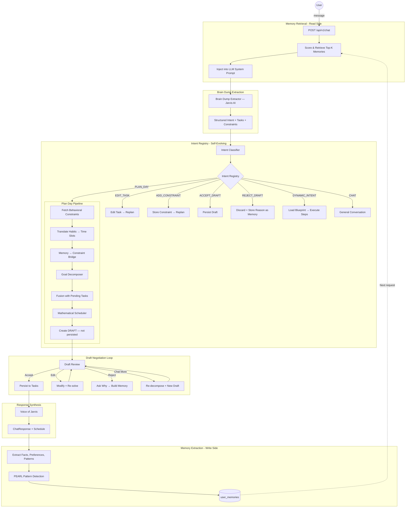
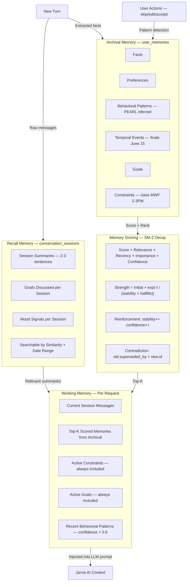
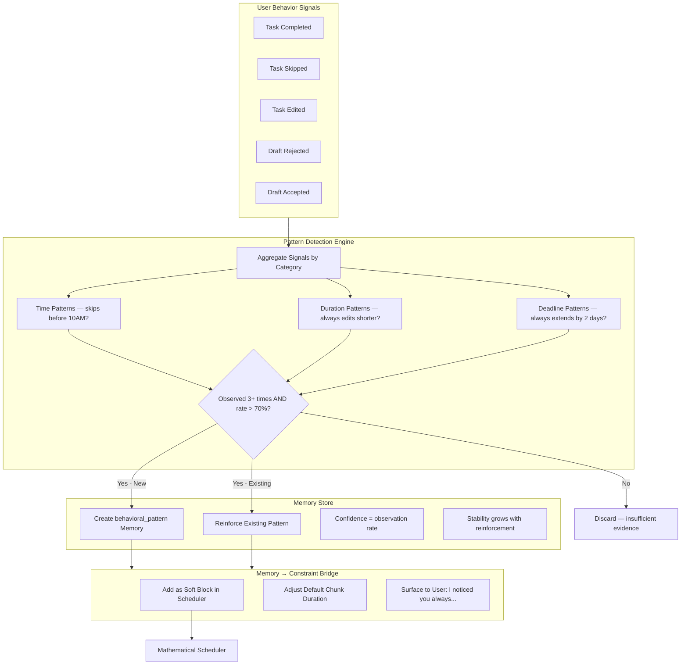

# Jarvis VC Pitch Deck — Prep Guide

> **File:** `Jarvis_VC_Pitch_v3.pptx`
> **Submission:** Startup Foundry LaunchPad
> **Deadline:** Wednesday, April 1, 2026
> **Required:** PPT link (public) + 1-min video link (public) + 5 interview docs attached

---

## Slide-by-Slide Guide

### Slide 1 — Cover
**Purpose:** First impression. Confidence, not clutter.

| Element | What to say / show |
|---------|-------------------|
| Headline | "Your AI that thinks, so you don't have to." |
| Sub | Local-first AI that converts your brain dump into a mathematically optimal, guilt-free daily schedule |
| Name | Murali Madhav · Jarvis Engine · 2026 |
| Vibe | Iron Man HUD — dark, warm, precise |

**Talking point:** Don't read the slide. Say: *"Jarvis is what I wished existed when I was drowning in exams and side projects."*

---

### Slide 2 — Problem + Your Insight
**Purpose:** Make them feel the pain before you sell the solution.

| Element | Content |
|---------|---------|
| Stats | 3.2 hrs/day lost · 5/5 interviewees said same thing · 78% weekly guilt |
| Founder story | You lived this — not a theory, a personal problem |
| Why tools fail | Notion/Todoist = empty containers. Calendars don't decompose goals. AI chatbots give advice, not plans. |
| Quote | Pull the sharpest line from your interviews here |

**To fill in:** Replace the placeholder quote with a real line from one of your 5 interviews. One sentence, devastating.

---

### Slide 3 — Solution: How Jarvis Works
**Purpose:** Show the machine, not the magic words.

Pipeline (left to right):
1. **Brain Dump** — anything you say
2. **Jarvis AI** — understands intent, tasks, habits, constraints
3. **Decomposer** — breaks goals into ≤25 min micro-tasks with psychology baked in
4. **Scheduler** — mathematical engine builds conflict-free plan
5. **Draft Review** — you accept / edit / reject / chat
6. **Voice of Jarvis** — warm human-sounding response

**Key talking points:**
- *"Your data never leaves your device"* — local-first, privacy-first
- *"This is math, not vibes"* — the scheduler uses constraint satisfaction, not AI guessing
- *"You're never locked in"* — edit anything, Jarvis re-solves in seconds

---

### Slide 4 — The Psychology Engine
**Purpose:** This is the moat no one else has. Make them feel the depth.

| Framework | What to say |
|-----------|-------------|
| **WOOP** | Every task has an obstacle pre-planned — not just "study for exam" but "if I feel overwhelmed, I open chapter 3 notes" |
| **CLT** | 25 minutes. Active recall criteria. Designed to build skill, not fake productivity |
| **TMT** | Your deadlines become math. Nearest deadline = scheduled first, automatically |
| **SM-2** | Habits don't just repeat — they're spaced by the same algorithm that powers Anki. You build routines that stick |
| **Anti-Guilt** | When Jarvis can't fit everything, it explains why. Too much scope, not enough time. Never "you failed" |

**Talking point:** *"Five frameworks from cognitive science, behavioral psychology, and spaced repetition — baked into the architecture, not bolted on as reminders."*

---

### Slide 5 — Technical Moat + USPs
**Purpose:** Show VCs there's a real barrier to replication.

| USP | Talking point |
|-----|--------------|
| Local-first AI | Privacy by architecture. The AI runs on your device. No subscription required to think. |
| Deterministic Scheduler | Constraint satisfaction mathematics. Every plan is provably feasible — not a suggestion |
| PEARL Memory | Jarvis watches what you skip, edit, and reject. It infers your patterns and automatically adjusts future plans. You never have to say "stop scheduling me before 10 AM" twice. |
| 3-Tier Memory | Facts, preferences, and behavioral patterns are stored, scored, and decayed mathematically. Memories don't just change what Jarvis says — they change the constraints fed into the scheduler. |
| Self-Evolving Intents | When Jarvis notices you keep asking for something new, it learns it as a first-class capability — without a code update. |
| Anti-Guilt Architecture | The system is designed to absorb blame. Over-committed? Jarvis recalibrates. Never "you failed to complete." |

**Moat line:** *"The longer you use Jarvis, the more it knows you. That dataset is proprietary. Switching cost compounds with every interaction."*

---

### Slide 6 — Target Audience + Why Now
**Purpose:** Show you know exactly who you're building for and why this moment is right.

**First 100 users:**
- Engineering + pre-professional students
- Juggling 5+ competing priorities simultaneously
- Tech-comfortable (will use CLI/API-first product)
- **Includes students with ADHD** — Jarvis externalises the planning brain, dramatically reducing executive function burden

**Why Now (3 forces):**
1. Local AI is finally production-quality — wasn't true 18 months ago
2. Combining language models + constraint solvers produces trustworthy plans — the stack just matured
3. Gen Z burnout is at record highs post-pandemic — demand has never been higher

---

### Slide 7 — Vision
**Purpose:** Show the size of the opportunity and the compounding moat.

| Phase | Timeline | What |
|-------|----------|------|
| Phase 1 | 2026 | Students · 10K users · Freemium |
| Phase 2 | 2027 | Knowledge workers + freelancers · Team layer · Premium |
| Phase 3 | 2028+ | Enterprise · Org-wide cognitive load management · API licensing |

**Market:** TAM $14.3B · SAM $2.1B · SOM $140M (India + SEA, 3yr)

**Moat:** PEARL data flywheel — every user interaction trains the behavioral model. Proprietary dataset. Network effect without a network.

---

### Slide 8 — Interview Evidence (Appendix)
**Purpose:** Satisfy the "5 interviews documented" requirement.

Replace all `[bracketed]` fields with:
- Interviewee first name or role (no surnames needed)
- Year + college or job title
- One verbatim quote — their words, not paraphrased
- The pain signal it demonstrates

> **Before submitting:** this slide must be filled in. The PPT gets attached alongside the form — reviewers will check.

---

## 1-Minute Video Script

> **[0:00–0:20 · Problem]**
> "Every student I know spends hours each day figuring out what to work on, when, and for how long — before they've done a single productive thing. Planners don't help. Notion doesn't think for you. The cognitive overhead of managing your own productivity is killing actual execution."

> **[0:20–0:40 · Audience + Hypothesis]**
> "I spoke to 5 engineering students and mentors. Every single one said the same thing: they know what they need to do, they just can't turn it into a real plan. My hypothesis: if an AI could take your brain dump and produce a guilt-free, mathematically valid schedule automatically — people would actually follow it."

> **[0:40–1:00 · Solution]**
> "That's Jarvis. You dump your thoughts — tasks, habits, deadlines, whatever. Jarvis understands your intent, decomposes your goals into 25-minute blocks using behavioral science, and builds your day with constraint satisfaction mathematics. No manual planning. No guilt. Just: here's your day, let's go."

**Recording tips:**
- Record straight to camera, no slides in background
- One take energy — slightly fast is fine, nervous is not
- End on the last line, don't trail off
- Upload to YouTube (unlisted) or Loom, set visibility to "Anyone with link"

---

## Future Vision: Jarvis Everywhere

> This section is for internal roadmap + investor conversations. Not in the current deck but ready to discuss when asked "what's next?"

### Phase 2 Integrations — Jarvis Watches Your Life

The long-term vision: Jarvis doesn't wait for you to brain dump. It watches the inputs in your life and schedules proactively — before you even think to ask.

| Integration | What Jarvis does with it |
|-------------|--------------------------|
| **Notion** | Reads your project pages, task databases, meeting notes. Detects pending work and new commitments automatically. |
| **Slack / Teams** | Monitors messages for action items, deadlines, blockers. "Can you send that by Friday?" becomes a task in Jarvis without you doing anything. |
| **WhatsApp** | Parses voice notes and messages for commitments. "I'll call you Sunday" → blocked Sunday slot. |
| **Gmail / Outlook** | Reads email for deadlines, calendar invites, follow-up requests. Builds your day before you open your inbox. |
| **Google Calendar / iCal** | Two-way sync — Jarvis respects your calendar and writes accepted plans back to it. |
| **GitHub / Linear** | Detects open PRs, unresolved issues, sprint deadlines → feeds into planning automatically. |
| **Spotify / Screen time** | Energy signals — listening to focus playlists vs. doom-scrolling → PEARL infers cognitive state, adjusts plan intensity. |

### The Proactive Jarvis Vision

> *"Jarvis works for you even when you're not working."*

- **Sunday night auto-plan** — Jarvis reads your week ahead (calendar, Notion, email) and generates a draft plan before Monday morning. You wake up to a ready schedule.
- **Async task capture** — a WhatsApp message to a Jarvis number captures tasks on the go. Processed overnight. Ready in the morning.
- **Deadline radar** — Jarvis monitors all connected sources and surfaces approaching deadlines 48 hours in advance, even ones you forgot you committed to.
- **Post-week reflection** — every Friday, Jarvis generates a completion summary, identifies patterns, and adjusts next week's defaults. No manual review needed.
- **ADHD mode** — simplified view, fewer decisions, stronger WOOP scaffolding, shorter tasks, more check-ins. One toggle. Jarvis adapts the entire system.

### Why This Is a Moat, Not a Feature

Every integration feeds PEARL. Every signal makes the behavioral model richer. By the time a competitor builds the scheduler, Jarvis already has 12 months of each user's behavioral data — what time they focus, what they avoid, what they always reschedule.

That's not a product. That's a second brain. You don't switch your second brain.

---

## Key Architecture Diagrams

> For VC conversations and technical due diligence. These show the depth of the system.

### Core Request Flow

---

### 3-Tier Memory Architecture

---

### PEARL Behavioral Engine

---

## Submission Checklist

- [ ] Fill in 5 interview rows on Slide 8 (name/role, quote, pain signal)
- [ ] Replace quote placeholder on Slide 2 with sharpest interview line
- [ ] Upload PPT to Google Slides, set sharing → "Anyone with the link"
- [ ] Record 1-minute video (script above), upload to YouTube unlisted or Loom
- [ ] Set video visibility → "Anyone with the link"
- [ ] Attach interview documentation as supplementary file
- [ ] Submit form with both links before deadline
