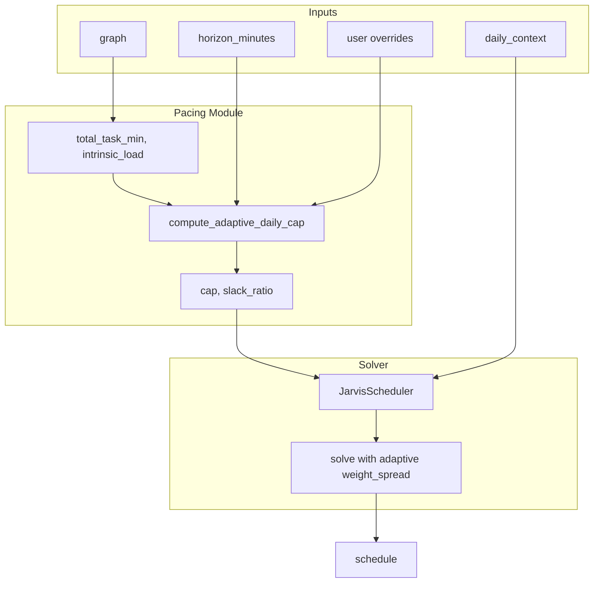

# Adaptive Pacing and User Overrides

## Problem

- Current cap logic is hardcoded: `MAX_DEEP_WORK_MINUTES_PER_DAY = 360` when horizon > 1 day, causing cramming in long-horizon scenarios.
- Fixed `weight_spread = 5` is too weak; makespan dominates and packs work into early days.
- No user overrides for daily limits or per-task duration bounds.

## Approach

Replace hardcoding with **formula-driven adaptive logic** and explicit **user overrides** at both daily and per-task levels.

---

## Part 1: Pacing Utility Module

**New file:** [app/utils/pacing.py](app/utils/pacing.py)

Create `compute_adaptive_daily_cap()` and related helpers.

**Slack ratio:**

```python
slack_ratio = horizon_minutes / max(1, total_task_minutes)
```

**Logic (when `user_override` is None):**

- Single-day horizon (<= 1440 min): no cap (return horizon).
- Multi-day: use slack ratio tiers (configurable):
  - `slack_ratio >= 10` → target 90 min/day (sustainable)
  - `slack_ratio >= 5` → target 120 min/day
  - `slack_ratio >= 3` → target 180 min/day
  - else → target 240 min/day (4h research upper bound)
- `target_days = max(2, min(horizon_days, ceil(total_work / target_min_per_day)))`
- `cap = ceil(total_work / target_days)`
- Cognitive load factor: if `intrinsic_load >= 0.8` → `cap *= 0.8`; if `>= 0.7` → `cap *= 0.9`
- `cap = min(cap, PACING_MAX_DEEP_WORK_PER_DAY)` (240)
- **min_daily override:** if user sets `min_daily_deep_work_minutes`, limit spreading so no day gets less: `target_days = min(target_days, total_work / min_daily)` when `min_daily > 0`

---

## Part 2: Config Constants

**File:** [app/core/config.py](app/core/config.py)

Add pacing constants (override via env if desired):

```python
PACING_SUSTAINABLE_MIN_PER_DAY: int = 90   # slack >= 10
PACING_MODERATE_MIN_PER_DAY: int = 120     # slack >= 5
PACING_STANDARD_MIN_PER_DAY: int = 180     # slack >= 3
PACING_MAX_DEEP_WORK_PER_DAY: int = 240    # upper bound 4h
PACING_COGNITIVE_LOAD_HIGH: float = 0.8    # factor when intrinsic_load >= 0.8
PACING_COGNITIVE_LOAD_MED: float = 0.9     # factor when intrinsic_load >= 0.7
```

Keep `MAX_DEEP_WORK_MINUTES_PER_DAY` for backward compat; pacing module takes precedence when adaptive path is used.

---

## Part 3: Solver Adaptive Weight

**File:** [app/core/or_tools/solver.py](app/core/or_tools/solver.py)

1. Extend `JarvisScheduler.__init`__ with `slack_ratio: float = 1.0`.
2. In `solve()`, compute spread weight from slack:

```python
if self._load_d_vars:
    weight_spread = 5 + 45 * min(1.0, max(0, (self.slack_ratio - 2) / 8))
    ...
```

1. Update `run_schedule` (and any direct scheduler construction) to pass `slack_ratio`.

---

## Part 4: Schedule Layer Wiring

**File:** [app/api/v1/endpoints/schedule.py](app/api/v1/endpoints/schedule.py)

1. Import `compute_adaptive_daily_cap` from [app/utils/pacing.py](app/utils/pacing.py).
2. Replace cap logic in `run_schedule`:

```python
total_task_minutes = sum(c.duration_minutes for c in graph.decomposition)
intrinsic_load = graph.cognitive_load_estimate.get("intrinsic_load", 0.5)
slack_ratio = horizon_minutes / max(1, total_task_minutes)

cap = compute_adaptive_daily_cap(
    horizon_minutes=horizon_minutes,
    total_task_minutes=total_task_minutes,
    intrinsic_load=intrinsic_load,
    user_override=max_daily_deep_work_minutes,
    min_daily_override=min_daily_deep_work_minutes,
)
```

1. Pass `slack_ratio` into `JarvisScheduler` (new param).
2. Extend `run_schedule` signature: `min_daily_deep_work_minutes: Optional[int] = None`.
3. Extend `ScheduleRequest` with `min_daily_deep_work_minutes: Optional[int] = None`.

---

## Part 5: User Overrides – Daily Level

**API surface:**


| Override                      | ScheduleRequest | ChatRequest | Effect                                                             |
| ----------------------------- | --------------- | ----------- | ------------------------------------------------------------------ |
| `max_daily_deep_work_minutes` | yes (existing)  | add         | Hard cap; overrides adaptive cap                                   |
| `min_daily_deep_work_minutes` | add             | add         | Avoid days with less than X min; constrains target_days in formula |


**File:** [app/api/v1/endpoints/chat.py](app/api/v1/endpoints/chat.py)

Add to `ChatRequest`:

```python
max_daily_deep_work_minutes: Optional[int] = Field(default=None, ge=30, le=600, ...)
min_daily_deep_work_minutes: Optional[int] = Field(default=None, ge=15, le=240, ...)
```

**File:** [app/services/analytical/control_policy.py](app/services/analytical/control_policy.py)

1. Extend `execute_agentic_flow` and `_run_plan_day_flow` with `max_daily_deep_work_minutes`, `min_daily_deep_work_minutes`.
2. Pass them through to `run_schedule`.

---

## Part 6: User Overrides – Per-Task (Optional)

**Interpretation:** Max/min **per-chunk** duration (e.g. "no task longer than 20 min", "no task shorter than 10 min").

**Approach:**

1. **Decompose prompt:** When overrides are set, prepend to `enriched_planning_goal`:
  - `"[Constraint: Each task must be 10-20 minutes.] "` (example)
2. **Validation/clamp before scheduling:** In `run_schedule`, before adding tasks, optionally clamp chunk durations to `[min_task, max_task]`. If clamping changes total work, recompute `total_task_minutes` and adaptive cap. Clamp only when overrides are provided; otherwise use LLM values as-is.

**API surface:**


| Override                    | ScheduleRequest      | ChatRequest | Effect                                  |
| --------------------------- | -------------------- | ----------- | --------------------------------------- |
| `max_task_duration_minutes` | add (Optional, 1-25) | add         | Clamp chunk durations before scheduling |
| `min_task_duration_minutes` | add (Optional, 1-25) | add         | Clamp chunk durations before scheduling |


**File:** [app/api/v1/endpoints/reasoning.py](app/api/v1/endpoints/reasoning.py)

TaskChunk keeps `duration_minutes` ge=1, le=25. Clamping in schedule layer stays within that range when overrides are given.

---

## Part 7: Free Time Bound (Optional Enhancement)

**File:** [app/utils/pacing.py](app/utils/pacing.py)

Add `compute_free_minutes_per_day(daily_context: List[TimeSlot], horizon_minutes: int) -> List[int]`:

- For each day in horizon, sum BLOCKED slot durations overlapping that day.
- Return `1440 - blocked_min` per day.
- In `compute_adaptive_daily_cap`, when `daily_context` is passed: `cap = min(cap, min(free_per_day))` over days that have free time.

Increases robustness when calendars are very constrained.

---

## Data Flow




---

## File Summary


| File                                                                                   | Changes                                                                                        |
| -------------------------------------------------------------------------------------- | ---------------------------------------------------------------------------------------------- |
| [app/utils/pacing.py](app/utils/pacing.py)                                             | New: `compute_adaptive_daily_cap`, optional `compute_free_minutes_per_day`                     |
| [app/core/config.py](app/core/config.py)                                               | Add PACING_* constants                                                                         |
| [app/core/or_tools/solver.py](app/core/or_tools/solver.py)                             | Add `slack_ratio` param; `weight_spread = f(slack_ratio)`                                      |
| [app/api/v1/endpoints/schedule.py](app/api/v1/endpoints/schedule.py)                   | Use pacing module; pass slack_ratio to scheduler; add min_daily, per-task overrides to request |
| [app/api/v1/endpoints/chat.py](app/api/v1/endpoints/chat.py)                           | Add max_daily, min_daily, max_task, min_task overrides                                         |
| [app/services/analytical/control_policy.py](app/services/analytical/control_policy.py) | Wire overrides from ChatRequest to run_schedule; pass to decompose when used                   |


---

## Edge Cases

- **User override and adaptive:** User `max_daily` overrides adaptive cap; user `min_daily` is an input to the formula.
- **Per-task clamp:** If clamp changes durations, recompute `total_task_minutes` and `slack_ratio` before cap and solver.
- **INFEASIBLE:** Tighter cap can cause INFEASIBLE; existing recalibration flow still applies.
- **Single-day:** No cap; `slack_ratio` still passed (solver can no-op spread when no load_d vars).

---

## Testing

1. Unit: `compute_adaptive_daily_cap(horizon=21600, total=250, intrinsic=0.75)` → cap in 90–120 range.
2. Unit: `slack_ratio=12` → `weight_spread` significantly larger than baseline.
3. Integration: Chat with deadline override → schedule spread across days, no cramming.
4. Override: `max_daily_deep_work_minutes=60` → cap respected; `min_daily_deep_work_minutes=60` → fewer, heavier days.

