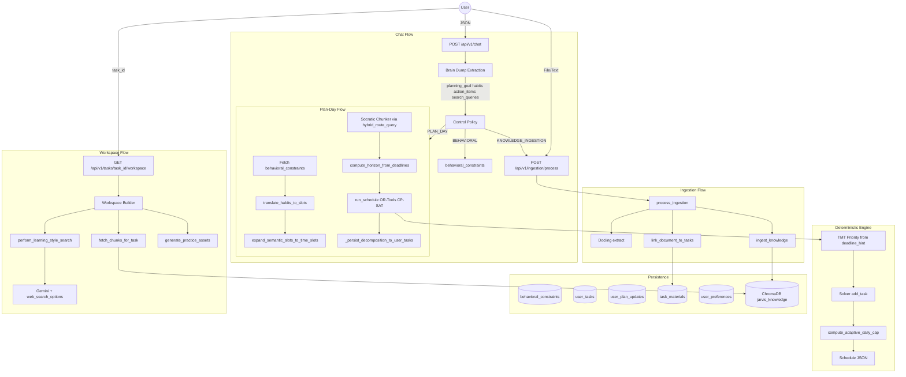

# Global Recalibration, Multi-Goal Fusion & Architecture Doc Update

## Part A: Global Recalibration (Unchanged)

The implementation steps from the original plan remain: migration 007, `get_all_pending_tasks`, `_persist_decomposition_to_user_tasks` updates, `compute_horizon_from_deadlines` chunks parameter, fusion flow in `_run_plan_day_flow`, replace persistence. See the full plan for details.

---

## Part B: Update POLICY_ENGINE_ARCHITECTURE.md

**File**: [docs/POLICY_ENGINE_ARCHITECTURE.md](docs/POLICY_ENGINE_ARCHITECTURE.md)

**Rationale**: The architecture doc is out of date. It describes DKT/RL in the scheduling path; the actual system uses OR-Tools CP-SAT with TMT and adaptive pacing. It omits the brain-dump flow, ingestion pipeline, proactive workspace, multi-source deadlines, and (post-implementation) multi-goal fusion.

### B1. Replace Request Flow Diagram

**Current**: Generic API -> Router -> Local LLM; DKT -> RL -> CSP.

**New diagram** (mermaid):

### B2. Add "Implemented APIs" Section

List the actual routes:

- `POST /api/v1/chat` – Unified entry; brain-dump extraction, plan-day, ingestion, habits
- `GET /api/v1/tasks/{task_id}/workspace` – Proactive workspace (RAG + web search + practice)
- `POST /api/v1/ingestion/process` – Document ingestion, task-material linking
- `POST /api/v1/schedule/generate-schedule` – Direct OR-Tools schedule from ExecutionGraph
- `GET/POST /api/v1/habits/*` – Habits CRUD
- `POST /api/v1/reasoning/decompose-goal` – Socratic Chunker

### B3. Update Component Definitions Table

| Component             | Definition                                                                                                                         |
| --------------------- | ---------------------------------------------------------------------------------------------------------------------------------- |
| **Control Policy**    | Master orchestrator for /chat: brain-dump extraction, multi-intent execution, plan-day flow, ingestion routing.                    |
| **LiteLLM Router**    | Local-first: Qwen 27B (decompose), Qwen 4B (router/SLM), Gemini (L9 search). Offloads Real-Time Research and last-resort fallback. |
| **Habit Translator**  | Converts natural-language constraints (behavioral_constraints) to SemanticTimeSlots.                                               |
| **Horizon Expander**  | Replicates semantic slots across multi-day horizon into concrete TimeSlots.                                                        |
| **Socratic Chunker**  | Decomposes goals into TaskChunks (25-min ceiling) via LLM.                                                                         |
| **OR-Tools CP-SAT**   | Deterministic scheduler; TMT priorities from deadline_hint; AddNoOverlap, dependencies.                                            |
| **Adaptive Pacing**   | compute_adaptive_daily_cap: slack-ratio-driven daily cap; prevents cramming.                                                       |
| **ChromaDB**          | Vector store for ingested knowledge; task_materials links to user_tasks.                                                           |
| **Workspace Builder** | Fetches RAG chunks, learning-style web search, dynamic practice assets for task focus mode.                                        |

Remove or mark as "Future" the DKT and RL rows if they are not implemented.

### B4. Add "Data Model" Section

Brief table of persistent stores:

- `behavioral_constraints` – Habits, preferences (raw_text, constraint_type)
- `user_tasks` – Task decomposition (task_id, goal_id, title, …)
- `user_plan_updates` – Goal-level deadlines (goal_id, deadline_date)
- `user_preferences` – learning_style for workspace
- `task_materials` – Links documents to tasks (source_id -> ChromaDB)
- `pending_calendar_updates` – Extracted timetables awaiting approval

### B5. Add "Global Recalibration (Planned)" Section

When multi-goal fusion is implemented:

- `get_all_pending_tasks` fetches pending chunks from user_tasks
- Fusion merges new decomposition with pending; namespaces by goal_id
- `compute_horizon_from_deadlines` runs on fused chunks
- Single schedule across all goals; TMT prioritizes by deadline

Include a small mermaid subgraph in the Plan-Day Flow showing: Decompose -> get_all_pending_tasks -> Fusion -> RunSchedule.

### B6. Keep Routing Behavior Section

The "Local-First" and "Cloud Gemini L9" behavior is accurate; only adjust model names (Qwen 27B, Qwen 4B) if desired.

---

## File Change Summary (Architecture Update)

| File                                                                     | Change                                                                                                      |
| ------------------------------------------------------------------------ | ----------------------------------------------------------------------------------------------------------- |
| [docs/POLICY_ENGINE_ARCHITECTURE.md](docs/POLICY_ENGINE_ARCHITECTURE.md) | Replace flow diagram; add APIs, component definitions, data model; add Global Recalibration planned section |

---

## Implementation Order

**Phase 1 – Global Recalibration** (existing plan):

1. Migration 007
2. `get_all_pending_tasks`
3. Update `_persist_decomposition_to_user_tasks`
4. Extend `compute_horizon_from_deadlines`
5. Fusion logic in `_run_plan_day_flow`
6. (Optional) Task completion endpoint

**Phase 2 – Architecture Doc** (can run in parallel or after Phase 1):

1. Update [docs/POLICY_ENGINE_ARCHITECTURE.md](docs/POLICY_ENGINE_ARCHITECTURE.md) with B1–B6

