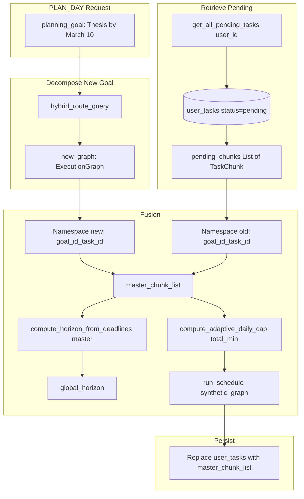

# Global Recalibration & Multi-Goal Task Fusion

## Problem

The system has "amnesia": each PLAN_DAY only schedules the goal mentioned in the current request. Goals added earlier (e.g., "Maths exam March 20", "Thesis March 10") are ignored. We need to fetch all pending tasks, merge with the new goal's decomposition, and schedule as one unified timeline with proper deadline prioritization.

---

## Architecture




---

## 1. Database Migration: Status and Full Chunk Persistence

**New migration**: `app/db/migrations/007_global_recalibration.sql`

```sql
-- Add status for pending/completed/cancelled
ALTER TABLE user_tasks ADD COLUMN IF NOT EXISTS status TEXT NOT NULL DEFAULT 'pending'
    CHECK (status IN ('pending', 'completed', 'cancelled'));

-- Full TaskChunk fields for retrieval and fusion
ALTER TABLE user_tasks ADD COLUMN IF NOT EXISTS duration_minutes INT DEFAULT 25;
ALTER TABLE user_tasks ADD COLUMN IF NOT EXISTS difficulty_weight FLOAT DEFAULT 0.5;
ALTER TABLE user_tasks ADD COLUMN IF NOT EXISTS dependencies JSONB DEFAULT '[]';
ALTER TABLE user_tasks ADD COLUMN IF NOT EXISTS deadline_hint TEXT;

CREATE INDEX IF NOT EXISTS idx_user_tasks_status ON user_tasks(user_id, status);
```

**Rationale**: `get_all_pending_tasks` needs to reconstruct `TaskChunk` objects. Store `duration_minutes`, `difficulty_weight`, `dependencies`, `deadline_hint` per row. `completion_criteria` and `implementation_intention` can be omitted for scheduling (solver only needs duration, difficulty, dependencies, deadline_hint).

---

## 2. Update _persist_decomposition_to_user_tasks

**File**: [app/services/analytical/control_policy.py](app/services/analytical/control_policy.py)

Extend the persisted row to include:

- `status`: always `'pending'` for new inserts
- `duration_minutes`: from `chunk.duration_minutes`
- `difficulty_weight`: from `chunk.difficulty_weight`
- `dependencies`: `chunk.dependencies` as JSON array
- `deadline_hint`: from `chunk.deadline_hint`; if null, resolve from `user_plan_updates` for this `goal_id` (optional enhancement)

Use **prefixed** `task_id`: `f"{goal_id}_{chunk.task_id}"` so collisions are avoided when merging.

---

## 3. Global Task Retrieval

**File**: New `app/services/analytical/task_retrieval.py` (or extend [app/services/extraction/behavioral_store.py](app/services/extraction/behavioral_store.py))

```python
def get_all_pending_tasks(user_id: str, supabase_client) -> list[TaskChunk]:
    """Fetch all pending tasks from user_tasks, hydrating to TaskChunk format."""
```

**Logic**:

1. Query `user_tasks` where `user_id=X` and `status='pending'`, ordered by `created_at` desc.
2. For each row: build `TaskChunk(task_id=row.task_id, title=..., duration_minutes=..., difficulty_weight=..., dependencies=..., deadline_hint=...)`. The `task_id` is already prefixed (goal_id_task_id) from persistence.
3. **Deduplication**: Same `(user_id, task_id)` may appear in multiple plans. Keep the latest per `task_id` (or per `(goal_id, original_task_id)`).
4. **Deadline enrichment**: If `deadline_hint` is null, optionally look up `user_plan_updates` for that `goal_id` and use `deadline_raw` as the hint for horizon/TMT.
5. Return `list[TaskChunk]`.

**Note**: `TaskChunk` requires `completion_criteria` and `implementation_intention`. For retrieved chunks, use placeholder `completion_criteria="(from prior plan)"` and `implementation_intention=None`. The solver does not use these.

---

## 4. Deadline Parser: Accept List of Chunks

**File**: [app/utils/deadline_parser.py](app/utils/deadline_parser.py)

Add overload or extend `compute_horizon_from_deadlines`:

```python
def compute_horizon_from_deadlines(
    graph: ExecutionGraph | None = None,
    chunks: list["TaskChunk"] | None = None,
    plan_start: datetime = ...,
    external_deadline: str | None = None,
    plan_deadlines: list[str] | None = None,
) -> int | None:
```

When `chunks` is provided, iterate `chunks` instead of `graph.decomposition` for `_consider(chunk.deadline_hint)`. Support both `graph` and `chunks`; `chunks` takes precedence if both provided.

---

## 5. Run Schedule: Accept List of Chunks (Refactor)

**File**: [app/api/v1/endpoints/schedule.py](app/api/v1/endpoints/schedule.py)

**Option A (minimal change)**: Keep `run_schedule(graph: ExecutionGraph, ...)`. In control policy, build a **synthetic ExecutionGraph**:

```python
synthetic_graph = ExecutionGraph(
    goal_metadata=graph.goal_metadata,  # use new goal
    decomposition=master_chunk_list,
    cognitive_load_estimate={
        "intrinsic_load": avg_intrinsic or 0.6,
        ...
    },
)
```

**Option B (cleaner)**: Add `run_schedule_from_chunks(chunks: list[TaskChunk], goal_metadata: GoalMetadata, daily_context, horizon_minutes, ...)` that internally builds the scheduler from chunks. `run_schedule` can call this.

Recommend **Option A** to avoid duplicating logic; `run_schedule` already iterates `graph.decomposition` and uses `_delay_hours_for_chunk` per chunk. TMT will automatically prioritize "Exam tomorrow" over "Project in 2 weeks" because `_delay_hours_for_chunk` uses `deadline_hint`.

---

## 6. Fusion Policy in _run_plan_day_flow

**File**: [app/services/analytical/control_policy.py](app/services/analytical/control_policy.py)

**Current flow**: decompose -> persist -> schedule.

**New flow**:

1. **Decompose** current `planning_goal` → `new_graph`.
2. **Namespace new chunks**: For each chunk in `new_graph.decomposition`, set `chunk.task_id = f"{goal_id}_{chunk.task_id}"` and update `chunk.dependencies` to use prefixed IDs. (Create new TaskChunk instances to avoid mutating the original.)
3. **Fetch pending**: `pending_chunks = get_all_pending_tasks(user_id, supabase)`.
4. **Exclude current goal's old tasks**: Pending includes tasks from ALL goals. When we're planning for goal "thesis", we're REPLACING that goal's decomposition with the new one. So filter: `pending_chunks = [c for c in pending_chunks if not _belongs_to_goal(c, goal_id)]`. How do we know? We need `goal_id` in the stored chunk. Store it in user_tasks (we have it). When hydrating, we can pass goal_id or infer from task_id prefix (e.g. `thesis_task_1` → goal `thesis`). So we filter by `task_id.startswith(f"{goal_id}_")`.
5. **Merge**: `master_chunk_list = list(pending_chunks) + list(new_prefixed_chunks)`.
6. **Global horizon**: `inferred_horizon = compute_horizon_from_deadlines(chunks=master_chunk_list, plan_start=..., external_deadline=..., plan_deadlines=...)`. If None, use extended steps as today.
7. **Global pacing**: `total_task_minutes = sum(c.duration_minutes for c in master_chunk_list)`. Pass to `run_schedule`; it already uses `compute_adaptive_daily_cap(horizon_minutes, total_task_minutes, ...)`.
8. **Synthetic graph**: `synthetic_graph = ExecutionGraph(goal_metadata=new_graph.goal_metadata, decomposition=master_chunk_list, cognitive_load_estimate=new_graph.cognitive_load_estimate)`.
9. **Schedule**: `run_schedule(synthetic_graph, daily_context, horizon_minutes=global_horizon, ...)` with horizon retry loop.
10. **Persist**: Replace strategy. Delete or mark superseded all `user_tasks` for this user with `status='pending'`. Insert fresh rows for each chunk in `master_chunk_list` (with prefixed task_id, goal_id, duration_minutes, etc.).

**Replace vs upsert**: To avoid orphaned rows from very old plans, we could: (a) DELETE all pending for user then INSERT master list, or (b) soft-delete by setting status='cancelled' for rows not in master, then INSERT new and UPDATE existing. Simpler: DELETE where user_id and status=pending, then INSERT master. Ensures DB reflects the current fused universe.

---

## 7. Task ID Namespace and Dependencies

When prefixing, `task_id` becomes `{goal_id}_{orig_id}`. Dependencies within the same goal become `{goal_id}_{dep_id}`. Dependencies across goals are not expected (old chunks are independent of new chunks). So:

- New chunks: `dependencies = [f"{goal_id}_{d}" for d in chunk.dependencies]`
- Old chunks: already stored with prefixed IDs; dependencies in DB are prefixed.

When hydrating from DB, ensure `dependencies` in the row are used as-is (they were persisted with prefixed IDs from the last fusion).

---

## 8. Response and Goal Metadata

`GenerateScheduleResponse` has `goal_metadata: GoalMetadata`. For a fused schedule we have multiple goals. Options:

- **A**: Use the new goal's metadata (user asked to plan "Thesis").
- **B**: Add `goal_ids: list[str]` to the response for the frontend to show which goals are in the schedule.

Recommend **A** for now; add **B** as optional enhancement so the UI can display "Thesis + Maths" in the schedule summary.

---

## 9. Task Completion API (Optional for MVP)

To mark tasks `completed` so they drop out of `get_all_pending_tasks`:

**New endpoint**: `PATCH /api/v1/tasks/{task_id}/status` with body `{"status": "completed"}`.

Requires `user_id` for IDOR. Updates `user_tasks` set status where user_id and task_id.

Can be deferred; without it, all tasks stay pending. User could "replan" to effectively clear by starting fresh (would need a "clear all" or similar).

---

## File Summary


| File                                             | Change                                                                             |
| ------------------------------------------------ | ---------------------------------------------------------------------------------- |
| `app/db/migrations/007_global_recalibration.sql` | **New** – status, duration_minutes, difficulty_weight, dependencies, deadline_hint |
| `app/services/analytical/control_policy.py`      | Persist full chunk; fusion flow; namespace; replace persistence                    |
| `app/services/analytical/task_retrieval.py`      | **New** – `get_all_pending_tasks`                                                  |
| `app/utils/deadline_parser.py`                   | `compute_horizon_from_deadlines` accepts `chunks: list[TaskChunk]`                 |
| `app/api/v1/endpoints/schedule.py`               | No change if synthetic graph used; else add `run_schedule_from_chunks`             |


---

## Implementation Order

1. Migration 007
2. `get_all_pending_tasks` in task_retrieval.py
3. Update `_persist_decomposition_to_user_tasks` to save full chunk + prefixed task_id
4. Extend `compute_horizon_from_deadlines` for `chunks` parameter
5. Fusion logic in `_run_plan_day_flow`: namespace, merge, exclude current goal's old tasks, synthetic graph, replace persistence
6. (Optional) Task completion endpoint

---

## Edge Cases

- **No pending tasks**: `master_chunk_list = new_chunks` only; behavior same as today.
- **Goal ID missing**: If `graph.goal_metadata.goal_id` is empty, use a slug from objective or `f"plan_{uuid4()}"` for namespace.
- **Dependency cycles across goals**: Not expected; each goal's chunks have internal deps only.
- **Duplicate task_ids across goals**: Prevented by prefixing with goal_id.

