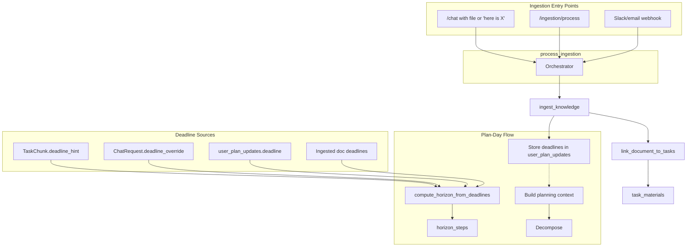

# Multi-Source Deadlines and Universal Ingestion Fusion

## Problem

1. **Deadlines only from same-message goal**: The scheduler horizon uses `deadline_hint` from TaskChunks, which the LLM infers only from the planning goal. Deadlines from later messages, ingestion (syllabus, email), or manual override never reach the scheduler.
2. **Ingestion disconnected from chat**: Knowledge ingestion (sample papers, DPP) runs via `/ingestion/process` but never from `/chat`. The brain-dump `has_knowledge` is a stub. When a user sends "Here's a sample paper for maths" in chat, it is not ingested or linked.
3. **Task-material linking exists but chat doesn't trigger it**: `link_document_to_tasks` runs when `process_ingestion(KNOWLEDGE_INGESTION)` executes with `user_id`. The dedicated ingestion API supports this, but chat does not route knowledge content to ingestion.
4. **No goal-level persistence for updates**: `user_tasks` has no `deadline` or `goal_id`. There is no place to store "exam March 20" from a later message or ingestion, linked to the goal (e.g. math_midsem_prep), for use in future planning.

---

## Architecture Overview




---

## Part 1: Multi-Source Deadline Layer

### 1.1 Goal-Level Deadline Storage

**Rationale:** Schedules are ephemeral (generated daily), but **goals are persistent**. The Socratic Chunker already generates `goal_id` (e.g. `math_midsem_prep`). Using `goal_id` lets deadlines from later ingestion (e.g. Math DPP upload) link directly to the goal.

**New migration:** `006_user_plan_updates.sql`

```sql
CREATE TABLE IF NOT EXISTS user_plan_updates (
    id UUID PRIMARY KEY DEFAULT gen_random_uuid(),
    user_id TEXT NOT NULL,
    goal_id TEXT,
    source TEXT NOT NULL,
    deadline_date DATE,
    deadline_raw TEXT,
    context_snippet TEXT,
    created_at TIMESTAMPTZ NOT NULL DEFAULT NOW()
);
CREATE INDEX idx_user_plan_updates_user ON user_plan_updates(user_id);
CREATE INDEX idx_user_plan_updates_goal ON user_plan_updates(user_id, goal_id);
```

- `goal_id`: From `graph.goal_metadata.goal_id` (e.g. `math_midsem_prep`). Null = "apply to next plan".
- `source`: `"ingestion"` | `"chat"` | `"manual"` | `"action_item"`
- `deadline_date`: Parsed ISO date for horizon computation
- `deadline_raw`: Original string (e.g. "March 20", "before Friday")
- `context_snippet`: Optional (e.g. "Exam from syllabus", "Slack message")

### 1.2 Manual Override

**File:** [app/api/v1/endpoints/chat.py](app/api/v1/endpoints/chat.py)

Add to `ChatRequest`:

```python
deadline_override: Optional[str] = Field(
    default=None,
    description="Manual deadline (ISO-8601 YYYY-MM-DD). Used for horizon if provided.",
)
```

**File:** [app/utils/deadline_parser.py](app/utils/deadline_parser.py)

Extend `compute_horizon_from_deadlines`:

```python
def compute_horizon_from_deadlines(
    graph: ExecutionGraph,
    plan_start: datetime,
    *,
    external_deadline: str | None = None,
    plan_deadlines: list[str] | None = None,
) -> int | None:
```

- Collect: (a) chunk.deadline_hint, (b) external_deadline (from override), (c) plan_deadlines (from user_plan_updates)
- Take max of all parseable future dates
- Return `min(horizon_min, MAX_HORIZON_MINUTES)`

**File:** [app/services/analytical/control_policy.py](app/services/analytical/control_policy.py)

- Pass `deadline_override` from `ChatRequest` through `execute_agentic_flow` and `_run_plan_day_flow`
- Query `user_plan_updates` for `user_id` (and optionally `goal_id` once graph is built)
- Call `compute_horizon_from_deadlines(graph, plan_start, external_deadline=override, plan_deadlines=from_db)`

### 1.3 Ingestion Injects Deadlines

**File:** [app/services/extraction/orchestrator.py](app/services/extraction/orchestrator.py)

After `ingest_knowledge` returns (KNOWLEDGE_INGESTION path):

- If `kr.deadlines` is non-empty and `user_id` is present:
  - Parse each via `parse_deadline_to_date` from [app/utils/deadline_parser.py](app/utils/deadline_parser.py)
  - Resolve `goal_id`: when `link_document_to_tasks` returns matched task_ids, query `user_tasks` for those tasks and take the `goal_id` (tasks belong to one goal). If no match, use `goal_id=null`.
  - Insert into `user_plan_updates` with `source="ingestion"`, `goal_id`, `context_snippet` from doc summary

### 1.4 Chat Message Updates Deadline

**File:** [app/schemas/context.py](app/schemas/context.py) – `BrainDumpExtraction`

Add optional:

```python
deadline_update: Optional[str] = Field(
    default=None,
    description="User mentions a new deadline (e.g. 'exam is March 20'). Extract as ISO if possible.",
)
```

**File:** [app/services/analytical/control_policy.py](app/services/analytical/control_policy.py)

- In `BRAIN_DUMP_EXTRACTION_PROMPT`: "deadline_update: If the user mentions a deadline, due date, or exam date, extract it as ISO-8601 (YYYY-MM-DD)."
- In `execute_agentic_flow`: If `extraction.deadline_update` and parseable:
  - Insert into `user_plan_updates` with `source="chat"` and `goal_id` from latest user goal (or null for "current" goal)
- When `_run_plan_day_flow` runs, query `user_plan_updates` for this user (and optionally match by goal_id once graph is built) and include in `plan_deadlines`

---

## Part 2: Universal Ingestion from Any Entry Point

### 2.1 Chat Triggers Ingestion for Knowledge Content

**Current gap:** `has_knowledge` is extracted but never used. Messages like "Here's a sample paper" or file attachments with study content do not trigger `process_ingestion`.

**File:** [app/services/analytical/control_policy.py](app/services/analytical/control_policy.py)

Add **Step 6b** after Step 6 (calendar):

```
If extraction.has_knowledge OR (extraction is file-only / content-only with no planning_goal):
  - Call process_ingestion with payload=user_prompt (or extracted file text), user_id, db_client
  - If intent becomes KNOWLEDGE_INGESTION: run full pipeline, link to tasks, store deadlines
  - Append ingestion_result to execution_summary
```

**Chat API extension:** Support file attachments.

**File:** [app/api/v1/endpoints/chat.py](app/api/v1/endpoints/chat.py)

Add optional:

```python
file_base64: Optional[str] = None
media_type: Optional[str] = None
```

- If `file_base64` + `media_type` provided, extract text via `extract_document`, append to `user_prompt` or pass separately to brain dump / ingestion
- Brain dump should set `has_knowledge=True` when the message or attachment indicates study materials, sample papers, syllabi, etc.

**Note on file size:** `file_base64` in JSON is fine for the unified `/chat` endpoint and typical PDFs. For very large files (e.g. 50MB+ PDFs), JSON parsing can get slow. Future option: multipart/form-data upload or a separate `/ingestion/upload` endpoint for large files.

### 2.2 Fallback Single-Intent for Knowledge-Only Messages

**File:** [app/services/analytical/control_policy.py](app/services/analytical/control_policy.py) – `_fallback_single_intent`

When `intent == IntentType.KNOWLEDGE_INGESTION`, `process_ingestion` is already called with `intent_override`. Ensure `user_id` is passed (it is, from the request).

### 2.3 Same Pipeline for All Entry Points

- `/chat` with knowledge content → `process_ingestion(payload=..., user_id=..., file_bytes=...)`
- `/ingestion/process` → same `process_ingestion`
- Future Slack/email webhook → same `process_ingestion`

All paths run: classify → ingest_knowledge → link_document_to_tasks → store deadlines in user_plan_updates (with goal_id from matched tasks).

---

## Part 3: Task-Material Linking and Context Fusion

### 3.1 Task-Material Linking (Already Implemented)

[app/services/extraction/task_material_linker.py](app/services/extraction/task_material_linker.py) already:

- Fetches `user_tasks` for `user_id`
- Embeds `document_topics` and task titles
- Links via cosine similarity
- Upserts into `task_materials`

**Requirement:** Any ingestion path that runs `process_ingestion(KNOWLEDGE_INGESTION)` with `user_id` must call `link_document_to_tasks`. This already happens in [orchestrator line 182-191](app/services/extraction/orchestrator.py).

### 3.2 Planning Context Enrichment

**File:** [app/services/analytical/control_policy.py](app/services/analytical/control_policy.py) – `_run_plan_day_flow`

Before `_call_decompose`, build enriched context:

1. **Deadlines** (already covered in Part 1)
2. **Linked materials**: Query `task_materials` for this user. For tasks that will be created from the upcoming decomposition, we don't have task_ids yet. Alternative: query Chroma / user_plan_updates for recent deadlines and inject as prefix to `planning_goal`:

```
   "[Context: Known deadline for this goal: 2026-03-20.] User goal: Study for maths mid-sem"
   

```

1. **Semantic match**: When `planning_goal` mentions "maths" and we have `user_plan_updates` with `context_snippet` containing "maths" or "Probability", we can inject: "Relevant materials and deadlines from your syllabus/ingestion have been considered."

**Concrete:** Create `_build_planning_context(user_id, planning_goal, supabase) -> str`:

- Query `user_plan_updates` for `user_id` (limit 10, order by created_at desc)
- Filter by topic overlap (simple keyword match: planning_goal vs context_snippet) or use latest
- Build prefix: "Deadline: YYYY-MM-DD (from syllabus). " if any parseable
- Return `prefix + planning_goal`

Pass this enriched string to `_call_decompose` instead of raw `planning_goal`.

### 3.3 Persist goal_id for Later Updates

**File:** [app/services/analytical/control_policy.py](app/services/analytical/control_policy.py) – `_persist_decomposition_to_user_tasks`

- Add `goal_id` to `user_tasks` (migration 006: `ALTER TABLE user_tasks ADD COLUMN goal_id TEXT`).
- When persisting, store `goal_id = graph.goal_metadata.goal_id` alongside each task.
- This enables: (1) ingestion-linked deadlines to attach to the correct goal; (2) querying `user_plan_updates` by `goal_id` when planning.

**File:** [app/services/analytical/control_policy.py](app/services/analytical/control_policy.py) – deadline from chat

- When `extraction.deadline_update` is parsed, resolve `goal_id`: use latest from `user_tasks` for this user (most recent `goal_id`), or null for "apply to next plan".

---

## Part 4: Action Item Deadline Extraction

**Current:** `ActionItemProposal.deadline_mentioned: bool` but no actual date.

**File:** [app/services/extraction/action_item_handler.py](app/services/extraction/action_item_handler.py)

- Extend `ActionItemExtraction` schema: `deadline_date: Optional[str] = None` (ISO-8601)
- Update prompt: "If deadline mentioned, set deadline_mentioned=true and deadline_date as YYYY-MM-DD when parseable."
- When `deadline_date` is present and user approves/links the action item, insert into `user_plan_updates` with `source="action_item"` and `goal_id` from user's current/latest goal (or null).

---

## Part 5: File Summary and Migration Order


| Component           | File(s)                                          | Change                                                                                                                        |
| ------------------- | ------------------------------------------------ | ----------------------------------------------------------------------------------------------------------------------------- |
| Goal updates table  | `app/db/migrations/006_user_plan_updates.sql`    | New table (goal_id); ALTER user_tasks ADD goal_id                                                                             |
| Deadline parser     | `app/utils/deadline_parser.py`                   | Add `external_deadline`, `plan_deadlines` params                                                                              |
| Chat API            | `app/api/v1/endpoints/chat.py`                   | Add `deadline_override`, optional `file_base64`/`media_type`                                                                  |
| Control policy      | `app/services/analytical/control_policy.py`      | Step 6b knowledge ingestion; deadline_update handling; `_build_planning_context`; pass override and plan deadlines to horizon |
| Brain dump schema   | `app/schemas/context.py`                         | Add `deadline_update` to BrainDumpExtraction                                                                                  |
| Brain dump prompt   | `app/services/analytical/control_policy.py`      | Extract deadline_update                                                                                                       |
| Orchestrator        | `app/services/extraction/orchestrator.py`        | After ingest_knowledge, insert deadlines into user_plan_updates                                                               |
| Action item handler | `app/services/extraction/action_item_handler.py` | Add `deadline_date` extraction                                                                                                |


---

## Part 6: Edge Cases and Testing

- **No user_id on ingestion**: Skip user_plan_updates and task-material linking; still store in Chroma
- **Multiple deadline sources**: Max (furthest) wins; all contribute to horizon
- **Past deadline in user_plan_updates**: Filter out in query or in compute_horizon
- **Sample paper before any plan**: Stored in Chroma, no task link (no user_tasks). When user later plans "Study maths", new tasks are created; next ingestion of related doc will link. No retroactive link for pre-existing Chroma docs without user_tasks
- **Same document re-ingested**: task_materials upsert on (user_id, task_id, source_id) prevents duplicates

---

## Implementation Order

1. Migration 006, deadline parser extension, ChatRequest.deadline_override, control policy wiring (Part 1.1, 1.2, 2.1 partial)
2. Orchestrator: insert deadlines into user_plan_updates after ingest (Part 1.3)
3. Brain dump deadline_update extraction and storage (Part 1.4)
4. Chat knowledge ingestion step 6b and file support (Part 2.1)
5. _build_planning_context for enriched decompose prompt (Part 3.2)
6. Action item deadline_date extraction (Part 4)

