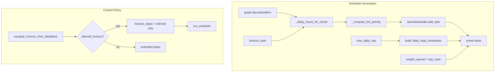

# Pacing, TMT from Deadlines, and Spread Improvements

## Goals

1. **TMT from deadlines** – Tasks nearer their deadline get higher priority (scheduled earlier).
2. **Max daily deep-work cap** – Hard limit on scheduled work per day to avoid cramming.
3. **Spread preference** – Soft objective to minimize peak daily load, distributing work across days.
4. **Horizon retry optimization** – When deadline is known, skip redundant shorter horizons.

---

## 1. TMT from Deadlines

**Current:** All chunks use `DEFAULT_DELAY_HOURS = 24` in [app/api/v1/endpoints/schedule.py](app/api/v1/endpoints/schedule.py).

**Change:** Compute `delay_hours` per chunk from `chunk.deadline_hint` and `horizon_start`.

**Implementation:**

- Add `_delay_hours_for_chunk(chunk, horizon_start)` in [app/api/v1/endpoints/schedule.py](app/api/v1/endpoints/schedule.py):
  - Import `parse_deadline_to_date` from [app/utils/deadline_parser.py](app/utils/deadline_parser.py).
  - If `chunk.deadline_hint` parses to a date, compute `hours = (deadline_date - horizon_start).total_seconds() / 3600`.
  - Use `max(1.0, hours)` to avoid division-by-zero and floor at 1h.
  - Else return `DEFAULT_DELAY_HOURS`.
- In `run_schedule`, replace the TMT loop to pass per-chunk delay:

```python
for chunk in graph.decomposition:
    delay_h = _delay_hours_for_chunk(chunk, resolved_horizon_start)
    tmt_raw, priority_score = _compute_tmt_priority(chunk.difficulty_weight, delay_h)
```

- **Edge cases:** Past deadlines → treat as `delay_hours = 1` (highest urgency). Invalid ISO → fall back to `DEFAULT_DELAY_HOURS`.

---

## 2. Max Daily Deep-Work Cap

**Current:** Solver has no per-day workload limit; it can pack unlimited work into early days.

**Change:** Add configurable `max_daily_deep_work_minutes` and enforce it in [app/core/or_tools/solver.py](app/core/or_tools/solver.py).

**Implementation:**

- Add to [app/core/config.py](app/core/config.py):  
`MAX_DEEP_WORK_MINUTES_PER_DAY: int = 360` (6 hours). Document that this is a mental-health safeguard.
- Extend `JarvisScheduler.__init`__ with `max_daily_deep_work_minutes: Optional[int] = None`. When `None`, skip daily-cap logic (backward compatible).
- Add `build_daily_load_constraints()`:
  - `num_days = ceil(horizon / 1440)`.
  - For each day `d` and each task `t`:
    - `b_t_d = model.new_bool_var(f"on_day_{t}_{d}")`
    - `day_start, day_end = d * 1440, (d + 1) * 1440`
    - `model.add(start_t >= day_start).only_enforce_if(b_t_d)`
    - `model.add(start_t < day_end).only_enforce_if(b_t_d)`
    - `contrib_t_d = model.new_int_var(0, duration_t, ...)`
    - `model.add(contrib_t_d == duration_t).only_enforce_if(b_t_d)`
    - `model.add(contrib_t_d == 0).only_enforce_if(b_t_d.Not())`
  - `load_d = sum(contrib_t_d for t)`; `model.add(load_d <= max_daily_deep_work_minutes)`.
- Call `build_daily_load_constraints()` from `solve()` when `max_daily_deep_work_minutes` is set.
- Wire through [app/api/v1/endpoints/schedule.py](app/api/v1/endpoints/schedule.py): add `max_daily_deep_work_minutes: Optional[int] = None` to `run_schedule` and `JarvisScheduler`. Default to `MAX_DEEP_WORK_MINUTES_PER_DAY` when horizon > 1 day.
- Add to [app/api/v1/endpoints/schedule.py](app/api/v1/endpoints/schedule.py) `ScheduleRequest`: optional `max_daily_deep_work_minutes` so clients can override.

**Note:** With a hard cap, some plans may become INFEASIBLE (e.g. 8h of work, 6h cap, single day). The existing INFEASIBLE handling (Socratic recalibration, horizon expansion) still applies.

---

## 3. Spread Preference (Soft Objective)

**Change:** When daily cap is enabled, also minimize peak daily load so the solver prefers spreading work over cramming.

**Implementation:**

- In [app/core/or_tools/solver.py](app/core/or_tools/solver.py), when `max_daily_deep_work_minutes` is set and we have `load_d` vars:
  - Add `max_load = model.new_int_var(0, horizon, "max_load")`.
  - For each day `d`: `model.add(max_load >= load_d)`.
  - Extend the objective: `obj += weight_spread * max_load` (e.g. `weight_spread = 5`).
  - Balance with existing terms: `weight_makespan * makespan + sum(priority*start) + weight_spread * max_load`.
- Tuning: `weight_spread` should be small enough that makespan and priority remain dominant but large enough to discourage cramming when feasible. Start with `weight_spread = 5`; `weight_makespan = 15`.

---

## 4. Horizon Retry Optimization

**Current:** When `inferred_horizon` exists, [app/services/analytical/control_policy.py](app/services/analytical/control_policy.py) still tries `[2880, 4320, 7200, inferred_horizon]` in order.

**Change:** When `inferred_horizon` is not `None`, use only `[inferred_horizon]` and skip shorter steps to avoid redundant INFEASIBLE attempts.

**Implementation:**

- In `_run_plan_day_flow` around lines 446–452:
  - Replace logic with: if `inferred_horizon is not None`, set `horizon_steps = [min(inferred_horizon, MAX_HORIZON_MINUTES)]` (single step).
  - Else keep existing `base_steps` / `extended_steps` logic.

---

## Data Flow




---

## File Summary


| File                                                                                   | Changes                                                                                                  |
| -------------------------------------------------------------------------------------- | -------------------------------------------------------------------------------------------------------- |
| [app/core/config.py](app/core/config.py)                                               | Add `MAX_DEEP_WORK_MINUTES_PER_DAY = 360`                                                                |
| [app/core/or_tools/solver.py](app/core/or_tools/solver.py)                             | `max_daily_deep_work_minutes` param; `build_daily_load_constraints()`; spread term in objective          |
| [app/api/v1/endpoints/schedule.py](app/api/v1/endpoints/schedule.py)                   | `_delay_hours_for_chunk()`; per-chunk delay in TMT loop; pass `max_daily_deep_work_minutes` to scheduler |
| [app/services/analytical/control_policy.py](app/services/analytical/control_policy.py) | When `inferred_horizon` set, use only that horizon step                                                  |


---

## Edge Cases

- **Single-day horizon (<= 1440 min):** Skip daily cap and spread logic; no per-day partitioning.
- **Past deadline in chunk:** `_delay_hours_for_chunk` returns 1 (urgent).
- **Cap too low:** INFEASIBLE → existing Socratic recalibration.
- **Direct POST /generate-schedule:** Uses `request.plan_start` (or now) for delay calc; `max_daily_deep_work_minutes` from request or config default.

---

## Testing

1. **TMT:** Unit test: chunk with `deadline_hint: "2026-03-20"`, `horizon_start` = 2026-03-05 → `delay_hours` ≈ 360.
2. **Daily cap:** Integration: 4h of tasks, 2-day horizon, 3h cap → work split across days.
3. **Horizon retry:** With `inferred_horizon = 21600` (15d), `horizon_steps` should be `[21600]` only.
4. **INFEASIBLE:** 10h tasks, 1-day horizon, 6h cap → 422 with existing message.

