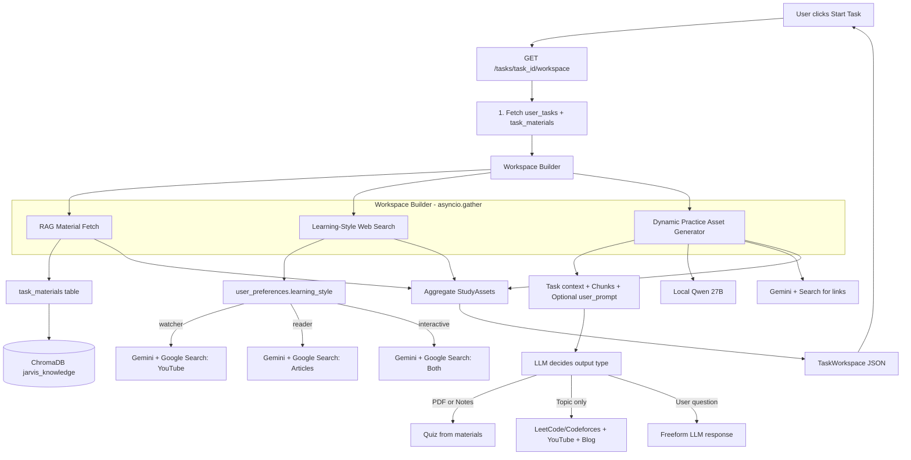
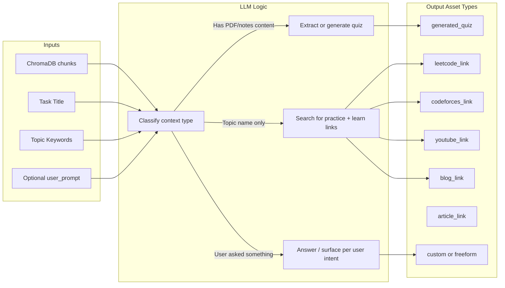
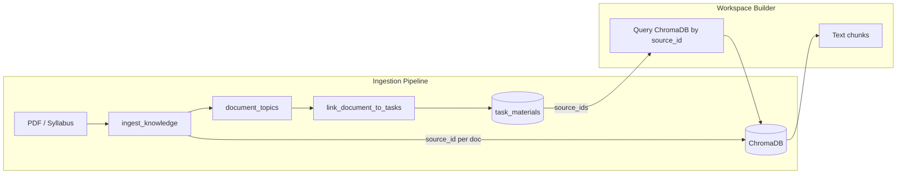
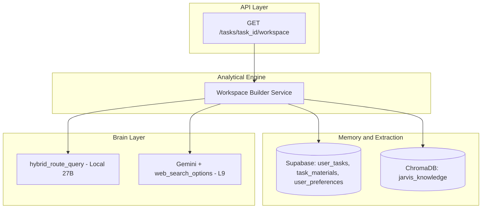

# Proactive Task Workspace & Just-in-Time Context Surfacing

## Summary

When a user clicks "Start Task" on a scheduled item (e.g., "Study Dijkstra's Algorithm", "Practice Sliding Window"), the system proactively assembles a workspace containing:

- **RAG material**: PDF chunks, lecture notes, or syllabus from ChromaDB (via `task_materials` links)
- **Curated web content**: YouTube videos (watcher) or articles (reader) via Gemini Google Search grounding
- **Dynamic practice assets**: Context-aware and user-driven. The LLM adapts based on:
  - **PDF/notes from tutor** → Extract or pick questions from multiple topics to generate a practice quiz
  - **Lecture notes** → Generate quiz from class materials
  - **Topic only** (e.g., "sliding window") → Suggest LeetCode/Codeforces problem links + YouTube + blog links to learn the concept
  - **User question** (optional freeform prompt) → LLM can surface anything: links, explanation, custom quiz, etc.

Target load time: under 5 seconds via `asyncio.gather()` concurrency.

---

## Architecture Diagrams

### High-Level Data Flow




### Dynamic Practice Asset Generator: Context-to-Output Mapping




### ChromaDB-to-Task Linking (Requires Refactor)




**Current gap**: ChromaDB stores `ids=["ingestion_0", "ingestion_1"]` (shared across ingestions) and `metadata.source = "ingestion"`. The `task_materials.source_id` (e.g. `ingestion_abc123`) is never stored in ChromaDB, so we cannot fetch "chunks linked to this task."

**Solution**: Refactor `ingest_knowledge` to accept `source_id`, generate it in the orchestrator before ingest, and store chunks with `ids=[f"{source_id}_{i}"]` and `metadata.source_id = source_id`. Then the workspace builder can `collection.get(where={"source_id": source_id})` for each linked source.

### Component Layering (per POLICY_ENGINE_ARCHITECTURE)




---

## Implementation Plan

### 1. User Learning Style Preference

**Files**: [app/schemas/context.py](app/schemas/context.py), new migration, optional preference service

- Add `LearningStyle = Literal["watcher", "reader", "interactive"]` and `UserProfile` (or extend an existing schema) with `learning_style: LearningStyle = "reader"`.
- **Storage**: New migration `006_user_preferences.sql`:

```sql
  CREATE TABLE user_preferences (
    user_id TEXT PRIMARY KEY,
    learning_style TEXT DEFAULT 'reader' CHECK (learning_style IN ('watcher', 'reader', 'interactive')),
    updated_at TIMESTAMPTZ DEFAULT NOW()
  );
  

```

- Add helper `get_learning_style(user_id) -> str` (e.g. in behavioral_store or new `app/services/user_preferences.py`). Default to `"reader"` if missing.

### 2. Task Workspace Schema

**File**: New [app/schemas/workspace.py](app/schemas/workspace.py)

```python
from pydantic import BaseModel
from typing import List, Literal, Optional

# Expanded asset types for dynamic practice surfacing
ASSET_TYPES = Literal[
    "pdf_chunk",           # RAG chunk from ingested PDF
    "youtube_link",        # Video tutorial
    "article_link",        # Article or documentation
    "blog_link",           # Blog post on concept
    "leetcode_link",       # LeetCode problem
    "codeforces_link",     # Codeforces problem
    "generated_quiz",      # Quiz from PDF/notes (picked or generated)
    "generated_content",   # Freeform LLM output (explanation, custom quiz, etc.)
]

class StudyAsset(BaseModel):
    asset_type: str  # One of ASSET_TYPES
    title: str
    content_or_url: str  # URL for links, markdown/text for generated content
    rationale: str  # e.g. "Matches your visual learning style", "From your syllabus Ch.4"
    metadata: Optional[dict] = None  # e.g. difficulty, topic for problems

class TaskWorkspace(BaseModel):
    task_id: str
    task_title: str
    primary_objective: str  # derived from title + topic_keywords
    surfaced_assets: List[StudyAsset]
```

### 3. ChromaDB Refactor: source_id Propagation

**Files**: [app/services/extraction/knowledge_ingester.py](app/services/extraction/knowledge_ingester.py), [app/services/extraction/orchestrator.py](app/services/extraction/orchestrator.py)

- Add `source_id: Optional[str] = None` to `ingest_knowledge()`. When provided, use it as the chunk ID prefix: `ids=[f"{source_id}_{i}"]` and store `source_id` in metadata.
- In [orchestrator.py](app/services/extraction/orchestrator.py): Generate `source_id = f"ingestion_{uuid.uuid4().hex[:12]}"` *before* calling `ingest_knowledge`, pass it in, then pass the same `source_id` to `link_document_to_tasks`.

### 4. RAG Fetch Helper

**File**: New or extend [app/services/extraction/knowledge_ingester.py](app/services/extraction/knowledge_ingester.py) (or workspace_builder)

- `async def fetch_chunks_for_task(user_id: str, task_id: str) -> list[str]`:
  - Query Supabase `task_materials` for `(user_id, task_id)` to get `source_id` list.
  - For each `source_id`, query ChromaDB: `collection.get(where={"source_id": source_id})` and collect `documents`.
  - Fallback: If no task_materials, do a semantic query: `collection.query(query_texts=[task_title + " " + " ".join(topic_keywords)], n_results=5)` to get relevant chunks anyway.
- Return list of chunk text strings.

### 5. Web Search with Gemini Grounding

**File**: [app/models/brain/litellm_conf.py](app/models/brain/litellm_conf.py) or new `app/services/analytical/web_search.py`

- Add `async def perform_learning_style_search(task_title: str, learning_style: str) -> list[StudyAsset]`:
  - Uses `litellm.acompletion` with `model=GEMINI_MODEL`, `web_search_options={"search_context_size": "medium"}`, `force_cloud=True` (or direct Gemini call).
  - Prompts:
    - **watcher**: "Search for the best highly-rated YouTube tutorial explaining {task_title}. Return the exact YouTube URL and a short title. Format: URL | Title"
    - **reader**: "Search for the best comprehensive written guide or documentation for {task_title}. Return the exact article URL and a short title. Format: URL | Title"
    - **interactive**: Request both 1 YouTube and 1 article; surface both.
  - Parse response to extract URLs and titles, return `List[StudyAsset]` with rationale like "Matches your watcher/reader learning style."

Note: LiteLLM supports `web_search_options` for `gemini/gemini-2.0-flash` and similar. Our config uses `GEMINI_MODEL` (e.g. `gemini/gemini-1.5-pro`); confirm which Gemini models support search or use `gemini-2.0-flash` for this path.

### 6. Dynamic Practice Asset Generator

**File**: [app/services/analytical/workspace_builder.py](app/services/analytical/workspace_builder.py)

Replace fixed DPP with a context-aware, LLM-driven generator that produces different asset types based on materials and user intent.

**Function**: `async def generate_practice_assets(chunks: list[str], task_title: str, topic_keywords: list[str], user_prompt: Optional[str] = None, learning_style: str = "reader") -> list[StudyAsset]`

**Context classification** (implicit in prompt; no separate classification step needed for MVP):

- **Has chunks** (PDF, syllabus, lecture notes): LLM extracts or picks questions from multiple topics to form a practice quiz. Prompt: "The user has these materials. Create a short practice quiz (3-5 questions) by picking or adapting questions from the content. Cover multiple topics if present. Format as markdown with numbered questions and expected answers."
- **No chunks, topic-only** (e.g., task title is "Practice Sliding Window"): Use Gemini + Google Search to find LeetCode/Codeforces problem links and learning resources (YouTube, blog, article). Prompt: "Search for: (1) 2-3 LeetCode or Codeforces problems on {topic}, (2) One YouTube tutorial, (3) One blog or article to learn the concept. Return structured: URL | Title | Rationale."
- **User prompt provided** (optional `user_prompt` on workspace request): Pass user question to LLM. It can surface links, generate a custom quiz, explain something, or combine. Keep response structured as `StudyAsset` list when possible; fallback to a single `generated_content` asset for freeform answers.

**Implementation approach**:

1. **Single LLM orchestration call** (local 27B): Rich system prompt describing all scenarios. Input = task_title, topic_keywords, chunks (truncated), user_prompt. Output = JSON list of `{asset_type, title, content_or_url, rationale}`. LLM picks the right strategy.
2. **Hybrid for links**: When chunks are empty and context suggests "topic-only" or user asks for links, delegate to Gemini + `web_search_options` to get real LeetCode/Codeforces/YouTube URLs. Parse response into `StudyAsset` list. Local model alone may hallucinate URLs; use Gemini for grounded search.
3. **Response schema**: Pydantic model `PracticeAssetsResponse = { assets: list[StudyAsset] }` for structured output.

### 7. Workspace Builder Service

**File**: New [app/services/analytical/workspace_builder.py](app/services/analytical/workspace_builder.py)

```python
async def build_task_workspace(
    user_id: str,
    task_id: str,
    user_prompt: Optional[str] = None,
) -> TaskWorkspace:
    # 1. Fetch task from user_tasks (title, topic_keywords)
    # 2. Fetch learning_style from user_preferences
    # 3. Concurrent: RAG chunks, learning_style (fast DB)
    chunks, learning_style = await asyncio.gather(
        fetch_chunks_for_task(user_id, task_id),
        get_learning_style(user_id),
    )
    
    # 4. Concurrent: Web Search (learning-style links), Dynamic Practice Assets
    web_assets, practice_assets = await asyncio.gather(
        perform_learning_style_search(task_title, learning_style),
        generate_practice_assets(
            chunks=chunks,
            task_title=task_title,
            topic_keywords=task.topic_keywords or [],
            user_prompt=user_prompt,
            learning_style=learning_style,
        ),
    )
    
    # 5. Build surfaced_assets: RAG chunks as pdf_chunk + web_assets + practice_assets
    # Return TaskWorkspace
```

**Concurrency**: RAG + learning_style first, then web search + practice generator in parallel. Practice generator uses both local 27B (quiz from chunks) and Gemini (links when topic-only) internally as needed.

### 8. Workspace Endpoint

**File**: New [app/api/v1/endpoints/workspace.py](app/api/v1/endpoints/workspace.py)

- Route: `GET /api/v1/tasks/{task_id}/workspace`
- Query params:
  - `user_id: str` (required, for IDOR protection)
  - `prompt: Optional[str]` – Optional user question or intent (e.g., "I need LeetCode problems on this", "What should I focus on today?") passed to the Dynamic Practice Asset Generator for freeform, user-driven surfacing
- Logic: Call `build_task_workspace(user_id, task_id, user_prompt=prompt)`, return `TaskWorkspace` JSON.
- Register in [app/api/v1/router.py](app/api/v1/router.py) with prefix `/tasks` or under an existing tasks router.

**Router structure**: Add a `tasks` or `workspace` router. For `GET /api/v1/tasks/{task_id}/workspace`, include workspace router with prefix `/tasks` and a sub-path.

### 9. Performance

- Use `asyncio.gather` for RAG fetch, web search, and DPP generation. Target <5s.
- Timeout: Consider `asyncio.wait_for(build_task_workspace(...), timeout=8.0)` to avoid long hangs; return partial workspace on timeout if feasible.

---

## File Summary


| File                                                         | Action                                                                                |
| ------------------------------------------------------------ | ------------------------------------------------------------------------------------- |
| `app/schemas/context.py`                                     | Add `LearningStyle`, optional `UserProfile`                                           |
| `app/schemas/workspace.py`                                   | **New** – `StudyAsset`, `TaskWorkspace`, expanded `ASSET_TYPES`                       |
| `app/db/migrations/006_user_preferences.sql`                 | **New** – `user_preferences` table                                                    |
| `app/services/extraction/knowledge_ingester.py`              | Add `source_id` param, propagate to ChromaDB                                          |
| `app/services/extraction/orchestrator.py`                    | Generate `source_id` before ingest, pass to both ingest and linker                    |
| `app/services/analytical/workspace_builder.py`               | **New** – `build_task_workspace`, `fetch_chunks_for_task`, `generate_practice_assets` |
| `app/services/analytical/web_search.py` or `litellm_conf.py` | **New/extend** – `perform_learning_style_search`; link search for LeetCode/Codeforces |
| `app/services/user_preferences.py` or `behavioral_store.py`  | **New/extend** – `get_learning_style`, `set_learning_style`                           |
| `app/api/v1/endpoints/workspace.py`                          | **New** – `GET /tasks/{task_id}/workspace` with optional `prompt` param               |
| `app/api/v1/router.py`                                       | Register workspace router                                                             |


---

## Order of Implementation

1. Migration 006 (user_preferences)
2. Schemas (context LearningStyle, workspace StudyAsset/TaskWorkspace)
3. ChromaDB refactor (source_id in ingester + orchestrator)
4. RAG fetch helper (fetch_chunks_for_task)
5. User preferences service (get_learning_style)
6. Web search helper (perform_learning_style_search)
7. Workspace builder (build_task_workspace, generate_dpp)
8. Workspace endpoint + router registration

---

## Practice Asset Scenarios (User-Reported)


| Context              | Materials                    | Example Output                                      |
| -------------------- | ---------------------------- | --------------------------------------------------- |
| PDF from tutor       | Multi-topic DPP/syllabus     | Quiz by picking questions from multiple topics      |
| Class lecture notes  | Notes in ChromaDB            | Generated quiz from lecture content                 |
| Topic name only      | None (e.g. "Sliding Window") | LeetCode/Codeforces links + YouTube + blog to learn |
| User asks a question | Any                          | LLM decides: links, explanation, custom quiz, etc.  |


The practice generator is intentionally dynamic: the same component handles all cases. Avoid fixed templates (e.g. "always 3 questions"); let the LLM adapt.

---

## Open Decisions

- **API path**: `GET /api/v1/tasks/{task_id}/workspace` vs `GET /api/v1/workspace/{task_id}` – either is fine; plan assumes a tasks-scoped path.
- **Learning style API**: Add `PATCH /api/v1/users/me/preferences` or similar to set `learning_style`? Out of scope for this plan but recommended for Phase 2.
- **Gemini search model**: `gemini-2.0-flash` supports `web_search_options` per LiteLLM docs; `gemini-1.5-pro` may differ. Use `GEMINI_MODEL` if supported, else add `GEMINI_SEARCH_MODEL` config for this flow.
- **Practice generator branching**: Single rich prompt vs explicit classify-then-generate. MVP favors single prompt; refine if quality suffers.

