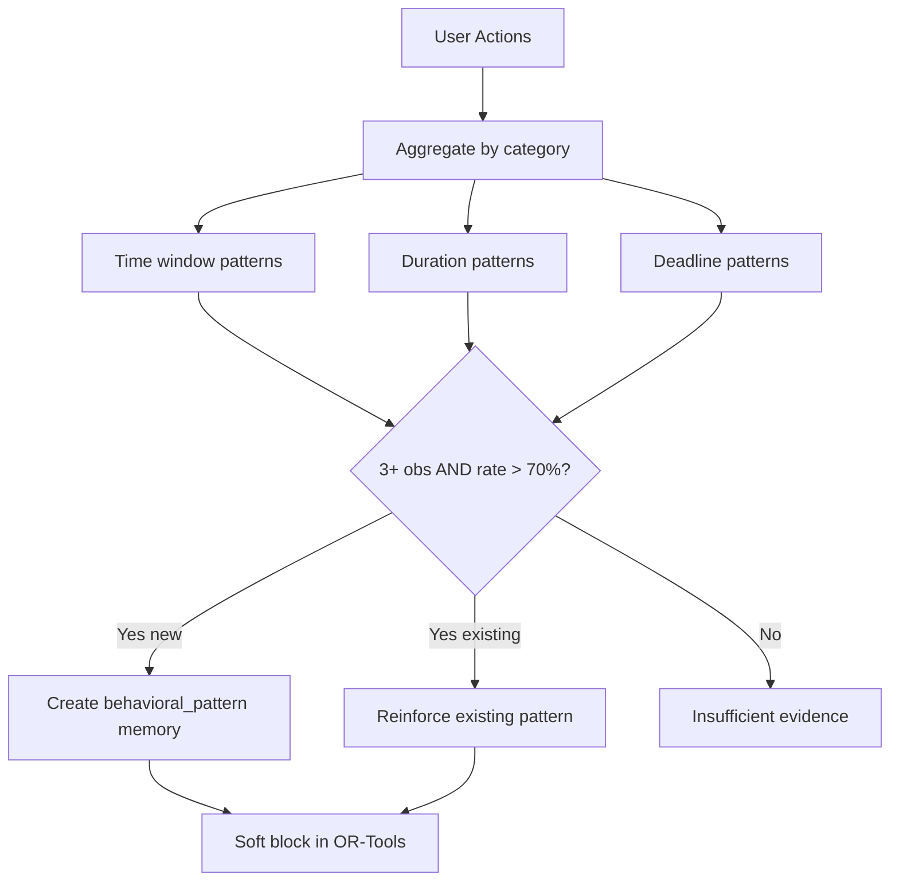
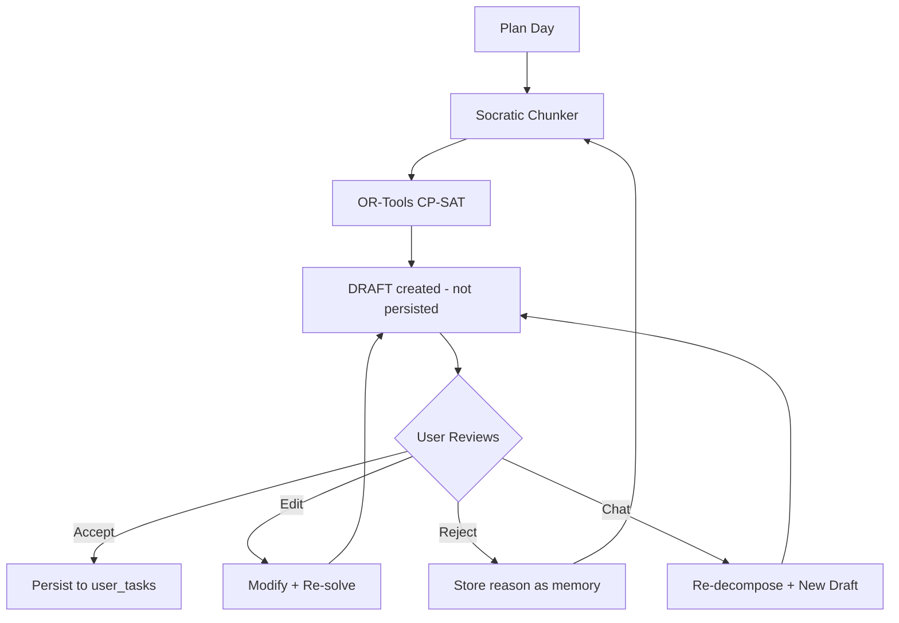

# Phase 1 Wiring — Connect Backend Modules to Live Request Path

> **For agentic workers:** REQUIRED SUB-SKILL: Use superpowers:subagent-driven-development (recommended) or superpowers:executing-plans to implement this plan task-by-task. Steps use checkbox (`- [ ]`) syntax for tracking.

**Goal:** Wire the Phase 1 memory system, memory extraction, memory-to-constraint bridge, PEARL pattern detection, and memory UI into the live `/chat` and `/chat/stream` endpoints so that the existing (tested) modules actually execute during user interactions.

**Architecture:** All modules exist and pass tests. The work is purely integration: initialize MemoryStore at startup, inject memory context into LLM prompts before pipeline execution, fire memory extraction after responses, feed memory constraints into the OR-Tools scheduler, and populate the `memories` field in ChatResponse so the frontend MemoryPanel renders.

**Tech Stack:** Python/FastAPI (backend), Next.js/React (frontend), Supabase (database), asyncio (concurrency)

---

## Current State (What's Working vs Missing)

| Component | Module | Tests | Wired into /chat |
|-----------|--------|-------|-------------------|
| MemoryStore CRUD | `app/services/memory/store.py` | ✅ | ❌ Not initialized in `main.py` |
| Memory retriever + scoring | `app/services/memory/retriever.py` | ✅ | ❌ `build_memory_context` doesn't exist |
| Memory extractor | `app/services/memory/extractor.py` | ✅ | ❌ Never called from `chat.py` |
| Constraint bridge | `app/services/memory/constraint_bridge.py` | ✅ | ❌ Never called from `control_policy.py` |
| PEARL detection | `app/services/memory/pearl.py` | ✅ | ❌ Never called after task events |
| Chat history | `app/services/chat_history.py` | ✅ | ✅ Fully wired |
| DraftStore | `app/services/draft_store.py` | ✅ | ✅ Wired (frontend uses localStorage + chat.py) |
| Frontend MemoryPanel | `components/MemoryPanel.tsx` | N/A | ❌ Reads `response.memories` but field never populated |
| Frontend model display | `components/JarvisResponse.tsx` | N/A | ✅ Works (minor 4B/27B label bug fixed) |

## File Map

| File | Action | Responsibility |
|------|--------|---------------|
| `app/main.py:45` | Modify | Add MemoryStore initialization to `app.state` |
| `app/services/memory/retriever.py` | Modify | Add `build_memory_context()` orchestrator function |
| `app/api/v1/endpoints/chat.py:110-200` | Modify | Inject memory context before pipeline; fire extraction after response |
| `app/services/analytical/control_policy.py:590-611` | Modify | Accept `memory_store` param in `_run_plan_day_flow`; call `memories_to_constraints` before scheduler |
| `app/services/analytical/control_policy.py:1095-1130` | Modify | Accept `memory_store` param in `execute_agentic_flow`; pass to `_run_plan_day_flow` |
| `app/schemas/context.py:215-273` | Modify | Add `memories` field to ChatResponse |
| `tests/test_memory_wiring.py` | Create | Integration test for the wiring (mock Supabase, verify flow) |

---

### Task 1: Initialize MemoryStore in app.state

**Files:**
- Modify: `app/main.py:43-54`

- [ ] **Step 1: Add MemoryStore import and initialization after DraftStore**

In `app/main.py`, after line 45 (DraftStore init), add:

```python
    # Initialize memory store (Supabase-backed archival memory)
    from app.services.memory.store import MemoryStore
    app.state.memory_store = MemoryStore(
        supabase_client=getattr(app.state.db_client, 'supabase', None)
    )
```

This goes right after:
```python
    app.state.draft_store = DraftStore(supabase_client=getattr(app.state.db_client, 'supabase', None))
```

And before:
```python
    from app.services.intent_registry import register_default_intents
```

- [ ] **Step 2: Verify server starts without error**

Run: `cd /Users/madhav/Jarvis-cursor/Jarvis-Engine && uvicorn app.main:app --reload --port 8000`

Expected: Server starts, prints `✅ Database connection successful` (or stub warning). No import errors.

- [ ] **Step 3: Commit**

```bash
git add app/main.py
git commit -m "feat: initialize MemoryStore in app.state at startup"
```

---

### Task 2: Create `build_memory_context` in retriever.py

**Files:**
- Modify: `app/services/memory/retriever.py`
- Test: `tests/test_memory_retriever.py`

- [ ] **Step 1: Write the failing test**

Add to `tests/test_memory_retriever.py`:

```python
def test_build_memory_context__returns_formatted_block():
    """build_memory_context fetches active memories, scores them, returns formatted string."""
    from app.services.memory.retriever import build_memory_context

    # Mock memory store with test memories
    class MockStore:
        def get_active_memories(self, user_id):
            return [
                {
                    "id": "m1", "user_id": "u1", "memory_type": "constraint",
                    "content": "No tasks between 2 PM and 3 PM",
                    "confidence": 0.9, "strength": 1.0, "stability": 2.0,
                    "last_reinforced": datetime.now(timezone.utc).isoformat(),
                },
                {
                    "id": "m2", "user_id": "u1", "memory_type": "goal",
                    "content": "Finish DSA by April",
                    "confidence": 0.8, "strength": 1.0, "stability": 1.0,
                    "last_reinforced": datetime.now(timezone.utc).isoformat(),
                },
                {
                    "id": "m3", "user_id": "u1", "memory_type": "fact",
                    "content": "CS student at VIT",
                    "confidence": 0.7, "strength": 0.5, "stability": 1.0,
                    "last_reinforced": datetime.now(timezone.utc).isoformat(),
                },
            ]

    store = MockStore()
    result = build_memory_context("u1", store)

    assert "What you know about this user" in result
    assert "No tasks between 2 PM and 3 PM" in result
    assert "Finish DSA by April" in result
    assert "CS student at VIT" in result


def test_build_memory_context__empty_memories():
    """build_memory_context returns empty string when no memories exist."""
    from app.services.memory.retriever import build_memory_context

    class EmptyStore:
        def get_active_memories(self, user_id):
            return []

    result = build_memory_context("u1", EmptyStore())
    assert result == ""
```

- [ ] **Step 2: Run test to verify it fails**

Run: `cd /Users/madhav/Jarvis-cursor/Jarvis-Engine && python -m pytest tests/test_memory_retriever.py::test_build_memory_context__returns_formatted_block -v`

Expected: FAIL — `ImportError: cannot import name 'build_memory_context'`

- [ ] **Step 3: Implement `build_memory_context` in retriever.py**

Add at the bottom of `app/services/memory/retriever.py`:

```python
def build_memory_context(user_id: str, memory_store) -> str:
    """Retrieve and format memories for LLM context injection.

    Called at the START of every /chat request.
    Returns a formatted string to inject into the LLM system prompt.

    Does NOT use embeddings for scoring (avoids blocking the hot path
    with ChromaDB calls). Instead, uses importance + confidence + recency
    to select memories. This is fast and good enough — the LLM does the
    semantic relevance filtering itself once memories are in context.
    """
    all_memories = memory_store.get_active_memories(user_id)
    if not all_memories:
        return ""

    current_time = datetime.now(timezone.utc)

    # Always-include memories (constraints, goals, patterns with high confidence)
    must_include = [
        mem for mem in all_memories
        if mem.get("memory_type") in ALWAYS_INCLUDE_TYPES
        and mem.get("confidence", 0) >= ALWAYS_INCLUDE_MIN_CONFIDENCE
        and mem.get("superseded_by") is None
    ]

    # Score remaining memories by recency × importance × confidence (no embedding)
    remaining = [m for m in all_memories if m not in must_include]
    scored = []
    for mem in remaining:
        recency = compute_memory_strength(mem, current_time)
        importance = IMPORTANCE_WEIGHTS.get(mem.get("memory_type", "fact"), 0.5)
        confidence = mem.get("confidence", 0.5)
        score = recency * importance * confidence
        scored.append((mem, score))

    scored.sort(key=lambda x: x[1], reverse=True)
    top_k = [mem for mem, _ in scored[:15]]

    # Merge and deduplicate
    final = deduplicate_memories(must_include + top_k)

    return format_memory_block(final)
```

- [ ] **Step 4: Run tests to verify they pass**

Run: `cd /Users/madhav/Jarvis-cursor/Jarvis-Engine && python -m pytest tests/test_memory_retriever.py -v`

Expected: All tests PASS including the two new ones.

- [ ] **Step 5: Commit**

```bash
git add app/services/memory/retriever.py tests/test_memory_retriever.py
git commit -m "feat: add build_memory_context for LLM prompt injection"
```

---

### Task 3: Add `memories` field to ChatResponse schema

**Files:**
- Modify: `app/schemas/context.py:270-273`

- [ ] **Step 1: Add the `memories` field to ChatResponse**

In `app/schemas/context.py`, after the `clarification_options` field (around line 273), add:

```python
    memories: Optional[List[dict]] = Field(
        default=None,
        description="Memories extracted from this conversation turn. Frontend renders in MemoryPanel.",
    )
```

- [ ] **Step 2: Verify existing tests still pass**

Run: `cd /Users/madhav/Jarvis-cursor/Jarvis-Engine && python -m pytest tests/test_core_pipeline.py tests/test_intent_routing.py -v`

Expected: All PASS (Optional field with default=None is backward-compatible).

- [ ] **Step 3: Commit**

```bash
git add app/schemas/context.py
git commit -m "feat: add memories field to ChatResponse for frontend MemoryPanel"
```

---

### Task 4: Wire memory context injection into chat.py

**Files:**
- Modify: `app/api/v1/endpoints/chat.py:107-146` (non-streaming endpoint)
- Modify: `app/api/v1/endpoints/chat.py:169-250` (streaming endpoint)

This is the critical integration — inject memory context into the LLM system prompt at the START of every request and fire memory extraction AFTER each response.

- [ ] **Step 1: Wire memory into the non-streaming `chat()` endpoint**

In `app/api/v1/endpoints/chat.py`, in the `chat()` function (around line 110), after fetching `draft_store`, add memory_store retrieval:

```python
    memory_store = getattr(http_request.app.state, "memory_store", None)
```

After `conversation_history = await build_context_messages(...)` (line 128), add memory context retrieval:

```python
    # Inject archival memory into conversation context
    memory_context = ""
    if memory_store:
        from app.services.memory.retriever import build_memory_context
        import asyncio
        memory_context = await asyncio.to_thread(build_memory_context, request.user_id, memory_store)
```

Pass `memory_context` to `execute_agentic_flow` by adding a new kwarg. After line 146 (`conversation_history=conversation_history,`), add:

```python
        memory_context=memory_context,
        memory_store=memory_store,
```

After `save_assistant_message` (line 153), add fire-and-forget memory extraction:

```python
    # Fire-and-forget: extract memories from this turn
    if memory_store:
        import asyncio
        from app.services.memory.extractor import safe_extract_memories
        asyncio.create_task(safe_extract_memories(
            request.user_id, request.user_prompt, response.message, memory_store,
        ))
```

- [ ] **Step 2: Wire memory into the streaming `chat_stream()` endpoint**

In the `chat_stream()` function (around line 172), after fetching `draft_store`, add:

```python
    memory_store = getattr(http_request.app.state, "memory_store", None)
```

Inside the `event_stream()` generator, after `conversation_history = await build_context_messages(...)` (line 191), add:

```python
        # Inject archival memory into conversation context
        memory_context = ""
        if memory_store:
            from app.services.memory.retriever import build_memory_context
            memory_context = await asyncio.to_thread(build_memory_context, request.user_id, memory_store)
```

In the `run_pipeline()` inner function (around line 219), pass `memory_context` and `memory_store` to `execute_agentic_flow`:

```python
                    memory_context=memory_context,
                    memory_store=memory_store,
```

After the `complete` event is yielded (after `save_assistant_message`), add fire-and-forget extraction. Before the final `yield f"event: complete\n..."` in each code path (GENERAL_QA at ~line 354, GREETING at ~line 377, VoJ at ~line 472), add:

```python
            # Fire-and-forget memory extraction
            if memory_store:
                _response_text = message_clean or partial.message or ""
                asyncio.create_task(safe_extract_memories(
                    request.user_id, request.user_prompt, _response_text, memory_store,
                ))
```

Also add at the top of `chat_stream` (inside event_stream) the import:

```python
        from app.services.memory.extractor import safe_extract_memories
```

- [ ] **Step 3: Verify server starts and handles a chat request**

Run: `cd /Users/madhav/Jarvis-cursor/Jarvis-Engine && uvicorn app.main:app --reload --port 8000`

Test with curl:
```bash
curl -X POST http://localhost:8000/api/v1/chat \
  -H "Content-Type: application/json" \
  -d '{"user_prompt": "hello", "user_id": "test-wiring"}'
```

Expected: 200 OK response with `intent: "GREETING"`.

- [ ] **Step 4: Commit**

```bash
git add app/api/v1/endpoints/chat.py
git commit -m "feat: wire memory retrieval and extraction into chat endpoints"
```

---

### Task 5: Wire memory context and memory_store into control_policy

**Files:**
- Modify: `app/services/analytical/control_policy.py:1090-1130` (`execute_agentic_flow` signature)
- Modify: `app/services/analytical/control_policy.py:590-611` (`_run_plan_day_flow` signature)

- [ ] **Step 1: Add `memory_context` and `memory_store` params to `execute_agentic_flow`**

In `app/services/analytical/control_policy.py`, find the `execute_agentic_flow` function signature (around line 1070-1095). Add two new parameters:

```python
    memory_context: str = "",
    memory_store: Optional[Any] = None,
```

Where the brain dump extraction prompt is constructed, prepend memory context. Find where `effective_prompt` is built (around line 1095-1098). After `effective_prompt` is set, add:

```python
    # Inject archival memory into the prompt so the LLM has user context
    if memory_context:
        effective_prompt = memory_context + "\n\n---\n\nUser message: " + effective_prompt
```

Pass `memory_store` through to `_run_plan_day_flow`. Find the call to `_run_plan_day_flow` (search for `_run_plan_day_flow(` in execute_agentic_flow). Add `memory_store=memory_store,` to its kwargs.

- [ ] **Step 2: Add `memory_store` param to `_run_plan_day_flow` and call `memories_to_constraints`**

In `_run_plan_day_flow` (line 590), add to the signature:

```python
    memory_store: Optional[Any] = None,
```

After the `_build_daily_context` function definition (line 674), add memory constraint injection:

```python
    # Inject memory-derived constraints (PEARL patterns + explicit constraints)
    memory_constraints: list[TimeSlot] = []
    if memory_store:
        from app.services.memory.constraint_bridge import memories_to_constraints
        import asyncio
        memory_constraints = await asyncio.to_thread(
            memories_to_constraints, user_id, memory_store
        )

    def _build_daily_context(horizon_minutes: int) -> list:
        ctx = expand_semantic_slots_to_time_slots(
            semantic_slots,
            horizon_minutes=horizon_minutes,
            plan_start=plan_start,
        )
        # Add memory-derived constraints
        ctx.extend(memory_constraints)
        if past_minutes > 0:
            past_slot = TimeSlot(
                name="past",
                start_min=0,
                end_min=past_minutes,
                availability=Availability.BLOCKED,
                recurring=False,
            )
            ctx.insert(0, past_slot)
        return ctx
```

Note: This replaces the existing `_build_daily_context` — the only change is adding `ctx.extend(memory_constraints)` before the past slot.

- [ ] **Step 3: Verify existing tests still pass**

Run: `cd /Users/madhav/Jarvis-cursor/Jarvis-Engine && python -m pytest tests/test_core_pipeline.py tests/test_intent_routing.py -v`

Expected: All PASS (new params have defaults).

- [ ] **Step 4: Commit**

```bash
git add app/services/analytical/control_policy.py
git commit -m "feat: wire memory context and constraint bridge into control policy"
```

---

### Task 6: Populate `memories` field in ChatResponse for frontend

**Files:**
- Modify: `app/api/v1/endpoints/chat.py`

The frontend MemoryPanel reads `response.memories` from the `complete` SSE event. We need to run memory extraction synchronously (not fire-and-forget) for the `complete` event and include the results.

- [ ] **Step 1: Add memories to the `complete` event in the streaming endpoint**

In the streaming endpoint's `event_stream()` generator, we already added fire-and-forget extraction. Instead, for the `complete` event, we should try to include memories. But extraction takes 2-5 seconds (LLM call), so we can't block.

Instead, use a simpler approach: include the **existing** memories (already stored) in the response. This is fast (DB query only).

In `event_stream()`, after memory_context is built, also fetch the memory list:

```python
        # Fetch existing memories for frontend MemoryPanel
        _existing_memories = []
        if memory_store:
            _existing_memories = await asyncio.to_thread(
                memory_store.get_active_memories, request.user_id
            )
```

Then, in every `partial_dict` construction before `yield f"event: complete\n..."`, add:

```python
            if _existing_memories:
                partial_dict["memories"] = [
                    {"memory_type": m.get("memory_type"), "content": m.get("content"), "confidence": m.get("confidence", 0.5)}
                    for m in _existing_memories[:20]
                ]
```

This goes before each `yield f"event: complete\ndata: {json.dumps(partial_dict)}\n\n"` line. There are 4 places in the stream handler where `complete` is emitted:
1. `awaiting_task_confirmation` path (~line 282)
2. GENERAL_QA path (~line 355)
3. GREETING path (~line 377)
4. VoJ/pipeline path (~line 472)

Add the memories injection before each one.

- [ ] **Step 2: Verify frontend shows memories**

1. Start backend: `cd /Users/madhav/Jarvis-cursor/Jarvis-Engine && uvicorn app.main:app --reload --port 8000`
2. Start frontend: `cd /Users/madhav/Jarvis-cursor/jarvis-demo && npm run dev`
3. Chat: "I'm a CS student and I hate mornings"
4. Wait for response to complete
5. Check: After the response, the memory extraction task should store memories. On the NEXT message, the MemoryPanel should show the extracted memories.

- [ ] **Step 3: Commit**

```bash
git add app/api/v1/endpoints/chat.py
git commit -m "feat: include existing memories in ChatResponse for frontend MemoryPanel"
```

---

### Task 7: Wire PEARL pattern detection after task completion/skip

**Files:**
- Modify: `app/api/v1/endpoints/chat.py` (accept-schedule handler)
- Modify: `app/api/v1/endpoints/tasks.py` (if it exists, or the task endpoints)

PEARL should detect patterns after user actions (task completion, skip, schedule acceptance). The simplest integration point is the `/chat/accept-schedule` endpoint.

- [ ] **Step 1: Find the task completion and accept-schedule endpoints**

Check if task completion endpoints exist:

```bash
cd /Users/madhav/Jarvis-cursor/Jarvis-Engine && grep -rn "def complete_task\|def skip_task\|accept_schedule" app/api/v1/endpoints/
```

- [ ] **Step 2: Add PEARL detection trigger after accept-schedule**

In the `accept_schedule` handler in `chat.py` (search for `accept-schedule` route), after tasks are persisted, add:

```python
    # Fire-and-forget: detect behavioral patterns from task history
    memory_store = getattr(http_request.app.state, "memory_store", None)
    if memory_store:
        import asyncio
        from app.services.memory.pearl import detect_patterns
        asyncio.create_task(asyncio.to_thread(
            detect_patterns, request.user_id, supabase, memory_store
        ))
```

- [ ] **Step 3: Add PEARL detection trigger after task skip (if endpoint exists)**

If a task skip endpoint exists, add the same fire-and-forget PEARL trigger.

- [ ] **Step 4: Commit**

```bash
git add app/api/v1/endpoints/chat.py
git commit -m "feat: trigger PEARL pattern detection after schedule acceptance"
```

---

### Task 8: Integration test for the full wiring

**Files:**
- Create: `tests/test_memory_wiring.py`

- [ ] **Step 1: Write integration test for memory wiring**

```python
"""Test that the memory system is properly wired into the live request path.

These tests verify the WIRING (imports, initialization, calling) rather than
the memory system logic itself (which is tested in test_memory_*.py).
"""

import pytest
from unittest.mock import MagicMock, AsyncMock, patch


def test_memory_store_initialized_in_app_state():
    """MemoryStore should be initialized in app.state during lifespan."""
    # Verify the import and initialization code exists in main.py
    import app.main
    source = open(app.main.__file__).read()
    assert "MemoryStore" in source, "main.py must import MemoryStore"
    assert "app.state.memory_store" in source, "main.py must set app.state.memory_store"


def test_chat_response_has_memories_field():
    """ChatResponse schema must have an optional memories field."""
    from app.schemas.context import ChatResponse
    fields = ChatResponse.model_fields
    assert "memories" in fields, "ChatResponse must have a 'memories' field"
    assert fields["memories"].default is None, "memories must default to None"


def test_build_memory_context_exists():
    """build_memory_context must be importable from retriever."""
    from app.services.memory.retriever import build_memory_context
    assert callable(build_memory_context)


def test_control_policy_accepts_memory_params():
    """execute_agentic_flow must accept memory_context and memory_store params."""
    import inspect
    from app.services.analytical.control_policy import execute_agentic_flow
    sig = inspect.signature(execute_agentic_flow)
    params = list(sig.parameters.keys())
    assert "memory_context" in params, "execute_agentic_flow must accept memory_context"
    assert "memory_store" in params, "execute_agentic_flow must accept memory_store"


def test_run_plan_day_flow_accepts_memory_store():
    """_run_plan_day_flow must accept memory_store param."""
    import inspect
    from app.services.analytical.control_policy import _run_plan_day_flow
    sig = inspect.signature(_run_plan_day_flow)
    params = list(sig.parameters.keys())
    assert "memory_store" in params, "_run_plan_day_flow must accept memory_store"
```

- [ ] **Step 2: Run tests**

Run: `cd /Users/madhav/Jarvis-cursor/Jarvis-Engine && python -m pytest tests/test_memory_wiring.py -v`

Expected: All PASS if Tasks 1-7 are complete.

- [ ] **Step 3: Run the full test suite to verify no regressions**

Run: `cd /Users/madhav/Jarvis-cursor/Jarvis-Engine && python -m pytest tests/ -v --ignore=tests/test_scheduler.py --ignore=tests/test_clarification.py --ignore=tests/test_draft_endpoints.py -x`

(Ignoring the 3 files that crash due to OR-Tools/Python 3.13 incompatibility — pre-existing issue.)

Expected: All existing tests still PASS.

- [ ] **Step 4: Commit**

```bash
git add tests/test_memory_wiring.py
git commit -m "test: add integration tests for memory system wiring"
```

---

### Task 9: Fix model display bug — synthesis_model for GENERAL_QA

**Files:**
- Modify: `app/api/v1/endpoints/chat.py:269-271`
- Modify: `app/services/analytical/control_policy.py:517`

The model display pipeline is working but has a bug: when the intent is GENERAL_QA in auto mode, the frontend shows "4B" instead of "27B" because two places hardcode SLM_ROUTER_MODEL.

- [ ] **Step 1: Fix `step` event in chat.py to use correct synthesis model**

In `chat.py` around line 269, find:

```python
        yield f"event: step\ndata: {json.dumps({'intent': partial.intent, 'stage': 'pipeline_done', 'model_mode': model_mode, 'synthesis_model': SLM_ROUTER_MODEL})}\n\n"
```

Replace with:

```python
        # GENERAL_QA uses 27B for the actual response; other intents use 4B for synthesis
        _synthesis_model = LOCAL_LLM_MODEL if partial.intent == "GENERAL_QA" else SLM_ROUTER_MODEL
        yield f"event: step\ndata: {json.dumps({'intent': partial.intent, 'stage': 'pipeline_done', 'model_mode': model_mode, 'synthesis_model': _synthesis_model})}\n\n"
```

- [ ] **Step 2: Fix fallback intent_classified event in control_policy.py**

In `control_policy.py` around line 517, find:

```python
    if progress_callback:
        await progress_callback("intent_classified", {"intent": intent.value, "fallback": True})
```

Replace with:

```python
    from app.core.config import LOCAL_LLM_MODEL
    _fallback_model = LOCAL_LLM_MODEL if intent == IntentType.GENERAL_QA else SLM_ROUTER_MODEL
    if progress_callback:
        await progress_callback("intent_classified", {"intent": intent.value, "fallback": True, "model": _fallback_model})
```

- [ ] **Step 3: Verify model display in frontend**

Start backend + frontend, send a GENERAL_QA query in auto mode. The model indicator should show "27B" during the response, not "4B".

- [ ] **Step 4: Commit**

```bash
git add app/api/v1/endpoints/chat.py app/services/analytical/control_policy.py
git commit -m "fix: show correct model (27B) for GENERAL_QA in auto mode"
```

---

### Task 10: Fix broken Mermaid diagrams in PITCH_ARCHITECTURE.md

**Files:**
- Modify: `docs/PITCH_ARCHITECTURE.md`

The pitch architecture document has broken Mermaid `stateDiagram-v2` diagrams. The parser chokes on:
1. **Double colons in transition labels** — e.g., `TasksActive --> BehaviorObserved: System observes: complete / skip / edit` (second `:` breaks parser)
2. **`e^()` notation in node labels** — `Decay["Strength = Initial x e^(-t / (stability x halflife))"]` (caret may break some renderers)

These are on lines 45, 90, 181, 226, 227, and 331.

- [ ] **Step 1: Fix double-colon transition labels**

Replace all double-colon transitions with single-colon labels (escape the second colon):

Line 45:
```
OLD: TasksActive --> BehaviorObserved: System observes: complete / skip / edit
NEW: TasksActive --> BehaviorObserved: System observes — complete, skip, edit
```

Line 226:
```
OLD: Persisted --> Replan: Background: replan remaining tasks
NEW: Persisted --> Replan: Background — replan remaining tasks
```

Line 227:
```
OLD: Persisted --> PearlObserve: PEARL: observe what was accepted/edited
NEW: Persisted --> PearlObserve: PEARL — observe what was accepted/edited
```

Line 331:
```
OLD: ProgressTracked --> PearlDetects: PEARL: CNN problems solved in 8 min avg
NEW: ProgressTracked --> PearlDetects: PEARL — CNN problems solved in 8 min avg
```

- [ ] **Step 2: Fix `e^()` notation in node labels**

Line 90 (inside note block — likely OK but sanitize for safety):
```
OLD: Recency = strength x e^(-t / (stability x 7days))
NEW: Recency = strength × exp(-t / (stability × 7days))
```

Line 181 (inside flowchart node label — this WILL break):
```
OLD: Decay["Strength = Initial x e^(-t / (stability x halflife))"]
NEW: Decay["Strength = Initial × exp(-t / stability × halflife)"]
```

- [ ] **Step 3: Verify all 10 diagrams render**

Open `docs/PITCH_ARCHITECTURE.md` in a Mermaid-capable viewer (VS Code preview, GitHub, or Mermaid Live Editor). All 10 diagrams should render without errors.

- [ ] **Step 4: Commit**

```bash
git add docs/PITCH_ARCHITECTURE.md
git commit -m "fix: repair broken Mermaid stateDiagram syntax in pitch architecture"
```

---

### Task 11: Update POLICY_ENGINE_ARCHITECTURE.md to reflect Phase 1 architecture

**Files:**
- Modify: `docs/POLICY_ENGINE_ARCHITECTURE.md`

The current POLICY_ENGINE_ARCHITECTURE.md still references the original architecture (Qwen-14B, no memory system, no registry, no draft UX). It needs to be updated to reflect the Phase 1 implementation.

- [ ] **Step 1: Update the intro and target architecture description**

Update the header text to reflect the Phase 1 architecture:
- Memory system (3-tier: working/recall/archival)
- Registry framework (intent, document, PEARL)
- Draft negotiation UX
- Gemini 2.5 Flash primary, Qwen-4B/27B fallback
- Remove references to "Qwen-14B" (we use Qwen-4B + Qwen-27B)

- [ ] **Step 2: Add Memory System diagram**

Add a new section after the existing diagrams:

```mermaid
flowchart TD
    subgraph MemRead [Memory Read — Every Request]
        ChatStart[/chat request] --> FetchActive[Fetch active memories]
        FetchActive --> Score[Score: Importance × Recency × Confidence]
        Score --> TopK[Top-K + always-include constraints/goals]
        TopK --> Inject[Inject into LLM system prompt]
    end

    subgraph MemWrite [Memory Write — After Response]
        Response[ChatResponse] --> Extract[Extract facts, prefs, patterns]
        Extract --> Dedup[Dedup: similarity > 0.85?]
        Dedup -->|New| Store[Store with confidence=0.5]
        Dedup -->|Existing| Reinforce[Reinforce: stability++]
    end

    subgraph Bridge [Memory to Constraint Bridge]
        Memories[(user_memories)] --> Constraints[Convert to TimeSlot]
        Constraints --> Solver[OR-Tools CP-SAT]
    end

    Inject --> Pipeline[execute_agentic_flow]
    Pipeline --> Response
    Store --> Memories
    Reinforce --> Memories
```

- [ ] **Step 3: Add PEARL Pattern Detection diagram**



- [ ] **Step 4: Add Draft Negotiation UX diagram**



- [ ] **Step 5: Update the existing diagrams to use correct model names**

Replace all references to:
- "Qwen-14B" → "Qwen-27B (local) / Gemini 2.5 Flash (primary)"
- "Local Powerhouse" → "Gemini 2.5 Flash + Local Qwen fallback"

- [ ] **Step 6: Commit**

```bash
git add docs/POLICY_ENGINE_ARCHITECTURE.md
git commit -m "docs: update architecture diagrams to reflect Phase 1 implementation"
```

---

### Task 12: Fix stateDiagram syntax in spec file (if any render issues)

**Files:**
- Modify: `docs/superpowers/specs/2026-03-28-jarvis-architecture-reset-design.md`

The spec has 9 Mermaid diagrams. The `stateDiagram-v2` at line 465 has `e^(-t / stability × 7days)` in a note block which may not render in some environments.

- [ ] **Step 1: Check and fix the memory state machine diagram**

Line 485 in the spec:
```
OLD: Recency = strength × e^(-t / stability × 7days)
NEW: Recency = strength × exp(-t / (stability × 7days))
```

- [ ] **Step 2: Verify all 9 spec diagrams render**

Open spec in VS Code preview or GitHub. All 9 diagrams should render.

- [ ] **Step 3: Commit**

```bash
git add docs/superpowers/specs/2026-03-28-jarvis-architecture-reset-design.md
git commit -m "fix: sanitize math notation in spec Mermaid diagrams"
```

---

## Execution Order

Tasks are organized by dependency. Tasks within the same group can run in parallel.

**Group A: Memory Wiring (sequential, each depends on previous)**
1. **Task 1** — MemoryStore init (everything else needs this)
2. **Task 2** — `build_memory_context` (chat.py needs this to inject context)
3. **Task 3** — ChatResponse `memories` field (frontend needs this)
4. **Task 4** — Wire into chat.py (the main integration)
5. **Task 5** — Wire into control_policy (memory constraints)
6. **Task 6** — Populate memories in response (frontend display)
7. **Task 7** — PEARL triggers (behavioral intelligence)
8. **Task 8** — Integration tests (verify everything)

**Group B: Bug Fixes and Docs (independent, can run in parallel with Group A)**
9. **Task 9** — Fix model display bug (4B/27B label for GENERAL_QA)
10. **Task 10** — Fix broken Mermaid diagrams in PITCH_ARCHITECTURE.md
11. **Task 11** — Update POLICY_ENGINE_ARCHITECTURE.md with Phase 1 diagrams
12. **Task 12** — Fix stateDiagram syntax in spec file

## What This Plan Does NOT Cover (Intentional)

- **Intent registry wiring** — The hardcoded if/elif works for the current intent set. Wiring the registry is a refactor, not a bug. Separate plan.
- **Draft endpoint fixes** — Frontend uses localStorage + chat.py endpoints, not the `/api/v1/drafts/` endpoints. They work for the demo. Separate plan.
- **Missing PEARL patterns** (duration_preference, deadline_buffer) — The 2 existing patterns work. Add more later.
- **Document handler implementations** — Stubs are fine for now. Separate plan.
- **Memory lifecycle/decay job** — Decay math works on-read. Background job is optimization, not critical path.
- **Async MemoryStore** — `asyncio.to_thread()` wrapping handles this adequately for now.
