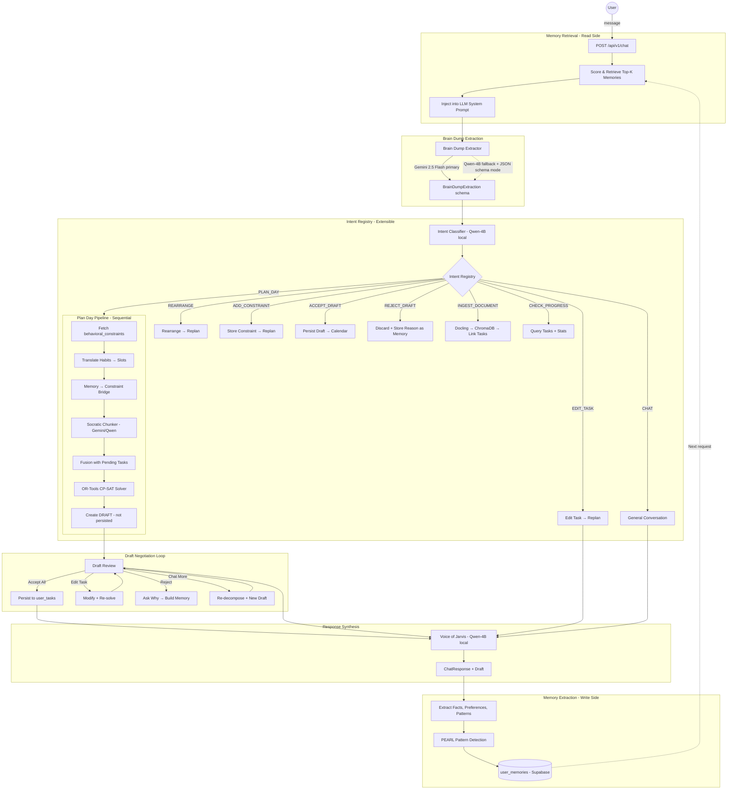
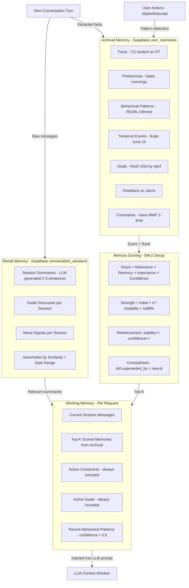
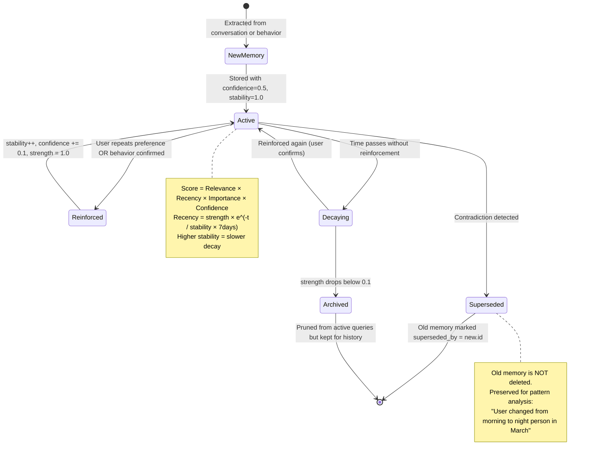
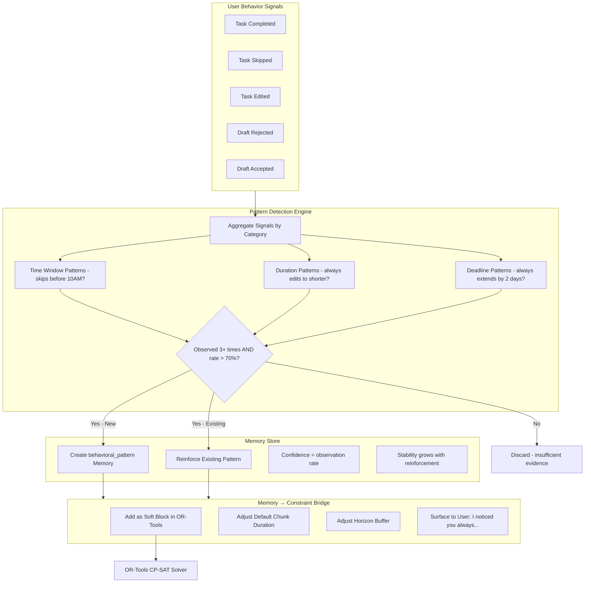
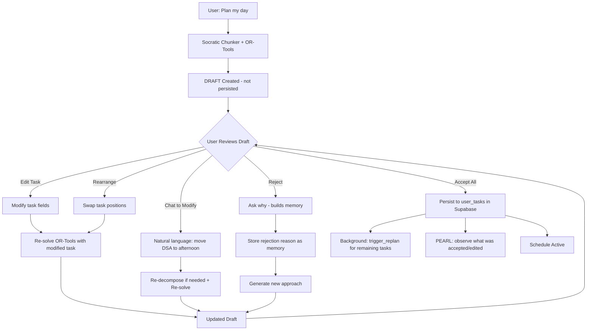
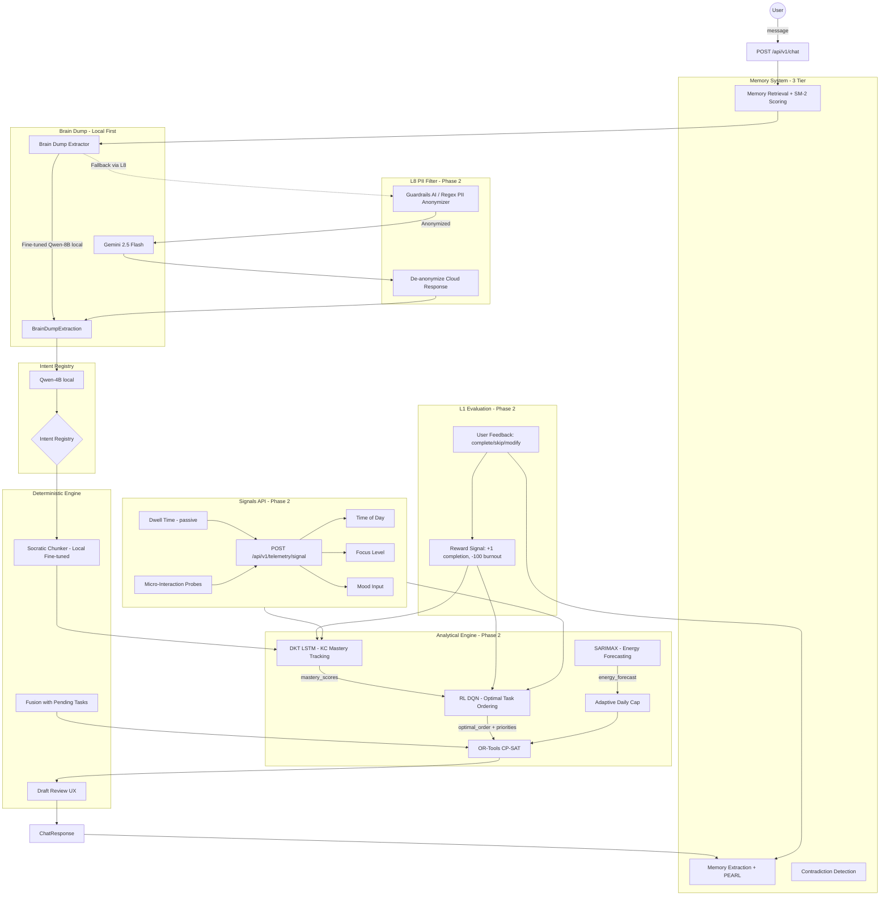

# Jarvis Architecture Reset — Design Spec

**Date:** 2026-03-28
**Author:** Madhav + Claude
**Status:** Draft — awaiting review

---

## Executive Summary

Jarvis has a solid vision but a fragile implementation. This spec defines a comprehensive architecture reset that:

1. **Stabilizes the core loop** — brain dump → decompose → schedule → draft review → persist
2. **Implements state-of-the-art memory & context** — 3-tier memory inspired by MemGPT, with SM-2 decay and PEARL behavioral inference
3. **Switches to reliable LLM routing** — Gemini 2.5 Flash primary, local Qwen fallback (inverted from current)
4. **Adds the negotiation UX** — accept/edit/reject/chat-more for proposed schedules
5. **Cuts stubs that create false complexity** — DKT, RL, SARIMAX, L8, L1 preserved in FUTURE_ARCHITECTURE.md
6. **Makes extensible intent routing** — registry pattern, not hardcoded if/elif
7. **Adds real tests** — integration tests for the full pipeline
8. **Updates ALL documentation** — honest status, no false claims

### Painkiller Thesis

The product is a painkiller for: **"I'm overwhelmed with what's on my plate — organize it for me and let me adjust."**

The moat is NOT the LLM. The moat is:
- **Deterministic scheduling** (OR-Tools CP-SAT — mathematically correct, not LLM guessing)
- **Anti-guilt psychology** (INFEASIBLE = recalibrate, not "you failed")
- **Negotiation UX** (propose → review → edit → accept — no competitor does this)
- **Behavioral inference** (PEARL: system observes you and adapts without being told)
- **Memory that changes system behavior** (not just recall — memories become scheduling constraints)

---

## What's Cut (Preserved in FUTURE_ARCHITECTURE.md)

These components are removed from the codebase and architecture docs. Full specifications are preserved in `docs/FUTURE_ARCHITECTURE.md` with math, training data requirements, integration points, and architecture diagrams showing where they plug in.

| Component | File | What's Preserved |
|-----------|------|-----------------|
| DKT LSTM | `app/models/analytical/dkt_lstm.py` | LSTM math: `y_t = σ(W_yh·h_t + b_y)`, input format `x_t = {q_t, a_t}`, KC mastery probability, training data schema, integration point (feeds difficulty_weight to TaskChunk) |
| RL DQN | `app/models/analytical/dqn_rl.py` | State space (chapters_remaining, time_until_deadline, energy_cycle), reward function (+1 completion, -100 burnout), policy `π(a|s)`, integration point (replaces TMT priority in CP-SAT) |
| SARIMAX | `app/models/forecast/capacity_ts.py` | Seasonality params (S=24 hourly, S=7 weekly, S=365 annual), exogenous variables (time-tracking, completion rates, mood), integration point (feeds compute_adaptive_daily_cap) |
| L8 PII Filter | Planned | Anonymization strategy: consistent placeholders per PII type, Guardrails AI or regex-based, gateway before cloud LLM calls |
| L1 Evaluation | Planned | Feedback signal design: user rates task quality 0-5, completion/skip/modify events as reward signals, Ragas/DeepEval metrics |
| Signals API | Planned | `POST /api/v1/telemetry/signal` — time, focus, mood inputs → RL reward/penalty + DKT user profile |

**When to bring them back:**
- DKT: When you have 100+ task completion events per user (enough training data)
- RL: When DKT is producing reliable mastery scores (RL needs DKT output)
- SARIMAX: When you have 4+ weeks of continuous usage data per user
- L8 PII: When you start sending user content to cloud (currently minimal)
- L1 Evaluation: When the core loop is stable and you need optimization signals

---

## Phase 1 Architecture — "Make It Work"

### Architecture Diagram (Phase 1)



### Core Loop (Text)

```
User sends message
       │
       ▼
┌──────────────────────┐
│   MEMORY RETRIEVAL   │  Retrieve relevant memories from user_memories
│   (read side)        │  Score: relevance × recency × importance × confidence
│   Top-K injection    │  Always include: active constraints, goals, patterns
└──────────┬───────────┘
           │
           ▼
┌──────────────────────┐
│   BRAIN DUMP         │  LLM: Gemini 2.5 Flash (primary)
│   EXTRACTION         │       Qwen-4B + JSON schema mode (local fallback)
│                      │  Output: BrainDumpExtraction (Pydantic)
└──────────┬───────────┘
           │
           ▼
┌──────────────────────┐
│   INTENT REGISTRY    │  LLM classifies into registered intents
│   CLASSIFICATION     │  Registry is extensible — add new intents by registration
│                      │  Fallback: CHAT (general conversation)
└──────────┬───────────┘
           │
           ├── PLAN_DAY ──────────────────────────────────────────────┐
           │                                                          │
           ├── EDIT_TASK ──► Modify task in Supabase → trigger_replan │
           │                                                          │
           ├── REARRANGE ──► Swap/move tasks → trigger_replan        │
           │                                                          │
           ├── ADD_CONSTRAINT ──► behavioral_constraints → replan    │
           │                                                          │
           ├── ACCEPT_DRAFT ──► Persist draft to calendar             │
           │                                                          │
           ├── REJECT_DRAFT ──► Discard + ask why (builds memory)    │
           │                                                          │
           ├── INGEST_DOCUMENT ──► Docling → ChromaDB → link tasks   │
           │                                                          │
           ├── CHECK_PROGRESS ──► Query tasks + completion stats      │
           │                                                          │
           └── CHAT ──► General conversation (memory extraction only) │
                                                                      │
                                                                      ▼
                                                        ┌──────────────────────┐
                                                        │   PLAN_DAY FLOW      │
                                                        │                      │
                                                        │   1. Fetch habits    │
                                                        │   2. Translate slots │
                                                        │      (Gemini/Qwen)  │
                                                        │   3. Decompose goal  │
                                                        │      (Gemini/Qwen)  │
                                                        │   4. Fusion with     │
                                                        │      pending tasks   │
                                                        │   5. OR-Tools solve  │
                                                        │   6. CREATE DRAFT    │
                                                        │      (not persist)   │
                                                        └──────────┬───────────┘
                                                                   │
                                                                   ▼
                                                        ┌──────────────────────┐
                                                        │   DRAFT REVIEW UX    │
                                                        │                      │
                                                        │   User can:          │
                                                        │   • Accept all       │
                                                        │   • Edit individual  │
                                                        │     tasks            │
                                                        │   • Reject + explain │
                                                        │   • Chat to modify   │
                                                        │   • Rearrange order  │
                                                        └──────────┬───────────┘
                                                                   │
                                                                   ▼
                                                        ┌──────────────────────┐
                                                        │   VOICE OF JARVIS    │
                                                        │   (Qwen-4B local)    │
                                                        │   Warm synthesis     │
                                                        └──────────┬───────────┘
                                                                   │
                                                                   ▼
                                                        ┌──────────────────────┐
                                                        │  MEMORY EXTRACTION   │
                                                        │  (write side)        │
                                                        │  Extract facts,      │
                                                        │  preferences,        │
                                                        │  detect patterns     │
                                                        └──────────────────────┘
```

### LLM Routing (Inverted from Current)

| Task | Primary | Fallback | Rationale |
|------|---------|----------|-----------|
| Brain dump extraction | Gemini 2.5 Flash | Qwen-4B + JSON schema mode | Schema reliability critical |
| Task decomposition (Socratic Chunker) | Gemini 2.5 Flash | Qwen-8B + JSON schema mode | Quality of decomposition matters most |
| Habit translation | Gemini 2.5 Flash | Qwen-4B | Structured output needed |
| Intent classification | Qwen-4B local (JSON schema mode) | Gemini 2.5 Flash | Fast, simple classification — local is fine |
| Voice of Jarvis synthesis | Qwen-4B local | Gemini 2.5 Flash | Creative text, local handles well |
| Memory extraction | Qwen-4B local | Gemini 2.5 Flash | Background task, doesn't need to be perfect |
| Real-time web search | Gemini 2.5 Flash | N/A | Only cloud can do this |

**Cost at scale:** Gemini 2.5 Flash free tier = 500 requests/day. For a solo developer building, this is plenty. At scale: ~$0.001 per request = $90/month for 1000 daily active users.

**Migration path to local:** Once stable, swap Gemini → local one-by-one per task. Validate each swap doesn't regress quality. The `hybrid_route_query` abstraction already supports this.

### Intent Registry System

```python
# app/services/intent_registry.py

from dataclasses import dataclass, field
from typing import Callable, Awaitable, Any

@dataclass
class IntentDefinition:
    name: str
    description: str                    # Used by LLM to classify
    handler: Callable[..., Awaitable[Any]]
    examples: list[str] = field(default_factory=list)
    requires_draft: bool = False        # Does this intent need an active draft?
    triggers_replan: bool = False       # Should this trigger background replan?

class IntentRegistry:
    _intents: dict[str, IntentDefinition] = {}

    @classmethod
    def register(cls, intent: IntentDefinition):
        cls._intents[intent.name] = intent

    @classmethod
    def get(cls, name: str) -> IntentDefinition | None:
        return cls._intents.get(name)

    @classmethod
    def all_for_classification(cls) -> str:
        """Generate classification prompt from all registered intents."""
        lines = []
        for name, defn in cls._intents.items():
            examples = ", ".join(defn.examples[:3])
            lines.append(f"- {name}: {defn.description} (e.g., {examples})")
        return "\n".join(lines)

    @classmethod
    def classify(cls, intent_name: str) -> IntentDefinition:
        """Look up handler for classified intent. Falls back to CHAT."""
        return cls._intents.get(intent_name, cls._intents["CHAT"])

# Registration happens at app startup (main.py lifespan)
# New intents added by creating a handler function + registering it
```

**Adding a new intent tomorrow:**

```python
# 1. Write the handler
async def handle_weekly_review(user_id: str, message: str, context: dict):
    # Query completed/skipped tasks for the week
    # Generate summary with LLM
    # Return ChatResponse
    ...

# 2. Register it (in main.py or a setup file)
IntentRegistry.register(IntentDefinition(
    name="WEEKLY_REVIEW",
    description="User wants to review their week's progress and accomplishments",
    handler=handle_weekly_review,
    examples=["how was my week", "weekly review", "what did I accomplish"],
))

# Done. The classifier will now recognize it. No other code changes needed.
```

---

## Memory & Context Architecture

### Design Principles

1. **Inspired by MemGPT** — 3-tier memory (working, recall, archival)
2. **Inspired by Zep** — contradiction detection, temporal awareness
3. **Novel: SM-2 decay** — memories fade if not reinforced (Ebbinghaus forgetting curve applied to AI memory)
4. **Novel: PEARL inference** — observe behavior patterns → create scheduling rules automatically
5. **Novel: Memory → Constraint bridge** — memories don't just inform responses, they change the OR-Tools solver constraints

Source code references for implementation patterns:
- Mem0: github.com/mem0ai/mem0 — `mem0/memory/main.py` (memory add/search/update logic)
- Zep: github.com/getzep/zep — `pkg/memory/` (fact extraction, contradiction resolution)
- Letta: github.com/letta-ai/letta — `letta/agent.py` (working memory management, context paging)

### Three-Tier Memory Model



```
┌─────────────────────────────────────────────────────────┐
│                   WORKING MEMORY                         │
│                                                          │
│  Current session messages + injected memories            │
│  Lives in: Python memory (per-request)                   │
│  Size: Limited by LLM context window                     │
│  Lifetime: Single session                                │
│                                                          │
│  Contents:                                               │
│  - Last N messages from current session                  │
│  - Top-K scored memories from archival store              │
│  - Active constraints (always included)                  │
│  - Active goals (always included)                        │
│  - Recent behavioral patterns (confidence > 0.6)         │
├─────────────────────────────────────────────────────────┤
│                   RECALL MEMORY                          │
│                                                          │
│  Past conversation summaries                             │
│  Lives in: Supabase conversation_sessions table          │
│  Size: Unlimited (grows over time)                       │
│  Lifetime: Permanent (but summaries, not raw messages)   │
│                                                          │
│  Contents:                                               │
│  - Session summaries (LLM-generated, 2-3 sentences)     │
│  - Goals discussed per session                           │
│  - Mood signals per session                              │
│  - Searchable by similarity + date range                 │
├─────────────────────────────────────────────────────────┤
│                   ARCHIVAL MEMORY                        │
│                                                          │
│  Structured, categorized, scored user knowledge          │
│  Lives in: Supabase user_memories table                  │
│  Size: Unlimited (but decayed — low-strength pruned)     │
│  Lifetime: Permanent until superseded or decayed         │
│                                                          │
│  Contents:                                               │
│  - Facts, preferences, constraints, goals                │
│  - Behavioral patterns (PEARL-inferred)                  │
│  - Temporal events (with expiry)                         │
│  - Feedback on Jarvis behavior                           │
│  - Each memory has: confidence, strength, stability      │
└─────────────────────────────────────────────────────────┘
```

### Database Schema

```sql
-- ===========================================
-- TIER 1: Working Memory (no table — in-memory per request)
-- ===========================================

-- ===========================================
-- TIER 2: Recall Memory
-- ===========================================

CREATE TABLE conversation_sessions (
    id              UUID PRIMARY KEY DEFAULT gen_random_uuid(),
    user_id         TEXT NOT NULL,
    started_at      TIMESTAMPTZ DEFAULT now(),
    ended_at        TIMESTAMPTZ,
    summary         TEXT,                 -- LLM-generated 2-3 sentence summary
    goals_discussed TEXT[],               -- extracted goal IDs referenced
    mood_signal     TEXT,                 -- 'positive' | 'neutral' | 'stressed' | 'frustrated'
    message_count   INTEGER DEFAULT 0,
    created_at      TIMESTAMPTZ DEFAULT now()
);

CREATE INDEX idx_sessions_user ON conversation_sessions(user_id, started_at DESC);

CREATE TABLE conversation_messages (
    id              UUID PRIMARY KEY DEFAULT gen_random_uuid(),
    user_id         TEXT NOT NULL,
    session_id      UUID NOT NULL REFERENCES conversation_sessions(id),
    role            TEXT NOT NULL CHECK (role IN ('user', 'assistant', 'system')),
    content         TEXT NOT NULL,
    intent_detected TEXT,                 -- classified intent for this message
    created_at      TIMESTAMPTZ DEFAULT now()
);

CREATE INDEX idx_messages_session ON conversation_messages(session_id, created_at);
CREATE INDEX idx_messages_user ON conversation_messages(user_id, created_at DESC);

-- ===========================================
-- TIER 3: Archival Memory
-- ===========================================

CREATE TABLE user_memories (
    id              UUID PRIMARY KEY DEFAULT gen_random_uuid(),
    user_id         TEXT NOT NULL,
    memory_type     TEXT NOT NULL CHECK (memory_type IN (
                        'fact', 'preference', 'behavioral_pattern',
                        'temporal_event', 'goal', 'feedback', 'constraint'
                    )),
    content         TEXT NOT NULL,        -- the actual memory text
    source          TEXT DEFAULT 'conversation', -- 'conversation' | 'behavior' | 'ingestion'
    source_id       UUID,                 -- links to conversation_messages.id or user_tasks.id

    -- SM-2 inspired scoring fields
    confidence      FLOAT DEFAULT 0.5,    -- 0.0 to 1.0, increases with reinforcement
    strength        FLOAT DEFAULT 1.0,    -- current memory strength (decays over time)
    stability       FLOAT DEFAULT 1.0,    -- reinforcement count (higher = slower decay)

    -- Lifecycle
    last_accessed   TIMESTAMPTZ DEFAULT now(),
    last_reinforced TIMESTAMPTZ DEFAULT now(),
    superseded_by   UUID REFERENCES user_memories(id),  -- contradiction chain
    expires_at      TIMESTAMPTZ,          -- for temporal_event type (e.g., "finals June 15")

    -- PEARL: for behavioral_pattern type
    observation_count INTEGER DEFAULT 1,  -- how many times this pattern was observed
    applied_as      TEXT,                 -- 'hard_constraint' | 'soft_preference' | NULL

    created_at      TIMESTAMPTZ DEFAULT now(),
    updated_at      TIMESTAMPTZ DEFAULT now()
);

CREATE INDEX idx_memories_user_type ON user_memories(user_id, memory_type);
CREATE INDEX idx_memories_user_active ON user_memories(user_id)
    WHERE superseded_by IS NULL AND strength > 0.1;
```

### Memory Lifecycle Diagram



### Memory Extraction Pipeline

Runs after each conversation turn. Uses a fast/cheap LLM (Qwen-4B or Gemini Flash) to extract structured memories.

```python
# app/services/memory/extractor.py

EXTRACTION_PROMPT = """
Analyze this conversation exchange and extract new information about the user.

EXISTING MEMORIES (what we already know):
{existing_memories}

CURRENT EXCHANGE:
User: {user_message}
Assistant: {assistant_response}

Extract ONLY genuinely new information. Do not repeat what we already know.
If the user contradicts an existing memory, mark it as a contradiction.

Return JSON array:
[
  {{
    "type": "fact|preference|behavioral_pattern|temporal_event|goal|feedback|constraint",
    "content": "concise statement of what was learned",
    "confidence": 0.5-1.0,
    "contradicts": "id of existing memory this contradicts, or null",
    "expires_at": "ISO date if temporal, or null"
  }}
]

Return empty array [] if nothing new was learned.
"""

async def extract_memories_from_turn(
    user_id: str,
    user_message: str,
    assistant_response: str,
    existing_memories: list[dict],
) -> list[dict]:
    """
    Extract structured memories from a conversation turn.

    Inspired by:
    - Mem0: mem0/memory/main.py — add() method with deduplication
    - Zep: pkg/memory/extractor.go — fact extraction pipeline
    """
    formatted_existing = "\n".join([
        f"[{m['id']}] ({m['memory_type']}) {m['content']}"
        for m in existing_memories[:20]  # Limit context
    ])

    prompt = EXTRACTION_PROMPT.format(
        existing_memories=formatted_existing or "None yet.",
        user_message=user_message,
        assistant_response=assistant_response,
    )

    memories = await hybrid_route_query(
        prompt=prompt,
        response_schema=MemoryExtractionResponse,
        prefer_local=True,  # Background task, local is fine
    )

    for mem in memories:
        if mem.contradicts:
            # Supersede old memory (Zep-inspired contradiction handling)
            await supersede_memory(mem.contradicts, new_content=mem.content)
        else:
            # Check for near-duplicates (Mem0-inspired dedup)
            similar = await find_similar_memory(user_id, mem.content, threshold=0.85)
            if similar:
                await reinforce_memory(similar.id)
            else:
                await store_memory(user_id, mem)

    return memories
```

### Memory Scoring & Retrieval

```python
# app/services/memory/retriever.py

import math
from datetime import datetime, timezone

IMPORTANCE_WEIGHTS = {
    'constraint': 1.0,           # Always critical for scheduling
    'behavioral_pattern': 0.9,   # PEARL insights — high value
    'preference': 0.8,           # User stated preferences
    'temporal_event': 0.8,       # Deadlines, exams — time-sensitive
    'goal': 0.7,                 # Active goals
    'fact': 0.6,                 # Background facts
    'feedback': 0.5,             # Feedback on Jarvis
}

# Types that are ALWAYS injected regardless of relevance score
ALWAYS_INCLUDE_TYPES = {'constraint', 'goal', 'behavioral_pattern'}
ALWAYS_INCLUDE_MIN_CONFIDENCE = 0.6

def compute_memory_strength(memory, current_time: datetime) -> float:
    """
    SM-2 inspired decay function.

    Memory_Strength(t) = Initial_Strength × e^(-t / (stability × base_halflife))

    - stability starts at 1.0, increases each time memory is reinforced
    - base_halflife = 7 days (one week)
    - A memory reinforced 5 times has stability=5, so half-life = 5 weeks

    Mathematical justification:
    - Ebbinghaus forgetting curve (1885): R = e^(-t/S) where S is stability
    - SM-2 algorithm (Wozniak, 1987): interval grows with each successful review
    - This applies the same proven curve to AI system memory
    """
    hours_since_reinforced = (
        current_time - memory.last_reinforced
    ).total_seconds() / 3600

    base_halflife_hours = 7 * 24  # 1 week in hours
    effective_halflife = memory.stability * base_halflife_hours

    return memory.strength * math.exp(-hours_since_reinforced / effective_halflife)


def score_memory(memory, query_embedding, memory_embedding, current_time) -> float:
    """
    Final score = Relevance × Recency × Importance × Confidence

    Inspired by:
    - Mem0: mem0/memory/main.py — search() scoring
    - MemGPT: Context window paging decisions
    """
    # Semantic relevance (cosine similarity)
    relevance = cosine_similarity(query_embedding, memory_embedding)

    # Time-decayed strength (SM-2 curve)
    recency = compute_memory_strength(memory, current_time)

    # Type-based importance
    importance = IMPORTANCE_WEIGHTS.get(memory.memory_type, 0.5)

    # Confidence from reinforcement history
    confidence = memory.confidence

    return relevance * recency * importance * confidence


async def build_memory_context(user_id: str, current_query: str) -> str:
    """
    Retrieve and format memories for LLM context injection.
    Called at the START of every /chat request.

    Returns a formatted string to inject into the system prompt.
    """
    # Get all active memories (not superseded, strength > 0.1)
    all_memories = await get_active_memories(user_id)

    if not all_memories:
        return ""

    current_time = datetime.now(timezone.utc)
    query_embedding = await embed(current_query)

    # Score each memory
    scored = []
    for mem in all_memories:
        mem_embedding = await embed(mem.content)  # Cache these
        score = score_memory(mem, query_embedding, mem_embedding, current_time)
        scored.append((mem, score))

    scored.sort(key=lambda x: x[1], reverse=True)

    # Always-include memories (constraints, goals, patterns with high confidence)
    must_include = [
        mem for mem in all_memories
        if mem.memory_type in ALWAYS_INCLUDE_TYPES
        and mem.confidence >= ALWAYS_INCLUDE_MIN_CONFIDENCE
        and mem.superseded_by is None
    ]

    # Top-K by score (configurable, default 15)
    top_k = [mem for mem, score in scored[:15]]

    # Merge and deduplicate
    final = deduplicate_memories(must_include + top_k)

    # Format for LLM
    return format_memory_block(final)


def format_memory_block(memories: list) -> str:
    """Format memories as a structured block for the LLM system prompt."""
    if not memories:
        return ""

    sections = {}
    for mem in memories:
        sections.setdefault(mem.memory_type, []).append(mem.content)

    lines = ["## What you know about this user:\n"]

    type_labels = {
        'constraint': 'Scheduling Constraints',
        'goal': 'Active Goals',
        'behavioral_pattern': 'Observed Patterns',
        'preference': 'Preferences',
        'temporal_event': 'Upcoming Events',
        'fact': 'Facts',
        'feedback': 'User Feedback on Jarvis',
    }

    for mem_type, label in type_labels.items():
        if mem_type in sections:
            lines.append(f"### {label}")
            for content in sections[mem_type]:
                lines.append(f"- {content}")
            lines.append("")

    return "\n".join(lines)
```

### Memory Reinforcement & Contradiction

```python
# app/services/memory/lifecycle.py

async def reinforce_memory(memory_id: str):
    """
    Called when a memory is confirmed by user behavior or repeated statement.
    Increases stability (slower future decay) and confidence.

    SM-2 analogy: This is like a successful review — next interval gets longer.
    """
    memory = await get_memory(memory_id)
    memory.stability += 1.0
    memory.confidence = min(1.0, memory.confidence + 0.1)
    memory.strength = 1.0  # Reset to full strength
    memory.last_reinforced = datetime.now(timezone.utc)
    await update_memory(memory)


async def supersede_memory(old_memory_id: str, new_content: str):
    """
    Called when a new memory contradicts an existing one.
    The old memory is NOT deleted — it's marked as superseded.
    This preserves the evolution history.

    Inspired by Zep's contradiction handling:
    - zep/pkg/memory/fact_resolver.go

    Example:
      Old: "User is a morning person"
      New: "User prefers working after 2 PM"
      Result: Old.superseded_by = New.id
              Old memory stays for historical analysis
              New memory is the active one
    """
    old_memory = await get_memory(old_memory_id)
    new_memory = await store_memory(old_memory.user_id, {
        "type": old_memory.memory_type,
        "content": new_content,
        "confidence": 0.6,  # Start moderate — needs reinforcement to grow
        "source": "contradiction",
    })
    old_memory.superseded_by = new_memory.id
    await update_memory(old_memory)
    return new_memory


async def decay_memories(user_id: str):
    """
    Background job: recalculate memory strengths.
    Prune memories with strength < 0.1 (effectively forgotten).

    Run periodically (e.g., daily) or on session start.
    """
    memories = await get_all_memories(user_id)
    current_time = datetime.now(timezone.utc)

    for mem in memories:
        new_strength = compute_memory_strength(mem, current_time)
        if new_strength < 0.1:
            # Memory has decayed below threshold — archive it
            await archive_memory(mem.id)
        else:
            mem.strength = new_strength
            await update_memory(mem)
```

### PEARL Behavioral Pattern Detection



```python
# app/services/memory/pearl.py

"""
PEARL-lite: Pattern detection from user behavior.

Reference: "PEARL: Self-Evolving Assistant for Time Management
with Reinforcement Learning" (arXiv 2601.11957v2)

Phase 1 implementation: Rule-based pattern detection.
Phase 2 (future): RL-based policy learning (see FUTURE_ARCHITECTURE.md).

The key insight: Don't wait for the user to tell you their preferences.
Observe their actions and infer rules.
"""

# Pattern detection thresholds
MIN_OBSERVATIONS = 3      # Need at least 3 instances to detect a pattern
MIN_PATTERN_RATE = 0.7    # Pattern must occur in 70%+ of opportunities

OBSERVABLE_PATTERNS = {
    "skip_time_window": {
        "signal": "user skips tasks scheduled in a specific time window",
        "query": """
            SELECT
                EXTRACT(HOUR FROM scheduled_start) as hour,
                COUNT(*) FILTER (WHERE status = 'skipped') as skipped,
                COUNT(*) as total
            FROM user_tasks
            WHERE user_id = :user_id
            AND scheduled_start IS NOT NULL
            GROUP BY hour
            HAVING COUNT(*) >= :min_observations
        """,
        "inference": "User avoids tasks during hour {hour} (skipped {rate}%)",
        "constraint_type": "soft_preference",
    },
    "duration_preference": {
        "signal": "user consistently edits task durations in one direction",
        "query": """
            SELECT
                AVG(edited_duration - original_duration) as avg_change,
                COUNT(*) as edit_count
            FROM task_edits
            WHERE user_id = :user_id
            HAVING COUNT(*) >= :min_observations
        """,
        "inference": "User prefers {direction} tasks (avg adjustment: {avg_change} min)",
        "constraint_type": "soft_preference",
    },
    "deadline_buffer": {
        "signal": "user consistently extends deadlines by similar amounts",
        "query": """
            SELECT
                AVG(new_deadline - original_deadline) as avg_extension_days,
                COUNT(*) as extension_count
            FROM deadline_changes
            WHERE user_id = :user_id
            HAVING COUNT(*) >= :min_observations
        """,
        "inference": "User typically needs {avg_extension} extra days (observed {count}x)",
        "constraint_type": "soft_preference",
    },
}


async def detect_patterns(user_id: str) -> list[dict]:
    """
    Scan user behavior data for recurring patterns.
    Create behavioral_pattern memories for detected patterns.

    Run after: task completion, task skip, task edit, schedule rejection.
    """
    detected = []

    for pattern_name, config in OBSERVABLE_PATTERNS.items():
        results = await db.execute(config["query"], {
            "user_id": user_id,
            "min_observations": MIN_OBSERVATIONS,
        })

        for row in results:
            rate = row.get("skipped", 0) / row.get("total", 1)
            if rate >= MIN_PATTERN_RATE:
                inference = config["inference"].format(**row)

                # Check if this pattern already exists
                existing = await find_similar_memory(
                    user_id, inference, memory_type="behavioral_pattern"
                )

                if existing:
                    # Reinforce existing pattern
                    await reinforce_memory(existing.id)
                    existing.observation_count += 1
                else:
                    # Create new pattern memory
                    await store_memory(user_id, {
                        "type": "behavioral_pattern",
                        "content": inference,
                        "confidence": min(0.9, rate),
                        "source": "behavior",
                        "applied_as": config["constraint_type"],
                        "observation_count": row.get("total", MIN_OBSERVATIONS),
                    })

                detected.append({"pattern": pattern_name, "inference": inference})

    return detected


async def apply_patterns_to_schedule(user_id: str, time_slots: list) -> list:
    """
    Inject PEARL-detected patterns as constraints into the scheduler.

    This is the BREAKTHROUGH: memories don't just inform responses —
    they change the mathematical constraints in OR-Tools.
    """
    patterns = await get_memories(
        user_id,
        memory_type="behavioral_pattern",
        min_confidence=0.6,
    )

    for pattern in patterns:
        if "avoids tasks during hour" in pattern.content:
            # Extract hour and add as soft block
            hour = extract_hour_from_pattern(pattern.content)
            time_slots.append(TimeSlot(
                start_min=hour * 60,
                end_min=(hour + 1) * 60,
                availability="minimal_work",  # Soft, not hard block
                source="pearl_pattern",
            ))

        elif "prefers shorter tasks" in pattern.content:
            # Adjust default chunk duration
            # This modifies the Socratic Chunker's target duration
            pass  # Handled in decomposition step

    return time_slots
```

### Memory → Scheduler Constraint Bridge

This is the novel component — memories directly affect the OR-Tools solver:

```python
# app/services/memory/constraint_bridge.py

"""
Bridge between archival memory and the deterministic scheduler.

This is what makes Jarvis different from ChatGPT's memory:
- ChatGPT memory: affects what the LLM says
- Jarvis memory: affects the MATHEMATICAL CONSTRAINTS in OR-Tools

A behavioral pattern like "user skips morning tasks" doesn't just make
Jarvis say "I notice you prefer afternoons" — it makes the scheduler
STOP SCHEDULING deep work before 10 AM.
"""

async def memories_to_constraints(user_id: str) -> list[TimeSlot]:
    """
    Convert relevant memories into TimeSlot constraints for OR-Tools.

    Called during _run_plan_day_flow, BEFORE run_schedule.
    """
    constraints = []

    # 1. Explicit constraints (user stated)
    explicit = await get_memories(user_id, memory_type="constraint")
    for mem in explicit:
        slot = await parse_constraint_to_timeslot(mem.content)
        if slot:
            constraints.append(slot)

    # 2. PEARL behavioral patterns (system inferred)
    patterns = await get_memories(
        user_id,
        memory_type="behavioral_pattern",
        min_confidence=0.6,
    )
    for pattern in patterns:
        slot = await parse_pattern_to_timeslot(pattern)
        if slot:
            # Inferred patterns are SOFT constraints, not hard blocks
            slot.availability = "minimal_work"
            slot.source = "pearl_inferred"
            constraints.append(slot)

    # 3. Temporal events (deadlines, exams)
    events = await get_memories(
        user_id,
        memory_type="temporal_event",
        not_expired=True,
    )
    for event in events:
        # Temporal events affect horizon computation, not time slots
        pass  # Handled separately in compute_horizon_from_deadlines

    return constraints
```

---

## Draft Negotiation UX

### Flow Diagram



### Flow (Text)

```
User: "Plan my day — I need to study DSA and write my essay"
                    │
                    ▼
            Jarvis decomposes + schedules
                    │
                    ▼
            Returns DRAFT (not persisted):
            ┌─────────────────────────────┐
            │  Draft #d7f2...             │
            │                             │
            │  09:00 - 09:25  DSA: Arrays │  [edit] [skip]
            │  09:30 - 09:55  DSA: Trees  │  [edit] [skip]
            │  10:00 - 10:25  Essay: Outline│ [edit] [skip]
            │  10:30 - 10:55  Essay: Draft │  [edit] [skip]
            │  ...                        │
            │                             │
            │  [Accept All] [Reject] [Chat to Modify]
            └─────────────────────────────┘
                    │
        ┌───────────┼───────────┬────────────┐
        ▼           ▼           ▼            ▼
    Accept All    Edit Task   Reject      Chat More
        │           │           │            │
    Persist to    Modify +    Ask why      User says
    user_tasks    re-solve    (builds      "move DSA
        │         schedule    memory)      to afternoon"
        │           │           │            │
        ▼           ▼           ▼            ▼
    Done       New Draft    PEARL notes   Re-decompose
               proposed     preference    + new Draft
```

### Draft Schema

```python
# app/schemas/draft.py (update existing)

class DraftSchedule(BaseModel):
    draft_id: str
    user_id: str
    goal_id: str | None
    tasks: list[DraftTask]
    horizon_start: datetime
    created_at: datetime
    status: Literal["pending", "accepted", "rejected", "modified"]
    rejection_reason: str | None = None  # If rejected, why? (builds memory)

class DraftTask(BaseModel):
    task_id: str
    title: str
    start_min: int
    duration_minutes: int
    difficulty_weight: float
    completion_criteria: str
    editable_fields: list[str] = ["title", "duration_minutes", "start_min", "difficulty_weight"]

class DraftAction(BaseModel):
    """User action on a draft."""
    action: Literal["accept_all", "reject", "edit_task", "rearrange", "chat_modify"]
    draft_id: str
    task_id: str | None = None          # For edit_task
    edits: dict | None = None           # For edit_task: {"duration_minutes": 15}
    reason: str | None = None           # For reject: why?
    modification_request: str | None = None  # For chat_modify: natural language
```

### Draft Endpoints

```
POST /api/v1/drafts/{draft_id}/accept     → Persist all tasks to user_tasks
POST /api/v1/drafts/{draft_id}/reject     → Discard + store rejection reason as memory
PATCH /api/v1/drafts/{draft_id}/tasks/{task_id}  → Edit task + re-solve schedule
POST /api/v1/drafts/{draft_id}/rearrange  → Swap task order + re-solve
POST /api/v1/drafts/{draft_id}/chat       → Natural language modification → re-solve
```

---

## Testing Strategy

### Integration Tests (Priority)

```python
# tests/test_full_pipeline.py

@pytest.mark.asyncio
async def test_brain_dump_to_schedule__happy_path():
    """Full pipeline: brain dump → decompose → schedule → draft."""
    response = await client.post("/api/v1/chat", json={
        "user_prompt": "I need to study for my DSA exam next week",
        "user_id": "test-user-1",
    })
    assert response.status_code == 200
    data = response.json()
    assert data["intent"] == "PLAN_DAY"
    assert data["draft_id"] is not None
    assert len(data["schedule"]) >= 3  # At least 3 micro-tasks

@pytest.mark.asyncio
async def test_draft_accept__persists_tasks():
    """Accepting a draft persists tasks to user_tasks."""
    # Create a draft first
    chat_response = await create_test_draft()
    draft_id = chat_response["draft_id"]

    # Accept it
    response = await client.post(f"/api/v1/drafts/{draft_id}/accept")
    assert response.status_code == 200

    # Verify tasks are in user_tasks
    tasks = await get_user_tasks("test-user-1")
    assert len(tasks) >= 3

@pytest.mark.asyncio
async def test_draft_edit__resolves_schedule():
    """Editing a task in a draft triggers re-solve."""
    chat_response = await create_test_draft()
    draft_id = chat_response["draft_id"]
    task_id = chat_response["schedule"][0]["task_id"]

    # Edit task duration
    response = await client.patch(
        f"/api/v1/drafts/{draft_id}/tasks/{task_id}",
        json={"duration_minutes": 15}
    )
    assert response.status_code == 200
    # Schedule should be re-solved with new duration
    assert response.json()["schedule"][0]["duration_minutes"] == 15

@pytest.mark.asyncio
async def test_memory_extraction__stores_preference():
    """After a chat turn, memories are extracted and stored."""
    await client.post("/api/v1/chat", json={
        "user_prompt": "I'm a CS student at VIT, I hate studying before 10 AM",
        "user_id": "test-user-1",
    })

    memories = await get_user_memories("test-user-1")
    types = [m["memory_type"] for m in memories]
    assert "fact" in types        # "CS student at VIT"
    assert "preference" in types  # "hates studying before 10 AM"

@pytest.mark.asyncio
async def test_memory_contradiction__supersedes_old():
    """Contradicting memory supersedes the old one."""
    # First: establish a preference
    await store_test_memory("test-user-1", "preference", "User likes morning work")

    # Then: contradict it
    await client.post("/api/v1/chat", json={
        "user_prompt": "Actually I'm terrible in the mornings, I work best at night",
        "user_id": "test-user-1",
    })

    memories = await get_active_memories("test-user-1", type="preference")
    # Old memory should be superseded
    assert any("night" in m["content"] for m in memories)
    assert not any(
        m["content"] == "User likes morning work" and m["superseded_by"] is None
        for m in memories
    )

@pytest.mark.asyncio
async def test_pearl_pattern_detection__skip_pattern():
    """PEARL detects when user consistently skips tasks in a time window."""
    # Simulate 4 morning task skips
    for _ in range(4):
        task = await create_task_at_hour("test-user-1", hour=8)
        await skip_task(task["id"])

    # Run pattern detection
    patterns = await detect_patterns("test-user-1")

    assert any("avoids tasks during hour 8" in p["inference"] for p in patterns)

@pytest.mark.asyncio
async def test_memory_affects_schedule():
    """Constraint memories should affect the OR-Tools schedule."""
    # Store a constraint
    await store_test_memory(
        "test-user-1", "constraint",
        "No tasks between 2 PM and 3 PM (has class)"
    )

    # Generate a schedule
    response = await client.post("/api/v1/chat", json={
        "user_prompt": "Plan my afternoon for DSA study",
        "user_id": "test-user-1",
    })

    schedule = response.json()["schedule"]
    # No task should overlap with 14:00-15:00 (minutes 840-900)
    for task in schedule:
        assert not (task["start_min"] < 900 and
                   task["start_min"] + task["duration_minutes"] > 840)
```

---

## Documentation Updates

### Files to Update

| File | Action | Details |
|------|--------|---------|
| `docs/POLICY_ENGINE_ARCHITECTURE.md` | **Rewrite** | Remove false claims about DKT/RL/SARIMAX being "in the flow." Clearly separate "Implemented" vs "Planned (Phase 2)." Add memory architecture diagrams. Add intent registry documentation. |
| `docs/FUTURE_ARCHITECTURE.md` | **Create** | Full specs for DKT (LSTM math, training data format, integration points), RL (DQN state/action/reward, policy learning), SARIMAX (seasonality, exogenous vars), L8 PII, L1 Eval. Include the Phase 2 architecture diagram. |
| `docs/PROJECT_STATUS.md` | **Rewrite** | Honest status: what works, what's broken, what's cut, what's next. |
| `.claude/CLAUDE.md` | **Update** | Add memory tables, intent registry, Gemini-primary routing. Remove references to stubs as "planned next." |
| `docs/superpowers/plans/` | **New plan** | Implementation plan for this architecture reset (created by writing-plans skill). |

### FUTURE_ARCHITECTURE.md — Phase 2 Diagram



### FUTURE_ARCHITECTURE.md — Structure

```markdown
# Future Architecture — Phase 2 and Beyond

This document preserves the full specifications for components that are
PLANNED but not yet implemented. These were designed during the initial
architecture phase and validated against research literature.

**Why they're deferred:** These components require user behavioral data
that can only be collected once the core loop (Phase 1) is working
reliably with real users.

**When to bring them back:** See "Prerequisites" section for each component.

## Phase 2 Architecture Diagram
[Full Mermaid diagram showing DKT → RL → CP-SAT pipeline,
 L8 PII gateway, L1 Evaluation feedback loop, Signals API]

## 1. Deep Knowledge Tracing (DKT)
### Math
### Training Data Schema
### Integration Points
### Prerequisites (when to build)

## 2. Reinforcement Learning (DQN)
### State Space, Action Space, Reward Function
### Policy Definition
### Integration with DKT Output
### Prerequisites

## 3. SARIMAX Cognitive Energy Forecasting
### Seasonality Parameters
### Exogenous Variables
### Integration with Adaptive Pacing
### Prerequisites

## 4. L8 PII Filter
### Anonymization Strategy
### Implementation Approach
### Prerequisites

## 5. L1 Evaluation
### Feedback Signal Design
### Metrics (Ragas/DeepEval)
### RL Reward Loop
### Prerequisites

## 6. Signals API
### Endpoint Design
### Signal Types
### Integration with RL + DKT
### Prerequisites
```

---

## Summary of Decisions

| Decision | Choice | Rationale |
|----------|--------|-----------|
| LLM primary | Gemini 2.5 Flash | Free tier, reliable JSON, already integrated |
| LLM local | Qwen-4B + JSON schema mode | Intent classification + Voice of Jarvis |
| Memory model | 3-tier (MemGPT concept), built natively | No library overhead, domain-specific |
| Memory decay | SM-2 forgetting curve | Proven math (Ebbinghaus 1885, Wozniak 1987) |
| Contradiction handling | Supersede chain (Zep concept), built natively | Preserves evolution history |
| Behavioral inference | PEARL-lite, rule-based | No ML needed until user data exists |
| Memory → Scheduler | Direct constraint bridge | THE breakthrough — no competitor has this |
| Intent routing | Registry pattern | Extensible without code changes to router |
| Draft UX | Negotiate loop (accept/edit/reject/chat) | Key differentiator from Motion/Reclaim |
| Stubs (DKT/RL/SARIMAX) | Cut, preserved in FUTURE_ARCHITECTURE.md | Reduce false complexity, bring back with data |
| Testing | Integration tests for full pipeline | Must work end-to-end before adding features |
| Docs | Full rewrite of POLICY_ENGINE_ARCHITECTURE.md | Honest, accurate, no false claims |

---

## Implementation Order (High Level)

1. Database migrations (memory tables)
2. Memory extraction pipeline
3. Memory retrieval + injection into LLM prompt
4. Memory scoring with SM-2 decay
5. Contradiction detection
6. Intent registry system
7. Swap LLM routing (Gemini primary)
8. Draft negotiation endpoints
9. PEARL pattern detection
10. Memory → constraint bridge
11. Integration tests
12. Documentation updates
13. FUTURE_ARCHITECTURE.md creation

Detailed implementation plan will be created by the writing-plans skill after this spec is approved.
