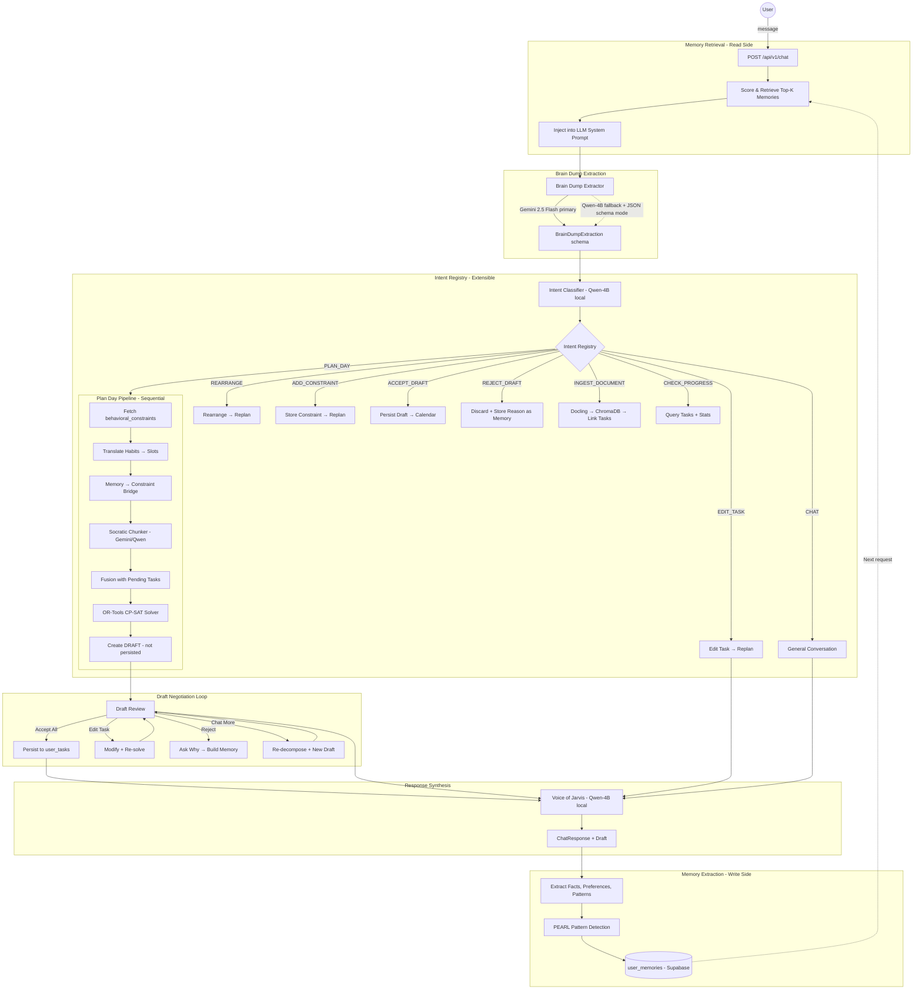
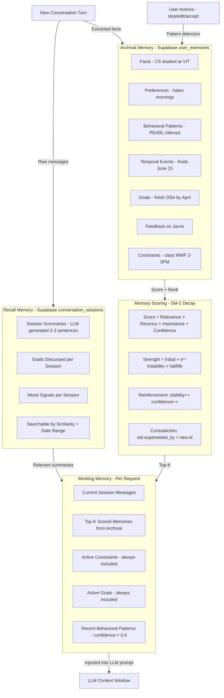
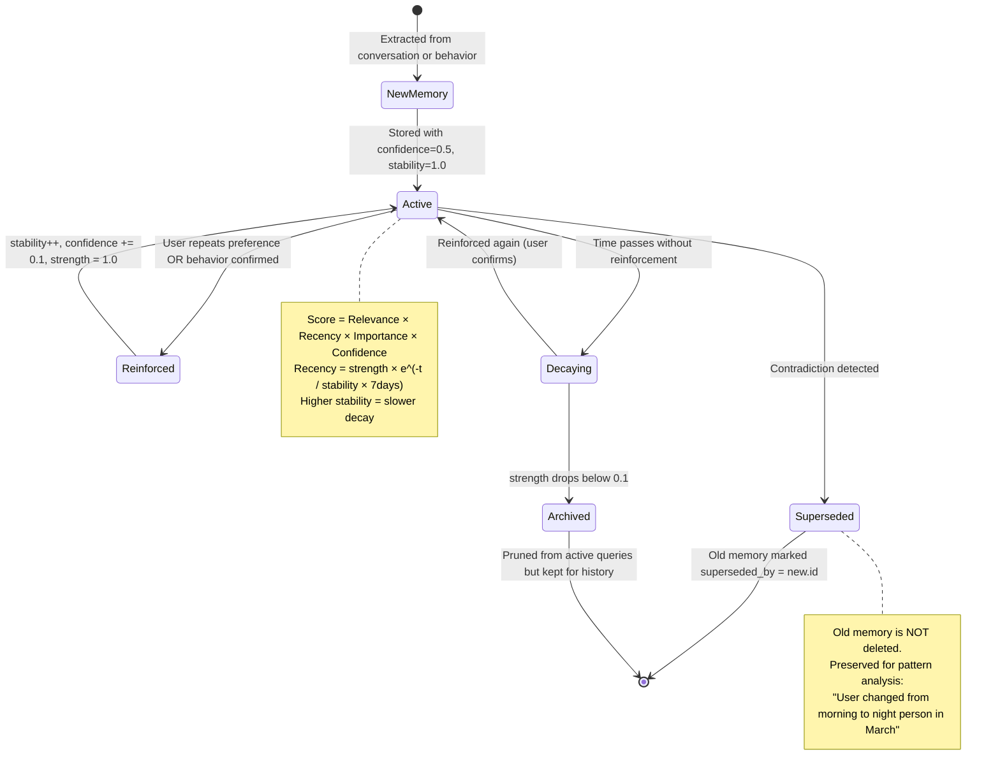
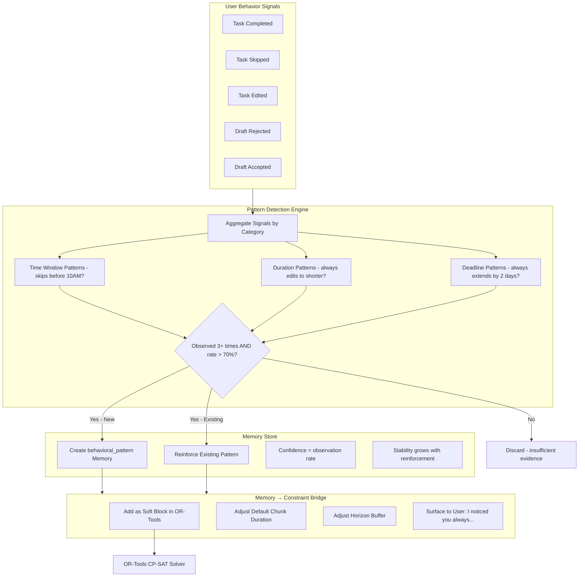
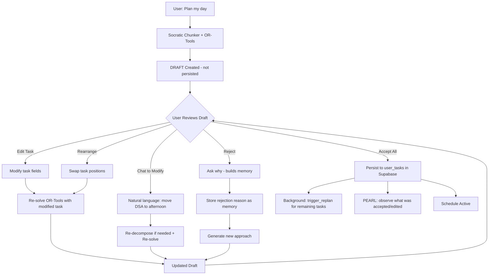
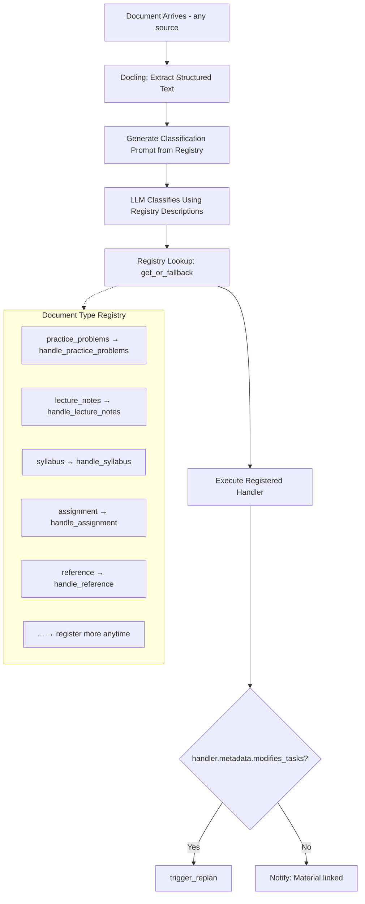
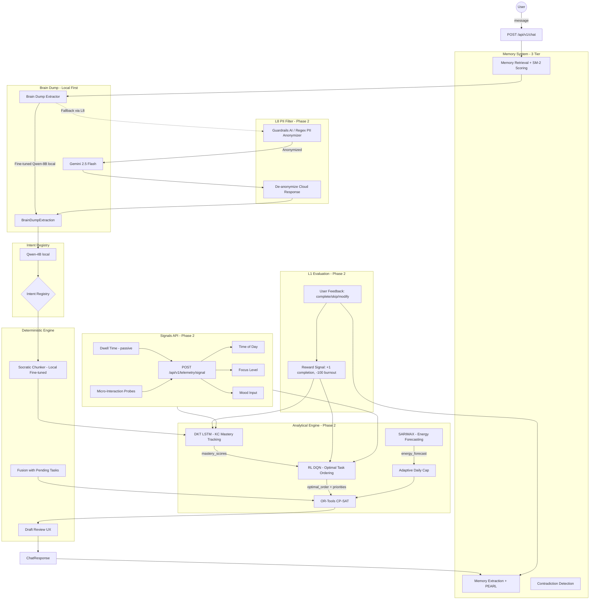

# Jarvis Architecture Reset — Design Spec

**Date:** 2026-03-28
**Author:** Madhav + Claude
**Status:** Draft — awaiting review

---

## Executive Summary

Jarvis has a solid vision but a fragile implementation. This spec defines a comprehensive architecture reset that:

1. **Stabilizes the core loop** — brain dump → decompose → schedule → draft review → persist
2. **Implements state-of-the-art memory & context** — 3-tier memory inspired by MemGPT, with SM-2 decay and PEARL behavioral inference
3. **Switches to reliable LLM routing** — Gemini 2.5 Flash primary, local Qwen fallback (inverted from current)
4. **Adds the negotiation UX** — accept/edit/reject/chat-more for proposed schedules
5. **Cuts stubs that create false complexity** — DKT, RL, SARIMAX, L8, L1 preserved in FUTURE_ARCHITECTURE.md
6. **Makes extensible intent routing** — registry pattern, not hardcoded if/elif
7. **Adds real tests** — integration tests for the full pipeline
8. **Updates ALL documentation** — honest status, no false claims

### Painkiller Thesis

The product is a painkiller for: **"I'm overwhelmed with what's on my plate — organize it for me and let me adjust."**

The moat is NOT the LLM. The moat is:
- **Deterministic scheduling** (OR-Tools CP-SAT — mathematically correct, not LLM guessing)
- **Anti-guilt psychology** (INFEASIBLE = recalibrate, not "you failed")
- **Negotiation UX** (propose → review → edit → accept — no competitor does this)
- **Behavioral inference** (PEARL: system observes you and adapts without being told)
- **Memory that changes system behavior** (not just recall — memories become scheduling constraints)

---

## What's Cut (Preserved in FUTURE_ARCHITECTURE.md)

These components are removed from the codebase and architecture docs. Full specifications are preserved in `docs/FUTURE_ARCHITECTURE.md` with math, training data requirements, integration points, and architecture diagrams showing where they plug in.

| Component | File | What's Preserved |
|-----------|------|-----------------|
| DKT LSTM | `app/models/analytical/dkt_lstm.py` | LSTM math: `y_t = σ(W_yh·h_t + b_y)`, input format `x_t = {q_t, a_t}`, KC mastery probability, training data schema, integration point (feeds difficulty_weight to TaskChunk) |
| RL DQN | `app/models/analytical/dqn_rl.py` | State space (chapters_remaining, time_until_deadline, energy_cycle), reward function (+1 completion, -100 burnout), policy `π(a|s)`, integration point (replaces TMT priority in CP-SAT) |
| SARIMAX | `app/models/forecast/capacity_ts.py` | Seasonality params (S=24 hourly, S=7 weekly, S=365 annual), exogenous variables (time-tracking, completion rates, mood), integration point (feeds compute_adaptive_daily_cap) |
| L8 PII Filter | Planned | Anonymization strategy: consistent placeholders per PII type, Guardrails AI or regex-based, gateway before cloud LLM calls |
| L1 Evaluation | Planned | Feedback signal design: user rates task quality 0-5, completion/skip/modify events as reward signals, Ragas/DeepEval metrics |
| Signals API | Planned | `POST /api/v1/telemetry/signal` — time, focus, mood inputs → RL reward/penalty + DKT user profile |

**When to bring them back:**
- DKT: When you have 100+ task completion events per user (enough training data)
- RL: When DKT is producing reliable mastery scores (RL needs DKT output)
- SARIMAX: When you have 4+ weeks of continuous usage data per user
- L8 PII: When you start sending user content to cloud (currently minimal)
- L1 Evaluation: When the core loop is stable and you need optimization signals

---

## Phase 1 Architecture — "Make It Work"

### Architecture Diagram (Phase 1)



### Core Loop (Text)

```
User sends message
       │
       ▼
┌──────────────────────┐
│   MEMORY RETRIEVAL   │  Retrieve relevant memories from user_memories
│   (read side)        │  Score: relevance × recency × importance × confidence
│   Top-K injection    │  Always include: active constraints, goals, patterns
└──────────┬───────────┘
           │
           ▼
┌──────────────────────┐
│   BRAIN DUMP         │  LLM: Gemini 2.5 Flash (primary)
│   EXTRACTION         │       Qwen-4B + JSON schema mode (local fallback)
│                      │  Output: BrainDumpExtraction (Pydantic)
└──────────┬───────────┘
           │
           ▼
┌──────────────────────┐
│   INTENT REGISTRY    │  LLM classifies into registered intents
│   CLASSIFICATION     │  Registry is extensible — add new intents by registration
│                      │  Fallback: CHAT (general conversation)
└──────────┬───────────┘
           │
           ├── PLAN_DAY ──────────────────────────────────────────────┐
           │                                                          │
           ├── EDIT_TASK ──► Modify task in Supabase → trigger_replan │
           │                                                          │
           ├── REARRANGE ──► Swap/move tasks → trigger_replan        │
           │                                                          │
           ├── ADD_CONSTRAINT ──► behavioral_constraints → replan    │
           │                                                          │
           ├── ACCEPT_DRAFT ──► Persist draft to calendar             │
           │                                                          │
           ├── REJECT_DRAFT ──► Discard + ask why (builds memory)    │
           │                                                          │
           ├── INGEST_DOCUMENT ──► Docling → ChromaDB → link tasks   │
           │                                                          │
           ├── CHECK_PROGRESS ──► Query tasks + completion stats      │
           │                                                          │
           └── CHAT ──► General conversation (memory extraction only) │
                                                                      │
                                                                      ▼
                                                        ┌──────────────────────┐
                                                        │   PLAN_DAY FLOW      │
                                                        │                      │
                                                        │   1. Fetch habits    │
                                                        │   2. Translate slots │
                                                        │      (Gemini/Qwen)  │
                                                        │   3. Decompose goal  │
                                                        │      (Gemini/Qwen)  │
                                                        │   4. Fusion with     │
                                                        │      pending tasks   │
                                                        │   5. OR-Tools solve  │
                                                        │   6. CREATE DRAFT    │
                                                        │      (not persist)   │
                                                        └──────────┬───────────┘
                                                                   │
                                                                   ▼
                                                        ┌──────────────────────┐
                                                        │   DRAFT REVIEW UX    │
                                                        │                      │
                                                        │   User can:          │
                                                        │   • Accept all       │
                                                        │   • Edit individual  │
                                                        │     tasks            │
                                                        │   • Reject + explain │
                                                        │   • Chat to modify   │
                                                        │   • Rearrange order  │
                                                        └──────────┬───────────┘
                                                                   │
                                                                   ▼
                                                        ┌──────────────────────┐
                                                        │   VOICE OF JARVIS    │
                                                        │   (Qwen-4B local)    │
                                                        │   Warm synthesis     │
                                                        └──────────┬───────────┘
                                                                   │
                                                                   ▼
                                                        ┌──────────────────────┐
                                                        │  MEMORY EXTRACTION   │
                                                        │  (write side)        │
                                                        │  Extract facts,      │
                                                        │  preferences,        │
                                                        │  detect patterns     │
                                                        └──────────────────────┘
```

### LLM Routing (Inverted from Current)

| Task | Primary | Fallback | Rationale |
|------|---------|----------|-----------|
| Brain dump extraction | Gemini 2.5 Flash | Qwen-4B + JSON schema mode | Schema reliability critical |
| Task decomposition (Socratic Chunker) | Gemini 2.5 Flash | Qwen-8B + JSON schema mode | Quality of decomposition matters most |
| Habit translation | Gemini 2.5 Flash | Qwen-4B | Structured output needed |
| Intent classification | Qwen-4B local (JSON schema mode) | Gemini 2.5 Flash | Fast, simple classification — local is fine |
| Voice of Jarvis synthesis | Qwen-4B local | Gemini 2.5 Flash | Creative text, local handles well |
| Memory extraction | Qwen-4B local | Gemini 2.5 Flash | Background task, doesn't need to be perfect |
| Real-time web search | Gemini 2.5 Flash | N/A | Only cloud can do this |

**Cost at scale:** Gemini 2.5 Flash free tier = 500 requests/day. For a solo developer building, this is plenty. At scale: ~$0.001 per request = $90/month for 1000 daily active users.

**Migration path to local:** Once stable, swap Gemini → local one-by-one per task. Validate each swap doesn't regress quality. The `hybrid_route_query` abstraction already supports this.

### Intent Registry System

The Intent Registry uses the shared `BaseRegistry` framework (defined in the Registry Framework section below). All registries in Jarvis share the same base class.

```python
# app/services/intent_registry.py
# Uses BaseRegistry from app/core/registry.py

from app.core.registry import BaseRegistry, RegistryEntry

# Create the intent registry instance
intent_registry = BaseRegistry[dict](
    name="intent",
    fallback_key="CHAT",  # Unknown intents default to general conversation
)

# Intent-specific metadata fields (passed via RegistryEntry.metadata)
# - requires_draft: bool — Does this intent need an active draft?
# - triggers_replan: bool — Should this trigger background replan?

# Registration happens at app startup (main.py lifespan)
# See register_default_intents() below for built-in intents
```

**Adding a new intent tomorrow:**

```python
# 1. Write the handler
async def handle_weekly_review(user_id: str, message: str, context: dict):
    # Query completed/skipped tasks for the week
    # Generate summary with LLM
    # Return ChatResponse
    ...

# 2. Register it (in main.py or a setup file)
intent_registry.register(RegistryEntry(
    name="WEEKLY_REVIEW",
    description="User wants to review their week's progress and accomplishments",
    handler=handle_weekly_review,
    examples=["how was my week", "weekly review", "what did I accomplish"],
    metadata={"requires_draft": False, "triggers_replan": False},
))

# Done. The classifier will now recognize it. No other code changes needed.
```

---

## Memory & Context Architecture

### Design Principles

1. **Inspired by MemGPT** — 3-tier memory (working, recall, archival)
2. **Inspired by Zep** — contradiction detection, temporal awareness
3. **Novel: SM-2 decay** — memories fade if not reinforced (Ebbinghaus forgetting curve applied to AI memory)
4. **Novel: PEARL inference** — observe behavior patterns → create scheduling rules automatically
5. **Novel: Memory → Constraint bridge** — memories don't just inform responses, they change the OR-Tools solver constraints

Source code references for implementation patterns:
- Mem0: github.com/mem0ai/mem0 — `mem0/memory/main.py` (memory add/search/update logic)
- Zep: github.com/getzep/zep — `pkg/memory/` (fact extraction, contradiction resolution)
- Letta: github.com/letta-ai/letta — `letta/agent.py` (working memory management, context paging)

### Three-Tier Memory Model



```
┌─────────────────────────────────────────────────────────┐
│                   WORKING MEMORY                         │
│                                                          │
│  Current session messages + injected memories            │
│  Lives in: Python memory (per-request)                   │
│  Size: Limited by LLM context window                     │
│  Lifetime: Single session                                │
│                                                          │
│  Contents:                                               │
│  - Last N messages from current session                  │
│  - Top-K scored memories from archival store              │
│  - Active constraints (always included)                  │
│  - Active goals (always included)                        │
│  - Recent behavioral patterns (confidence > 0.6)         │
├─────────────────────────────────────────────────────────┤
│                   RECALL MEMORY                          │
│                                                          │
│  Past conversation summaries                             │
│  Lives in: Supabase conversation_sessions table          │
│  Size: Unlimited (grows over time)                       │
│  Lifetime: Permanent (but summaries, not raw messages)   │
│                                                          │
│  Contents:                                               │
│  - Session summaries (LLM-generated, 2-3 sentences)     │
│  - Goals discussed per session                           │
│  - Mood signals per session                              │
│  - Searchable by similarity + date range                 │
├─────────────────────────────────────────────────────────┤
│                   ARCHIVAL MEMORY                        │
│                                                          │
│  Structured, categorized, scored user knowledge          │
│  Lives in: Supabase user_memories table                  │
│  Size: Unlimited (but decayed — low-strength pruned)     │
│  Lifetime: Permanent until superseded or decayed         │
│                                                          │
│  Contents:                                               │
│  - Facts, preferences, constraints, goals                │
│  - Behavioral patterns (PEARL-inferred)                  │
│  - Temporal events (with expiry)                         │
│  - Feedback on Jarvis behavior                           │
│  - Each memory has: confidence, strength, stability      │
└─────────────────────────────────────────────────────────┘
```

### Database Schema

```sql
-- ===========================================
-- TIER 1: Working Memory (no table — in-memory per request)
-- ===========================================

-- ===========================================
-- TIER 2: Recall Memory
-- ===========================================

CREATE TABLE conversation_sessions (
    id              UUID PRIMARY KEY DEFAULT gen_random_uuid(),
    user_id         TEXT NOT NULL,
    started_at      TIMESTAMPTZ DEFAULT now(),
    ended_at        TIMESTAMPTZ,
    summary         TEXT,                 -- LLM-generated 2-3 sentence summary
    goals_discussed TEXT[],               -- extracted goal IDs referenced
    mood_signal     TEXT,                 -- 'positive' | 'neutral' | 'stressed' | 'frustrated'
    message_count   INTEGER DEFAULT 0,
    created_at      TIMESTAMPTZ DEFAULT now()
);

CREATE INDEX idx_sessions_user ON conversation_sessions(user_id, started_at DESC);

CREATE TABLE conversation_messages (
    id              UUID PRIMARY KEY DEFAULT gen_random_uuid(),
    user_id         TEXT NOT NULL,
    session_id      UUID NOT NULL REFERENCES conversation_sessions(id),
    role            TEXT NOT NULL CHECK (role IN ('user', 'assistant', 'system')),
    content         TEXT NOT NULL,
    intent_detected TEXT,                 -- classified intent for this message
    created_at      TIMESTAMPTZ DEFAULT now()
);

CREATE INDEX idx_messages_session ON conversation_messages(session_id, created_at);
CREATE INDEX idx_messages_user ON conversation_messages(user_id, created_at DESC);

-- ===========================================
-- TIER 3: Archival Memory
-- ===========================================

CREATE TABLE user_memories (
    id              UUID PRIMARY KEY DEFAULT gen_random_uuid(),
    user_id         TEXT NOT NULL,
    memory_type     TEXT NOT NULL CHECK (memory_type IN (
                        'fact', 'preference', 'behavioral_pattern',
                        'temporal_event', 'goal', 'feedback', 'constraint'
                    )),
    content         TEXT NOT NULL,        -- the actual memory text
    source          TEXT DEFAULT 'conversation', -- 'conversation' | 'behavior' | 'ingestion'
    source_id       UUID,                 -- links to conversation_messages.id or user_tasks.id

    -- SM-2 inspired scoring fields
    confidence      FLOAT DEFAULT 0.5,    -- 0.0 to 1.0, increases with reinforcement
    strength        FLOAT DEFAULT 1.0,    -- current memory strength (decays over time)
    stability       FLOAT DEFAULT 1.0,    -- reinforcement count (higher = slower decay)

    -- Lifecycle
    last_accessed   TIMESTAMPTZ DEFAULT now(),
    last_reinforced TIMESTAMPTZ DEFAULT now(),
    superseded_by   UUID REFERENCES user_memories(id),  -- contradiction chain
    expires_at      TIMESTAMPTZ,          -- for temporal_event type (e.g., "finals June 15")

    -- PEARL: for behavioral_pattern type
    observation_count INTEGER DEFAULT 1,  -- how many times this pattern was observed
    applied_as      TEXT,                 -- 'hard_constraint' | 'soft_preference' | NULL

    created_at      TIMESTAMPTZ DEFAULT now(),
    updated_at      TIMESTAMPTZ DEFAULT now()
);

CREATE INDEX idx_memories_user_type ON user_memories(user_id, memory_type);
CREATE INDEX idx_memories_user_active ON user_memories(user_id)
    WHERE superseded_by IS NULL AND strength > 0.1;
```

### Memory Lifecycle Diagram



### Memory Extraction Pipeline

Runs after each conversation turn. Uses a fast/cheap LLM (Qwen-4B or Gemini Flash) to extract structured memories.

```python
# app/services/memory/extractor.py

EXTRACTION_PROMPT = """
Analyze this conversation exchange and extract new information about the user.

EXISTING MEMORIES (what we already know):
{existing_memories}

CURRENT EXCHANGE:
User: {user_message}
Assistant: {assistant_response}

Extract ONLY genuinely new information. Do not repeat what we already know.
If the user contradicts an existing memory, mark it as a contradiction.

Return JSON array:
[
  {{
    "type": "fact|preference|behavioral_pattern|temporal_event|goal|feedback|constraint",
    "content": "concise statement of what was learned",
    "confidence": 0.5-1.0,
    "contradicts": "id of existing memory this contradicts, or null",
    "expires_at": "ISO date if temporal, or null"
  }}
]

Return empty array [] if nothing new was learned.
"""

async def extract_memories_from_turn(
    user_id: str,
    user_message: str,
    assistant_response: str,
    existing_memories: list[dict],
) -> list[dict]:
    """
    Extract structured memories from a conversation turn.

    Inspired by:
    - Mem0: mem0/memory/main.py — add() method with deduplication
    - Zep: pkg/memory/extractor.go — fact extraction pipeline
    """
    formatted_existing = "\n".join([
        f"[{m['id']}] ({m['memory_type']}) {m['content']}"
        for m in existing_memories[:20]  # Limit context
    ])

    prompt = EXTRACTION_PROMPT.format(
        existing_memories=formatted_existing or "None yet.",
        user_message=user_message,
        assistant_response=assistant_response,
    )

    memories = await hybrid_route_query(
        prompt=prompt,
        response_schema=MemoryExtractionResponse,
        prefer_local=True,  # Background task, local is fine
    )

    for mem in memories:
        if mem.contradicts:
            # Supersede old memory (Zep-inspired contradiction handling)
            await supersede_memory(mem.contradicts, new_content=mem.content)
        else:
            # Check for near-duplicates (Mem0-inspired dedup)
            similar = await find_similar_memory(user_id, mem.content, threshold=0.85)
            if similar:
                await reinforce_memory(similar.id)
            else:
                await store_memory(user_id, mem)

    return memories
```

### Memory Scoring & Retrieval

```python
# app/services/memory/retriever.py

import math
from datetime import datetime, timezone

IMPORTANCE_WEIGHTS = {
    'constraint': 1.0,           # Always critical for scheduling
    'behavioral_pattern': 0.9,   # PEARL insights — high value
    'preference': 0.8,           # User stated preferences
    'temporal_event': 0.8,       # Deadlines, exams — time-sensitive
    'goal': 0.7,                 # Active goals
    'fact': 0.6,                 # Background facts
    'feedback': 0.5,             # Feedback on Jarvis
}

# Types that are ALWAYS injected regardless of relevance score
ALWAYS_INCLUDE_TYPES = {'constraint', 'goal', 'behavioral_pattern'}
ALWAYS_INCLUDE_MIN_CONFIDENCE = 0.6

def compute_memory_strength(memory, current_time: datetime) -> float:
    """
    SM-2 inspired decay function.

    Memory_Strength(t) = Initial_Strength × e^(-t / (stability × base_halflife))

    - stability starts at 1.0, increases each time memory is reinforced
    - base_halflife = 7 days (one week)
    - A memory reinforced 5 times has stability=5, so half-life = 5 weeks

    Mathematical justification:
    - Ebbinghaus forgetting curve (1885): R = e^(-t/S) where S is stability
    - SM-2 algorithm (Wozniak, 1987): interval grows with each successful review
    - This applies the same proven curve to AI system memory
    """
    hours_since_reinforced = (
        current_time - memory.last_reinforced
    ).total_seconds() / 3600

    base_halflife_hours = 7 * 24  # 1 week in hours
    effective_halflife = memory.stability * base_halflife_hours

    return memory.strength * math.exp(-hours_since_reinforced / effective_halflife)


def score_memory(memory, query_embedding, memory_embedding, current_time) -> float:
    """
    Final score = Relevance × Recency × Importance × Confidence

    Inspired by:
    - Mem0: mem0/memory/main.py — search() scoring
    - MemGPT: Context window paging decisions
    """
    # Semantic relevance (cosine similarity)
    relevance = cosine_similarity(query_embedding, memory_embedding)

    # Time-decayed strength (SM-2 curve)
    recency = compute_memory_strength(memory, current_time)

    # Type-based importance
    importance = IMPORTANCE_WEIGHTS.get(memory.memory_type, 0.5)

    # Confidence from reinforcement history
    confidence = memory.confidence

    return relevance * recency * importance * confidence


async def build_memory_context(user_id: str, current_query: str) -> str:
    """
    Retrieve and format memories for LLM context injection.
    Called at the START of every /chat request.

    Returns a formatted string to inject into the system prompt.
    """
    # Get all active memories (not superseded, strength > 0.1)
    all_memories = await get_active_memories(user_id)

    if not all_memories:
        return ""

    current_time = datetime.now(timezone.utc)
    query_embedding = await embed(current_query)

    # Score each memory
    scored = []
    for mem in all_memories:
        mem_embedding = await embed(mem.content)  # Cache these
        score = score_memory(mem, query_embedding, mem_embedding, current_time)
        scored.append((mem, score))

    scored.sort(key=lambda x: x[1], reverse=True)

    # Always-include memories (constraints, goals, patterns with high confidence)
    must_include = [
        mem for mem in all_memories
        if mem.memory_type in ALWAYS_INCLUDE_TYPES
        and mem.confidence >= ALWAYS_INCLUDE_MIN_CONFIDENCE
        and mem.superseded_by is None
    ]

    # Top-K by score (configurable, default 15)
    top_k = [mem for mem, score in scored[:15]]

    # Merge and deduplicate
    final = deduplicate_memories(must_include + top_k)

    # Format for LLM
    return format_memory_block(final)


def format_memory_block(memories: list) -> str:
    """Format memories as a structured block for the LLM system prompt."""
    if not memories:
        return ""

    sections = {}
    for mem in memories:
        sections.setdefault(mem.memory_type, []).append(mem.content)

    lines = ["## What you know about this user:\n"]

    type_labels = {
        'constraint': 'Scheduling Constraints',
        'goal': 'Active Goals',
        'behavioral_pattern': 'Observed Patterns',
        'preference': 'Preferences',
        'temporal_event': 'Upcoming Events',
        'fact': 'Facts',
        'feedback': 'User Feedback on Jarvis',
    }

    for mem_type, label in type_labels.items():
        if mem_type in sections:
            lines.append(f"### {label}")
            for content in sections[mem_type]:
                lines.append(f"- {content}")
            lines.append("")

    return "\n".join(lines)
```

### Memory Reinforcement & Contradiction

```python
# app/services/memory/lifecycle.py

async def reinforce_memory(memory_id: str):
    """
    Called when a memory is confirmed by user behavior or repeated statement.
    Increases stability (slower future decay) and confidence.

    SM-2 analogy: This is like a successful review — next interval gets longer.
    """
    memory = await get_memory(memory_id)
    memory.stability += 1.0
    memory.confidence = min(1.0, memory.confidence + 0.1)
    memory.strength = 1.0  # Reset to full strength
    memory.last_reinforced = datetime.now(timezone.utc)
    await update_memory(memory)


async def supersede_memory(old_memory_id: str, new_content: str):
    """
    Called when a new memory contradicts an existing one.
    The old memory is NOT deleted — it's marked as superseded.
    This preserves the evolution history.

    Inspired by Zep's contradiction handling:
    - zep/pkg/memory/fact_resolver.go

    Example:
      Old: "User is a morning person"
      New: "User prefers working after 2 PM"
      Result: Old.superseded_by = New.id
              Old memory stays for historical analysis
              New memory is the active one
    """
    old_memory = await get_memory(old_memory_id)
    new_memory = await store_memory(old_memory.user_id, {
        "type": old_memory.memory_type,
        "content": new_content,
        "confidence": 0.6,  # Start moderate — needs reinforcement to grow
        "source": "contradiction",
    })
    old_memory.superseded_by = new_memory.id
    await update_memory(old_memory)
    return new_memory


async def decay_memories(user_id: str):
    """
    Background job: recalculate memory strengths.
    Prune memories with strength < 0.1 (effectively forgotten).

    Run periodically (e.g., daily) or on session start.
    """
    memories = await get_all_memories(user_id)
    current_time = datetime.now(timezone.utc)

    for mem in memories:
        new_strength = compute_memory_strength(mem, current_time)
        if new_strength < 0.1:
            # Memory has decayed below threshold — archive it
            await archive_memory(mem.id)
        else:
            mem.strength = new_strength
            await update_memory(mem)
```

### PEARL Behavioral Pattern Detection



```python
# app/services/memory/pearl.py

"""
PEARL-lite: Pattern detection from user behavior.

Reference: "PEARL: Self-Evolving Assistant for Time Management
with Reinforcement Learning" (arXiv 2601.11957v2)

Phase 1 implementation: Rule-based pattern detection.
Phase 2 (future): RL-based policy learning (see FUTURE_ARCHITECTURE.md).

The key insight: Don't wait for the user to tell you their preferences.
Observe their actions and infer rules.
"""

# Pattern detection thresholds
MIN_OBSERVATIONS = 3      # Need at least 3 instances to detect a pattern
MIN_PATTERN_RATE = 0.7    # Pattern must occur in 70%+ of opportunities

OBSERVABLE_PATTERNS = {
    "skip_time_window": {
        "signal": "user skips tasks scheduled in a specific time window",
        "query": """
            SELECT
                EXTRACT(HOUR FROM scheduled_start) as hour,
                COUNT(*) FILTER (WHERE status = 'skipped') as skipped,
                COUNT(*) as total
            FROM user_tasks
            WHERE user_id = :user_id
            AND scheduled_start IS NOT NULL
            GROUP BY hour
            HAVING COUNT(*) >= :min_observations
        """,
        "inference": "User avoids tasks during hour {hour} (skipped {rate}%)",
        "constraint_type": "soft_preference",
    },
    "duration_preference": {
        "signal": "user consistently edits task durations in one direction",
        "query": """
            SELECT
                AVG(edited_duration - original_duration) as avg_change,
                COUNT(*) as edit_count
            FROM task_edits
            WHERE user_id = :user_id
            HAVING COUNT(*) >= :min_observations
        """,
        "inference": "User prefers {direction} tasks (avg adjustment: {avg_change} min)",
        "constraint_type": "soft_preference",
    },
    "deadline_buffer": {
        "signal": "user consistently extends deadlines by similar amounts",
        "query": """
            SELECT
                AVG(new_deadline - original_deadline) as avg_extension_days,
                COUNT(*) as extension_count
            FROM deadline_changes
            WHERE user_id = :user_id
            HAVING COUNT(*) >= :min_observations
        """,
        "inference": "User typically needs {avg_extension} extra days (observed {count}x)",
        "constraint_type": "soft_preference",
    },
}


async def detect_patterns(user_id: str) -> list[dict]:
    """
    Scan user behavior data for recurring patterns.
    Create behavioral_pattern memories for detected patterns.

    Run after: task completion, task skip, task edit, schedule rejection.
    """
    detected = []

    for pattern_name, config in OBSERVABLE_PATTERNS.items():
        results = await db.execute(config["query"], {
            "user_id": user_id,
            "min_observations": MIN_OBSERVATIONS,
        })

        for row in results:
            rate = row.get("skipped", 0) / row.get("total", 1)
            if rate >= MIN_PATTERN_RATE:
                inference = config["inference"].format(**row)

                # Check if this pattern already exists
                existing = await find_similar_memory(
                    user_id, inference, memory_type="behavioral_pattern"
                )

                if existing:
                    # Reinforce existing pattern
                    await reinforce_memory(existing.id)
                    existing.observation_count += 1
                else:
                    # Create new pattern memory
                    await store_memory(user_id, {
                        "type": "behavioral_pattern",
                        "content": inference,
                        "confidence": min(0.9, rate),
                        "source": "behavior",
                        "applied_as": config["constraint_type"],
                        "observation_count": row.get("total", MIN_OBSERVATIONS),
                    })

                detected.append({"pattern": pattern_name, "inference": inference})

    return detected


async def apply_patterns_to_schedule(user_id: str, time_slots: list) -> list:
    """
    Inject PEARL-detected patterns as constraints into the scheduler.

    This is the BREAKTHROUGH: memories don't just inform responses —
    they change the mathematical constraints in OR-Tools.
    """
    patterns = await get_memories(
        user_id,
        memory_type="behavioral_pattern",
        min_confidence=0.6,
    )

    for pattern in patterns:
        if "avoids tasks during hour" in pattern.content:
            # Extract hour and add as soft block
            hour = extract_hour_from_pattern(pattern.content)
            time_slots.append(TimeSlot(
                start_min=hour * 60,
                end_min=(hour + 1) * 60,
                availability="minimal_work",  # Soft, not hard block
                source="pearl_pattern",
            ))

        elif "prefers shorter tasks" in pattern.content:
            # Adjust default chunk duration
            # This modifies the Socratic Chunker's target duration
            pass  # Handled in decomposition step

    return time_slots
```

### Memory → Scheduler Constraint Bridge

This is the novel component — memories directly affect the OR-Tools solver:

```python
# app/services/memory/constraint_bridge.py

"""
Bridge between archival memory and the deterministic scheduler.

This is what makes Jarvis different from ChatGPT's memory:
- ChatGPT memory: affects what the LLM says
- Jarvis memory: affects the MATHEMATICAL CONSTRAINTS in OR-Tools

A behavioral pattern like "user skips morning tasks" doesn't just make
Jarvis say "I notice you prefer afternoons" — it makes the scheduler
STOP SCHEDULING deep work before 10 AM.
"""

async def memories_to_constraints(user_id: str) -> list[TimeSlot]:
    """
    Convert relevant memories into TimeSlot constraints for OR-Tools.

    Called during _run_plan_day_flow, BEFORE run_schedule.
    """
    constraints = []

    # 1. Explicit constraints (user stated)
    explicit = await get_memories(user_id, memory_type="constraint")
    for mem in explicit:
        slot = await parse_constraint_to_timeslot(mem.content)
        if slot:
            constraints.append(slot)

    # 2. PEARL behavioral patterns (system inferred)
    patterns = await get_memories(
        user_id,
        memory_type="behavioral_pattern",
        min_confidence=0.6,
    )
    for pattern in patterns:
        slot = await parse_pattern_to_timeslot(pattern)
        if slot:
            # Inferred patterns are SOFT constraints, not hard blocks
            slot.availability = "minimal_work"
            slot.source = "pearl_inferred"
            constraints.append(slot)

    # 3. Temporal events (deadlines, exams)
    events = await get_memories(
        user_id,
        memory_type="temporal_event",
        not_expired=True,
    )
    for event in events:
        # Temporal events affect horizon computation, not time slots
        pass  # Handled separately in compute_horizon_from_deadlines

    return constraints
```

---

## Draft Negotiation UX

### Flow Diagram



### Flow (Text)

```
User: "Plan my day — I need to study DSA and write my essay"
                    │
                    ▼
            Jarvis decomposes + schedules
                    │
                    ▼
            Returns DRAFT (not persisted):
            ┌─────────────────────────────┐
            │  Draft #d7f2...             │
            │                             │
            │  09:00 - 09:25  DSA: Arrays │  [edit] [skip]
            │  09:30 - 09:55  DSA: Trees  │  [edit] [skip]
            │  10:00 - 10:25  Essay: Outline│ [edit] [skip]
            │  10:30 - 10:55  Essay: Draft │  [edit] [skip]
            │  ...                        │
            │                             │
            │  [Accept All] [Reject] [Chat to Modify]
            └─────────────────────────────┘
                    │
        ┌───────────┼───────────┬────────────┐
        ▼           ▼           ▼            ▼
    Accept All    Edit Task   Reject      Chat More
        │           │           │            │
    Persist to    Modify +    Ask why      User says
    user_tasks    re-solve    (builds      "move DSA
        │         schedule    memory)      to afternoon"
        │           │           │            │
        ▼           ▼           ▼            ▼
    Done       New Draft    PEARL notes   Re-decompose
               proposed     preference    + new Draft
```

### Draft Schema

```python
# app/schemas/draft.py (update existing)

class DraftSchedule(BaseModel):
    draft_id: str
    user_id: str
    goal_id: str | None
    tasks: list[DraftTask]
    horizon_start: datetime
    created_at: datetime
    status: Literal["pending", "accepted", "rejected", "modified"]
    rejection_reason: str | None = None  # If rejected, why? (builds memory)

class DraftTask(BaseModel):
    task_id: str
    title: str
    start_min: int
    duration_minutes: int
    difficulty_weight: float
    completion_criteria: str
    editable_fields: list[str] = ["title", "duration_minutes", "start_min", "difficulty_weight"]

class DraftAction(BaseModel):
    """User action on a draft."""
    action: Literal["accept_all", "reject", "edit_task", "rearrange", "chat_modify"]
    draft_id: str
    task_id: str | None = None          # For edit_task
    edits: dict | None = None           # For edit_task: {"duration_minutes": 15}
    reason: str | None = None           # For reject: why?
    modification_request: str | None = None  # For chat_modify: natural language
```

### Draft Endpoints

```
POST /api/v1/drafts/{draft_id}/accept     → Persist all tasks to user_tasks
POST /api/v1/drafts/{draft_id}/reject     → Discard + store rejection reason as memory
PATCH /api/v1/drafts/{draft_id}/tasks/{task_id}  → Edit task + re-solve schedule
POST /api/v1/drafts/{draft_id}/rearrange  → Swap task order + re-solve
POST /api/v1/drafts/{draft_id}/chat       → Natural language modification → re-solve
```

---

## Testing Strategy

### Integration Tests (Priority)

```python
# tests/test_full_pipeline.py

@pytest.mark.asyncio
async def test_brain_dump_to_schedule__happy_path():
    """Full pipeline: brain dump → decompose → schedule → draft."""
    response = await client.post("/api/v1/chat", json={
        "user_prompt": "I need to study for my DSA exam next week",
        "user_id": "test-user-1",
    })
    assert response.status_code == 200
    data = response.json()
    assert data["intent"] == "PLAN_DAY"
    assert data["draft_id"] is not None
    assert len(data["schedule"]) >= 3  # At least 3 micro-tasks

@pytest.mark.asyncio
async def test_draft_accept__persists_tasks():
    """Accepting a draft persists tasks to user_tasks."""
    # Create a draft first
    chat_response = await create_test_draft()
    draft_id = chat_response["draft_id"]

    # Accept it
    response = await client.post(f"/api/v1/drafts/{draft_id}/accept")
    assert response.status_code == 200

    # Verify tasks are in user_tasks
    tasks = await get_user_tasks("test-user-1")
    assert len(tasks) >= 3

@pytest.mark.asyncio
async def test_draft_edit__resolves_schedule():
    """Editing a task in a draft triggers re-solve."""
    chat_response = await create_test_draft()
    draft_id = chat_response["draft_id"]
    task_id = chat_response["schedule"][0]["task_id"]

    # Edit task duration
    response = await client.patch(
        f"/api/v1/drafts/{draft_id}/tasks/{task_id}",
        json={"duration_minutes": 15}
    )
    assert response.status_code == 200
    # Schedule should be re-solved with new duration
    assert response.json()["schedule"][0]["duration_minutes"] == 15

@pytest.mark.asyncio
async def test_memory_extraction__stores_preference():
    """After a chat turn, memories are extracted and stored."""
    await client.post("/api/v1/chat", json={
        "user_prompt": "I'm a CS student at VIT, I hate studying before 10 AM",
        "user_id": "test-user-1",
    })

    memories = await get_user_memories("test-user-1")
    types = [m["memory_type"] for m in memories]
    assert "fact" in types        # "CS student at VIT"
    assert "preference" in types  # "hates studying before 10 AM"

@pytest.mark.asyncio
async def test_memory_contradiction__supersedes_old():
    """Contradicting memory supersedes the old one."""
    # First: establish a preference
    await store_test_memory("test-user-1", "preference", "User likes morning work")

    # Then: contradict it
    await client.post("/api/v1/chat", json={
        "user_prompt": "Actually I'm terrible in the mornings, I work best at night",
        "user_id": "test-user-1",
    })

    memories = await get_active_memories("test-user-1", type="preference")
    # Old memory should be superseded
    assert any("night" in m["content"] for m in memories)
    assert not any(
        m["content"] == "User likes morning work" and m["superseded_by"] is None
        for m in memories
    )

@pytest.mark.asyncio
async def test_pearl_pattern_detection__skip_pattern():
    """PEARL detects when user consistently skips tasks in a time window."""
    # Simulate 4 morning task skips
    for _ in range(4):
        task = await create_task_at_hour("test-user-1", hour=8)
        await skip_task(task["id"])

    # Run pattern detection
    patterns = await detect_patterns("test-user-1")

    assert any("avoids tasks during hour 8" in p["inference"] for p in patterns)

@pytest.mark.asyncio
async def test_memory_affects_schedule():
    """Constraint memories should affect the OR-Tools schedule."""
    # Store a constraint
    await store_test_memory(
        "test-user-1", "constraint",
        "No tasks between 2 PM and 3 PM (has class)"
    )

    # Generate a schedule
    response = await client.post("/api/v1/chat", json={
        "user_prompt": "Plan my afternoon for DSA study",
        "user_id": "test-user-1",
    })

    schedule = response.json()["schedule"]
    # No task should overlap with 14:00-15:00 (minutes 840-900)
    for task in schedule:
        assert not (task["start_min"] < 900 and
                   task["start_min"] + task["duration_minutes"] > 840)
```

---

## Intelligent Document-Task Integration

### The Problem (Current State)

The current `task_material_linker.py` does a single cosine similarity match between document topics and task titles. This is shallow — it answers "is this document vaguely related to this task?" but NOT:

- What TYPE of document is this? (practice problems vs lecture notes vs syllabus vs assignment)
- Does this document contain INDIVIDUAL problems that should be extracted?
- Should this document CHANGE existing task completion criteria?
- Should this document CREATE new tasks?
- Should this document be surfaced DURING task execution as practice material?

### The Scenario

```
Day 1: User says "I have a deep learning contest on Friday"
       → Jarvis decomposes into tasks:
         1. "Study CNNs - convolution layers" (25 min)
         2. "Study backpropagation math" (25 min)
         3. "Practice: implement a basic neural network" (25 min)
         4. "Study optimization algorithms (SGD, Adam)" (25 min)
         5. "Mock contest: solve timed problems" (25 min)

Day 1: User adds habits: "I study best after lunch", "30 min breaks between sessions"
       → Tasks recalibrated — scheduled 1-5 PM with breaks

Day 2: User uploads "DL_Practice_Problems.pdf" containing 15 practice problems
       → CURRENT BEHAVIOR: Links PDF to tasks by topic similarity. That's it.
       → DESIRED BEHAVIOR: See below.
```

### Architectural Principle: The Registry Framework

Before diving into document-specific design, let's establish the core architectural principle that applies across the ENTIRE system.

**The problem with hardcoding:** Hardcoded types (5 document types, 7 intents, 6 memory types) create a system that requires code changes every time you want to extend it. Tomorrow you might need to handle meeting transcripts, code repositories, medical data, or client briefs.

**The solution: Registry Pattern as a first-class framework.**

This is the same pattern used by:
- Django (middleware registry, app registry)
- FastAPI (dependency injection, router mounting)
- VS Code (extension system)
- Claude Code (skill system)

```mermaid
flowchart TD
    subgraph RegistryFramework [Jarvis Registry Framework]
        direction TB
        BaseRegistry[BaseRegistry - Abstract]

        BaseRegistry --> IntentRegistry[Intent Registry]
        BaseRegistry --> DocTypeRegistry[Document Type Registry]
        BaseRegistry --> MemoryTypeRegistry[Memory Type Registry]
        BaseRegistry --> PatternRegistry[PEARL Pattern Registry]

        IntentRegistry --> I1[PLAN_DAY]
        IntentRegistry --> I2[EDIT_TASK]
        IntentRegistry --> I3[+ register new intent]

        DocTypeRegistry --> D1[practice_problems]
        DocTypeRegistry --> D2[lecture_notes]
        DocTypeRegistry --> D3[+ register new doc type]

        MemoryTypeRegistry --> M1[fact]
        MemoryTypeRegistry --> M2[preference]
        MemoryTypeRegistry --> M3[+ register new memory type]

        PatternRegistry --> P1[skip_time_window]
        PatternRegistry --> P2[duration_preference]
        PatternRegistry --> P3[+ register new pattern detector]
    end

    subgraph Adding [Adding Something New Tomorrow]
        NewDocType[New Doc Type: meeting_transcript]
        Step1[1. Define handler function]
        Step2[2. Register with metadata]
        Step3[3. Done - classifier auto-discovers it]
        NewDocType --> Step1 --> Step2 --> Step3
    end
```



### The Base Registry (Shared Framework)

```python
# app/core/registry.py

from dataclasses import dataclass, field
from typing import Callable, Awaitable, Any, TypeVar, Generic

T = TypeVar("T")

@dataclass
class RegistryEntry(Generic[T]):
    """Base entry for any registry."""
    name: str
    description: str              # Used by LLM for classification
    handler: Callable[..., Awaitable[Any]]
    examples: list[str] = field(default_factory=list)
    metadata: dict[str, Any] = field(default_factory=dict)


class BaseRegistry(Generic[T]):
    """
    Generic registry framework. All registries (intent, document, memory,
    pattern) inherit from this. Provides:
    - Registration with validation
    - LLM classification prompt generation
    - Handler lookup
    - Introspection (list all registered types)

    This is the core architectural pattern of Jarvis.
    Adding a new capability to ANY subsystem = defining a handler + registering it.
    """

    def __init__(self, name: str, fallback_key: str | None = None):
        self._name = name
        self._entries: dict[str, RegistryEntry[T]] = {}
        self._fallback_key = fallback_key  # e.g., "CHAT" for intents, "reference" for docs

    def register(self, entry: RegistryEntry[T]) -> None:
        """Register a new entry. Idempotent — re-registering overwrites."""
        if not entry.name or not entry.handler:
            raise ValueError(f"Registry entry must have name and handler")
        self._entries[entry.name] = entry

    def get(self, name: str) -> RegistryEntry[T] | None:
        """Look up an entry by name."""
        return self._entries.get(name)

    def get_or_fallback(self, name: str) -> RegistryEntry[T]:
        """Look up entry, fall back to default if not found."""
        entry = self._entries.get(name)
        if entry:
            return entry
        if self._fallback_key and self._fallback_key in self._entries:
            return self._entries[self._fallback_key]
        raise KeyError(f"No entry '{name}' in {self._name} registry and no fallback")

    def classification_prompt(self) -> str:
        """
        Generate a classification prompt from all registered entries.
        The LLM sees this to decide which handler to route to.

        This is the KEY to extensibility: when you register a new type,
        the LLM automatically learns to classify it. No retraining needed.
        """
        lines = [f"Classify into one of these {self._name} types:\n"]
        for name, entry in self._entries.items():
            examples = ", ".join(entry.examples[:3]) if entry.examples else "N/A"
            lines.append(f"- {name}: {entry.description} (e.g., {examples})")
        if self._fallback_key:
            lines.append(f"\nIf none match clearly, use: {self._fallback_key}")
        return "\n".join(lines)

    def all_entries(self) -> dict[str, RegistryEntry[T]]:
        """List all registered entries (for introspection/debugging)."""
        return dict(self._entries)

    def registered_names(self) -> list[str]:
        """List all registered type names."""
        return list(self._entries.keys())
```

### Document Type Registry (Framework-Based)

```python
# app/services/documents/registry.py

from app.core.registry import BaseRegistry, RegistryEntry

# Create the document type registry
document_registry = BaseRegistry[dict](
    name="document",
    fallback_key="reference",  # Unknown docs default to reference material
)


# ─── Handler definitions ────────────────────────────────────

async def handle_practice_problems(user_id: str, extraction: dict, source_id: str):
    """Extract individual problems, match to tasks, enrich completion criteria."""
    ...

async def handle_lecture_notes(user_id: str, extraction: dict, source_id: str):
    """Extract key concepts, link to tasks as study material."""
    ...

async def handle_syllabus(user_id: str, extraction: dict, source_id: str):
    """Extract topics + deadlines, create/update tasks."""
    ...

async def handle_assignment(user_id: str, extraction: dict, source_id: str):
    """Extract requirements + deadline, add as completion criteria or new task."""
    ...

async def handle_reference(user_id: str, extraction: dict, source_id: str):
    """Chunk + store in ChromaDB for RAG. Default handler."""
    ...


# ─── Registration (happens at app startup) ──────────────────

def register_default_document_types():
    """Register the built-in document types. Called during app lifespan."""

    document_registry.register(RegistryEntry(
        name="practice_problems",
        description="Problem sets, DPPs, sample papers, exercises, practice questions",
        handler=handle_practice_problems,
        examples=[
            "DPP with 15 math problems",
            "Sample exam paper",
            "LeetCode problem compilation",
        ],
        metadata={
            "modifies_tasks": True,
            "triggers_replan": True,
            "extraction_schema": "ProblemSetExtraction",
        },
    ))

    document_registry.register(RegistryEntry(
        name="lecture_notes",
        description="Class notes, lecture slides, topic summaries, study guides",
        handler=handle_lecture_notes,
        examples=[
            "Chapter 5 notes on neural networks",
            "Lecture slides from ML class",
            "Study guide for midterm",
        ],
        metadata={
            "modifies_tasks": False,  # Support material, doesn't change tasks
            "triggers_replan": False,
            "extraction_schema": "NotesExtraction",
        },
    ))

    document_registry.register(RegistryEntry(
        name="syllabus",
        description="Course structure, topic lists, exam schedules, curriculum outlines",
        handler=handle_syllabus,
        examples=[
            "CS301 course syllabus",
            "Semester schedule with exam dates",
            "Module breakdown for Deep Learning course",
        ],
        metadata={
            "modifies_tasks": True,
            "triggers_replan": True,
            "extraction_schema": "SyllabusExtraction",
        },
    ))

    document_registry.register(RegistryEntry(
        name="assignment",
        description="Homework, projects, lab reports, deliverables with deadlines",
        handler=handle_assignment,
        examples=[
            "Assignment 3: implement CNN",
            "Project proposal due Friday",
            "Lab report requirements",
        ],
        metadata={
            "modifies_tasks": True,
            "triggers_replan": True,
            "extraction_schema": "AssignmentExtraction",
        },
    ))

    document_registry.register(RegistryEntry(
        name="reference",
        description="Textbook chapters, articles, documentation, general reference material",
        handler=handle_reference,
        examples=[
            "Chapter from Deep Learning textbook",
            "Research paper on transformers",
            "API documentation",
        ],
        metadata={
            "modifies_tasks": False,
            "triggers_replan": False,
            "extraction_schema": None,  # Uses default chunking
        },
    ))


# ─── ADDING A NEW TYPE TOMORROW ─────────────────────────────
#
# Example: Meeting transcripts from Slack/Zoom integration
#
# async def handle_meeting_transcript(user_id, extraction, source_id):
#     """Extract action items from meeting, create tasks, link decisions."""
#     action_items = extraction["action_items"]
#     decisions = extraction["decisions"]
#     for item in action_items:
#         await propose_task_from_action_item(user_id, item, source_id)
#     for decision in decisions:
#         await store_memory(user_id, {
#             "type": "fact",
#             "content": decision,
#             "source": "meeting_transcript",
#         })
#
# document_registry.register(RegistryEntry(
#     name="meeting_transcript",
#     description="Meeting notes, Zoom transcripts, standup summaries",
#     handler=handle_meeting_transcript,
#     examples=["Weekly standup notes", "Client call transcript", "Sprint retro"],
#     metadata={
#         "modifies_tasks": True,
#         "triggers_replan": True,
#         "extraction_schema": "MeetingExtraction",
#     },
# ))
#
# That's it. The classifier will now recognize meeting transcripts.
# No changes to the pipeline, classifier, or routing code needed.
```

### The Document Intelligence Pipeline (Framework-Based)



```python
# app/services/documents/pipeline.py

async def document_intelligence_pipeline(
    user_id: str,
    extracted_text: str,
    source: str,
    source_id: str,
):
    """
    Universal document processing pipeline.
    Uses the registry framework — no hardcoded type checks.

    Adding a new document type requires ZERO changes to this function.
    """
    # 1. Classify using registry-generated prompt
    classification_prompt = document_registry.classification_prompt()

    doc_type = await classify_with_llm(
        text=extracted_text[:8000],
        classification_prompt=classification_prompt,
        response_schema=DocumentClassification,
    )

    # 2. Look up handler from registry
    entry = document_registry.get_or_fallback(doc_type.document_type)

    # 3. Run type-specific extraction if schema defined
    extraction = {}
    if entry.metadata.get("extraction_schema"):
        extraction = await extract_by_schema(
            extracted_text,
            schema_name=entry.metadata["extraction_schema"],
        )
    extraction["classification"] = doc_type

    # 4. Execute handler
    await entry.handler(user_id, extraction, source_id)

    # 5. Trigger replan if handler metadata says so
    if entry.metadata.get("triggers_replan"):
        await trigger_replan(user_id)

    # 6. Store ingestion event as memory
    await store_memory(user_id, {
        "type": "fact",
        "content": f"Uploaded {doc_type.document_type}: topics {', '.join(doc_type.topics_covered[:5])}",
        "source": "ingestion",
        "source_id": source_id,
    })

    return doc_type
```

### The Same Pattern Everywhere

This registry framework is now the architectural backbone. Every extensible subsystem uses it:

| Registry | Fallback | Current Entries | Adding New = |
|----------|----------|----------------|--------------|
| **Intent Registry** | `CHAT` | PLAN_DAY, EDIT_TASK, REARRANGE, ADD_CONSTRAINT, ACCEPT_DRAFT, REJECT_DRAFT, INGEST_DOCUMENT, CHECK_PROGRESS, CHAT | Define handler + register |
| **Document Type Registry** | `reference` | practice_problems, lecture_notes, syllabus, assignment, reference | Define handler + register |
| **Memory Type Registry** | `fact` | fact, preference, behavioral_pattern, temporal_event, goal, feedback, constraint | Define type config + register |
| **PEARL Pattern Registry** | N/A | skip_time_window, duration_preference, deadline_buffer | Define detector query + register |

```python
# Example: PEARL Pattern Registry

pearl_registry = BaseRegistry[dict](name="pearl_pattern")

pearl_registry.register(RegistryEntry(
    name="skip_time_window",
    description="User consistently skips tasks in a specific time window",
    handler=detect_skip_time_pattern,
    metadata={
        "min_observations": 3,
        "min_rate": 0.7,
        "constraint_type": "soft_preference",
        "sql_query": "SELECT EXTRACT(HOUR FROM ...) ...",
    },
))

# Tomorrow: detect that user always reschedules after lunch
pearl_registry.register(RegistryEntry(
    name="post_lunch_reschedule",
    description="User reschedules tasks after 1-2 PM window",
    handler=detect_post_lunch_pattern,
    metadata={
        "min_observations": 4,
        "min_rate": 0.6,
        "constraint_type": "soft_preference",
    },
))
```

### Future Document Types You Might Add

These require ZERO pipeline changes — just a handler + registration:

| Document Type | Handler Does | When You'd Add It |
|--------------|-------------|-------------------|
| `meeting_transcript` | Extract action items → create tasks, store decisions as memories | When Slack/Zoom integration lands |
| `email_thread` | Extract deadlines, commitments, action items → create/update tasks | When email MCP integration lands |
| `code_repository` | Extract TODOs, README tasks, issue references → link to tasks | When GitHub integration lands |
| `calendar_export` | Parse .ics → create hard blocks, detect conflicts | When calendar sync is built |
| `research_paper` | Extract key findings, methodology → link to research tasks | For graduate students |
| `project_proposal` | Extract milestones, deliverables, timeline → create task hierarchy | For entrepreneurs |
| `health_data` | Extract sleep patterns, energy data → feed into SARIMAX/pacing | When health tracking integration lands |
| `financial_report` | Extract deadlines (tax, invoices), commitments → create tasks | For freelancers/entrepreneurs |

The classifier automatically discovers new types because it reads from the registry. No retraining, no code changes to the pipeline.

### Document Classification Schema (Updated — Registry-Driven)

```python
class DocumentClassification(BaseModel):
    """
    LLM classifies uploaded document into a registered type.
    The 'document_type' field is validated against the registry at runtime,
    not against a hardcoded Literal.
    """

    document_type: str = Field(
        description="One of the registered document types from the registry"
    )

    confidence: float = Field(ge=0, le=1)

    topics_covered: list[str] = Field(
        default_factory=list,
        description="Granular topic tags: 'CNN architectures', 'backpropagation', 'Adam optimizer'"
    )

    problem_count: int | None = Field(
        default=None,
        description="Number of individual problems/questions found (if applicable)"
    )

    deadline_detected: str | None = Field(
        default=None,
        description="ISO date if a deadline is mentioned"
    )

    difficulty_estimate: float | None = Field(
        default=None, ge=0, le=1,
        description="Estimated difficulty 0-1 based on content complexity"
    )

    @model_validator(mode="after")
    def validate_document_type(self):
        """Validate that document_type is registered in the registry."""
        if not document_registry.get(self.document_type):
            # Fall back to default rather than crash
            self.document_type = document_registry._fallback_key or "reference"
        return self
```

### Practice Problem Extraction

When a document is classified as `practice_problems`, extract individual problems:

```python
class ExtractedProblem(BaseModel):
    """A single problem extracted from a problem set document."""

    problem_number: int
    problem_text: str                    # The actual question
    topic_tags: list[str]                # What KC does this test?
    difficulty_estimate: float           # 0-1
    expected_time_minutes: int           # How long should this take?
    has_solution: bool                   # Is the solution included in the doc?
    solution_text: str | None = None     # If yes, the solution

class ProblemSetExtraction(BaseModel):
    """Full extraction from a practice problem document."""

    problems: list[ExtractedProblem]
    overall_topics: list[str]
    source_document_id: str
```

### Task Enrichment Logic

> **Note:** The dispatch below is handled by the **Document Type Registry** (see Registry Framework section). Each document type's handler IS the enrichment logic — there is no separate `enrich_tasks_with_document` function with hardcoded if/elif. The `document_intelligence_pipeline` calls `entry.handler(user_id, extraction, source_id)` directly from the registry lookup.

The handler implementations below are what gets registered in the Document Type Registry (see `register_default_document_types()` in the Registry Framework section):


async def _handle_practice_problems(user_id, extraction, source_id):
    """
    Practice problems flow:
    1. Match each problem to existing tasks by topic similarity
    2. For matched tasks: add problems as completion criteria
    3. For unmatched problems: propose as standalone practice tasks
    4. Create practice assets that surface during workspace
    """
    problems = extraction["problems"]
    existing_tasks = await get_all_pending_tasks(user_id)

    for problem in problems:
        # Find best matching task
        best_task, similarity = await find_best_matching_task(
            problem.topic_tags, existing_tasks
        )

        if best_task and similarity > 0.6:
            # ENRICH: Add problem as completion criteria for this task
            await append_completion_criteria(
                task_id=best_task.task_id,
                criteria=f"Solve: {problem.problem_text[:100]}",
                source="uploaded_document",
                source_id=source_id,
            )

            # Store as practice asset for workspace
            await store_practice_asset(
                user_id=user_id,
                task_id=best_task.task_id,
                asset_type="practice_problem",
                content=problem.problem_text,
                solution=problem.solution_text,
                source_id=source_id,
            )
        else:
            # No matching task — propose as new practice task via draft
            await propose_practice_task(
                user_id=user_id,
                problem=problem,
                source_id=source_id,
                # This goes into the draft review flow — user can accept/reject
            )


async def _handle_syllabus(user_id, extraction, source_id):
    """
    Syllabus flow:
    1. Extract topics and deadlines from syllabus
    2. For each topic: check if a task already exists
    3. If yes: update deadline, add subtopics
    4. If no: propose new task decomposition via draft
    5. Store syllabus as reference material for all matched tasks
    """
    topics = extraction["topics_covered"]
    deadlines = extraction.get("deadlines", [])
    existing_tasks = await get_all_pending_tasks(user_id)

    for topic in topics:
        matching_task = await find_best_matching_task(topic, existing_tasks)

        if matching_task:
            # Update existing task with syllabus info
            if deadlines:
                await update_task_deadline(matching_task.task_id, deadlines[0])
            await link_document_to_task(user_id, matching_task.task_id, source_id)
        else:
            # Propose new tasks for uncovered topics
            await propose_syllabus_task(user_id, topic, deadlines, source_id)


async def _handle_assignment(user_id, extraction, source_id):
    """
    Assignment flow:
    1. Check if related task exists
    2. If yes: add assignment requirements as completion criteria
    3. If no: create new task with assignment deadline
    4. Either way: link document for workspace reference
    """
    requirements = extraction.get("requirements", [])
    deadline = extraction.get("deadline_detected")
    topic = extraction.get("topics_covered", ["Assignment"])[0]

    matching_task = await find_best_matching_task(topic, await get_all_pending_tasks(user_id))

    if matching_task:
        # Enrich existing task
        for req in requirements:
            await append_completion_criteria(
                task_id=matching_task.task_id,
                criteria=req,
                source="assignment",
                source_id=source_id,
            )
        if deadline:
            await update_task_deadline(matching_task.task_id, deadline)
    else:
        # Propose new task via draft
        await propose_assignment_task(user_id, topic, requirements, deadline, source_id)


async def _handle_reference_material(user_id, extraction, source_id):
    """
    Reference material flow (lecture notes, textbook chapters):
    1. Chunk and store in ChromaDB (existing behavior)
    2. Match to existing tasks by topic
    3. Link for workspace surfacing
    4. Do NOT modify task criteria — this is support material, not requirements
    """
    # This is what the current system already does, but with better matching
    topics = extraction.get("topics_covered", [])
    matched_tasks = await link_document_to_tasks(user_id, topics, source_id)

    if matched_tasks:
        # Notify user: "Linked your notes to N tasks"
        pass
```

### Updated Database Schema for Document Integration

```sql
-- Practice problems extracted from documents
extracted_problems (
    id              UUID PRIMARY KEY DEFAULT gen_random_uuid(),
    user_id         TEXT NOT NULL,
    source_id       TEXT NOT NULL,        -- Links to ChromaDB document
    problem_number  INTEGER NOT NULL,
    problem_text    TEXT NOT NULL,
    topic_tags      TEXT[] NOT NULL,
    difficulty      FLOAT DEFAULT 0.5,
    expected_time   INTEGER DEFAULT 10,   -- minutes
    has_solution    BOOLEAN DEFAULT false,
    solution_text   TEXT,
    linked_task_id  TEXT,                 -- Which task this problem is assigned to
    status          TEXT DEFAULT 'pending', -- 'pending' | 'completed' | 'skipped'
    completed_at    TIMESTAMPTZ,
    created_at      TIMESTAMPTZ DEFAULT now()
);

CREATE INDEX idx_problems_task ON extracted_problems(user_id, linked_task_id);

-- Task completion criteria (enriched by documents)
task_completion_criteria (
    id              UUID PRIMARY KEY DEFAULT gen_random_uuid(),
    user_id         TEXT NOT NULL,
    task_id         TEXT NOT NULL,
    criteria_text   TEXT NOT NULL,
    source          TEXT DEFAULT 'decomposition', -- 'decomposition' | 'uploaded_document' | 'assignment' | 'user_edit'
    source_id       TEXT,                -- Links to document if from upload
    is_required     BOOLEAN DEFAULT true,
    is_completed    BOOLEAN DEFAULT false,
    completed_at    TIMESTAMPTZ,
    created_at      TIMESTAMPTZ DEFAULT now()
);

CREATE INDEX idx_criteria_task ON task_completion_criteria(user_id, task_id);
```

### Document Integration Diagram (Full Flow)

```mermaid
flowchart TD
    subgraph Day1 [Day 1: User Creates Goal]
        Goal[User: I have a DL contest Friday]
        Goal --> Decompose[Socratic Chunker]
        Decompose --> Tasks[5 Tasks with Completion Criteria]
        Tasks --> Draft[Draft Review → Accept]
        Draft --> Persisted[(user_tasks in Supabase)]
    end

    subgraph Day1b [Day 1: User Adds Habits]
        Habits[User: I study best after lunch + 30 min breaks]
        Habits --> BehavioralStore[(behavioral_constraints)]
        BehavioralStore --> Replan1[trigger_replan]
        Replan1 --> RescheduledTasks[Tasks rescheduled: 1-5 PM with breaks]
    end

    subgraph Day2 [Day 2: User Uploads Practice PDF]
        Upload[User uploads DL_Practice_Problems.pdf]
        Upload --> Docling[Docling: Extract Text]
        Docling --> Classify[Document Classifier]
        Classify -->|practice_problems| ExtractProblems[Extract 15 Individual Problems]

        ExtractProblems --> MatchLoop{For Each Problem}
        MatchLoop -->|Problem about CNNs| MatchTask1[Match → Study CNNs task]
        MatchLoop -->|Problem about backprop| MatchTask2[Match → Study backprop task]
        MatchLoop -->|Problem about transformers| NoMatch[No matching task]

        MatchTask1 --> EnrichCriteria1[Add as completion criteria for CNN task]
        MatchTask2 --> EnrichCriteria2[Add as completion criteria for backprop task]
        NoMatch --> ProposeDraft[Propose new practice task via Draft]

        EnrichCriteria1 --> StorePractice1[Store as practice asset for workspace]
        EnrichCriteria2 --> StorePractice2[Store as practice asset for workspace]
    end

    subgraph Workspace [User Starts Working on Study CNNs Task]
        StartTask[User clicks Start Task]
        StartTask --> WorkspaceBuilder[Workspace Builder]
        WorkspaceBuilder --> FetchCriteria[Fetch completion criteria]
        WorkspaceBuilder --> FetchProblems[Fetch linked practice problems]
        WorkspaceBuilder --> FetchRAG[Fetch RAG chunks from notes]
        WorkspaceBuilder --> FetchWeb[Web search for tutorials]

        FetchCriteria --> Display[Display Workspace]
        FetchProblems --> Display
        FetchRAG --> Display
        FetchWeb --> Display

        Display --> UserSolves[User solves practice problems]
        UserSolves --> MarkComplete[Mark problems complete]
        MarkComplete --> CriteriaProgress[Update completion criteria progress]
        CriteriaProgress --> TaskProgress[Task completion: 3/5 criteria done]
    end

    subgraph PEARL_Observe [PEARL Observes]
        MarkComplete --> PearlObs[PEARL: User solved CNN problems in 8 min avg]
        PearlObs --> AdjustDifficulty[Adjust difficulty_weight for CNN topics]
        PearlObs --> MemoryStore[Memory: User is strong at CNNs, weak at backprop]
    end
```



### Workspace Enhancement

When the user starts working on a task, the workspace now surfaces:

```
┌─────────────────────────────────────────────────────┐
│  WORKSPACE: Study CNNs - convolution layers          │
│                                                      │
│  📋 Completion Criteria:                             │
│  ✅ Understand convolution operation                 │
│  ☐  Solve: Problem 3 from DL_Practice_Problems.pdf  │
│  ☐  Solve: Problem 7 from DL_Practice_Problems.pdf  │
│  ☐  Implement a basic conv layer (from decomposition)│
│                                                      │
│  📝 Practice Problems (from your uploaded PDF):      │
│  Problem 3: "Given a 5×5 input and 3×3 kernel..."   │
│     [Show Solution] [Mark Complete] [Skip]           │
│  Problem 7: "Calculate the output dimensions..."     │
│     [Show Solution] [Mark Complete] [Skip]           │
│                                                      │
│  📚 Study Materials:                                 │
│  • Lecture notes excerpt (from your uploaded notes)   │
│  • YouTube: 3Blue1Brown - CNNs explained             │
│  • Article: Stanford CS231n - Conv layers            │
│                                                      │
│  Progress: ██████░░░░ 40% (2/5 criteria complete)    │
└─────────────────────────────────────────────────────┘
```

### How Multi-Source Integration Works

The key insight: documents from ANY source (direct upload, Slack, email, API) go through the same Document Intelligence Pipeline:

```python
# All these entry points feed the same pipeline:

# 1. Direct upload via /chat
POST /api/v1/chat  (with file_base64)
  → Control Policy → INGEST_DOCUMENT → Document Intelligence Pipeline

# 2. Direct upload via /ingestion
POST /api/v1/ingestion/process
  → Document Intelligence Pipeline

# 3. Future: Slack integration (MCP)
Slack message with PDF attachment
  → Extract file → Document Intelligence Pipeline

# 4. Future: Email integration
Email with attachment
  → Extract file → Document Intelligence Pipeline

# All paths converge into the SAME registry-based pipeline.
# See document_intelligence_pipeline() in the Registry Framework section.
# No hardcoded type checks — the registry handler + metadata handles everything.
```

### Psychological Alignment

This design respects the psychological frameworks from the research:

| Framework | How Document Integration Applies |
|-----------|--------------------------------|
| **CLT (Cognitive Load)** | Practice problems are matched to specific tasks, not dumped as a generic list. Reduces extraneous load of "which problems go with which topic?" |
| **WOOP** | Assignment requirements become obstacles in the implementation intention: "If I encounter a CNN problem I can't solve, then I'll review the linked lecture notes" |
| **Mastery Orientation** | Progress is tracked per-criteria, not per-task. "3/5 criteria done" shows mastery development, not just checkboxes |
| **Anti-Guilt** | If user can't solve a practice problem, it's a signal to adjust difficulty_weight, not a failure. PEARL observes and adapts |
| **SM-2** | Problems the user struggles with get re-surfaced at spaced intervals (future: when DKT is implemented) |

---

## Documentation Updates

### Files to Update

| File | Action | Details |
|------|--------|---------|
| `docs/POLICY_ENGINE_ARCHITECTURE.md` | **Rewrite** | Remove false claims about DKT/RL/SARIMAX being "in the flow." Clearly separate "Implemented" vs "Planned (Phase 2)." Add memory architecture diagrams. Add intent registry documentation. |
| `docs/FUTURE_ARCHITECTURE.md` | **Create** | Full specs for DKT (LSTM math, training data format, integration points), RL (DQN state/action/reward, policy learning), SARIMAX (seasonality, exogenous vars), L8 PII, L1 Eval. Include the Phase 2 architecture diagram. |
| `docs/PROJECT_STATUS.md` | **Rewrite** | Honest status: what works, what's broken, what's cut, what's next. |
| `.claude/CLAUDE.md` | **Update** | Add memory tables, intent registry, Gemini-primary routing. Remove references to stubs as "planned next." |
| `docs/superpowers/plans/` | **New plan** | Implementation plan for this architecture reset (created by writing-plans skill). |

### FUTURE_ARCHITECTURE.md — Phase 2 Diagram



### FUTURE_ARCHITECTURE.md — Structure

```markdown
# Future Architecture — Phase 2 and Beyond

This document preserves the full specifications for components that are
PLANNED but not yet implemented. These were designed during the initial
architecture phase and validated against research literature.

**Why they're deferred:** These components require user behavioral data
that can only be collected once the core loop (Phase 1) is working
reliably with real users.

**When to bring them back:** See "Prerequisites" section for each component.

## Phase 2 Architecture Diagram
[Full Mermaid diagram showing DKT → RL → CP-SAT pipeline,
 L8 PII gateway, L1 Evaluation feedback loop, Signals API]

## 1. Deep Knowledge Tracing (DKT)
### Math
### Training Data Schema
### Integration Points
### Prerequisites (when to build)

## 2. Reinforcement Learning (DQN)
### State Space, Action Space, Reward Function
### Policy Definition
### Integration with DKT Output
### Prerequisites

## 3. SARIMAX Cognitive Energy Forecasting
### Seasonality Parameters
### Exogenous Variables
### Integration with Adaptive Pacing
### Prerequisites

## 4. L8 PII Filter
### Anonymization Strategy
### Implementation Approach
### Prerequisites

## 5. L1 Evaluation
### Feedback Signal Design
### Metrics (Ragas/DeepEval)
### RL Reward Loop
### Prerequisites

## 6. Signals API
### Endpoint Design
### Signal Types
### Integration with RL + DKT
### Prerequisites
```

---

## Summary of Decisions

| Decision | Choice | Rationale |
|----------|--------|-----------|
| LLM primary | Gemini 2.5 Flash | Free tier, reliable JSON, already integrated |
| LLM local | Qwen-4B + JSON schema mode | Intent classification + Voice of Jarvis |
| Memory model | 3-tier (MemGPT concept), built natively | No library overhead, domain-specific |
| Memory decay | SM-2 forgetting curve | Proven math (Ebbinghaus 1885, Wozniak 1987) |
| Contradiction handling | Supersede chain (Zep concept), built natively | Preserves evolution history |
| Behavioral inference | PEARL-lite, rule-based | No ML needed until user data exists |
| Memory → Scheduler | Direct constraint bridge | THE breakthrough — no competitor has this |
| Intent routing | Registry pattern | Extensible without code changes to router |
| Draft UX | Negotiate loop (accept/edit/reject/chat) | Key differentiator from Motion/Reclaim |
| Stubs (DKT/RL/SARIMAX) | Cut, preserved in FUTURE_ARCHITECTURE.md | Reduce false complexity, bring back with data |
| Testing | Integration tests for full pipeline | Must work end-to-end before adding features |
| Docs | Full rewrite of POLICY_ENGINE_ARCHITECTURE.md | Honest, accurate, no false claims |

---

## Spec Review Fixes — Resolved Issues

The following sections address gaps identified during spec review.

### Session Management (Recall Memory Lifecycle)

The `conversation_sessions` and `conversation_messages` tables need explicit lifecycle management:

```python
# app/services/memory/sessions.py

SESSION_TIMEOUT_MINUTES = 30  # Inactivity threshold for session end

async def get_or_create_session(user_id: str) -> str:
    """
    Get the active session for this user, or create a new one.
    A session ends after 30 minutes of inactivity.
    """
    # Find most recent session
    recent = await db.table("conversation_sessions") \
        .select("id, started_at") \
        .eq("user_id", user_id) \
        .is_("ended_at", "null") \
        .order("started_at", desc=True) \
        .limit(1) \
        .execute()

    if recent.data:
        last_message = await db.table("conversation_messages") \
            .select("created_at") \
            .eq("session_id", recent.data[0]["id"]) \
            .order("created_at", desc=True) \
            .limit(1) \
            .execute()

        if last_message.data:
            last_time = parse_datetime(last_message.data[0]["created_at"])
            if (now() - last_time).total_seconds() < SESSION_TIMEOUT_MINUTES * 60:
                return recent.data[0]["id"]  # Session still active

        # Session timed out — close it and summarize
        await close_session(recent.data[0]["id"])

    # Create new session
    result = await db.table("conversation_sessions").insert({
        "user_id": user_id,
    }).execute()
    return result.data[0]["id"]


async def close_session(session_id: str):
    """
    Close a session: generate summary, set ended_at.
    Summary is generated by Qwen-4B (fast, background task).
    """
    messages = await db.table("conversation_messages") \
        .select("role, content") \
        .eq("session_id", session_id) \
        .order("created_at") \
        .execute()

    if not messages.data or len(messages.data) < 2:
        await db.table("conversation_sessions") \
            .update({"ended_at": now().isoformat()}) \
            .eq("id", session_id) \
            .execute()
        return

    # Generate summary with fast local model
    conversation_text = "\n".join([
        f"{m['role']}: {m['content'][:200]}" for m in messages.data
    ])
    summary = await hybrid_route_query(
        user_prompt=f"Summarize this conversation in 2-3 sentences:\n{conversation_text}",
        system_prompt="Write a concise summary. Focus on goals discussed and decisions made.",
        prefer_local=True,  # Qwen-4B is fine for summaries
    )

    # Extract goals mentioned
    goals = await hybrid_route_query(
        user_prompt=f"List any goals or tasks mentioned:\n{conversation_text}",
        system_prompt="Return a JSON array of goal strings. Empty array if none.",
        prefer_local=True,
    )

    await db.table("conversation_sessions").update({
        "ended_at": now().isoformat(),
        "summary": summary[:500],
        "goals_discussed": goals,
        "message_count": len(messages.data),
    }).eq("id", session_id).execute()
```

### Draft Persistence Model

Drafts are stored in **Supabase** (not in-memory) to survive server restarts and support multi-request interactions:

```sql
-- Draft schedules awaiting user review
draft_schedules (
    id              UUID PRIMARY KEY DEFAULT gen_random_uuid(),
    user_id         TEXT NOT NULL,
    goal_id         TEXT,
    tasks           JSONB NOT NULL,       -- Array of DraftTask objects
    horizon_start   TIMESTAMPTZ NOT NULL,
    status          TEXT DEFAULT 'pending' CHECK (status IN (
                        'pending', 'accepted', 'rejected', 'modified', 'expired'
                    )),
    rejection_reason TEXT,
    created_at      TIMESTAMPTZ DEFAULT now(),
    expires_at      TIMESTAMPTZ DEFAULT (now() + interval '24 hours')
);

CREATE INDEX idx_drafts_user ON draft_schedules(user_id, status);
```

**Lifecycle:**
- Created by `_run_plan_day_flow` → status = `pending`
- `POST /drafts/{id}/accept` → status = `accepted`, tasks persisted to `user_tasks`
- `POST /drafts/{id}/reject` → status = `rejected`, rejection_reason stored as memory
- `PATCH /drafts/{id}/tasks/{task_id}` → status = `modified`, tasks re-solved, new draft created
- After 24 hours without action → status = `expired` (background cleanup)
- Server restart: drafts survive in Supabase, user can resume review

### trigger_replan Definition

```python
# app/services/analytical/replan.py

async def trigger_replan(user_id: str, reason: str = "task_change"):
    """
    Background schedule recalculation. Called when tasks change.

    This is a BACKGROUND task — it does NOT block the HTTP response.
    The user sees the updated schedule on their next request.

    What it does:
    1. Fetch all pending tasks (existing decomposition, not re-decomposed)
    2. Fetch behavioral constraints + memory-based constraints
    3. Re-run OR-Tools solver with current task set
    4. Create a new draft OR update the active schedule

    What it does NOT do:
    - Re-decompose goals (that only happens on PLAN_DAY intent)
    - Block the current response
    - Notify the user (they see changes on next interaction)
    """
    import asyncio

    async def _replan():
        try:
            pending = await get_all_pending_tasks(user_id)
            if not pending:
                return

            habits = await get_behavioral_context(user_id)
            memory_constraints = await memories_to_constraints(user_id)

            slots = await translate_habits_to_slots(habits)
            slots.extend(memory_constraints)

            time_slots = await expand_semantic_slots_to_time_slots(slots)
            horizon = compute_horizon_from_deadlines(pending)
            daily_cap = compute_adaptive_daily_cap(horizon, pending)

            schedule = await run_schedule(pending, time_slots, horizon, daily_cap)

            await persist_schedule(user_id, schedule)
        except Exception as e:
            logger.warning(f"Background replan failed for {user_id}: {e}")
            # Silent failure — replan is best-effort
            # User can always trigger manual replan via chat

    asyncio.create_task(_replan())
```

### behavioral_constraints → user_memories Migration Strategy

Both tables coexist during the transition. The migration is gradual:

```
Phase 1A-1B: COEXISTENCE
  - behavioral_constraints: existing habits (read + write)
  - user_memories: new memories from conversations (read + write)
  - Plan-day flow queries BOTH tables
  - New constraints from chat go to user_memories (type='constraint')
  - Existing habit CRUD endpoints continue to use behavioral_constraints

Phase 1D: BRIDGE
  - memories_to_constraints() queries BOTH tables
  - PEARL writes patterns to user_memories only
  - behavioral_constraints becomes read-mostly

Phase 2 (future): MIGRATION
  - One-time script copies behavioral_constraints → user_memories
  - behavioral_constraints table kept as archive
  - All new writes go to user_memories
  - Habit endpoints updated to use user_memories
```

### Memory Embedding Strategy

```python
# Embeddings are computed at STORAGE time and cached in a Supabase column.
# They are NOT recomputed on every request.

# Schema addition to user_memories:
#   embedding    FLOAT[] — pre-computed embedding vector (384 dimensions for MiniLM)

async def store_memory(user_id: str, memory: dict):
    """Store memory with pre-computed embedding."""
    embedding = await embed(memory["content"])  # Uses same embedder as ChromaDB

    await db.table("user_memories").insert({
        **memory,
        "user_id": user_id,
        "embedding": embedding,
    }).execute()


async def score_and_retrieve(user_id: str, query: str, top_k: int = 15):
    """
    Retrieve memories using pre-computed embeddings.
    Only the QUERY needs embedding at request time (1 call, not N).
    """
    query_embedding = await embed(query)  # Single embedding call

    # Fetch active memories with their pre-computed embeddings
    memories = await db.table("user_memories") \
        .select("*, embedding") \
        .eq("user_id", user_id) \
        .is_("superseded_by", "null") \
        .gt("strength", 0.1) \
        .execute()

    # Score using pre-computed embeddings (no LLM calls needed)
    scored = []
    for mem in memories.data:
        relevance = cosine_similarity(query_embedding, mem["embedding"])
        recency = compute_memory_strength(mem, now())
        importance = IMPORTANCE_WEIGHTS.get(mem["memory_type"], 0.5)
        score = relevance * recency * importance * mem["confidence"]
        scored.append((mem, score))

    scored.sort(key=lambda x: x[1], reverse=True)
    return scored[:top_k]

# Embedding model: same as ChromaDB — all-MiniLM-L6-v2 (384 dims)
# Runs locally via chromadb.utils.embedding_functions.DefaultEmbeddingFunction
# No API calls, no cost, fast (~5ms per embedding)
```

### Memory Extraction Error Handling

Memory extraction is **fire-and-forget** — it must NEVER block the response:

```python
async def safe_extract_memories(user_id, user_message, assistant_response, existing_memories):
    """
    Wrapper that catches ALL errors. Memory extraction is best-effort.
    A failed extraction means we miss one memory — not that the user's
    request fails.
    """
    try:
        await extract_memories_from_turn(
            user_id, user_message, assistant_response, existing_memories
        )
    except Exception as e:
        logger.debug(f"Memory extraction failed (non-blocking): {e}")
        # Silent failure. The response was already sent to the user.
        # We'll extract from the next turn.

# Called AFTER the response is sent:
# response = build_response(...)
# asyncio.create_task(safe_extract_memories(...))
# return response
```

### Gemini Rate Limit Fallback

```python
# In hybrid_route_query:

async def hybrid_route_query(...):
    if should_use_cloud(prompt):
        try:
            result = await call_gemini(prompt)
            return result
        except RateLimitError:
            logger.warning("Gemini rate limit hit — falling back to local")
            # Degrade gracefully to local model
            return await call_local_qwen(prompt)
        except Exception as e:
            logger.warning(f"Gemini error: {e} — falling back to local")
            return await call_local_qwen(prompt)
```

### LLM Model Clarification

Throughout this spec, the available models are:

| Model | Size | Available Now | Used For |
|-------|------|--------------|----------|
| Qwen-4B | ~3GB | Yes (LM Studio) | Intent classification, Voice of Jarvis, memory extraction |
| Qwen-27B | ~16GB | Yes (LM Studio) | Currently used for decomposition/translation (being replaced by Gemini) |
| Gemini 2.5 Flash | Cloud | Yes (API key configured) | Brain dump extraction, task decomposition, habit translation |

**Qwen-8B is NOT currently available.** References to Qwen-8B in this spec indicate a FUTURE option — when migrating from Gemini back to local (Phase 2), a fine-tuned Qwen-8B would be the target replacement for the 27B model (smaller, faster, fine-tuned for Jarvis schemas). This is a Phase 2 consideration, not a Phase 1 requirement.

### SM-2 Decay Formula Clarification

The decay formula is:

```
Memory_Strength(t) = Initial_Strength × e^(-t / (stability × base_halflife))
                                              ↑ parentheses are critical
```

- `t` = hours since last reinforcement
- `stability` = reinforcement count (starts at 1.0, incremented on each reinforcement, **capped at 20** to prevent infinite half-life)
- `base_halflife` = 168 hours (7 days)
- At stability=1: half-life = 1 week
- At stability=5: half-life = 5 weeks
- At stability=20 (cap): half-life = 140 days (~20 weeks)

The stability cap prevents memories from becoming permanently undecayable.

### TimeSlot Schema Update

The `TimeSlot` schema needs a `source` field for the memory-to-constraint bridge:

```python
# Addition to app/schemas/context.py TimeSlot model:

class TimeSlot(BaseModel):
    start_min: int
    end_min: int
    availability: Literal["blocked", "minimal_work", "full_focus"]
    recurrence: str | None = None
    weekday: int | None = None
    source: str = "user"  # NEW: "user" | "habit" | "pearl_inferred" | "calendar"
```

---

## Implementation Order (High Level)

### Phase 1A: Foundation (Make the core loop reliable)
1. Swap LLM routing (Gemini 2.5 Flash primary, Qwen-4B fallback)
2. Intent registry system (replace hardcoded routing)
3. Database migrations (memory tables + document integration tables)
4. Draft negotiation endpoints (accept/edit/reject/chat-modify)
5. Integration tests for core pipeline (brain dump → schedule → draft)

### Phase 1B: Memory & Context (Make Jarvis remember)
6. Conversation store (messages + sessions tables)
7. Memory extraction pipeline (extract after each turn)
8. Memory retrieval + injection into LLM prompt
9. Memory scoring with SM-2 decay
10. Contradiction detection
11. Memory → constraint bridge (memories affect OR-Tools)

### Phase 1C: Document Intelligence (Make materials work)
12. Document classifier (practice_problems / lecture_notes / syllabus / assignment / reference)
13. Practice problem extraction from PDFs
14. Task enrichment logic (match problems → tasks, update completion criteria)
15. Workspace enhancement (surface problems + criteria progress)
16. Multi-source integration pipeline (single pipeline for all document sources)

### Phase 1D: Behavioral Intelligence (Make Jarvis learn)
17. PEARL pattern detection (observe skips, edits, rejections)
18. Pattern → constraint bridge (inferred patterns become soft blocks)
19. Proactive surfacing ("I noticed you always skip morning tasks...")

### Phase 1E: Stabilize & Document
20. Full integration test suite
21. Documentation rewrite (POLICY_ENGINE_ARCHITECTURE.md)
22. FUTURE_ARCHITECTURE.md creation (preserve DKT/RL/SARIMAX specs)
23. PROJECT_STATUS.md and CLAUDE.md updates

Detailed implementation plan will be created by the writing-plans skill after this spec is approved.
