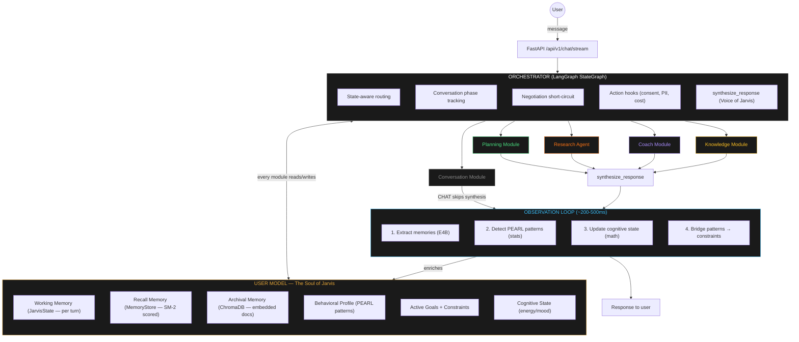

# Jarvis Architecture v2 — Design Spec

**Date:** 2026-04-12
**Author:** Madhav + Claude (Opus 4.6)
**Status:** Draft — awaiting review
**Supersedes:** `2026-03-28-jarvis-architecture-reset-design.md`
**Reference:** `docs/claude-code-architecture.md` (Claude Code internals analysis)

---

## Executive Summary

Jarvis v2 is a **Cognitive Architecture with the User Model at the center** — not a chatbot with tools, not a Claude Code clone. It adapts the strongest patterns from Claude Code (sub-agent isolation, hook pipeline, streaming, tool system) while being fundamentally different: Jarvis is a **stateful intelligence** that builds a deepening model of one person over time.

### What makes this architecture different

1. **Memory that changes math** — SM-2 decay on AI memories → PEARL behavioral inference → Memory→Constraint Bridge → OR-Tools solver constraints change. When Jarvis notices you skip morning tasks 70% of the time, the schedule math changes without you saying anything.
2. **Negotiation as core UX** — propose → review → edit → accept with a constraint solver backing it. No competitor does this.
3. **Deterministic core + intelligent periphery** — OR-Tools proves the schedule is correct. The LLM handles understanding, decomposition, and synthesis. The math is separate from the intelligence.
4. **Getting smarter** — Every interaction deposits behavioral data via the Observation Loop. The system improves without fine-tuning.

### Key decisions

- **LangGraph StateGraph** replaces hand-rolled `execute_agentic_flow()` in `control_policy.py`
- **Gemma 4 26B A4B** (primary) + **Gemma 4 E4B** (fast SLM) replace Qwen-27B + Qwen-4B. Gemini 2.5 Flash remains cloud fallback.
- **5 cognitive modules** — Planning (directed), Research (autonomous), Coach (directed), Knowledge (hybrid), Conversation (directed)
- **User Model is a lazy facade** over existing Supabase tables, not a new database
- **Observation Loop** runs after every turn (~200-500ms, blocking)
- **7 action hooks** for consent gates, PII filtering, cost tracking
- **Existing code wraps** — no rewrites, existing functions become LangGraph nodes

---

## Table of Contents

1. [Core Architecture](#1-core-architecture)
2. [User Model](#2-user-model)
3. [LangGraph Orchestrator](#3-langgraph-orchestrator)
4. [Five Cognitive Modules](#4-five-cognitive-modules)
5. [Observation Loop](#5-observation-loop)
6. [Action Hooks + Model Routing](#6-action-hooks--model-routing)
7. [Streaming + Frontend Integration](#7-streaming--frontend-integration)
8. [Migration Path + Implementation Priority](#8-migration-path--implementation-priority)
9. [Claude Code Feature Adoption Matrix](#9-claude-code-feature-adoption-matrix)

---

## 1. Core Architecture



### Architecture principles

| Principle | Implementation |
|---|---|
| User Model at center | Every module reads from and writes to the UserModel facade. It's the shared intelligence. |
| Modules, not autonomous agents (mostly) | Planning, Coach, Knowledge, Conversation are orchestrator-directed. They don't decide WHAT to do. |
| Agents where autonomy matters | Research and File operations within Knowledge can explore/iterate/decide. |
| Observation Loop, not just hooks | Post-turn behavioral intelligence: memory extraction + PEARL + constraint bridge. |
| Action hooks for consent | Synchronous blocking gates for consent, PII, cost — separate from Observation. |
| Wrap, don't rewrite | Existing functions become LangGraph nodes. No code is deleted. |
| Local-first always | Gemma 4 models primary, Gemini fallback only for web research or validation failure. |

---

## 2. User Model

The User Model is a **lazy facade** over existing Supabase tables — not a new database. It loads data on first access, caches per-session, and invalidates on writes.

### Data structure

```python
class UserModel:
    """Lazy facade over Supabase tables. Queries on first access, caches."""
    
    def __init__(self, user_id: str, db: DatabaseClient):
        self._user_id = user_id
        self._db = db
        self._cache: dict[str, Any] = {}
    
    # ── Working Memory (per-turn, in JarvisState not here) ──
    
    # ── Recall Memory (SM-2 scored facts, preferences, goals) ──
    async def get_memory_store(self) -> MemoryStore:
        """SM-2 scored memories from user_memories table."""
        ...
    
    # ── Archival Memory (embedded documents) ──
    async def get_semantic_store(self) -> ChromaDBHandle:
        """Vector embeddings from ChromaDB."""
        ...
    
    # ── Behavioral constraints ──
    async def get_behavioral_constraints(self) -> list[BehavioralConstraint]:
        """From behavioral_constraints table. PEARL patterns applied."""
        if "constraints" not in self._cache:
            self._cache["constraints"] = await self._db.table(
                "behavioral_constraints"
            ).select("*").eq("user_id", self._user_id).execute()
        return self._cache["constraints"]
    
    # ── Active state ──
    async def get_pending_tasks(self) -> list[TaskChunk]: ...
    async def get_active_goals(self) -> list[Goal]: ...
    async def get_active_draft(self) -> Optional[DraftSchedule]: ...
    
    # ── Behavioral profile ──
    async def get_pearl_patterns(self) -> list[PEARLPattern]: ...
    
    # ── Cognitive state ──
    async def get_estimated_energy(self) -> float: ...
    
    # ── Cache management ──
    def invalidate(self, key: str):
        """Called after a module writes to this data."""
        self._cache.pop(key, None)
    
    async def upsert_behavioral_constraint(self, constraint: BehavioralConstraint):
        """Write + invalidate."""
        await self._db.table("behavioral_constraints").upsert(...)
        self.invalidate("constraints")
```

### Memory naming (aligned with March 28 spec)

| Tier | Name | Storage | What's in it |
|---|---|---|---|
| Working | `JarvisState` (per-turn) | In-memory | Current turn context, module outputs, conversation phase |
| Recall | `MemoryStore` handle | Supabase `user_memories` | SM-2 scored facts, preferences, goals, feedback, constraints |
| Archival | `ChromaDBHandle` | ChromaDB vectors | Embedded document chunks, research findings |
| (Separate) | `behavioral_constraints` | Supabase table | Explicit rules from PEARL or user statements — feed OR-Tools |

### Mapping to existing code

| UserModel field | Existing source | Changes |
|---|---|---|
| `get_behavioral_constraints()` | `behavioral_constraints` table + `behavioral_store.py` | Add SM-2 confidence decay |
| `get_memory_store()` | `user_memories` table + `memory/store.py` | Expose as lazy handle |
| `get_semantic_store()` | ChromaDB via `chroma_client.py` | No change |
| `get_pending_tasks()` | `user_tasks` via `task_retrieval.py` | No change |
| `get_active_goals()` | `user_plan_updates` table | No change |
| `get_active_draft()` | `draft_store.py` | No change |
| `get_pearl_patterns()` | `memory/pearl.py` detectors | Extract from behavioral_constraints |
| `get_estimated_energy()` | Heuristic in `pacing.py` | Promote to UserModel method |

---

## 3. LangGraph Orchestrator

The orchestrator replaces `execute_agentic_flow()` in `control_policy.py`.

### State schema

```python
from langgraph.graph import StateGraph, END
from typing import TypedDict, Optional

class JarvisState(TypedDict):
    """State that flows through the LangGraph orchestrator."""
    
    # User Model (lazy facade, loaded once per session)
    user_model: UserModel
    
    # Current turn
    user_message: str
    brain_dump: Optional[BrainDumpExtraction]
    intent: Optional[IntentType]
    initiated_by: str  # "user" | "system" | "pearl"
    
    # Module outputs
    execution_graph: Optional[ExecutionGraph]
    schedule: Optional[dict]
    draft_response: Optional[DraftSchedule]
    research_results: Optional[list[dict]]
    ingestion_result: Optional[IngestionResult]
    clarification_request: Optional[str]
    
    # Response
    thinking_process: Optional[str]
    response_message: Optional[str]
    
    # Orchestrator control
    conversation_phase: ConversationPhase  # GREETING | PLANNING | NEGOTIATION | REVIEW | CHAT
    negotiation_state: NegotiationPhase    # NONE | PROPOSED | REVIEWING | EDITING | ACCEPTED
    modules_invoked: list[str]
    needs_followup: bool
    error: Optional[str]
```

### Graph topology

```python
graph = StateGraph(JarvisState)

# Nodes
graph.add_node("load_context",        load_user_model_and_memories)
graph.add_node("extract_brain_dump",  extract_with_gemma_e4b)
graph.add_node("classify_intent",     classify_intent_gemma_e4b)
graph.add_node("planning_module",     planning_graph.compile())
graph.add_node("research_agent",      research_graph.compile())
graph.add_node("coach_module",        run_coaching_response)
graph.add_node("knowledge_module",    knowledge_graph.compile())
graph.add_node("conversation_module", run_general_chat)
graph.add_node("synthesize_response", voice_of_jarvis_synthesis)
graph.add_node("observation_loop",    run_observation_loop)

# Negotiation short-circuit — skip extraction + classification
graph.add_conditional_edges("load_context", check_negotiation_shortcut, {
    "negotiation_active": "planning_module",
    "normal":             "extract_brain_dump",
})

graph.add_edge("extract_brain_dump", "classify_intent")

# State-aware intent routing
graph.add_conditional_edges("classify_intent", route_to_module, {
    "PLAN_DAY":         "planning_module",
    "EDIT_TASK":        "planning_module",
    "REARRANGE":        "planning_module",
    "ACCEPT_DRAFT":     "planning_module",
    "REJECT_DRAFT":     "planning_module",
    "ADD_CONSTRAINT":   "planning_module",
    "INGEST_DOCUMENT":  "knowledge_module",
    "CALENDAR_SYNC":    "knowledge_module",
    "CHECK_PROGRESS":   "coach_module",
    "RESEARCH":         "research_agent",
    "CHAT":             "conversation_module",
})

# Non-CHAT modules → synthesize → observe
for module in ["planning_module", "research_agent", "coach_module", "knowledge_module"]:
    graph.add_edge(module, "synthesize_response")
graph.add_edge("synthesize_response", "observation_loop")

# CHAT → observe directly (it IS the synthesis)
graph.add_edge("conversation_module", "observation_loop")

# Observation → done or multi-turn loop
graph.add_conditional_edges("observation_loop", check_needs_followup, {
    True:  "classify_intent",
    False: END,
})

# Compile with checkpointing
from langgraph.checkpoint.memory import MemorySaver
app = graph.compile(checkpointer=MemorySaver())
```

### State-aware routing

```python
def route_to_module(state: JarvisState) -> str:
    """Not a dumb router — understands conversation phase and history."""
    intent = state["intent"]
    phase = state["conversation_phase"]
    invoked = state["modules_invoked"]
    
    # Negotiation overrides intent classification
    if phase == ConversationPhase.NEGOTIATION:
        return "planning_module"
    
    # Anti-guilt: if planning failed, route to coach
    if "planning_module" in invoked and state.get("error"):
        return "coach_module"
    
    return INTENT_TO_MODULE.get(intent, "conversation_module")
```

---

## 4. Five Cognitive Modules

### Module 1: Planning Module (orchestrator-directed)

The flagship — brain dump → decompose → fuse → solve → draft.

```python
planning_graph = StateGraph(PlanningState)

planning_graph.add_node("fetch_constraints",     fetch_behavioral_constraints)
planning_graph.add_node("translate_habits",      translate_habits_to_slots)       # Gemma 26B
planning_graph.add_node("memory_to_constraints", bridge_memories_to_constraints)  # PEARL → OR-Tools
planning_graph.add_node("validate_goal",         check_goal_clarity)
planning_graph.add_node("decompose_goal",        socratic_chunker)               # Gemma 26B
planning_graph.add_node("fuse_tasks",            fuse_with_pending_tasks)
planning_graph.add_node("solve_schedule",        run_or_tools_solver)
planning_graph.add_node("handle_infeasible",     widen_horizon_and_recalibrate)

# Linear (sequential — never gather 26B calls)
planning_graph.add_edge("fetch_constraints", "translate_habits")
planning_graph.add_edge("translate_habits", "memory_to_constraints")
planning_graph.add_edge("memory_to_constraints", "validate_goal")
planning_graph.add_conditional_edges("validate_goal", is_goal_clear, {
    True:  "decompose_goal",
    False: END,  # clarification request
})
planning_graph.add_edge("decompose_goal", "fuse_tasks")
planning_graph.add_edge("fuse_tasks", "solve_schedule")
planning_graph.add_conditional_edges("solve_schedule", check_feasibility, {
    "OPTIMAL":    END,
    "INFEASIBLE": "handle_infeasible",
})
planning_graph.add_conditional_edges("handle_infeasible", can_retry, {
    "retry":     "solve_schedule",   # widen horizon (48h → 72h → 5d)
    "exhausted": END,                # anti-guilt response
})
```

| Aspect | Detail |
|---|---|
| **Type** | Module (orchestrator-directed) |
| **LLM** | Gemma 26B — sequential, never concurrent |
| **Reads** | constraints, tasks, goals, energy, memory_store |
| **Writes** | active_draft, pending_tasks (on accept) |
| **Existing code** | `control_policy.py`, `solver.py`, `habit_translator.py`, `horizon_expander.py`, `task_retrieval.py`, `schedule_modifier.py`, `task_editor.py`, `task_rearranger.py` |

Draft negotiation lives in the **orchestrator** (negotiation short-circuit), not inside this module.

### Module 2: Research Agent (autonomous)

```python
research_graph = StateGraph(ResearchState)

research_graph.add_node("plan_research",    plan_search_strategy)
research_graph.add_node("execute_search",   web_search_or_rag)
research_graph.add_node("evaluate_results", assess_relevance)
research_graph.add_node("summarize",        summarize_findings)            # Gemma 26B
research_graph.add_node("link_to_tasks",    link_findings_to_user_tasks)

research_graph.add_edge("plan_research", "execute_search")
research_graph.add_edge("execute_search", "evaluate_results")
research_graph.add_conditional_edges("evaluate_results", needs_more, {
    True:  "execute_search",
    False: "summarize",
})
research_graph.add_edge("summarize", "link_to_tasks")
research_graph.add_edge("link_to_tasks", END)
```

| Aspect | Detail |
|---|---|
| **Type** | Agent (autonomous, can iterate) |
| **LLM** | Gemini 2.5 Flash (web search) + Gemma 26B (summarization) |
| **Reads** | goals, tasks, memory_store |
| **Writes** | semantic_store (new embeddings), task-material links |
| **Existing code** | `workspace_builder.py` |

### Module 3: Coach Module (orchestrator-directed)

| Aspect | Detail |
|---|---|
| **Type** | Module (single node, no sub-graph) |
| **LLM** | Gemma E4B |
| **Reads** | memory_store, PEARL patterns, energy, pending_tasks |
| **Writes** | Nothing — Observation Loop extracts signals |
| **Triggers** | CHECK_PROGRESS intent, INFEASIBLE fallback, PEARL stress pre-step |
| **Existing code** | `voice_of_jarvis.py` (partially), `psychology/woop.py`, `psychology/pacing.py` |

### Module 4: Knowledge Module (hybrid)

```python
knowledge_graph = StateGraph(KnowledgeState)

knowledge_graph.add_node("classify_content",  classify_document_type)
knowledge_graph.add_node("extract_calendar",  extract_calendar_for_approval)
knowledge_graph.add_node("ingest_document",   docling_to_chromadb)
knowledge_graph.add_node("link_to_tasks",     auto_link_by_similarity)       # cosine ≥ 0.65
knowledge_graph.add_node("file_operations",   handle_file_read_write_glob)
knowledge_graph.add_node("propose_actions",   extract_action_items)

knowledge_graph.add_conditional_edges("classify_content", content_type, {
    "calendar":  "extract_calendar",
    "document":  "ingest_document",
    "file_op":   "file_operations",
})
knowledge_graph.add_edge("ingest_document", "link_to_tasks")
knowledge_graph.add_edge("link_to_tasks", "propose_actions")
knowledge_graph.add_edge("propose_actions", END)
knowledge_graph.add_edge("extract_calendar", END)
knowledge_graph.add_edge("file_operations", END)
```

| Aspect | Detail |
|---|---|
| **Type** | Hybrid (directed for ingestion, autonomous for file exploration) |
| **LLM** | Gemma E4B (calendar) + Gemma 26B (document understanding) |
| **Reads** | goals, tasks, semantic_store |
| **Writes** | semantic_store, pending_calendar_updates, action items |
| **Existing code** | `extraction/orchestrator.py`, `knowledge_ingester.py`, `calendar_extractor.py`, `task_material_linker.py`, `documents/pipeline.py` |

### Module 5: Conversation Module (orchestrator-directed)

| Aspect | Detail |
|---|---|
| **Type** | Module (single node, CHAT intent only) |
| **LLM** | Gemma E4B |
| **Reads** | memory_store, PEARL patterns, constraints |
| **Writes** | Nothing — Observation Loop extracts signals |
| **Existing code** | `voice_of_jarvis.py` |

**Important:** Conversation Module handles CHAT intent only. It does NOT synthesize responses for other modules — that's the orchestrator's `synthesize_response` node.

### `synthesize_response` (orchestrator step, not a module)

Runs after Planning, Research, Coach, Knowledge. Wraps module output in Voice of Jarvis personality. Adapts tone based on User Model context (energy, PEARL patterns, conversation phase).

### Module summary

| Module | Type | Sub-graph? | LLM | Key reads | Key writes |
|---|---|---|---|---|---|
| **Planning** | Directed | Yes (8 nodes) | Gemma 26B | constraints, tasks, goals, energy | draft, tasks |
| **Research** | Autonomous | Yes (5 nodes, loops) | Gemini + 26B | goals, tasks, memory | semantic store |
| **Coach** | Directed | No | Gemma E4B | memory, PEARL, energy, tasks | nothing |
| **Knowledge** | Hybrid | Yes (6 nodes) | E4B + 26B | goals, tasks, semantic store | semantic store, calendar |
| **Conversation** | Directed | No | Gemma E4B | memory, PEARL, constraints | nothing |

---

## 5. Observation Loop

Runs after **every interaction** (~200-500ms, blocking). The intelligence multiplier.

```python
async def run_observation_loop(state: JarvisState) -> JarvisState:
    """Post-turn behavioral intelligence. Blocking but fast (~200-500ms).
    
    Must be blocking because check_needs_followup reads results
    to decide whether to loop back.
    """
    user_model = state["user_model"]
    messages = state["user_message"], state["response_message"]
    
    # Sequential — total under 500ms
    await extract_and_store_memories(user_model, messages)   # E4B (~300ms)
    patterns = await detect_pearl_patterns(user_model)        # pure SQL/stats (~50ms)
    await update_cognitive_state(user_model)                   # pure math (~10ms)
    await bridge_patterns_to_constraints(user_model, patterns) # DB write (~50ms)
    
    return state
```

### Step 1: Memory Extraction

- **LLM:** Gemma E4B
- **Extracts:** Facts, preferences, goals, constraints, feedback — 7 memory types from `MemoryType` enum
- **SM-2:** New memories start with `ef=2.5`, `repetitions=0`. Each recall adjusts ef. Floor at 1.3.
- **Not every turn produces memories.** Prompted: "Only extract if the user revealed something new."

### Step 2: PEARL Pattern Detection

- **No LLM needed** — pure statistical analysis on episodic events
- **Current detectors:** TimeOfDayDetector, SkipPatternDetector, DurationAccuracyDetector
- **Confidence threshold:** ≥ 0.7 to act (matches `MIN_PATTERN_RATE` in `pearl.py`)

### Step 3: Update Cognitive State

- Circadian energy curve (from `pacing.py`)
- Adjust by recent skip rate

### Step 4: Memory → Constraint Bridge (THE MOAT)

| Pattern detected | Constraint created | OR-Tools effect |
|---|---|---|
| "Skips morning tasks 70%" | Soft block 8-11 AM | High-difficulty pushed to afternoon |
| "Takes 1.5x estimated time" | Duration multiplier 1.5x | More slack, fewer INFEASIBLE |
| "Productive after 2 PM" | Priority boost 2-6 PM | Best tasks in peak window |
| "Rejects schedules with >6 tasks" | Daily cap reduced to 6 | Less overwhelm |

No competitor has this. Everyone has an LLM. Nobody has memories that change the math.

---

## 6. Action Hooks + Model Routing

### 6A: Action Hooks

Synchronous, blocking gates — distinct from the Observation Loop. 7 events, lean and domain-specific.

| Hook | When | Blocking? |
|---|---|---|
| `PreModuleExecution` | Before module runs (system/PEARL-initiated only — user-initiated auto-allows) | Yes |
| `PostModuleExecution` | After module returns | No |
| `PreScheduleModify` | Before persisting schedule changes (draft negotiation UX) | Yes |
| `PreCloudLLM` | Before routing to Gemini (PII filter) | Yes |
| `PreMemoryWrite` | Before writing to user_memories | Optional |
| `CostThreshold` | Token count exceeds threshold | No |
| `ProactiveSuggestion` | Before unsolicited advice (Phase 2+) | Yes |

**`PreModuleExecution` is smart:** checks `initiated_by` field. User-initiated actions pass through. Only system/PEARL-initiated actions trigger the consent gate.

**Tiered consent (user trains Jarvis's autonomy):**

| Tier | Auto-allowed | Asks |
|---|---|---|
| **Cautious** (default) | Read memory, classify, decompose | Schedule changes, constraint adds, memory writes |
| **Balanced** (after 1 week) | + single-goal schedule changes | Multi-goal replans, habit mods |
| **Autonomous** (opt-in) | + proactive suggestions, auto-replan | Irreversible actions |

```python
class ActionHooks:
    """Lightweight hook pipeline. 7 events, simple registry."""
    
    def __init__(self):
        self._handlers: dict[str, list[HookHandler]] = {}
    
    def register(self, event: str, handler: HookHandler):
        self._handlers.setdefault(event, []).append(handler)
    
    async def execute(self, event: str, **context) -> HookResult:
        for handler in self._handlers.get(event, []):
            result = await handler(**context)
            if result.decision in (HookDecision.DENY, HookDecision.ASK):
                return result
        return HookResult(decision=HookDecision.ALLOW)
```

### 6B: Model Routing

| Model | Role | Latency |
|---|---|---|
| **Gemma 4 26B A4B** (~13-15 GB) | Decomposition, habit translation, document understanding, research summarization | 2-5s |
| **Gemma 4 E4B** (~2-3 GB) | Intent classification, brain dump extraction, memory extraction, Voice of Jarvis, calendar parsing, goal validation | 200-500ms |
| **Gemini 2.5 Flash** (cloud) | Web search, real-time research, last-resort fallback | 1-3s |

**Routing:**

```python
MODEL_ROUTING = {
    "socratic_chunker":        ModelRole.PRIMARY,    # 26B
    "habit_translation":       ModelRole.PRIMARY,
    "document_understanding":  ModelRole.PRIMARY,
    "research_summarization":  ModelRole.PRIMARY,
    "intent_classification":   ModelRole.FAST,       # E4B
    "brain_dump_extraction":   ModelRole.FAST,
    "memory_extraction":       ModelRole.FAST,
    "voice_of_jarvis":         ModelRole.FAST,
    "calendar_parsing":        ModelRole.FAST,
    "goal_validation":         ModelRole.FAST,
    "web_search":              ModelRole.CLOUD,      # Gemini
    "real_time_research":      ModelRole.CLOUD,
}
```

**Fallback chain:**

```python
async def route_llm_call(task, prompt, response_schema, hooks):
    role = MODEL_ROUTING.get(task, ModelRole.FAST)
    
    # Try local first (unless cloud-only)
    if role in (ModelRole.PRIMARY, ModelRole.FAST):
        try:
            result = await call_local_lm_studio(role.value, prompt, response_schema)
            return response_schema.model_validate_json(strip_fences(result))
        except (ValidationError, JSONDecodeError):
            logger.warning(f"Local {role.value} failed for {task}")
    
    # Cloud path — PII filter exactly once here
    pii_result = await hooks.execute("PreCloudLLM", prompt=prompt)
    if pii_result.decision == HookDecision.MODIFY:
        prompt = pii_result.modified_input["prompt"]
    
    result = await call_gemini(prompt, response_schema)
    return response_schema.model_validate_json(result)
```

**Critical constraint:** Never run two 26B calls concurrently. LangGraph's linear edges enforce this.

---

## 7. Streaming + Frontend Integration

### SSE Contract (backward-compatible)

The existing 4 SSE event types are preserved:

| Event | Data | Status |
|---|---|---|
| `event: phase` | `{phase, ...detail}` | Preserved — node completion → phase event |
| `event: step` | `{intent, stage, model_mode, synthesis_model}` | Preserved — at intent classification + pipeline_done |
| `event: error` | `{error: string}` | Preserved — try/except wrapper |
| `event: complete` | Full ChatResponse dict | Preserved — final response |

3 new event types (additive, frontend ignores until ready):

| Event | Data | Purpose |
|---|---|---|
| `event: consent_request` | `{reason, module, options}` | Hook-triggered consent dialog |
| `event: memory_extracted` | `{count, types}` | "Jarvis learned 2 things" indicator |
| `event: pattern_detected` | `{pattern_type, confidence}` | "Noticed: you prefer afternoons" badge |

### LangGraph → SSE mapping

```python
async def event_generator():
    config = {"configurable": {"thread_id": request.user_id}}
    
    try:
        async for event in jarvis_graph.astream(initial_state, config):
            node_name = list(event.keys())[0]
            node_state = event[node_name]
            
            phase = NODE_TO_PHASE.get(node_name)
            if phase:
                yield f"event: phase\ndata: {json.dumps({'phase': phase})}\n\n"
            
            if node_name == "classify_intent":
                yield f"event: step\ndata: {json.dumps({'intent': node_state['intent'], 'stage': 'intent_classified'})}\n\n"
            
            if node_state.get("thinking_process"):
                yield f"event: phase\ndata: {json.dumps({'phase': 'reasoning', 'thinking': node_state['thinking_process']})}\n\n"
            
            if node_state.get("draft_response"):
                yield f"event: phase\ndata: {json.dumps({'phase': 'draft_ready', **node_state['draft_response']})}\n\n"
        
        final = jarvis_graph.get_state(config).values
        yield f"event: step\ndata: {json.dumps({'intent': final['intent'], 'stage': 'pipeline_done', 'model_mode': 'gemma', 'synthesis_model': 'gemma-4-e4b'})}\n\n"
        yield f"event: complete\ndata: {json.dumps(build_chat_response(final))}\n\n"
    
    except Exception as exc:
        yield f"event: error\ndata: {json.dumps({'error': str(exc)})}\n\n"
```

### Phase names (match existing frontend voice)

```typescript
// jarvis-frontend/lib/constants.ts — ADDITIVE only
export const PHASE_NAMES: Record<string, string> = {
  // Existing (unchanged)
  connecting:            "Brewing your plan...",
  brain_dump_extraction: "Digesting your brain dump...",
  extracting:            "Digesting your brain dump...",
  intent_classified:     "Aha, figuring out what you need...",
  classifying:           "Aha, figuring out what you need...",
  decomposing:           "Breaking it into bite-sized pieces...",
  translating:           "Reading your habits...",
  scheduling:            "Crunching the numbers...",
  reasoning:             "Putting on my thinking cap...",
  responding:            "Crafting your response...",
  synthesizing:          "Adding the finishing touches...",
  complete:              "Voila!",
  
  // New (additive — playful tone)
  loading_context:       "Recalling what I know about you...",
  habits_fetched:        "Rounding up your habits...",
  habits_translated:     "Weaving habits into the timeline...",
  memory_bridging:       "Turning your patterns into math...",
  researching:           "Digging around the web...",
  coaching:              "Checking how you're doing...",
  ingesting:             "Munching on your document...",
  learning:              "Jotting down what I learned...",
  validating:            "Making sure I understand the goal...",
  schedule_done:         "Schedule locked in!",
  confirming:            "Getting your thumbs up...",
};
```

Frontend gracefully handles unknown phases via `getPhaseDisplayName()` fallback: `phase.replace(/_/g, ' ')`.

### Frontend changes: NONE

All 7 existing frontend components are unchanged. Backend migration is transparent.

### Checkpoint/resume (new, from LangGraph)

```python
state = jarvis_graph.get_state(config)
if state and state.values.get("active_draft"):
    yield sse_event("resume", {
        "message": "Welcome back! You had a schedule draft in progress.",
        "draft": state.values["active_draft"],
    })
```

---

## 8. Migration Path + Implementation Priority

### File Migration Map

**Replace:**

| File | New location |
|---|---|
| `services/analytical/control_policy.py` | `orchestrator/graph.py` |
| `services/intent_registry.py` | LangGraph conditional edges |

**Refactor:**

| File | Changes |
|---|---|
| `models/brain/litellm_conf.py` | → `core/model_router.py` (same interface, task-based routing) |
| `api/v1/endpoints/chat.py` | SSE generator calls `jarvis_graph.astream()` |
| `app/main.py` | Add graph initialization in lifespan |

**Wrap (same code, LangGraph node wrappers):**

| File | New role |
|---|---|
| `services/analytical/habit_translator.py` | `translate_habits` node |
| `services/analytical/horizon_expander.py` | Inside `fetch_constraints` node |
| `services/analytical/task_retrieval.py` | Inside `fuse_tasks` node |
| `services/analytical/schedule_modifier.py` | Planning module (EDIT_TASK) |
| `services/analytical/task_editor.py` | Planning module (task edits) |
| `services/analytical/task_rearranger.py` | Planning module (REARRANGE) |
| `services/analytical/workspace_builder.py` | Research agent sub-graph |
| `services/analytical/voice_of_jarvis.py` | `synthesize_response` node |
| `services/extraction/orchestrator.py` | Knowledge module sub-graph |
| `services/extraction/knowledge_ingester.py` | `ingest_document` node |
| `services/extraction/calendar_extractor.py` | `extract_calendar` node |
| `services/extraction/task_material_linker.py` | `link_to_tasks` node |
| `services/extraction/action_item_handler.py` | `propose_actions` node |
| `services/documents/pipeline.py` + `registry.py` | Knowledge module sub-graph |

**Keep (unchanged):**

| Category | Files |
|---|---|
| **Core** | `core/config.py`, `core/jarvis_logger.py`, `core/psychology/pacing.py`, `core/or_tools/solver.py`, `core/or_tools/constraints.py` |
| **DB** | `db/supabase_py.py` |
| **Services** | `draft_store.py`, `chat_history.py`, `sm2_engine.py`, `behavioral_store.py` |
| **Utils** | `docling_helper.py`, `chroma_client.py`, `deadline_parser.py`, `embedding.py`, `metrics.py`, `pacing.py` |
| **Schemas** | `context.py` (extended), `draft.py`, `document.py`, `memory.py`, `workspace.py` |
| **Endpoints** | `drafts.py`, `tasks.py`, `sessions.py`, `memories.py`, `documents.py`, `habits.py`, `workspace.py`, `schedule.py`, `reasoning.py`, `ingestion.py` |
| **Router** | `api/v1/router.py` |

**Deprecate:**

| File | Reason |
|---|---|
| `services/intent_registry.py` | LangGraph conditional edges replace |
| `app/core/registry.py` | Superseded alongside intent_registry |

**New files to create:**

| File | Purpose |
|---|---|
| `orchestrator/graph.py` | Main LangGraph StateGraph |
| `orchestrator/state.py` | JarvisState + ConversationPhase + NegotiationPhase |
| `orchestrator/routing.py` | State-aware `route_to_module()` |
| `orchestrator/hooks.py` | ActionHooks class + handlers |
| `modules/planning_graph.py` | Planning sub-graph |
| `modules/research_graph.py` | Research agent sub-graph |
| `modules/knowledge_graph.py` | Knowledge module sub-graph |
| `modules/coach.py` | Coach module function |
| `modules/conversation.py` | Conversation module function |
| `core/user_model.py` | UserModel lazy facade |
| `core/model_router.py` | `route_llm_call()` task-based routing |
| `core/observation.py` | Observation Loop |

### Implementation Priority (6 Layers)

```
Layer 1: User Model facade                ← makes existing data coherent
Layer 2: LangGraph orchestrator + hooks   ← replaces control_policy.py
Layer 3: Planning module + model router   ← flagship, already works
Layer 4: Observation Loop                 ← intelligence multiplier
Layer 5: Remaining modules + hooks        ← Research, Coach, Knowledge, Conversation
Layer 6: Intelligence layer               ← DKT, RL, SARIMAX (future)
```

**Layer 1: User Model (1-2 days)**

- Create `core/user_model.py` — lazy facade over existing Supabase tables
- Hydrate from `behavioral_constraints`, `user_tasks`, `user_plan_updates`, `user_memories`
- Add `invalidate(key)` for cache management
- Test: load UserModel for a real user, verify all fields populate

**Layer 2: LangGraph Orchestrator (2-3 days)**

- `pip install langgraph langchain-core`
- Create `orchestrator/state.py`, `orchestrator/graph.py`, `orchestrator/routing.py`
- Create `orchestrator/hooks.py` with ActionHooks class + `PreCloudLLM` hook (needed by Layer 3)
- Wire SSE endpoint: `jarvis_graph.astream()` replaces `execute_agentic_flow()`
- Add negotiation short-circuit + checkpointing (MemorySaver)
- Test: send a message, verify graph executes and SSE events fire

**Layer 3: Planning Module + Model Router (1-2 days)**

- Create `core/model_router.py` — `route_llm_call()` replacing `hybrid_route_query()`
- Create `modules/planning_graph.py` wrapping existing functions
- Wrap: `translate_habits`, `socratic_chunker`, `run_schedule`, `schedule_modifier`, `task_editor`, `task_rearranger`
- Add `validate_goal` (early exit) + `handle_infeasible` (retry edge)
- Update `app/main.py` lifespan — initialize graph
- Test: full plan-day flow via LangGraph

**Layer 4: Observation Loop (1 day)**

- Create `core/observation.py`
- Wire as final graph node
- Test: PEARL → constraint bridge updates behavioral_constraints

**Layer 5: Remaining Modules + Hooks (2-3 days)**

- Create `modules/research_graph.py`, `modules/knowledge_graph.py`, `modules/coach.py`, `modules/conversation.py`
- Register remaining 6 hook handlers in `orchestrator/hooks.py`
- Add new intents to routing (RESEARCH, CHECK_PROGRESS)
- Test each module independently

**Layer 6: Intelligence Layer (Phase 2+ — weeks/months)**

- DKT LSTM: mastery tracking → `difficulty_weight` (needs 100+ completions/user)
- RL DQN: optimal ordering → replaces TMT (needs DKT output)
- SARIMAX: energy forecasting → replaces heuristic cap (needs 4+ weeks data)
- Signals API: time/focus/mood inputs
- Jarvis Capabilities: user-definable intents (Intent Discovery Engine from March 28 spec)

### Milestone Timeline

| Milestone | Layers | What user sees | Est. days |
|---|---|---|---|
| **M1: Foundation** | L1 + L2 + L3 | Same features, now on LangGraph. Checkpoint/resume. | ~5 |
| **M2: Intelligence** | L4 | Jarvis learns from every conversation. Patterns → constraints. | ~1 |
| **M3: Full modules** | L5 | Research, coaching, knowledge, consent gates. | ~3 |
| **M4: Model swap** | — | Gemma 4 replaces Qwen. Quality upgrade. | ~1 (parallel) |
| **M5: Frontend polish** | — | Execute existing `2026-04-01` bug fix spec. New SSE events. | ~2 (parallel) |

**Total: ~12 days focused work.**

---

## 9. Claude Code Feature Adoption Matrix

20 features from Claude Code, adapted for Jarvis's cognitive architecture.

| # | Feature | Adaptation | Priority |
|---|---|---|---|
| 1 | Sub-agent system | LangGraph sub-graphs with own state | Core (Layer 2) |
| 2 | Tool-call hooks (Pre/Post) | 7 action hooks (consent, PII, cost) | Core (Layer 2+5) |
| 3 | Auto-compaction | Session memory management + User Model compaction | Layer 4 |
| 4 | Token budget tracking | Local LLM token count + VRAM monitoring | Layer 3 |
| 5 | Task backgrounding | LangGraph async sub-graphs + `progress_callback` | Layer 5 |
| 6 | Spinner vocabulary | PHASE_NAMES with playful tone, per-module progress | Layer 2 |
| 7 | Session persistence | LangGraph checkpointing (MemorySaver → PostgresSaver) | Layer 2 |
| 8 | Streaming (AsyncGenerator) | LangGraph `.astream()` → SSE | Layer 2 |
| 9 | Stop hooks | Observation Loop (memory extraction, PEARL, suggestions) | Layer 4 |
| 10 | Skills system | Jarvis Capabilities (user-definable intents) | Phase 2+ |
| 11 | MCP protocol | Jarvis as MCP server + client | Phase 2+ |
| 12 | Plugin system | IntentBlueprint registry as plugin folders | Phase 2+ |
| 13 | Permission system | Tiered consent (cautious → balanced → autonomous) | Layer 5 |
| 14 | Output styles | Voice of Jarvis personality engine (context-adaptive tone) | Layer 2 |
| 15 | Shell execution | Jarvis runs scripts, opens apps, executes automations | Phase 2+ |
| 16 | File operations | Knowledge module (read/write/glob/grep) | Layer 5 |
| 17 | Web search + browser | Research agent (Gemini + RAG + summarize) | Layer 5 |
| 18 | IDE integration | Architecture supports it (bridge protocol) | Phase 2+ |
| 19 | Command system | `/plan`, `/focus`, `/review`, `/ingest`, `/research` | Phase 2+ |
| 20 | Query engine (reasoning loop) | LangGraph StateGraph with state-aware routing | Core (Layer 2) |
