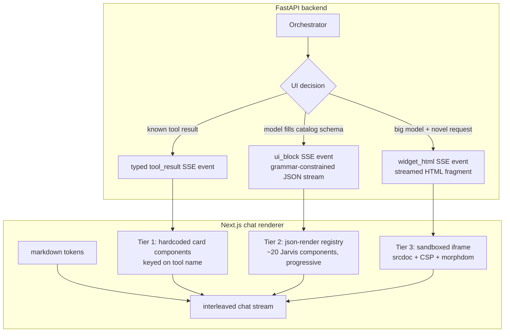
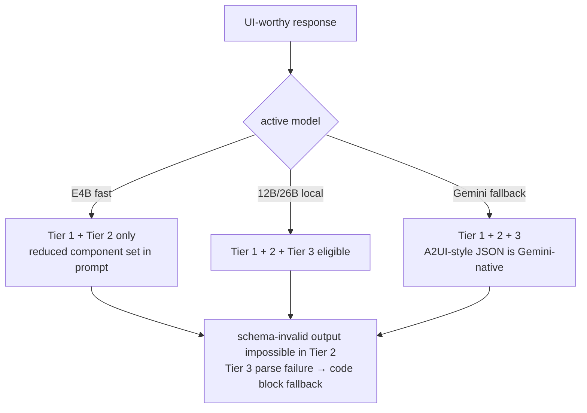
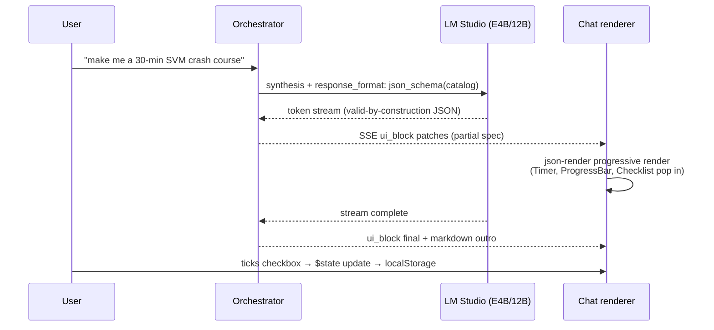

# Generative UI — Claude-Style Inline Rendering, Three Tiers

**Date:** 2026-08-08
**Status:** Design approved (pending final spec review)
**Depends on:** `2026-08-08-one-brain-stabilization-unification-design.md` (Tier 2+ need the stabilized v2 SSE path; Tier 1 can start in parallel — frontend-only)
**Research basis:** Deep-research report 2026-08-08 (Claude Artifacts/widget reverse-engineering, json-render/A2UI/MCP Apps survey, constrained-decoding literature)

---

## 1. Goal

When the user asks Jarvis to help study, plan, or track something, the chat should render **live interactive UI inline** — study trackers with timers and progress checkboxes, quiz cards, schedule cards, charts — the way Claude.ai does (reference: user's SVM-study-guide screenshots). It must work **local-first**: fully reliable on the small E4B model, richer on 26B/12B-class, maximal on cloud fallback.

## 2. How Claude does it (research summary that drives this design)

Claude.ai uses three separate mechanisms, and we mirror all three as tiers:

1. **Hardcoded renderers for known tool results** (Drive/search cards) — zero generation risk.
2. **Inline widgets via a `show_widget` tool call** streaming an HTML fragment, progressively DOM-injected (style → content → script ordering, DOM-diffing to avoid flashes), quality driven by a strict design-system prompt.
3. **Artifacts**: self-contained HTML/React in a sandboxed iframe on an isolated origin with strict CSP.

Key local-first insight: **grammar-constrained JSON generation collapses the small-vs-large model gap** (constrained 3B beats unconstrained 70B on schema tasks; LM Studio enforces `response_format: json_schema` at the decoder). The industry converged on "model emits data, client owns code" (Vercel json-render, Google A2UI, OpenAI Open-JSON-UI). Free-form codegen is the premium tier, not the foundation.

## 3. Architecture overview

### Model gating

## 4. Tier 1 — Typed tool-result cards (build first, frontend-only, ~days)

The v2 SSE stream already emits `tool_use` events from the ModuleStep wrapper. The frontend gets a renderer registry keyed on module/step name:

| Result type | Component |
|---|---|
| Schedule solve result | `ScheduleCard` — day grid, task blocks, accept/edit/reject buttons (wires to draft endpoints) |
| PEARL insight | `InsightCard` — pattern, confidence, blame-free framing |
| Task list / progress | `TaskListCard` — checkable, fires complete/skip endpoints |
| Memory extraction | `LearningMomentToast` (per existing UX memory: inline always, toast only ≥0.7 conf ×3 occurrences) |
| Document ingest result | `IngestCard` — type, chunks, linked tasks |

No model involvement. Works with the DB-degraded flag from the One Brain spec (cards render with a "stale" badge).

## 5. Tier 2 — JSON component catalog with grammar-constrained generation (core engine, ~1–2 wks)

### 5.1 Catalog

~20 components, defined **once** in Zod (`jarvis-frontend/lib/ui-catalog.ts`), mirrored as Pydantic models (`app/schemas/ui_catalog.py`), with a contract test in the test suite asserting the two JSON Schemas match. Initial set:

`Checklist`, `Timer`, `ProgressBar`, `StatRow`, `Flashcard`, `QuizQuestion`, `StudyPlanStep`, `Callout` (intuition/key-terms/exam-tip variants — the SVM-screenshot pattern), `MathBlock` (KaTeX), `CodeBlock`, `Table`, `Chart` (line/bar/donut via existing chart lib), `MermaidDiagram`, `CardGrid`, `TaskChip`, `WOOPForm`, `PomodoroCard`, `ScheduleMini`, `Divider`, `Text` (rich span runs).

Composition: a flat list of blocks with optional `children` one level deep (A2UI's finding: flat schemas are what small models fill reliably; deep recursion stresses grammar engines).

### 5.2 Generation

- New orchestrator step in the conversation/coach/research synthesis path: when the intent benefits from UI (study guide, quiz, plan review, comparison), the model is called with `response_format: json_schema` derived from the catalog — **LM Studio enforces this at the decoder, so invalid UI is unrepresentable.** Always set `max_tokens` (known constrained-decoding stall guard).
- Prompting uses the lazy-docs pattern (Claude's `read_me` trick): the full catalog doc is NOT in every system prompt; a compact component summary is, and the full per-component examples load only when a UI response is triggered.
- E4B gets a reduced catalog (10 components) in its prompt; the schema stays the full union (harmless).

### 5.3 Streaming render

- New SSE event `ui_block` interleaved with markdown token events. Payload: JSONL/JSON-Patch chunks of the growing spec (json-render's `createSpecStreamCompiler` format).
- Frontend adopts **vercel-labs/json-render** (Apache-2.0): catalog → registry renderer + spec-stream compiler; blocks pop in progressively as the model generates (checkbox items appear one by one — the Claude "magic").
- Interactivity: `$state`/`$bindState` bindings for checkboxes/timers persist to `localStorage` keyed by message id; action bindings (`completeTask`, `startTimer`) map to a small typed action registry that calls Jarvis endpoints.

### 5.4 Sequence

## 6. Tier 3 — Free-form HTML micro-widgets (wow tier, big-model only)

- A `show_widget` tool (mirroring Claude's) available **only** when the active model is 12B/26B-class or Gemini: emits `{title, loading_messages, widget_code}` where `widget_code` is a raw HTML fragment.
- Enforced generation order via prompt: `<style>` (CSS-variable-only, Jarvis theme tokens) → content HTML → `<script>` last.
- **Rendering: sandboxed iframe, not direct DOM injection** (Claude accepts direct-DOM risk because it controls the generator; we don't fully trust a local model's output). `sandbox="allow-scripts"`, srcdoc shell with strict CSP meta tag, **no CDN allowlist — offline-first**: local Chart.js + Tailwind-token bundle pre-injected into the shell.
- Progressive injection with **morphdom** diffing (no flash), scripts executed only on completion.
- postMessage JSON-RPC bridge (MCP-Apps-shaped) for widgets that need to call back (e.g., "mark mastered" → task endpoint) — allowlisted methods only.
- Failure mode: HTML that fails a sanity parse renders as a collapsed code block with a "show anyway" affordance.
- A **design-system prompt** (`app/prompts/widget_design_system.md`) ships as a first-class versioned asset: Jarvis CSS variables, two font weights, no gradients/shadows (they flash under DOM diffs), pre-styled card/button/skeleton snippets. Research finding: this prompt is ~80% of output quality.

## 7. Key decisions & rationale (ADR log)

| # | Decision | Why | Alternatives rejected |
|---|----------|-----|----------------------|
| D1 | **Schema-JSON catalog as the core engine, not free-form codegen** | Grammar-constrained decoding makes even E4B produce valid UI 100% of the time; free-form HTML from small local models is "usually works" at best and unvalidatable before render. Industry verdict agrees (Vercel paused RSC streamUI for json-render; Google A2UI; OpenAI Open-JSON-UI). | Free-form-first (unreliable locally), RSC/streamUI (Next server lock-in, incompatible with FastAPI SSE, deprecated by its own vendor), Thesys C1 (cloud dependency kills local-first). |
| D2 | **Adopt vercel-labs/json-render rather than build the renderer** | Apache-2.0, 36 shadcn components to crib, streaming spec compiler solved, generation side decoupled (FastAPI can feed it), community-proven with Ollama/local backends. | Hand-rolled registry renderer (weeks of streaming-parser edge cases already solved upstream). |
| D3 | **Flat component list, one nesting level** | A2UI's explicit finding: flat schemas are LLM-friendly; deep recursive trees stress grammar engines and small models. | Arbitrary-depth component tree (prettier types, worse reliability). |
| D4 | **Tier 3 in a sandboxed iframe, though Claude itself uses direct DOM injection** | Claude fully controls its generator; we run community local models. iframe + CSP is the only boundary that makes untrusted generated JS safe, and Simon Willison's testing confirms `allow-scripts` + CSP meta cannot be escaped. | Direct DOM + CSP (Claude's approach — unacceptable trust model here), no scripts at all (kills timers/interactivity). |
| D5 | **No CDNs anywhere; local asset bundles injected into the iframe shell** | Offline-first is the product thesis; CDN allowlists break on planes and leak usage. | Claude-style cdnjs/jsdelivr allowlist. |
| D6 | **E4B never gets Tier 3** | Small models can't reliably write coherent single-file HTML+JS; a broken widget is worse UX than a clean Tier 2 card. Gating by model class keeps every tier's promise honest. | "Let it try with fallback" (user sees failures; erodes the Jarvis-competence illusion). |
| D7 | **Catalog defined in Zod, mirrored in Pydantic, CI-checked** | Single source of truth argues for codegen, but a checked mirror is simpler than a codegen pipeline and the catalog changes slowly. Revisit codegen if drift bites twice. | JSON Schema as the single source with codegen both ways (tooling cost up front). |
| D8 | **UI state (checkboxes/timers) in localStorage keyed by message id, not Supabase** | Ephemeral widget state ≠ domain data; keeps widgets working DB-down; no schema churn. Domain-changing actions (complete task) go through real endpoints via the action registry. | Persisting widget state server-side (couples toy state to the DB, more failure surface). |
| D9 | **Build order Tier 1 → 2 → 3** | Each tier is independently shippable and de-risks the next (SSE plumbing from T1 reused by T2; streaming injection from T2's compiler informs T3). T1 works even with zero LLM — demo insurance. | Big-bang all-tiers (nothing demoable for weeks). |

## 8. Error handling

- Tier 2 schema violation: impossible by construction locally (grammar); Gemini path validates server-side, one retry, then plain-markdown fallback.
- Tier 2 stalled generation: `max_tokens` cap + SSE timeout → render whatever blocks completed + "…" indicator.
- Tier 3 malformed HTML: sanity parse fails → collapsed code block.
- Unknown component version skew (old cached frontend): renderer ignores unknown block types, renders known siblings, logs.

## 9. Testing

- Catalog contract test: Zod ↔ Pydantic JSON Schema equality, run as part of the normal test suite.
- Golden-spec renders: each of the ~20 components snapshot-rendered from fixture JSON.
- Constrained-generation integration test (LM Studio live, marked `@local`): 20 prompts × E4B → 100% schema-valid.
- Streaming test: chunked JSONL patches → progressive DOM assertions (Playwright).
- Tier 3 sandbox test: hostile fragment (fetch, top.location, cookie access) → blocked by CSP/sandbox, asserted in Playwright.
- Demo script: the SVM crash-course prompt from the user's screenshots → interactive tracker with timer, checkboxes, progress bar, on the local model.

## 10. Out of scope

Artifacts-style persistent side-panel apps (Tier 3 covers inline; persistence later) · MCP Apps interop (the postMessage bridge is shaped for it; actual MCP packaging later) · voice-driven UI · collaborative/shared widgets.
