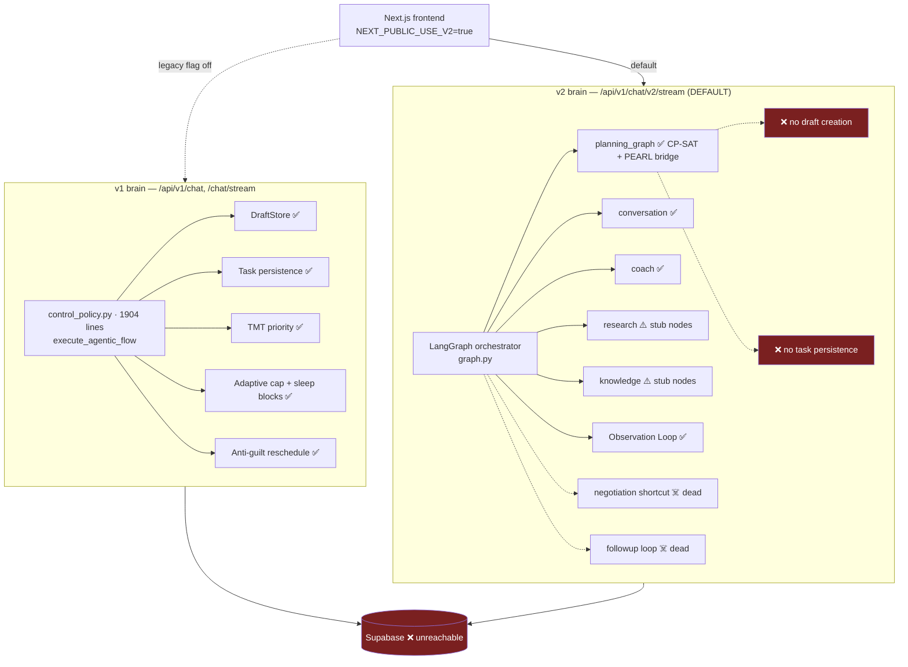
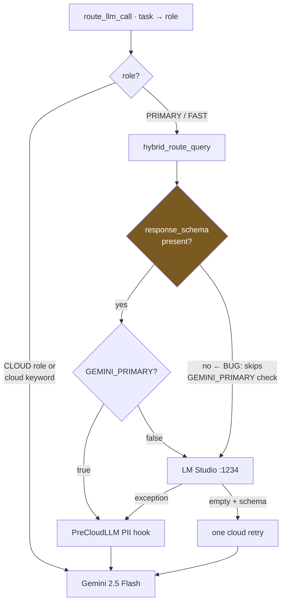
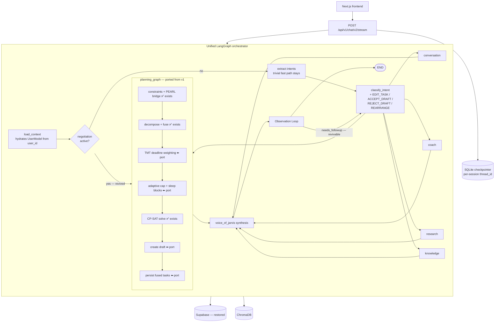
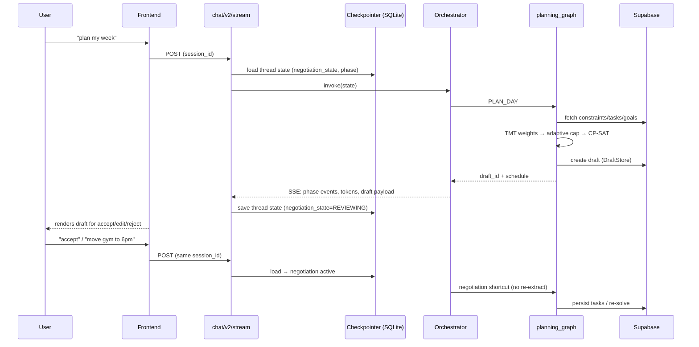

# One Brain — Demo-Path Stabilization + v1/v2 Unification

**Date:** 2026-08-08
**Status:** Design approved (pending final spec review)
**Supersedes:** the P0 ordering in `2026-05-01-post-spine-roadmap.md`
**Inputs:** Architecture audit (2026-08-08), full system health report (2026-08-08)

---

## 1. Problem

Three months of audit + live testing (2026-08-08) found:

1. **Every chat request returns 500.** The Supabase project host no longer resolves (paused/deleted), and `MemoryStore` bypasses the app's degraded-mode stub client, so an unguarded `httpx.ConnectError` kills `/chat` and `/chat/v2/stream` before any LLM is reached.
2. **Two parallel brains.** v1 (`control_policy.py`, 1,904 lines) has drafts, task persistence, TMT priority, adaptive caps, anti-guilt reschedule. v2 (LangGraph orchestrator) — **the path the frontend uses by default** (`NEXT_PUBLIC_USE_V2=true`) — has none of those: it never creates a draft (`draft_id` reported but never set) and never persists tasks. The negotiation UX, the pitch centerpiece, is dead on the default path.
3. **Dead v2 machinery.** `negotiation_state`, `conversation_phase`, and `needs_followup` are hardcoded at request entry and never updated; no checkpointer exists (`main.py:65-67` compiles without one because `UserModel` isn't serializable).
4. **LLM routing bug.** `GEMINI_PRIMARY` is only honored when `response_schema is not None` (`litellm_conf.py:114-122`) — unstructured calls route to a dead LM Studio and crash.
5. **Rotten model detection.** `detect_loaded_models()` only recognizes `27b/26b/22b` as primary-class and only Gemma-family models at all — current best local models (Gemma 4 12B, Qwen 3.6) would be misclassified or invisible.
6. **17/263 tests fail** (graph fixtures missing `register_default_modules()`, stale mocks patching moved symbols, draft route 404s); one test makes a live paid Gemini call. `chromadb` is not installed in the venv.
7. **Doc rot.** `PROJECT_STATUS.md`, `INDEX.md`, `POLICY_ENGINE_ARCHITECTURE.md` describe the pre-April system; the 04-05 Claude Code adaptation spec reads as active but was superseded; a raw pasted chat prompt sits inside the policy doc.

## 2. Current architecture (as verified 2026-08-08)

### 2.1 The two-brain problem

### 2.2 LLM routing as-is (bug highlighted)

## 3. Target architecture

One brain. v2 orchestrator absorbs the four missing v1 capabilities; v1 goes behind a deprecation shim and is deleted in a later milestone.

### 3.1 Request sequence (target, draft flow on default path)

## 4. Work items

### Phase 0 — stabilize (demo path green)

| # | Item | Files | Detail |
|---|------|-------|--------|
| 0.1 | Restore Supabase | — (user action) + `supabase/migrations/` | User unpauses project in dashboard. Then verify connectivity, apply the 2 loose May migrations (`2026-05-01_pearl_scheduled_hour.sql`, `2026-05-01_task_workspaces.sql`), and move them into `supabase/migrations/` so the CLI owns all schema. |
| 0.2 | MemoryStore resilience | `app/services/memory/store.py:34`, `retriever.py` | Respect an explicitly-passed stub/None client (no silent `_get_supabase()` fallback); wrap reads in try/except returning empty context. DB-down chat degrades, never 500s. |
| 0.3 | Routing fix | `app/models/brain/litellm_conf.py:114-122` | Honor `GEMINI_PRIMARY` for unstructured calls too — hoist the check above the schema branch. |
| 0.4 | Model detection refresh | `app/core/config.py:43-77` | Broaden heavy-class match (`12b`, `14b`); precedence: env override (`GEMMA_PRIMARY_MODEL`/`GEMMA_FAST_MODEL`) > loaded Gemma > loaded non-Gemma (`qwen`) as last-resort candidate; log what was picked and why. |
| 0.5 | Tests green | `tests/` | Graph-build fixtures call `register_default_modules()`; re-point stale mocks (`GEMINI_API_KEY` moved to `app.core.config`); fix draft route 404s (trailing slash); fix draft-store lifecycle failures; mock the live-Gemini coach test. Target: 263/263, fully offline. |
| 0.6 | Deps | `.venv`, `requirements.txt` | Install `chromadb`; verify `langgraph`/`uvicorn` pins match what's now installed (langgraph 1.2.10 vs `>=0.4.0` pin — pin a floor that matches tested behavior). |

### Phase 1 — unify

| # | Item | Files | Detail |
|---|------|-------|--------|
| 1.1 | Port draft creation | `app/modules/planning_graph.py` | New `create_draft` step calling the existing DraftStore exactly as `control_policy.py` does; set `draft_id` in state so `chat.py:1413` stops lying. |
| 1.2 | Port task persistence | `planning_graph.py` | v1 parity, made explicit: solve creates the **draft only**; `_persist_fused_tasks` runs **only on draft accept** (ACCEPT_DRAFT intent / confirm endpoint), never at solve time. |
| 1.3 | Port TMT + cap + sleep blocks | `planning_graph.py:205` area | Replace positional priority with the v1 TMT deadline weighting; add `compute_adaptive_daily_cap` and biological sleep-block injection; adopt v1's longer horizon-retry ladder. |
| 1.4 | Serializable state + checkpointer | `orchestrator/state.py`, `graph.py`, `main.py:65-67`, `chat.py` | `JarvisState` carries `user_id` (not the UserModel object); `load_context` hydrates the facade per-invocation; compile with `SqliteSaver` keyed by session thread_id; persist `negotiation_state`/`conversation_phase` across turns. This alone revives the negotiation shortcut and phase routing. |
| 1.5 | Intent coverage | `orchestrator/graph.py:135-165` | Classifier emits `EDIT_TASK`, `REARRANGE`, `ACCEPT_DRAFT`, `REJECT_DRAFT`, `ADD_CONSTRAINT` (routing table already has them); wire to draft flow. |
| 1.6 | Deprecate v1 | `chat.py`, `jarvis-frontend/lib/api.ts` | v1 endpoints delegate to v2 (or return deprecation warning + delegate); mark `control_policy.py` deprecated at top; remove the `NEXT_PUBLIC_USE_V2` frontend flag (v2 becomes the only path); deletion is a later milestone once parity is demo-verified. |
| 1.7 | Real token streaming | `chat.py:1293,1308` | Stream synthesis tokens incrementally instead of one whole-message "token" (`total_tokens: 1` today). |
| 1.8 | Doc truth pass | `docs/` | Rewrite `PROJECT_STATUS.md` against v2 reality; mark 04-05 spec **SUPERSEDED** in its header + INDEX; delete pasted-prompt junk from `POLICY_ENGINE_ARCHITECTURE.md:1156-1160`; add the four Apr/May specs to `INDEX.md`. |

## 5. Key decisions & rationale (ADR log)

| # | Decision | Why | Alternatives rejected |
|---|----------|-----|----------------------|
| D1 | **Keep Supabase; restore the existing project** | Fastest path to a working demo; all stores/migrations already target it; old data preserved if merely paused. | Fresh project (loses data, same code), local Postgres/SQLite rewrite (touches every store — deferred as its own future decision, revisit if local-first pitch demands it). |
| D2 | **Unify onto v2 (port v1 features in), not backport v2 into v1** | v2's LangGraph topology is the current, sound pattern (typed state, sub-graphs, observation loop) and matches the v2 spec + pitch narrative; v1 is a 1,904-line monolith violating the repo's own 200-line rule 10×. | Keeping both (every fix done twice, silent feature divergence via frontend flag — the state we're escaping); backporting (entrenches the monolith). |
| D3 | **SQLite checkpointer (LangGraph SqliteSaver), not Postgres/Supabase-backed** | Local-first, zero external dependency, survives Supabase outages — exactly the failure mode we just lived; trivially replaceable with PostgresSaver later since LangGraph's checkpointer is an interface. | MemorySaver (lost on restart — negotiation must survive restarts), PostgresSaver (couples conversation state to the DB that just took the system down). |
| D4 | **Hydrate UserModel inside `load_context` from `user_id`** | Root cause of "no checkpointer" was a non-serializable object in state. State should be data; facades are per-invocation. Also makes every graph node independently testable with a dict. | Custom msgpack serializer for UserModel (fragile, fights the framework). |
| D5 | **Chat must degrade gracefully when DB is down** (0.2) | An availability bug in a dependency must not zero out the whole product; demo insurance. | Fail-fast 500 (what we have; unacceptable for a local-first product). |
| D6 | **v1 deprecated via delegation shim, deleted later** | Parity claims need demo-verification first; shim keeps old clients working during the transition. | Immediate deletion (risky before parity proven), permanent coexistence (the disease itself). |
| D7 | **Broaden model detection instead of pinning new model names** | Model churn is ~quarterly (Gemma 4 12B now beats the older 27B-class at 8GB); detection by capability-class + env override outlives any hardcoded ID. | Hardcoding `gemma-4-12b` (stale in 3 months). |
| D8 | **Hooks tier system stays OUT of this spec** | Audit verdict: 5/7 hook events have no call sites — "consent theater." Wiring consent properly is its own design (Spec 3); shipping a half-wired safety layer is worse than none. | Bundling it here (scope creep on the critical path). |

## 6. Error handling

- **Supabase down:** every store read returns empty + logged warning; writes queue nothing (explicitly lossy) but return a `degraded: true` flag surfaced in SSE so the frontend can badge it.
- **LM Studio down:** `GEMINI_PRIMARY` honored on all call shapes (0.3); no Gemini key → clear startup error, chat returns a friendly "no model available" message rather than a traceback.
- **CP-SAT infeasible:** existing horizon-retry ladder + anti-guilt message (v1 behavior, ported with 1.3).
- **Checkpointer corruption:** on deserialize failure, start a fresh thread and log; never block chat.

## 7. Testing

- Phase 0 exit: 263/263 tests pass offline; live smoke: server boots with Supabase up **and** down, `/chat/v2/stream` returns SSE in both cases ("hi" fast path + a planning prompt).
- Phase 1 exit: new tests — draft created on v2 path (`draft_id` set), tasks persisted after accept, TMT ordering asserted, checkpointer round-trip (two-request negotiation), intent classifier covers the 5 new intents. Demo script: brain dump → draft → edit → accept → task complete → replan, all on `/v2/stream`.

## 8. Out of scope (deliberately)

Hooks tier system + wire-or-cut (Spec 3) · research/knowledge module cognition (Spec 3) · generative UI (separate spec, same date) · Google Calendar sync (creds exist, zero code — future spec) · local DB migration (revisit after YC/VC cycle) · DKT/RL/SARIMAX (still data-starved, per `FUTURE_ARCHITECTURE.md`).
