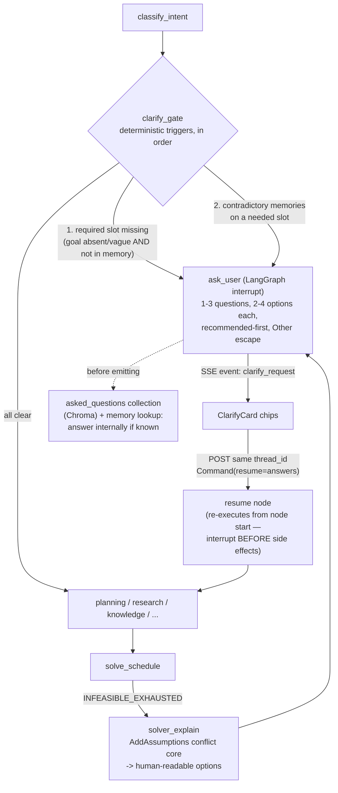

# Ask-Back Clarification Layer — "Solver Asks" Design

**Date:** 2026-08-13
**Status:** Design ready — implementation deliberately deferred until after the 2026-08-14 interview (demo path frozen).
**Research basis:** User-supplied deep research (Claude ask-back: training + prompting + AskUserQuestion tooling; MCP elicitation; QuestBench/"Ask or Assume?"/semantic-entropy literature; RouteLLM-style gating). That research proposed module names blind to the repo; this spec maps every piece onto the **real** architecture.

---

## 1. Thesis

Jarvis currently acts or hallucinates when underspecified (verified live: `plan` with no goal produced an invented plan instead of a question). The research verdict — ask-back is ~70–80% engineering — means a local Gemma-class model can do this well **if** the elicitation is an explicit typed action gated by cheap deterministic triggers. Jarvis has an unfair advantage the research flagged: **CP-SAT gives non-LLM, provably-grounded ask moments** (INFEASIBLE, ties, soft-constraint violations) that generic agents don't have.

## 2. What already exists (mapped, verified in code)

| Research blueprint item | Real Jarvis counterpart | State |
|---|---|---|
| Pause/resume loop (LangGraph `interrupt()` + checkpointer) | `ScrubbingSqliteSaver` + user-scoped `thread_id` (`app/orchestrator/checkpoint.py`) — `interrupt()`/`Command(resume=...)` work **today** | ✅ exists |
| "Irreversible action → confirm" trigger | The entire draft-negotiation loop: nothing writes `user_tasks` without an explicit accept (`draft_action`, plan_id-verified persist) | ✅ exists |
| INFEASIBLE → honest surface | `handle_infeasible` ladder → anti-guilt clarification, now passed through verbatim by the synthesis honesty gate (`app/modules/conversation.py`) | ✅ exists (prose, not options) |
| Required-slot trigger | `validate_goal` (5-char check — too weak; extraction hallucinates goals for vague input) | ⚠️ upgrade |
| RAG-first answer-before-asking | `build_memory_context` + `query_knowledge` (ChromaDB) | ✅ exists (not wired as ask-gate) |
| Contradictory-memory trigger | Contradiction detection + supersede in `app/services/memory/extractor.py` | ✅ exists (not surfaced as question) |
| Chip-style option UI | Draft accept/reject buttons, `InlineHabitStaging`, SSE typed events | ✅ pattern exists |
| Structured ask tool + PendingQuestion store | — | ❌ new |
| Solver conflict extraction (which constraints clash) | — (`JarvisScheduler` returns bare INFEASIBLE) | ❌ new |
| asked-questions dedup memory | — | ❌ new |

## 3. Architecture

## 4. Components

1. **`app/orchestrator/clarify.py`** — the gate + `AskUser` payload types (schema below), invoked as a node between `classify_intent` and module routing, plus a helper any node can call. Uses LangGraph `interrupt(payload)`; chat.py's SSE layer emits it as `event: clarify_request`; the next turn on the same conversation resumes with `Command(resume=answers)`. **Rule: interrupts sit before side effects** (node re-executes from its start on resume — the checkpointer semantics we already run).
2. **Ask schema** (MCP-elicitation-compatible; flat, primitives only): `questions[1..3] { id, question, type: single_select|multi_select|free_text, reason, options[2..4] { label, description, recommended? } }`; answers `{action: accept|decline|cancel, content: {id: selection}}`. Same shape Claude Code's AskUserQuestion uses — and directly exposable via MCP elicitation later.
3. **Triggers (deterministic-first, in order; LLM never consulted for the decision in P0):**
   - **T1 goal-slot**: replace `validate_goal`'s 5-char check: goal missing/vague AND memory lookup silent → ask ("What should I plan around?" + 2-3 options synthesized from pending goals/memories, free-text escape). This also kills the vague-input hallucination (verified bug).
   - **T2 memory contradiction**: extractor already detects contradictions; when a *needed* slot has two live conflicting memories, ask which holds (and supersede on answer).
   - **T3 solver INFEASIBLE**: new `solver/explain.py` — re-solve with `AddAssumptions` per constraint-group literal, `SufficientAssumptionsForInfeasibility()` → minimal conflicting set → map to labels ("your 11am rule", "Friday deadline", "daily cap") → options: relax X / extend deadline / reduce scope. Replaces the current prose-only anti-guilt message with the same message + actionable chips.
   - **T4 solver tie** (P1): objective-pinned re-solve with blocking clause; ≥2 optima → present 2-3 schedules as chips.
4. **RAG-first + dedup**: before any ask, embed the question → query memories (answer silently if confident hit) and a new `asked_questions` Chroma collection (question, answer, timestamp, TTL) — near-duplicate with valid answer → reuse, don't re-ask.
5. **Frontend `ClarifyCard`**: renders `clarify_request` chips (radio/checkbox/free-text); submits answers to the same chat endpoint with the conversation_id (the resume is just the next turn on the thread — no new REST surface needed).
6. **Timeout policy**: pending questions live until the next user turn (personal assistant ≠ 60s AFK); on `decline`/`cancel` → proceed with the recommended option **only for reversible actions**, never for accepts/writes.

## 5. Decisions (ADR)

| # | Decision | Why | Rejected |
|---|----------|-----|----------|
| D1 | LangGraph `interrupt()` + existing SqliteSaver, not a custom PendingQuestion store | The checkpointer, user-scoped threads, and resume-by-thread already run in production here; a parallel store would duplicate state machinery. | Custom store (the research's default — it assumed no checkpointer existed). |
| D2 | Deterministic triggers only in P0; no model-confidence gating | Verbalized confidence is systematically overconfident (research: ECE 0.122–0.726); slot/solver/memory triggers are free and high-precision. | Semantic entropy (5-10× generations — hostile to 24GB), verbalized confidence. |
| D3 | Solver conflict-core via `AddAssumptions`, surfaced as options | Grounded questions have near-100% necessity rate; this is the "solver asks" differentiator. IIS cost bounded by our 30s solver cap. | Prose-only INFEASIBLE (status quo), LLM-guessed explanations (can fabricate). |
| D4 | Ask-batch ≤3, options-first, recommended-first, Other escape | Matches AskUserQuestion's proven shape + HCI interruption-cost findings (batch at breakpoints, never drip-feed). | One-at-a-time Socratic chains (resumption lag per question). |
| D5 | MCP-elicitation-shaped schema | Free interop later (Notion MCP and future Jarvis MCP servers ask through the same UI); constraint to flat primitives also suits small-model structured output. | Bespoke schema. |
| D6 | Never auto-proceed on timeout for irreversible actions | Mirrors the accept-path honesty contract already shipped. | Claude's AFK-proceed default (fine for code, wrong for calendar writes). |
| D7 | Small "underspecified?" classifier deferred to P2 | Ship deterministic gates, instrument (necessity rate, pre/post-plan diff), and only add model-based gating where logs show leakage. | Classifier-first (no data to train/tune against yet). |

## 6. Phasing & effort

- **P0 (~2-3 sessions):** clarify_gate + T1 + interrupt/resume plumbing + ClarifyCard + instrumentation (log every gate decision, pre/post plan diff). Exit: vague-goal turns ask instead of hallucinating; necessity metrics logging.
- **P1 (~2 sessions):** T3 solver explain + options; T2 contradiction asks; asked_questions dedup + TTL.
- **P2 (later):** T4 ties, resident MiniLM-class classifier, MCP elicitation exposure.

## 7. Metrics (instrument from day one)

Question-necessity rate (answer changed the plan — target >50% else over-asking); solver-triggered necessity (~100% expected); repeat-question rate (→0 with dedup); task success with/without gate on a personal gold set; taps-to-resolution.

## 8. Out of scope

Voice elicitation; multi-user identity; fine-tuning the local model on double-turn preference data (revisit only if scaffolded asking underperforms).
