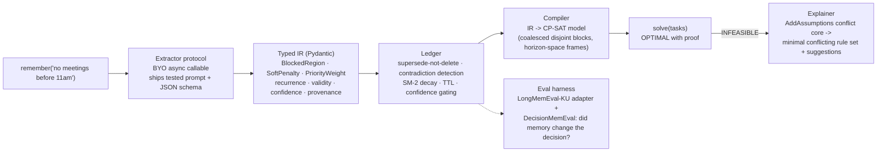

# groundrules — Decision Memory for AI Agents

**Date:** 2026-08-14
**Status:** Design approved (build starts after the Aug 14 walkthrough; nothing touches `spine-may1-wip` today)
**Win condition:** category credibility — OSS pip library + benchmark receipts + a category-naming launch. Not a hosted product, not revenue, not "memory layer #8."

---

## 1. Positioning

Every 2025-26 "memory layer" (Mem0, Zep, Letta, Supermemory, Mapi) does the same final act: retrieve text into a context window and hope the model honors it. **groundrules names a new category — Decision Memory**: memory that compiles into *hard constraints* a formal solver enforces. The demo is not recall; it's *type a sentence, watch the schedule mathematically bend* — and when your rules collide, get the **minimal conflicting set with a proof**, not a hallucinated apology.

Tagline: *"Memory layers remember what your users said. groundrules makes your agent obey it."*

v1 claim is deliberately narrow: **temporal constraints for agents that schedule and plan** (the domain proven live in Jarvis). No generic-constraint overclaim until the temporal core has receipts.

## 2. API surface (v1, complete)

```python
from groundrules import Bank

bank = Bank("sqlite:///me.db", extractor=my_llm)   # extractor: any async callable(text) -> IR
m1 = bank.remember("I never take meetings before 11am")     # RuleRecord(confidence, provenance)
m2 = bank.remember("actually, 10am is fine now")            # contradiction -> supersedes m1
bank.forget(m2.id)                                          # explicit delete; decay handles staleness

plan = bank.compile(horizon_days=3)        # RulePlan: typed IR, JSON-exportable
result = plan.solve(tasks)                 # tasks: list[Task(id, minutes, deadline?, priority?)]
result.status                              # OPTIMAL | FEASIBLE | INFEASIBLE
result.schedule                            # {task_id: (start, end)} wall-clock
result.explain()                           # INFEASIBLE -> ConflictCore: [rule labels + suggestions]
```

Zero-dependency core (`pydantic`, `ortools` only — ortools as the one heavy dep is the honest cost of proofs). `groundrules[litellm]` extra = one-liner extractor. `plan.to_json()` for bring-your-own-solver users.

## 3. Architecture



## 4. Components — every one extracted from shipped, reviewed Jarvis code

| Component | Source in Jarvis | Hardening it inherits |
|---|---|---|
| IR types | `app/services/memory/constraint_bridge.py` slot shapes + `SemanticTimeSlot` | horizon-space frame fix (times were midnight-anchored — 10-hour phantom blocks), recurrence expansion fix |
| Ledger | `user_memories` supersession + `behavioral_store` + SM-2 decay | contradiction-supersede semantics, confidence ≥0.6 gating |
| Extractor prompt | habit-translator + constraint-extraction prompts | strict-negative rules (emotions ≠ constraints), tested against Gemma-class + Gemini |
| Compiler | `constraint_bridge` + solver block handling | **overlapping-block coalescing** (two overlapping fixed intervals made models structurally UNSAT), atom-composable caps |
| Explainer | NEW — but specified in `2026-08-13-ask-back-clarification-design.md` T3 | built once here; **Jarvis imports it for ask-back** |
| Eval harness | NEW | LongMemEval knowledge-update category + DecisionMemEval (below) |

## 5. DecisionMemEval — the benchmark we publish

Retrieval benchmarks ask "was the memory in the top-10?" Ours asks **"did the decision change?"** Each case: (rule set, task set, a new memory) → assert the solved schedule differs in the *specific provable way* (region emptied, priority reordered, INFEASIBLE with the right conflict core). Scored: enforcement rate, supersession correctness, conflict-explanation accuracy, decay behavior. Published with a harness others can run — including on retrieval-only layers, where enforcement rate is structurally ~0. That asymmetry *is* the launch post.

## 6. Out of scope (v1)

Hosted API/dashboards/multi-tenant · embeddings & RAG recall (**we are not a retrieval layer — that's the category point**) · non-temporal domains · `bank.observe()` behavioral ingestion (PEARL-style statistics — v1.1, it's the second launch) · Z3/generic solver adapters (JSON export is the escape hatch).

## 7. Decisions (ADR)

| # | Decision | Why | Rejected |
|---|----------|-----|----------|
| D1 | New category framing ("Decision Memory"), not "better memory layer" | Seventh entrant in a commodity category loses; category creators set the benchmark. Our differentiator is enforcement, which retrieval layers structurally cannot match. | Compete on recall benchmarks (their turf, our weakest surface). |
| D2 | v1 = temporal domain, CP-SAT-ready | It's what's proven live (11:00 demo); a working vertical beats an unproven horizontal. Generic IR would ship untested abstractions. | Generic constraint IR; IR-only-no-solver (kills the proof demo). |
| D3 | Zero-dep core, BYO-LLM extractor protocol | pip-install story; local-first friendly; extraction quality is the user's model choice, enforcement quality is ours. `ortools` stays — proofs are the product. | Bundled LiteLLM (dependency drag), no extraction (kills the magic). |
| D4 | Explainer built in the library, consumed by Jarvis | The ask-back spec's T3 and this are the same engine; building twice is waste. Jarvis dogfooding = launch credibility ("extracted from a system I use daily"). | Parallel implementations. |
| D5 | Apache-2.0, new repo, Jarvis becomes first consumer | Credibility win-condition wants permissive OSS; replacing Jarvis's internal bridge with the lib is the proof it's real. | MIT (fine too — Apache for patent grant), keeping it in-tree (no pip story). |
| D6 | Publish DecisionMemEval alongside | Owning the eval is how categories get judged on your terms; LongMemEval-KU alone measures recall, not enforcement. | Benchmark-only on others' terms. |
| D7 | Ship after the walkthrough; ask-back P0 folds into this sequence | Demo branch frozen today; explainer-first sequencing serves both roadmaps. | Starting today (demo risk), after generative UI (loses momentum + duplicate explainer work). |

## 8. Phasing

- **P0 (~1 wk):** repo scaffold, IR + Ledger + Compiler extracted with their tests (most code moves, not written), JSON export, sqlite + in-memory stores.
- **P1 (~1 wk):** Explainer (assumption cores + labels + suggestions) → wire back into Jarvis ask-back T3; extractor protocol + `[litellm]` extra + tested prompt.
- **P2 (~1 wk):** Eval harness (LongMemEval-KU adapter + DecisionMemEval cases from Jarvis's real regression suite), README with the 11am GIF, launch post, PyPI.

## 9. Success criteria

`pip install groundrules` to enforced schedule in <10 lines · Jarvis's internal bridge fully replaced by the lib with its 509-test suite still green · DecisionMemEval published with ≥20 cases · launch post shipped with benchmark table.
